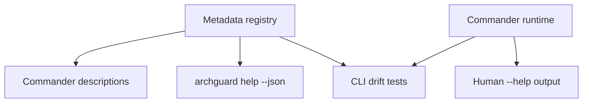

# cli-help-from-registry design

## 0. Terminology

- **Human help**: existing Commander output from `archguard --help` and `archguard <command> --help`.
- **Structured help**: deterministic JSON output from the new `archguard help --json` entrypoint.
- **CLI drift test**: test that compares Commander-visible command/options against registry metadata.

## 1. Decisions And Constraints

### Requirement Summary

Use the registry from `command-metadata-registry-core` to describe CLI commands and options, expose a JSON help/catalog surface for agents, and keep existing human help behavior compatible.

### Explicit Non-Goals

- Do not alter command handler behavior or query results.
- Do not migrate MCP descriptions in this feature.
- Do not generate README/docs blocks in this feature.

### Complexity Profile

CLI adapter change with compatibility risk. The default implementation should prefer registry-derived descriptions and drift checks over broad rewrites of Commander option registration.

### Key Decisions

- Add a new `help` command with `--json` for structured output.
- Existing `archguard --help` and `archguard <command> --help` remain human-readable Commander help.
- Query options may stay registered inline initially, but descriptions and MCP mapping metadata must be checked against registry data.
- CLI-only commands such as `diff` and `check` live in the same registry with no MCP equivalent.

### Baseline Risk

Commander treats help specially. A poorly chosen entrypoint could break existing `--help`; this design isolates structured help in a subcommand.

### Top 3 Risks

1. **Breaking human help** - structured help changes default Commander help output.
   - Mitigation: use `archguard help --json` as a separate command and test human help remains text.
2. **Option metadata drift** - query flags remain inline but metadata becomes stale.
   - Mitigation: CLI drift tests compare Commander options to registry entries.
3. **Structured help is not useful to agents** - JSON lacks MCP mappings or workflow hints.
   - Mitigation: structured help must include option mappings and agent guidance references from the registry.

### Evidence Plan

- CLI E2E evidence: spawn built CLI and parse `archguard help --json`.
- Compatibility evidence: assert `archguard --help` and `archguard query --help` remain human-readable.
- Drift evidence: tests fail on missing command/option metadata.

### Deliverables

- New `help` CLI command or equivalent command factory.
- Structured help JSON serializer.
- CLI drift tests and CLI E2E test.

### Cleanliness Rules

- No JSON mixed with progress/log text on stdout for `help --json`.
- No duplicated long command tables hand-authored outside registry.
- No changes to command handler behavior.

## 2. Nouns And Orchestration

### 2.1 Noun Layer

#### Current State

- `src/cli/index.ts` registers 7 commands manually.
- `src/cli/commands/query.ts` defines 35+ options inline.
- There is no machine-readable CLI catalog for agents.

#### Changes

- Add CLI adapter helpers that project registry entries into command descriptions and structured JSON.
- Add `createHelpCommand()` or equivalent and register it in `src/cli/index.ts`.
- Add structured output shape with command name, description, options, allowed values, defaults, MCP mappings, and agent guidance.

Example structured output:

```json
{
  "program": "archguard",
  "commands": [
    {
      "name": "query",
      "description": "Query architecture entities and relationships",
      "options": [
        {
          "flags": "--summary",
          "description": "...",
          "mapsToMcpTool": "archguard_summary"
        }
      ]
    }
  ]
}
```

### 2.2 Orchestration Layer



#### Current State

CLI help is produced directly from Commander definitions; agents cannot request a structured catalog.

#### Changes

The CLI workflow becomes:

1. Registry provides command/option descriptions and mappings.
2. Existing commands use registry description helpers where low-risk.
3. `archguard help --json` serializes the registry into a stable schema.
4. Tests compare current Commander commands/options with registry metadata.

#### Flow Constraints

- `archguard help --json` must print only JSON to stdout.
- Existing help commands must not become JSON by default.
- Unknown or unsupported help modes must fail with a clear error.

### 2.3 Mount Points

- `src/cli/index.ts` - register the new `help` command.
- `src/cli/commands/help.ts` - new structured help command.
- `src/cli/commands/*` - use registry-derived descriptions where safe.
- `tests/unit/cli/help-command.test.ts` - structured help tests.
- `tests/unit/cli/cli-metadata-drift.test.ts` - CLI registry drift tests.

### 2.4 Delivery Strategy

1. Add `help --json` command reading the registry.
   - Exit signal: `node dist/cli/index.js help --json` prints valid JSON after build.
2. Wire command descriptions to registry for top-level commands.
   - Exit signal: human help still lists all commands with expected descriptions.
3. Add query option metadata drift tests.
   - Exit signal: tests fail if a registered query flag is missing registry metadata or MCP mapping when required.
4. Add structured help E2E.
   - Exit signal: a test spawns the CLI and parses `archguard help --json`, then verifies `query --summary` maps to `archguard_summary`.
5. Run compatibility checks.
   - Exit signal: existing CLI command tests plus structured help tests pass.

### 2.5 Structure Health And Micro-Refactor

##### Evaluation

- File-level - `src/cli/index.ts` is small and only needs one additional command registration.
- File-level - `src/cli/commands/query.ts` is option-heavy; this feature should avoid rewriting all option registration in one step.
- Directory-level - `src/cli/commands/` already groups command factories; adding `help.ts` follows the existing pattern.
- Directory-level - `tests/unit/cli/` already contains command tests; adding focused help/drift tests is consistent.

##### Conclusion: no micro-refactor

Do not restructure `query.ts` in this feature. Keep option registration stable and add registry-derived descriptions or drift checks incrementally.

##### Out-of-scope Observation

`query.ts` has many independent option branches. A future `cs-refactor` could split query option groups, but this feature should not mix that structural refactor with help metadata.

## 3. Acceptance Contract

- `archguard help --json` exists and emits deterministic valid JSON.
- `archguard --help` remains human-readable.
- `archguard query --help` remains human-readable and still lists existing query flags.
- Structured help includes all 7 CLI commands and query option MCP mappings where present.
- CLI drift tests fail when a command or query option exists in Commander but is missing from registry metadata; tests must enumerate `createCLI().commands` and command `.options[]`, not grep source text.
- CLI E2E test builds or runs the CLI entrypoint and parses `help --json`.
- Human help compatibility tests snapshot `node dist/cli/index.js --help` and `node dist/cli/index.js query --help` output shape so registry-derived descriptions do not break Commander help.
- No command handler behavior changes.

### Required Validation Commands

- `npm run type-check`
- `npm test -- tests/unit/cli/help-command.test.ts tests/unit/cli/cli-metadata-drift.test.ts`
- `npm test -- tests/unit/cli/command.test.ts tests/unit/cli/commands/query.test.ts`
- `npm run build`
- `node dist/cli/index.js help --json`

## 4. Architecture Documentation Relationship

This feature makes the CLI adapter a registry consumer. Architecture docs or ADR updates should record that `archguard help --json` is the agent-readable CLI catalog surface.
