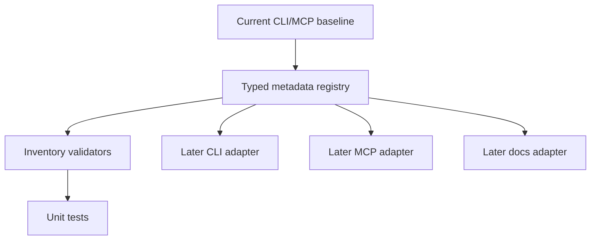

# command-metadata-registry-core design

## 0. Terminology

- **Metadata registry**: the typed source under `src/cli/metadata/` that records command/tool identity, summaries, examples, agent guidance, verification hints, and surface mappings.
- **Surface baseline**: the current 7 CLI commands and 24 MCP tools listed in the roadmap. This is the completeness target for the first feature.
- **Drift test**: a test that compares a consumer surface against registry expectations. This feature introduces inventory drift tests only; CLI/MCP/docs consumer drift belongs to later features.
- **callFirst matrix**: registry data describing prerequisite workflows for tools that require analysis artifacts, test data, git-history data, or Go Atlas data.

## 1. Decisions And Constraints

### Requirement Summary

Create a typed metadata layer that captures the existing command/tool surface without altering how commands or tools execute. Success means the repository can assert that every current CLI command and MCP tool has a metadata entry with agent guidance and verification hints.

### Explicit Non-Goals

- Do not migrate Commander registration, MCP registration, README, or user guides in this feature.
- Do not change any CLI command name, flag, MCP tool name, input schema shape, handler behavior, query result, or analysis output.
- Do not add the final docs generator or structured help renderer here.

### Complexity Profile

Default internal TypeScript library change. The unusual dimension is metadata completeness: this feature is mostly schema design plus inventory tests, not runtime behavior.

### Key Decisions

- Put registry model and data under `src/cli/metadata/`.
- Treat the 7 CLI commands and 24 MCP tools in the roadmap as the initial compatibility baseline.
- Keep Zod runtime validation and Commander runtime registration where they are for now; registry data describes the surface and powers later adapters.
- Include a first callFirst matrix in core metadata so later MCP and docs features can render the same workflow guidance.

### Baseline Risk

The current code has no `src/cli/metadata/` directory. Current descriptions are inline in `src/cli/commands/*` and `src/cli/mcp/*`, so this feature must avoid editing those strings except when adding tests that read them.

### Top 3 Risks

1. **Incomplete inventory** - a CLI command or MCP tool is omitted from metadata.
   - Mitigation: baseline tests assert the exact 7-command and 24-tool IDs.
2. **Registry becomes unused copy** - metadata exists but later consumers can ignore it.
   - Mitigation: this feature exposes validators and verification hints that later adapter features must use.
3. **Over-modeling blocks implementation** - metadata schema becomes too abstract for current surfaces.
   - Mitigation: start with fields required by current CLI/MCP/docs workflows and leave renderer-specific concerns to adapters.

### Evidence Plan

- Type evidence: `npm run type-check`.
- Unit evidence: registry validation tests.
- Regression evidence: existing CLI/MCP tests still pass because no runtime consumer changes are made.

### Deliverables

- New `src/cli/metadata/` model, registry, and validators.
- New unit tests for registry completeness.
- Architecture or ADR note candidate describing the registry source of truth.

### Cleanliness Rules

- No generated files without a deterministic generator.
- No TODO/FIXME placeholders in registry entries.
- No temporary console output or debug dumps.
- No heavy runtime imports from the metadata module.

## 2. Nouns And Orchestration

### 2.1 Noun Layer

#### Current State

- CLI command identity is implicit in `src/cli/index.ts` and command factories under `src/cli/commands/*`.
- Query flag identity is implicit in `src/cli/commands/query.ts`.
- MCP tool identity is implicit in `server.tool(...)` calls under `src/cli/mcp/*`.
- Agent guidance exists partly in README/docs and partly in inline MCP descriptions.

#### Changes

- Add typed metadata interfaces for CLI commands, CLI options, MCP tools, agent guidance, examples, and verification hints.
- Add registry entries for:
  - 7 CLI commands: `analyze`, `cache`, `check`, `diff`, `init`, `mcp`, `query`
  - 24 MCP tools from the roadmap baseline
  - the ADR-007 query CLI/MCP mapping, including `archguard_analyze_git` -> `archguard analyze --include-git`
- Add validation helpers that assert unique IDs, complete baseline coverage, valid surface values, and callFirst references that point to known tools/commands.
- Add an explicit callFirst matrix for all workflow-dependent tools:
  - Query-artifact consumers: `archguard_summary`, `archguard_find_entity`,
    `archguard_get_dependencies`, `archguard_get_dependents`,
    `archguard_find_implementers`, `archguard_find_subclasses`,
    `archguard_get_file_entities`, `archguard_detect_cycles`,
    `archguard_get_atlas_layer`, `archguard_get_package_stats`,
    `archguard_find_callers`
  - Test-analysis consumers: `archguard_detect_test_patterns`,
    `archguard_get_test_metrics`, `archguard_get_test_issues`,
    `archguard_get_entity_coverage`
  - Git-history consumers: `archguard_get_change_context`,
    `archguard_get_cochange`, `archguard_get_change_risk`,
    `archguard_get_ownership`
  - Atlas consumers: `archguard_get_package_fanin`,
    `archguard_get_package_fanout`, `archguard_detect_god_packages`

Example shape:

```ts
// Source: new src/cli/metadata/types.ts
export interface AgentGuidance {
  useWhen: string[];
  callFirst?: string[];
  followWith?: string[];
  failureRecovery: string[];
  limitations: string[];
}
```

### 2.2 Orchestration Layer



#### Current State

There is no registry workflow. Tests can validate specific CLI/MCP behavior but cannot ask whether every surface is represented in one source.

#### Changes

The new workflow is:

1. Static registry exports arrays/maps for CLI commands, query mappings, MCP tools, and workflow guidance.
2. Validators run in unit tests and optionally in later generation scripts.
3. Later features import the same registry instead of re-authoring surface descriptions.

#### Flow Constraints

- Validators must fail loudly on missing baseline entries.
- Registry entries must not import heavy runtime modules or create command/MCP instances.
- Registry data must be safe to import in tests, CLI help, docs generation, and MCP registration.

### 2.3 Mount Points

- `src/cli/metadata/index.ts` - new registry export.
- `src/cli/metadata/types.ts` - new metadata type contract.
- `tests/unit/cli/metadata-registry.test.ts` - new inventory and type-shape tests.

### 2.4 Delivery Strategy

1. Define the metadata model and empty validation helpers.
   - Exit signal: `npm run type-check` accepts the exported types.
2. Add complete baseline inventory entries.
   - Exit signal: tests can count 7 CLI commands and 24 MCP tools.
3. Add mapping and callFirst validators.
   - Exit signal: validator tests fail if a baseline item is removed or a callFirst target is unknown.
4. Add agent guidance and verification hints for every baseline entry.
   - Exit signal: tests assert non-empty useWhen, failureRecovery, limitations, and verification fields where required.
5. Run baseline validation.
   - Exit signal: targeted tests, `npm run type-check`, and `npm test -- tests/unit/cli/metadata-registry.test.ts` pass.

### 2.5 Structure Health And Micro-Refactor

##### Evaluation

- File-level - new files only under `src/cli/metadata/`; no existing large file needs to grow.
- File-level - tests add a new focused file under `tests/unit/cli/`; no existing test file needs broad expansion.
- Directory-level - `src/cli/` already has cohesive subdirectories (`commands`, `mcp`, `query`); adding `metadata` keeps this feature isolated.
- Directory-level - `tests/unit/cli/` has many focused test files, but a new metadata test is clearer than adding registry checks to unrelated command tests.

##### Conclusion: no micro-refactor

No existing file or directory needs a behavior-preserving move before this feature. The feature creates a new isolated metadata module.

## 3. Acceptance Contract

- Registry exports include exactly the current 7 CLI command IDs and 24 MCP tool names from the roadmap baseline.
- Registry includes a query/MCP parity map for the ADR-007 query tools plus analyze/analyze-git equivalents.
- Registry records `archguard_analyze_git` as equivalent to `archguard analyze --include-git`.
- Every metadata entry has non-empty `summary`, `agent.useWhen`, `agent.failureRecovery`, and at least one verification hint.
- Workflow-dependent tools have callFirst entries for analysis, test analysis, git history, or Atlas prerequisites; the matrix must enumerate every tool listed in section 2.1 rather than one representative per category.
- Negative E2E-style test: adding a fake baseline expectation without registry data fails the validator.
- Verification hints must reference real commands or test files, for example strings beginning with `npm `, `archguard `, `node `, or `tests/`.
- Importing `src/cli/metadata` has no runtime side effects and does not import Commander or the MCP SDK.
- New metadata module coverage satisfies the repository coverage gate.
- Runtime behavior remains unchanged: existing CLI and MCP tests still pass because no consumer migration occurs in this feature.

### Required Validation Commands

- `npm run type-check`
- `npm test -- tests/unit/cli/metadata-registry.test.ts`
- `npm test -- tests/unit/cli/command.test.ts tests/unit/cli/mcp/mcp-server.test.ts`

## 4. Architecture Documentation Relationship

This feature introduces a new metadata subsystem. Acceptance should update architecture docs or ADRs to note that `src/cli/metadata/` is the source for command/tool inventory and agent guidance, but runtime registration still remains in existing CLI/MCP files until later features.
