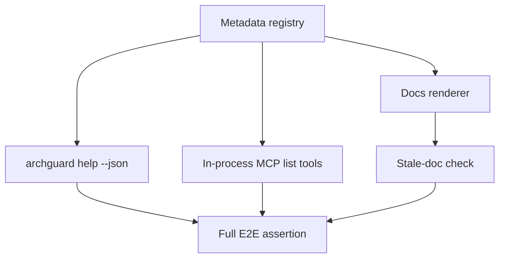

# docs-agent-surface-generation design

## 0. Terminology

- **Generated block**: marker-bounded content in docs rendered from registry metadata.
- **Stale-doc check**: command/test that fails when generated blocks differ from registry output.
- **Agent surface doc**: documentation that tells Claude/Codex-style agents which ArchGuard commands/tools to use and in what order.
- **Full E2E**: build/run path proving one registry change can appear in CLI structured help, MCP metadata, and docs checks.

## 1. Decisions And Constraints

### Requirement Summary

Use the registry to keep README/help/user-guide and agent surface docs synchronized with CLI and MCP metadata, and add a complete E2E verification path that exercises registry -> CLI -> MCP -> docs.

### Explicit Non-Goals

- Do not change command/tool runtime behavior.
- Do not hand-edit generated sections without a corresponding renderer/check.
- Do not introduce fake test shims or bypass real project validation commands.

### Complexity Profile

Documentation generation plus integration/E2E validation. This feature carries the roadmap-level full E2E responsibility.

### Key Decisions

- Use deterministic marker-bounded generated blocks or an equivalent renderer/check.
- Docs subject to stale checks: `README.md`, `docs/user-guide/cli-usage.md`, `docs/user-guide/mcp-usage.md`, and an agent-surface doc.
- Add a docs check script that can run in verification mode in CI.
- Full E2E must exercise real registry data through CLI structured help, in-process MCP metadata, and docs stale checks.
- The agent surface doc path is `docs/user-guide/agent-surface.md`.
- Claude and Codex workflows are the same at the ArchGuard capability level, but the agent surface doc must include separate setup snippets where their MCP registration differs.

### Baseline Risk

Generated docs can produce noisy diffs if the marker blocks are too broad. Keep generated sections narrow and stable.

### Top 3 Risks

1. **Docs churn is too broad** - generator rewrites large hand-authored sections.
   - Mitigation: marker-bounded generated blocks must be narrow and deterministic.
2. **E2E is partial** - tests check docs only, not runtime surfaces.
   - Mitigation: full E2E must compare CLI structured help, in-process MCP metadata, and docs stale-check output.
3. **CI does not enforce drift** - checks exist but do not run for PRs.
   - Mitigation: wire docs check or metadata E2E into `npm test` or CI.

### Evidence Plan

- Docs evidence: stale-doc check passes on checked-in generated blocks and fails on intentional mismatch.
- Runtime evidence: CLI help JSON and MCP list-tools expose matching registry entries.
- Full E2E evidence: one integration test exercises registry -> CLI -> MCP -> docs.

### Deliverables

- Docs render/check script.
- Marker-bounded registry-backed sections in README/user guides.
- Agent surface doc covering Claude and Codex workflows.
- Full metadata surface E2E test.
- CI/npm test wiring.

### Cleanliness Rules

- No hand-maintained generated tables outside marker blocks.
- No stale `archguard analyze-git` wording for git-history analysis in generated docs or runtime user-facing guidance.
- No fake command shims or tests that bypass real CLI/MCP code paths.

## 2. Nouns And Orchestration

### 2.1 Noun Layer

#### Current State

- README and user guides manually list CLI/MCP tools.
- `docs/user-guide/mcp-usage.md` contains useful workflows but is manually maintained.
- There is no agent surface doc generated from current registry metadata.

#### Changes

- Add docs rendering/check helpers for registry-backed sections.
- Add marker-bounded generated blocks or stale-check snapshots in target docs.
- Add an agent surface document covering Claude and Codex workflows:
  - analyze -> summary -> entity/dependency queries
  - analyze with tests -> detect patterns -> metrics/issues/entity coverage
  - analyze --include-git -> change context/cochange/risk/ownership
  - Go Atlas -> Atlas layer/analytics tools
- Add full E2E validation that proves generated docs and both runtime surfaces agree.

### 2.2 Orchestration Layer

#### Current State

Docs can drift from CLI/MCP code and from each other. Existing tests focus on runtime behavior, not docs consistency.

#### Changes

1. Render docs blocks from registry metadata.
2. Add verification mode to detect stale docs.
3. Add E2E test that runs the CLI structured help, inspects MCP metadata in process, and runs docs stale check.
4. Update README/user guides/agent surface docs with generated or verified registry-backed content.

#### Flow Constraints

- Docs check must be deterministic.
- Generated blocks must be small enough to keep PR review usable.
- E2E must use real project commands and in-process MCP, not a hosted Claude Code MCP server.

### 2.3 Mount Points

- `scripts/` - docs generation or verification script.
- `README.md`
- `docs/user-guide/cli-usage.md`
- `docs/user-guide/mcp-usage.md`
- `docs/user-guide/agent-surface.md`
- `tests/integration/cli-mcp/metadata-surface-e2e.test.ts`
- `package.json` script for docs check if needed.

### 2.4 Delivery Strategy

1. Add docs renderer/check script.
   - Exit signal: script can render/check registry-backed blocks deterministically.
2. Add marker-bounded docs blocks.
   - Exit signal: stale-doc check passes immediately after generation.
3. Add agent workflow content from registry.
   - Exit signal: Claude and Codex workflows mention only registered commands/tools.
4. Add full E2E surface test.
   - Exit signal: test builds or runs CLI structured help, lists MCP tools in process, runs docs stale check, and compares all baseline commands/tools and mappings across all three.
5. Add CI/npm coverage.
   - Exit signal: docs check or E2E test is reachable from `npm run test:coverage` or an explicit CI `npm run docs:check` step.

### 2.5 Structure Health And Micro-Refactor

##### Evaluation

- File-level - `README.md` and user guides are large docs, but generated blocks can be narrow and marker-bounded.
- File-level - `scripts/` already contains project utility scripts; adding a docs metadata script is consistent.
- Directory-level - `docs/user-guide/` is the right place for agent surface docs if no better existing doc exists.

##### Conclusion: no micro-refactor

No documentation tree reorganization is required. Keep generated/checked sections narrow.

## 3. Acceptance Contract

- README and user guide sections that list command/tool surfaces are generated or stale-checked from registry metadata.
- Agent surface doc includes Claude and Codex workflows and recovery paths derived from registry guidance.
- Docs stale-check fails when registry output differs from checked-in docs blocks.
- Full E2E test verifies:
  - CLI `archguard help --json` exposes all 7 commands.
  - in-process MCP metadata exposes all 24 MCP tool names.
  - all 22 ADR-007 query mappings plus `archguard_analyze` and `archguard_analyze_git` are consistent across registry, CLI structured help, and MCP metadata.
  - every workflow-dependent callFirst category is represented in MCP metadata and agent docs.
  - docs stale-check passes for the same registry data.
- CI runs the relevant drift/E2E checks either because they are Vitest tests covered by `npm run test:coverage`, or because `.github/workflows/ci.yml` explicitly runs `npm run docs:check`.
- No generated block, agent doc, or runtime user-facing message keeps stale `archguard analyze-git` wording for `archguard_analyze_git`; it should use `archguard analyze --include-git`.
- ADR-006 and ADR-007 are updated, or a new ADR is added, to record that the registry is now the source for command/tool descriptions and parity metadata.

### Required Validation Commands

- `npm run type-check`
- `npm run build`
- `npm test -- tests/integration/cli-mcp/metadata-surface-e2e.test.ts`
- `npm test -- tests/unit/cli/help-command.test.ts tests/unit/cli/mcp/mcp-metadata-drift.test.ts`
- docs check command added by this feature, for example `npm run docs:check`
- `npm test`
- `npm run test:coverage` or CI proof that `npm run docs:check` runs separately

## 4. Architecture Documentation Relationship

This feature completes the roadmap by making docs and agent guidance registry consumers. Acceptance should update docs/ADR references so contributors know registry changes require CLI/MCP/docs drift checks.
