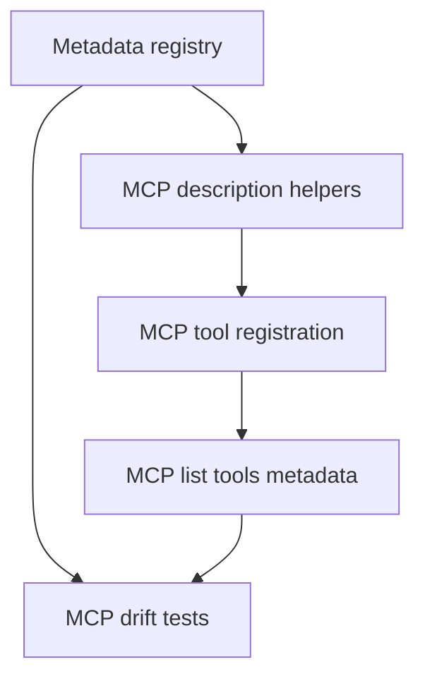

# mcp-agent-descriptions-from-registry design

## 0. Terminology

- **Tool description**: the natural-language string exposed to MCP clients for tool selection.
- **Parameter description**: the Zod `.describe(...)` text exposed in MCP tool schemas.
- **Agent guidance**: registry useWhen/callFirst/failureRecovery/limitations rendered into concise MCP descriptions.
- **In-process MCP verification**: tests that instantiate `createMcpServer()` directly, not through a Claude Code-hosted long-running process.

## 1. Decisions And Constraints

### Requirement Summary

Use the registry to improve MCP tool descriptions and parameter descriptions so agents know when to use each tool, what to call first, and how to recover from missing data.

### Explicit Non-Goals

- Do not rename any MCP tool.
- Do not change handler behavior, output payloads, or query semantics.
- Do not depend on Claude Code's hosted MCP process for verification.
- Do not generate docs in this feature.

### Complexity Profile

MCP adapter refactor with schema compatibility risk. The safest path is metadata helpers for descriptions while keeping Zod schema shapes and handlers local.

### Key Decisions

- Tool descriptions are assembled from registry fields and must comply with ADR-006.
- Zod schema shapes stay near handlers; parameter descriptions come from metadata helper functions where practical.
- Any remaining inline parameter description must be covered by an MCP->registry drift test.
- Fix ADR-006 low-priority description issues such as "Get" prefixes on `archguard_get_file_entities` and `archguard_get_change_context`.

### Baseline Risk

The MCP server currently registers 24 tools across several files. Refactoring descriptions across all files can accidentally change schema shape if helpers are too invasive.

### Top 3 Risks

1. **Schema drift** - replacing descriptions accidentally changes Zod schema shape.
   - Mitigation: snapshot/list-tools tests compare tool names and input schema shape before/after.
2. **Verbose descriptions reduce tool-selection quality** - generated text gets too long.
   - Mitigation: renderer must follow ADR-006 concise what/when/limitation/callFirst format.
3. **Hosted MCP validation gives false confidence** - current assistant session may use stale server code.
   - Mitigation: use in-process MCP or independent stdio process only.

### Evidence Plan

- Metadata evidence: in-process list-tools metadata matches registry.
- Behavior evidence: representative tool calls still return expected shapes.
- E2E evidence: workflow-dependent tool descriptions expose callFirst/failureRecovery guidance.

### Deliverables

- MCP metadata description helpers.
- Updated tool/parameter descriptions across all MCP registration files.
- MCP drift tests and representative behavior tests.

### Cleanliness Rules

- No handler logic rewrites unless required for description wiring.
- No stdout logging from MCP server.
- No weakening of Zod validation to fit metadata.

## 2. Nouns And Orchestration

### 2.1 Noun Layer

#### Current State

- `server.tool(...)` calls pass hard-coded descriptions.
- Common params such as `projectRoot`, `scope`, `outputScope`, and `queryFormat` are partly centralized.
- Test/git/atlas/call-graph tool descriptions are spread across separate files.

#### Changes

- Add metadata lookup helpers for MCP tool descriptions and parameter descriptions.
- Replace tool description strings with registry-derived descriptions.
- Replace common parameter descriptions with registry-derived helpers.
- Add drift tests that inspect exposed MCP tool metadata and compare it to registry expectations.

Example:

```ts
// Source: future helper shape
server.tool(
  'archguard_summary',
  mcpToolDescription('archguard_summary'),
  { projectRoot: projectRootParam }
);
```

### 2.2 Orchestration Layer



#### Current State

MCP descriptions are hand-authored per registration site. A no-data error may include recovery steps, but the tool selector description does not consistently expose workflow dependencies.

#### Changes

1. Registry produces concise descriptions with what/when/limitation/callFirst.
2. MCP registration imports helpers for tool and param descriptions.
3. In-process MCP tests list tools and compare names/descriptions/schema descriptions to registry data.
4. Representative tool calls prove behavior still works.

#### Flow Constraints

- Descriptions must remain concise enough for tool selection.
- callFirst guidance must be embedded for tools needing analysis/test/git/Atlas data.
- Error recovery strings in handlers can remain local but should not contradict registry guidance.

### 2.3 Mount Points

- `src/cli/mcp/mcp-server.ts`
- `src/cli/mcp/analyze-tool.ts`
- `src/cli/mcp/tools/test-analysis-tools.ts`
- `src/cli/mcp/tools/git-history-analyze-tool.ts`
- `src/cli/mcp/tools/git-history-tools.ts`
- `src/cli/mcp/tools/call-graph-tools.ts`
- `src/cli/mcp/tools/atlas-analytics-tools.ts`
- `tests/unit/cli/mcp/mcp-metadata-drift.test.ts`
- existing MCP unit/integration tests

### 2.4 Delivery Strategy

1. Add MCP metadata helper functions.
   - Exit signal: helpers return descriptions for all 24 tools.
2. Replace tool descriptions with registry-derived strings.
   - Exit signal: in-process tool list still exposes the same 24 tool names.
3. Replace or check parameter descriptions.
   - Exit signal: drift test covers common params and tool-specific params.
4. Add schema-shape preservation checks.
   - Exit signal: all 24 tools have assertions for input schema top-level field names and required/optional status; description text may change, field structure must not.
5. Add representative behavior checks.
   - Exit signal: existing MCP tests and selected tool calls pass with unchanged behavior.
6. Add MCP E2E metadata test.
   - Exit signal: in-process MCP list/call test verifies all workflow-dependent tool categories expose callFirst/failureRecovery guidance.

### 2.5 Structure Health And Micro-Refactor

##### Evaluation

- File-level - `mcp-server.ts` is large and description-heavy, but this feature should only swap descriptions and helpers, not split handlers.
- File-level - separate `tools/*.ts` files already group specialized tools.
- Directory-level - `src/cli/mcp/` has a clear split between core server and specialized tool modules.

##### Conclusion: no micro-refactor

Do not decompose `mcp-server.ts` in this feature. Keep the change behavior-preserving and description-focused.

##### Out-of-scope Observation

A future refactor could move core query tool registrations out of `mcp-server.ts`, but doing so here would increase risk and obscure metadata behavior changes.

## 3. Acceptance Contract

- MCP list-tools metadata still exposes exactly 24 current tool names.
- Tool descriptions are registry-derived and include useWhen/callFirst/failureRecovery/limitations where applicable.
- Common parameter descriptions are registry-derived or explicitly covered by drift tests.
- ADR-006 description issues for `archguard_get_file_entities` and `archguard_get_change_context` are resolved through metadata descriptions.
- Input schema shape tests assert all 24 tools retain their top-level parameter names and required/optional status.
- In-process MCP tests call representative tools and prove behavior is unchanged.
- No validation relies on the current Claude Code MCP process.
- E2E-style MCP metadata test verifies every workflow-dependent tool category tells the agent what to call first and how to recover from missing data.

### Required Validation Commands

- `npm run type-check`
- `npm test -- tests/unit/cli/mcp/mcp-metadata-drift.test.ts`
- `npm test -- tests/unit/cli/mcp/mcp-server.test.ts tests/unit/cli/mcp/analyze-tool.test.ts tests/unit/cli/mcp/git-history-mcp.test.ts tests/unit/cli/mcp/test-analysis-mcp.test.ts`
- `npm test -- tests/integration/cli-mcp/analyze-equivalence.test.ts`

## 4. Architecture Documentation Relationship

This feature makes MCP registration a registry consumer. ADR-006 should be updated or superseded to state that MCP description policy is enforced by registry metadata and drift tests.
