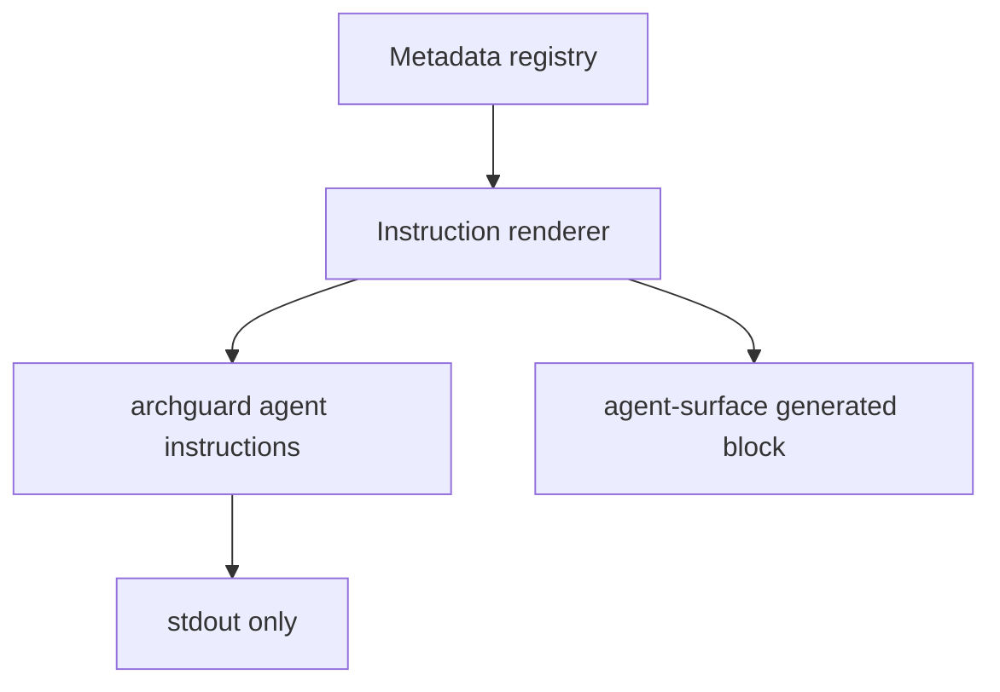

# agent-instructions-renderer design

## 0. Terminology

- **Instruction renderer**: a pure renderer that converts registry guidance into provider-specific Markdown/text.
- **Provider profile**: `claude` or `codex`, affecting wrapper text and config hints but not tool facts.
- **Read-only agent command**: `archguard agent instructions` prints instructions and does not write user config; write-capable behavior is reserved for `agent-onboarding-cli` after provider adapters exist.

## 1. Decisions And Constraints

### Requirement Summary

Create the first minimal loop for agent onboarding: a user can run `archguard agent instructions codex` or `archguard agent instructions claude` and receive registry-derived guidance with call-first, recovery, limitations, and freshness.

### Explicit Non-Goals

- Do not write Codex or Claude config files.
- Do not implement `archguard install`, `update`, or `config doctor`.
- Do not require TOML/JSON provider config adapters.
- Do not duplicate instructions as hand-written docs.

### Complexity Profile

Small CLI/docs feature. It is non-functional behavior for users but must be testable end-to-end through the built CLI.

### Key Decisions

- Add `src/cli/metadata/instruction-renderer.ts` as a sibling of `docs-renderer.ts`.
- Add `archguard agent instructions [provider]` with `--format markdown|text`.
- This feature explicitly does not implement `--write`; `--write` is reserved for the later onboarding CLI feature after provider adapters exist.
- This feature also adds the `agent` CLI command metadata and baseline entry, so CLI drift tests remain green when the command is registered.
- `docs-renderer.ts` must call the instruction renderer for agent-surface instruction blocks; it should not keep a second hard-coded workflow copy.
- Provider-specific profile text may differ, but tool catalog facts come from registry.
- `sourceMetadataHash` is `sha256` over canonical JSON containing `cliCommands`, `mcpTools`, `queryMappings`, and the agent guidance fields consumed by the renderer. `generatedAt` is excluded from the hash.

### Baseline Risk

Existing `docs/user-guide/agent-surface.md` is generated from registry blocks, but there is no standalone CLI command an agent can invoke to get its own operating instructions.

### Top 3 Risks

1. **Renderer becomes a second source of truth**.
   - Mitigation: renderer consumes registry only; no hard-coded tool list.
2. **Instructions are too long for agent context**.
   - Mitigation: default summary workflow plus optional catalog flag if needed.
3. **CLI command lands outside registry**.
   - Mitigation: this feature adds `agent` command metadata and baseline entry before registering the command.

### Evidence Plan

- CLI E2E: built `node dist/cli/index.js agent instructions codex`.
- Unit: renderer output contains known registry call-first and freshness strings.
- Docs: generated agent-surface block remains fresh.

### Deliverables

- Instruction renderer module.
- `archguard agent instructions` CLI.
- Tests for Codex and Claude profiles.
- Docs generated block update if needed.

### Cleanliness Rules

- No hand-maintained duplicated tool facts.
- No writing to `$HOME`.
- No temporary output or TODO markers.

## 2. Nouns And Orchestration

### 2.1 Noun Layer

#### Current State

- Registry has MCP tools, CLI commands, examples, and agent guidance.
- `docs-renderer.ts` renders README/user-guide blocks.
- CLI has `help` but no `agent` command.

#### Changes

- Add:

```ts
export type AgentProvider = 'claude' | 'codex';

export interface InstructionRenderInput {
  provider: AgentProvider;
  format: 'markdown' | 'text';
  includeCatalog?: boolean;
}

export interface InstructionRenderResult {
  provider: AgentProvider;
  content: string;
  sourceMetadataHash: string;
  generatedAt: string;
}
```

- Add CLI command:

```bash
archguard agent instructions codex
archguard agent instructions claude --format markdown
```

### 2.2 Orchestration Layer



#### Current State

Agent instructions exist only as documentation; an agent cannot ask ArchGuard for current guidance.

#### Changes

1. Renderer groups registry entries by workflow.
2. CLI prints provider-specific instructions.
3. Tests prove output includes call-first/recovery/freshness.

### 2.3 Mount Points

- `src/cli/metadata/instruction-renderer.ts`
- `src/cli/commands/agent.ts`
- `src/cli/index.ts`
- `src/cli/metadata/registry.ts`
- `docs/user-guide/agent-surface.md`
- `tests/unit/cli/instruction-renderer.test.ts`
- `tests/e2e/agent-instructions.e2e.test.ts`

### 2.4 Delivery Strategy

1. Implement pure renderer.
   - Exit signal: unit tests can render codex/claude profiles.
2. Add CLI command.
   - Exit signal: built CLI prints instructions.
3. Wire docs renderer to the instruction renderer for agent-surface instruction blocks.
   - Exit signal: `npm run docs:check` passes and no second hard-coded workflow copy is required.
4. Add E2E.
   - Exit signal: create `tests/e2e/` if needed, and `npm run test:e2e` executes the instructions command rather than empty-running.

### 2.5 Structure Health And Micro-Refactor

No micro-refactor. A new `agent.ts` command and renderer module keep this isolated. If `docs-renderer.ts` becomes too broad, record a later refactor observation; do not reorganize docs rendering here.

## 3. Acceptance Contract

- `archguard agent instructions codex` exits 0 and prints registry-derived instructions.
- `archguard agent instructions claude` exits 0 and prints registry-derived instructions.
- `agent` command metadata is present before the command is registered.
- Output contains call-first guidance for analyze, test analysis, git history, and Atlas workflows.
- Output contains freshness/recovery text from registry.
- The renderer exposes `sourceMetadataHash`.
- `sourceMetadataHash` is deterministic across repeated renders for unchanged metadata.
- No config files are written.
- `archguard agent instructions` has no `--write` flag in this feature.
- Docs check and metadata E2E remain green.

### Required Validation Commands

- `npm run build`
- `node dist/cli/index.js agent instructions codex`
- `node dist/cli/index.js agent instructions claude`
- `npm test -- tests/unit/cli/instruction-renderer.test.ts`
- `npm run test:e2e`
- `npm run docs:check`

## 4. Architecture Documentation Relationship

Acceptance should update `ARCHITECTURE.md` to mention `instruction-renderer.ts` if it becomes a stable metadata adapter.
