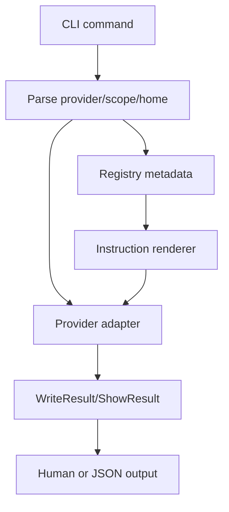

# agent-onboarding-cli design

## 0. Terminology

- **Onboarding CLI**: `archguard install`, `update`, `config`, and `agent` commands.
- **Provider**: `claude`, `codex`, or `all`.
- **Scope**: `user` or `project`.

## 1. Decisions And Constraints

### Requirement Summary

Expose user-facing commands for safe ArchGuard agent onboarding, reusing the instruction renderer and provider adapters rather than duplicating provider-specific logic in command handlers.

### Explicit Non-Goals

- Do not implement `config doctor` MCP probe in this feature.
- Do not support providers beyond Claude/Codex.
- Do not auto-upgrade npm packages.
- Do not write real HOME in tests.

### Complexity Profile

CLI orchestration feature. Most logic should delegate to adapters and renderers.

### Key Decisions

- Add command files under `src/cli/commands/`.
- All write-capable commands support `--home <dir>`, `--scope user|project`, `--dry-run`, and provider `all`.
- `install` writes both MCP config and instructions by default; `--mcp-only` skips instructions and `--instructions-only` skips MCP config.
- `update --instructions-only` skips `writeMcpServer` and only refreshes generated instructions; `--dry-run` still writes nothing.
- `update` refreshes existing ArchGuard entry/instructions and reports missing entries with recovery.
- `config remove` requires `--force` for non-dry-run removal. Without `--force`, it exits non-zero with a recovery message that suggests `--dry-run` or `--force`.
- `config show/remove` exposes adapter state safely.

### Baseline Risk

Manual docs already describe Claude/Codex config, but there is no one-command setup.

### Top 3 Risks

1. **Command handlers grow provider-specific branches**.
   - Mitigation: handlers only route to adapters.
2. **Write defaults surprise users**.
   - Mitigation: dry-run support and clear output; backup always on.
3. **Registry/docs drift**.
   - Mitigation: new commands are in registry and docs generated blocks.

### Evidence Plan

- CLI unit tests with mocked adapters.
- Integration tests in temp HOME for dry-run and write.
- Docs check for new command catalog.

### Deliverables

- `archguard agent instructions`.
- `archguard install`.
- `archguard update`.
- `archguard config show`.
- `archguard config remove`.
- Registry/docs entries and tests.

### Cleanliness Rules

- No direct writes outside adapters.
- No real HOME writes in tests.
- No provider-specific config parsing in command files.

## 2. Nouns And Orchestration

### 2.1 Noun Layer

#### Current State

- CLI commands are registered in `src/cli/index.ts`.
- No install/update/config command exists.
- Provider adapters and instruction renderer are planned dependencies.

#### Changes

Add commands:

```bash
archguard install [provider] --scope user --home <dir> --dry-run
archguard install [provider] --mcp-only --home <dir>
archguard install [provider] --instructions-only --home <dir>
archguard update [provider] --instructions-only --home <dir>
archguard config show [provider] --json --home <dir>
archguard config remove [provider] --dry-run --home <dir>
archguard config remove [provider] --force --home <dir>
archguard agent instructions [provider]
```

Stable JSON for `config show --json`:

```ts
interface ConfigShowResult {
  provider: 'claude' | 'codex';
  scope: 'user' | 'project';
  configPath: string;
  instructionsPath?: string;
  archguardEntry?: McpServerConfig;
  instructionsExcerpt?: string;
  sourceMetadataHash?: string;
  exists: boolean;
  warnings: string[];
}
```

### 2.2 Orchestration Layer



### 2.3 Mount Points

- `src/cli/commands/install.ts`
- `src/cli/commands/update.ts`
- `src/cli/commands/config.ts`
- `src/cli/index.ts`
- `src/cli/metadata/registry.ts`
- `tests/unit/cli/onboarding-cli.test.ts`
- `tests/e2e/agent-onboarding-cli.e2e.test.ts`

`src/cli/commands/agent.ts` already exists from `agent-instructions-renderer`; this feature may extend it only to add `--write` after adapter support exists.

### 2.4 Delivery Strategy

1. Register command shells from registry metadata.
   - Exit signal: `archguard --help` lists new commands.
2. Implement read-only agent instructions command.
   - Exit signal: command prints provider instructions.
3. Implement install/update/show/remove orchestration.
   - Exit signal: temp HOME tests pass.
4. Update docs generated blocks.
   - Exit signal: docs check passes.

### 2.5 Structure Health And Micro-Refactor

No micro-refactor. Add focused command files. Do not overload `src/cli/index.ts` beyond adding command registrations.

## 3. Acceptance Contract

- `archguard install codex --home <tmp> --dry-run` exits 0 and writes nothing.
- `archguard install claude --home <tmp> --dry-run` exits 0 and writes nothing.
- Non-dry-run install writes ArchGuard entries in temp HOME for both providers.
- `archguard update` refreshes instructions/config in temp HOME.
- `archguard config show --json` returns the stable `ConfigShowResult` schema.
- `archguard config remove --dry-run` writes nothing and reports planned removal.
- `archguard config remove` without `--force` refuses to mutate config.
- `archguard install --mcp-only` and `--instructions-only` exercise the expected adapter calls.
- New commands appear in registry and docs generated blocks.

### Required Validation Commands

- `npm run build`
- `node dist/cli/index.js install codex --home <tmp-home> --dry-run`
- `node dist/cli/index.js install claude --home <tmp-home> --dry-run`
- `node dist/cli/index.js config show codex --home <tmp-home> --json`
- `node dist/cli/index.js config remove codex --home <tmp-home> --dry-run`
- `npm test -- tests/unit/cli/onboarding-cli.test.ts`
- `npm run test:e2e`
- `npm run docs:check`

## 4. Architecture Documentation Relationship

Acceptance should update CLI usage docs through generated blocks and architecture notes if new command modules are stable.
