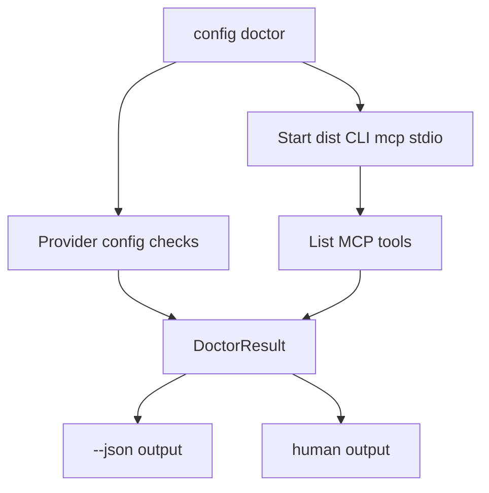

# config-doctor-mcp-e2e design

## 0. Terminology

- **Doctor**: diagnostic command returning pass/warn/fail/skipped checks and recovery.
- **Stdio MCP probe**: launching `node dist/cli/index.js mcp` as an independent process and performing initialize/listTools.
- **E2E temp HOME**: test-only home directory passed through `--home <dir>`.

## 1. Decisions And Constraints

### Requirement Summary

Close the roadmap by adding `archguard config doctor` and real E2E tests that prove Codex/Claude install/config/instructions flows work against the built CLI and independent MCP server.

### Explicit Non-Goals

- Do not rely on the current Codex/Claude session MCP server.
- Do not write real HOME.
- Do not add providers beyond Codex/Claude.
- Do not test Codebase Memory graph backend.

### Complexity Profile

Integration/E2E feature. The main risk is flaky process management around stdio MCP.

### Key Decisions

- Doctor minimum probe is independent stdio process initialize/listTools with default 5s timeout.
- Probe teardown sends `SIGTERM` after listTools or timeout, waits up to 500ms, then sends `SIGKILL` if the child is still alive.
- In-process MCP client may be used for additional fast tests but not as sole doctor proof.
- Reuse the `tests/e2e/` directory created by `agent-instructions-renderer`; if it is absent, this feature must create it and fail if `npm run test:e2e` empty-runs.
- `archguard config doctor` without provider checks both Codex and Claude and returns a multi-provider check list with `provider` omitted at top level.
- JSON output follows `DoctorResult`.

### Baseline Risk

ADR-007 warns that current agent-hosted MCP server cannot validate changed code. Doctor must avoid that trap.

### Top 3 Risks

1. **Flaky stdio probe**.
   - Mitigation: short timeout, deterministic teardown, stderr capture.
2. **False ok despite missing config**.
   - Mitigation: missing provider config is fail, query artifacts missing is warn.
3. **E2E writes user HOME**.
   - Mitigation: all tests pass `--home <tmp-home>`.

### Evidence Plan

- E2E install codex/claude into temp HOME.
- E2E doctor codex/claude JSON returns ok after install.
- Broken config fixture returns fail with recovery.
- Stdio probe listTools includes ArchGuard MCP tools.

### Deliverables

- `config doctor` command implementation.
- MCP probe helper.
- `tests/e2e/` with install/config/doctor flows.
- Docs updates for doctor usage.

### Cleanliness Rules

- Always kill spawned MCP process.
- Do not leave temp files outside test temp dir.
- No sleeps without timeout-based wait.

## 2. Nouns And Orchestration

### 2.1 Noun Layer

#### Current State

- MCP server can start through `archguard mcp`.
- No doctor command exists.
- `test:e2e` script exists. `agent-instructions-renderer` is expected to create `tests/e2e/`; this feature verifies the directory is real and adds doctor/onboarding E2E coverage there.

#### Changes

Add:

```ts
interface DoctorResult {
  ok: boolean;
  provider?: 'claude' | 'codex';
  checks: DoctorCheck[];
  recovery: string[];
}

interface DoctorCheck {
  id: string;
  status: 'pass' | 'warn' | 'fail' | 'skipped';
  message: string;
  path?: string;
  recovery?: string;
}

interface McpProbeOptions {
  timeoutMs?: number;
  teardownSignal?: 'SIGTERM' | 'SIGKILL';
}
```

When no provider is passed, `DoctorResult.provider` is omitted and `checks` contains provider-qualified check ids such as `codex.config.exists` and `claude.config.exists`.

### 2.2 Orchestration Layer



### 2.3 Mount Points

- `src/cli/agent/doctor.ts`
- `src/cli/agent/mcp-probe.ts`
- `src/cli/commands/config.ts`
- `tests/e2e/config-doctor.e2e.test.ts`
- `tests/e2e/agent-onboarding.e2e.test.ts`
- `docs/user-guide/mcp-usage.md` generated/manual doctor section if needed

`src/cli/commands/config.ts` is created by `agent-onboarding-cli`; this feature only appends/registers the `doctor` subcommand and does not change `show` or `remove` behavior.

### 2.4 Delivery Strategy

1. Implement probe helper with teardown.
   - Exit signal: integration test can list tools from dist CLI.
2. Implement doctor result aggregation.
   - Exit signal: unit tests produce pass/warn/fail.
3. Add CLI output modes.
   - Exit signal: `config doctor --json` returns stable JSON.
4. Add E2E flows.
   - Exit signal: `npm run test:e2e` executes `agent-onboarding.e2e.test.ts` and `config-doctor.e2e.test.ts`; the script output is not an empty run.
5. Add broken config fixtures.
   - Exit signal: tests cover JSON `{}`, TOML `[other]` only, and an ArchGuard entry whose command points at a missing executable.

### 2.5 Structure Health And Micro-Refactor

No micro-refactor. Add doctor/probe helpers under `src/cli/agent/`; keep command handler thin.

## 3. Acceptance Contract

- `archguard config doctor codex --home <tmp> --json` returns fail before install with recovery.
- After install, Codex doctor returns ok or warn only for missing query artifacts.
- Claude doctor has equivalent behavior.
- Doctor stdio probe launches current built `archguard mcp` and listTools includes registry MCP tools.
- Probe helper tears down the child process within 500ms after listTools returns.
- Broken config fixture returns fail and recovery.
- `npm run test:e2e` exercises install/config/instructions/doctor.
- `docs/adr/007-cli-mcp-interface-parity.md` records that current agent-hosted MCP servers are not acceptable verification evidence for modified MCP code.

### Required Validation Commands

- `npm run build`
- `npm run test:e2e`
- `node dist/cli/index.js install codex --home <tmp-home>`
- `node dist/cli/index.js config doctor codex --home <tmp-home> --json`
- `node dist/cli/index.js install claude --home <tmp-home>`
- `node dist/cli/index.js config doctor claude --home <tmp-home> --json`
- `npm run docs:check`

## 4. Architecture Documentation Relationship

Acceptance should update architecture docs with the doctor/probe subsystem and record the “do not use current agent-hosted MCP for verification” rule if it is not already visible enough.
