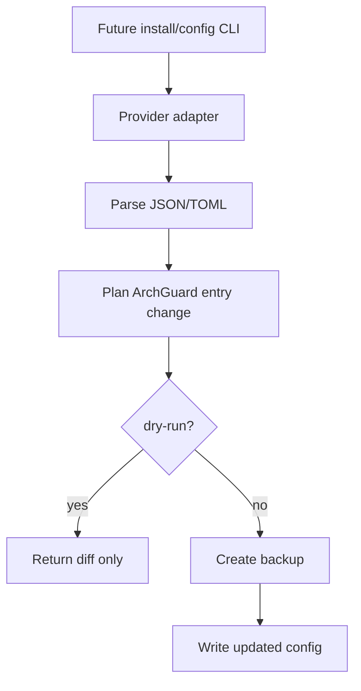

# provider-config-adapters design

## 0. Terminology

- **Provider adapter**: module that knows one agent provider's config file path and format.
- **Dry-run**: returns planned write result and diff without touching disk.
- **Backup**: timestamped copy of an existing config file before write.
- **Test home**: `--home <dir>` override used by tests to avoid real user HOME.

## 1. Decisions And Constraints

### Requirement Summary

Implement provider config adapters for Claude Code and Codex so later CLI commands can safely show, write, update, and remove ArchGuard MCP entries without modifying unrelated user config.

### Explicit Non-Goals

- Do not add top-level `archguard install` command yet.
- Do not perform MCP server probe.
- Do not write real user HOME in tests.
- Do not support providers beyond Claude and Codex.

### Complexity Profile

File format and safety feature. The risky part is preserving unknown JSON/TOML fields and providing deterministic dry-run behavior.

### Key Decisions

- Add adapters under `src/cli/agent/`.
- Use `--home <dir>`/home override in adapter API for tests.
- Claude config uses structured JSON read/write.
- Codex config uses `smol-toml` as the maintained TOML parser/serializer; this feature adds the dependency and lockfile update.
- Default config paths are:
  - Codex user scope: `~/.codex/config.toml`
  - Codex project scope: `<projectRoot>/.codex/config.toml`
  - Claude user scope: `~/.claude/mcp.json`
  - Claude project scope: `<projectRoot>/.mcp.json`
- Write operations only modify `archguard` MCP server entry and ArchGuard instruction blocks.
- This feature depends on `agent-instructions-renderer` for `InstructionRenderResult`; if that type is later moved to a shared `src/cli/agent/types.ts`, update both designs before implementation.

### Baseline Risk

Docs currently show manual Claude and Codex config snippets, but no code can safely manage them.

### Top 3 Risks

1. **Corrupting existing config**.
   - Mitigation: parser/serializer, backup, fixture tests with unrelated entries.
2. **Dry-run accidentally writes**.
   - Mitigation: memfs/temp HOME tests assert no file mutation.
3. **Provider path assumptions drift**.
   - Mitigation: adapter detection returns paths and reason; doctor later reports recovery.

### Evidence Plan

- Unit tests with temp HOME for Claude JSON and Codex TOML.
- Golden tests for preserving unrelated config.
- Dry-run mutation tests.

### Deliverables

- `AgentProviderAdapter` interface.
- `ClaudeCodeAdapter`.
- `CodexAdapter`.
- Shared types for `McpServerConfig`, `WriteOptions`, `WriteResult`.
- Tests for read/write/remove/show/dry-run/backup.

### Cleanliness Rules

- No regex-based config mutation.
- No writes outside provided home/project root in tests.
- No provider-specific logic in command handlers.

## 2. Nouns And Orchestration

### 2.1 Noun Layer

#### Current State

- No provider adapter modules exist.
- Manual config snippets live in README and docs.

#### Changes

Add:

```ts
interface AgentProviderAdapter {
  id: 'claude' | 'codex';
  detect(context: ProviderContext): Promise<ProviderDetection>;
  readConfig(context: ProviderContext): Promise<unknown>;
  writeMcpServer(
    context: ProviderContext,
    config: McpServerConfig,
    options: WriteOptions
  ): Promise<WriteResult>;
  removeMcpServer(context: ProviderContext, options: WriteOptions): Promise<WriteResult>;
  writeInstructions(
    context: ProviderContext,
    result: InstructionRenderResult,
    options: WriteOptions
  ): Promise<WriteResult>;
}
```

`ProviderContext` contains `scope`, `projectRoot`, and `homeDir`; this keeps `--home <dir>`
plumbing explicit without adding positional parameters as the adapter grows.

`WriteOptions` is:

```ts
interface WriteOptions {
  scope: 'user' | 'project';
  dryRun: boolean;
  force: boolean;
  backup: boolean;
}
```

`force` is required to overwrite an existing ArchGuard entry whose command/args differ from the planned entry; `dryRun` always wins and writes nothing.

### 2.2 Orchestration Layer



### 2.3 Mount Points

- `src/cli/agent/types.ts`
- `src/cli/agent/providers/claude.ts`
- `src/cli/agent/providers/codex.ts`
- `src/cli/agent/providers/index.ts`
- `tests/unit/cli/agent/provider-config-adapters.test.ts`
- `package.json` / lockfile if TOML dependency is added

### 2.4 Delivery Strategy

1. Add shared adapter types.
   - Exit signal: type-check passes.
2. Implement Claude JSON adapter.
   - Exit signal: fixture test preserves unrelated MCP servers.
3. Implement Codex TOML adapter with `smol-toml`.
   - Exit signal: fixture test preserves unrelated TOML config and package lock records `smol-toml`.
4. Add dry-run/backup/remove tests.
   - Exit signal: writes are safe and deterministic.

### 2.5 Structure Health And Micro-Refactor

No micro-refactor. New provider code should live under `src/cli/agent/` to avoid growing `src/cli/commands/`.

## 3. Acceptance Contract

- Claude adapter can read/write/remove ArchGuard MCP server entry in temp HOME.
- Codex adapter can read/write/remove ArchGuard MCP server entry in temp HOME.
- Detection returns the default config paths listed in this design for Codex and Claude user/project scopes.
- Existing unrelated config entries survive round-trip.
- Dry-run produces planned diff and does not write.
- Non-dry-run creates backup before overwriting existing config.
- No backup is required when creating a new config file that did not previously exist.
- Tests never write real HOME.

### Required Validation Commands

- `npm run type-check`
- `npm run lint`
- `npm test -- tests/unit/cli/agent/provider-config-adapters.test.ts`

## 4. Architecture Documentation Relationship

Acceptance should update architecture notes if `src/cli/agent/` becomes a stable subsystem.
