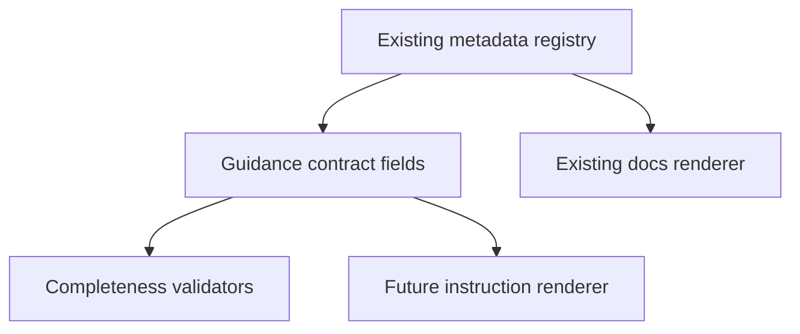

# registry-agent-guidance-contract design

## 0. Terminology

- **Agent guidance contract**: the subset of registry metadata consumed by agent instructions and agent-surface docs.
- **Freshness**: text that tells an agent whether a result reads current source, last `.archguard` artifacts, git history, or generated docs.
- **Docs include policy**: metadata flags deciding whether an entry appears in README, CLI guide, MCP guide, or agent surface.

## 1. Decisions And Constraints

### Requirement Summary

Extend the existing registry without changing CLI/MCP runtime behavior so future instruction rendering can use one source for `useWhen`, `avoidWhen`, `callFirst`, `failureRecovery`, `limitations`, `freshness`, and docs include policy.

### Explicit Non-Goals

- Do not implement install/config/update/doctor commands in this feature.
- Do not add provider-specific config writing.
- Do not migrate Commander option construction or MCP Zod schemas.
- Do not change existing tool names, command names, or handler behavior.

### Complexity Profile

Default internal TypeScript metadata change. The key risk is expanding the schema without creating unused abstraction.

### Key Decisions

- Add only fields needed by instructions rendering: `avoidWhen?: string[]`, `freshness?: string`, and `docs?: DocsContract`.
- Keep existing registry imports lightweight; metadata must not import Commander or MCP SDK.
- Validators must require `freshness` for artifact-backed tools and docs include policy for agent-facing entries.
- Freshness backfill uses the exported `workflowDependentMcpTools` list from `src/cli/metadata/registry.ts` as the authoritative set for workflow-dependent MCP tools.

### Baseline Risk

Current `AgentGuidance` has `useWhen`, `callFirst`, `followWith`, `failureRecovery`, and `limitations` only. Agent docs can describe when to call tools, but cannot consistently explain stale data or docs inclusion.

### Top 3 Risks

1. **Schema expands but entries stay sparse** - renderer would still need fallbacks.
   - Mitigation: validator checks required freshness/docs fields where applicable.
2. **Runtime coupling leaks into metadata** - metadata import becomes expensive.
   - Mitigation: add side-effect/import tests.
3. **Overlaps with later install contract** - this feature might absorb provider config concerns.
   - Mitigation: install-specific fields remain out of scope and move to `registry-install-config-contract`.

### Evidence Plan

- Unit evidence: metadata validator tests for new fields.
- Type evidence: `npm run type-check`.
- Drift evidence: existing metadata and docs tests still pass.

### Deliverables

- Updated `src/cli/metadata/types.ts`.
- Updated registry entries for workflow-dependent tools with `freshness`.
- Updated validator tests.
- No runtime behavior changes.

### Cleanliness Rules

- No TODO/FIXME placeholders.
- No temporary debug output.
- No heavy imports from metadata modules.

## 2. Nouns And Orchestration

### 2.1 Noun Layer

#### Current State

- `src/cli/metadata/types.ts` defines `AgentGuidance` without `avoidWhen` or `freshness`.
- `src/cli/metadata/docs-renderer.ts` can render agent-surface blocks, but long-form provider instructions are not modeled.
- Workflow-dependent MCP tools have `callFirst`, but stale-data behavior is encoded in prose.

#### Changes

- Add:

```ts
interface AgentGuidance {
  useWhen: string[];
  avoidWhen?: string[];
  callFirst?: string[];
  followWith?: string[];
  failureRecovery: string[];
  limitations: string[];
  freshness?: string;
}

interface DocsContract {
  includeInReadme?: boolean;
  includeInCliGuide?: boolean;
  includeInMcpGuide?: boolean;
  includeInAgentSurface?: boolean;
}
```

- Populate `freshness` for existing metadata categories that can surface stale generated data: `query`, `test-analysis`, `git-history`, `atlas`, and `docs`.
- Add validators for agent-facing completeness.

### 2.2 Orchestration Layer



#### Current State

Registry data is sufficient for MCP descriptions and docs generated blocks, but not enough for standalone provider instructions.

#### Changes

1. Extend types.
2. Backfill registry entries.
3. Enforce rules with validator tests.
4. Keep current renderers passing.

### 2.3 Mount Points

- `src/cli/metadata/types.ts`
- `src/cli/metadata/registry.ts`
- `src/cli/metadata/validators.ts`
- `tests/unit/cli/metadata-registry.test.ts`
- `tests/unit/cli/mcp/mcp-metadata-drift.test.ts` is not modified by default; only update it if MCP description rendering changes and the existing drift test proves compatibility is needed.

### 2.4 Delivery Strategy

1. Add optional fields to types.
   - Exit signal: type-check passes.
2. Add validator rules.
   - Exit signal: missing freshness/docs policy test fails for a tool listed in `workflowDependentMcpTools`.
3. Backfill registry entries.
   - Exit signal: validator tests pass.
4. Add side-effect/import regression coverage.
   - Exit signal: importing metadata modules does not import Commander or MCP SDK.
5. Confirm current docs/MCP surfaces remain stable.
   - Exit signal: docs check and metadata E2E pass.

### 2.5 Structure Health And Micro-Refactor

No micro-refactor. This feature extends existing metadata files and tests; it should not move modules.

## 3. Acceptance Contract

- `AgentGuidance` supports `avoidWhen` and `freshness`.
- Registry supports docs include policy for agent-facing generated surfaces.
- Artifact-backed tools declare freshness.
- Validators fail when workflow-dependent tools have no freshness text.
- Metadata import remains side-effect free and does not import Commander or MCP SDK.
- Existing CLI/MCP/docs behavior is unchanged.
- `workflowDependentMcpTools` is the validator source of truth for freshness requirements.

### Required Validation Commands

- `npm run type-check`
- `npm test -- tests/unit/cli/metadata-registry.test.ts`
- `npm test -- tests/integration/cli-mcp/metadata-surface-e2e.test.ts`
- `npm run docs:check`

## 4. Architecture Documentation Relationship

Acceptance should update `.codestable/architecture/ARCHITECTURE.md` if the metadata contract description changes materially.
