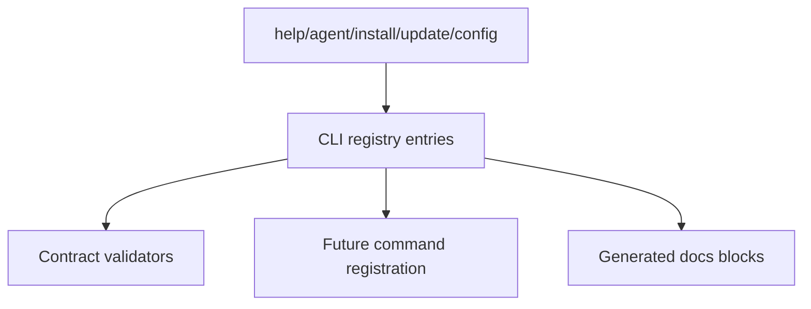

# registry-install-config-contract design

## 0. Terminology

- **Install contract**: metadata describing whether a command writes config, writes instructions, and which provider/scope it targets.
- **Surface policy**: explicit declaration of `both`, `cli-only`, `mcp-only`, `docs-only`, or `internal`.
- **Lifecycle**: `stable`, `experimental`, or `deprecated`.

## 1. Decisions And Constraints

### Requirement Summary

Prepare the registry so upcoming install/config/update/doctor commands can be represented in the same metadata source as existing CLI/MCP/docs surfaces.

### Explicit Non-Goals

- Do not implement provider adapters.
- Do not write config files.
- Do not implement doctor probe.
- Do not change existing command behavior besides adding metadata.

### Complexity Profile

Metadata and validation feature. Risk is drift between new commands and registry baseline.

### Key Decisions

- Add lifecycle and surface policy to metadata entries.
- Add `ArtifactContract` and `InstallContract`; `DocsContract` is owned by `registry-agent-guidance-contract`.
- Add `help`, `install`, `update`, and `config` to CLI metadata. `agent` command metadata is owned by `agent-instructions-renderer`.
- Do not add `install` / `update` / `config` to the enforced runtime baseline until their command shells are registered in `agent-onboarding-cli`; staged metadata may be marked experimental and excluded from runtime drift until then.
- Concretely, this feature adds `help` to `cliCommandBaseline` immediately, and introduces a separate staged command metadata list or lifecycle-based validator exemption for `install` / `update` / `config` until runtime registration lands.
- `help` is `cli-only` and does not need `InstallContract`.
- `help` still needs real examples and verification, with verification pointing at `tests/unit/cli/help-command.test.ts`.
- `install`, `update`, and `config` must have `InstallContract`.

### Baseline Risk

Current `cliCommandBaseline` excludes `help`; new commands would otherwise be easy to forget in registry and docs drift tests.

### Top 3 Risks

1. **Registry baseline mismatch**.
   - Mitigation: drift tests compare actual Commander commands to registry.
2. **Contract interaction unclear**.
   - Mitigation: validators enforce `writesInstructions -> includeInAgentSurface`.
3. **Over-prescriptive install metadata**.
   - Mitigation: provider-specific file details remain in provider adapters.

### Evidence Plan

- Unit validator tests for lifecycle/surface/install/docs interactions.
- CLI metadata drift tests include new command names.
- Docs check passes.

### Deliverables

- Extended metadata types.
- Registry entries for `help`, `agent`, `install`, `update`, `config`.
- Validator rules for install/docs relationship.
- Tests proving baseline and contract completeness.

### Cleanliness Rules

- No placeholder registry entries without examples/guidance.
- No runtime imports into metadata.

## 2. Nouns And Orchestration

### 2.1 Noun Layer

#### Current State

- Registry categories include analysis, query, test-analysis, git-history, atlas, cache, configuration, fitness, metrics, mcp, docs.
- Existing CLI baseline has 7 commands and omits `help`.
- No install/config metadata fields exist.

#### Changes

- Add:

```ts
type SurfacePolicy = 'both' | 'cli-only' | 'mcp-only' | 'docs-only' | 'internal';
type Lifecycle = 'stable' | 'experimental' | 'deprecated';

interface ArtifactContract {
  reads?: string[];
  writes?: string[];
  requiresAnalyze?: boolean;
  requiresGitAnalyze?: boolean;
  requiresTestAnalyze?: boolean;
}

interface InstallContract {
  provider?: 'claude' | 'codex' | 'all';
  configScope?: 'user' | 'project';
  writesConfig?: boolean;
  writesInstructions?: boolean;
}
```

- Add registry entries for new commands even before runtime handlers are implemented, guarded by lifecycle `experimental` if needed.
- Add explicit validator rules:
  - `surfacePolicy === 'cli-only'` entries cannot declare MCP surfaces.
  - `surfacePolicy === 'mcp-only'` entries cannot be in the enforced CLI baseline.
  - `surfacePolicy === 'internal'` entries cannot be rendered into generated docs blocks.
  - `install.writesInstructions === true` requires `docs.includeInAgentSurface === true`.
  - `install.provider === 'all'` means per-provider reporting; `configScope` remains `user` or `project` only.

### 2.2 Orchestration Layer



### 2.3 Mount Points

- `src/cli/metadata/types.ts`
- `src/cli/metadata/registry.ts`
- `src/cli/metadata/validators.ts`
- `tests/unit/cli/cli-metadata-drift.test.ts`
- `tests/unit/cli/metadata-registry.test.ts`

### 2.4 Delivery Strategy

1. Add contract types.
   - Exit signal: type-check passes.
2. Add validator rules.
   - Exit signal: invalid install/docs combinations fail tests.
3. Add `help` registry entry and immediate baseline update.
   - Exit signal: CLI metadata drift tests expect `help` and `tests/unit/cli/help-command.test.ts` covers it.
4. Add staged `install` / `update` / `config` registry entries.
   - Exit signal: metadata validators cover these entries without causing runtime CLI drift before command shells exist.
5. Refresh docs generated blocks if affected.
   - Exit signal: docs check passes.

### 2.5 Structure Health And Micro-Refactor

No micro-refactor. This remains in `src/cli/metadata/`. If registry data becomes too large, later split registry by category; do not split during this feature unless tests become unreadable.

## 3. Acceptance Contract

- `help`, `install`, `update`, and `config` metadata entries exist; only `help` is enforced in the runtime CLI baseline during this feature.
- `help` is explicitly `cli-only`.
- `help` has at least one real example and verification target `tests/unit/cli/help-command.test.ts`.
- `install`, `update`, and `config` have install metadata.
- Validators enforce `writesInstructions -> includeInAgentSurface`.
- Validators enforce provider/scope rules for provider `all` and the surfacePolicy rules above.
- Existing metadata surface E2E remains green.

### Required Validation Commands

- `npm run type-check`
- `npm test -- tests/unit/cli/metadata-registry.test.ts tests/unit/cli/cli-metadata-drift.test.ts`
- `npm run docs:check`

## 4. Architecture Documentation Relationship

Acceptance should update architecture notes if the registry is now the source for install/config command metadata.
