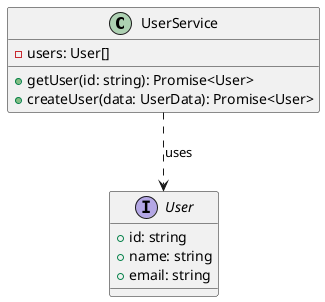

# ArchGuard

Automated architecture documentation generation tool with AI-powered PlantUML diagrams.

## Overview

ArchGuard analyzes TypeScript projects to extract architectural insights and generates beautiful PlantUML diagrams using Claude AI. It automatically identifies classes, interfaces, enums, and their relationships, creating comprehensive architecture documentation with minimal effort.

## Features

- **Parallel Processing**: High-performance parsing with configurable concurrency
- **Smart Caching**: File-based caching with SHA-256 hashing for fast repeated analysis
- **AI-Powered Diagrams**: Beautiful PlantUML diagrams generated through Claude Code CLI
- **Zero API Key Management**: Uses Claude Code's existing configuration
- **Rich CLI**: Interactive progress display with real-time feedback
- **Flexible Output**: Generate PlantUML diagrams or ArchJSON data
- **Robust Error Handling**: Graceful handling of parsing errors with detailed reporting
- **Configuration Files**: Project-level configuration with .archguardrc support
- **High Test Coverage**: 80%+ test coverage with comprehensive unit, integration, and E2E tests

## Quick Start

### Installation

```bash
npm install -g archguard
```

Or install as a dev dependency:

```bash
npm install --save-dev archguard
```

### Prerequisites

Ensure you have claude-glm CLI installed and configured:

```bash
# Check if claude-glm is available
claude-glm --version
```

If you don't have claude-glm, install it according to your setup instructions.

**Note**: ArchGuard uses claude-glm CLI for PlantUML generation.

### Basic Usage

Analyze your TypeScript project:

```bash
archguard analyze -s ./src -o ./docs/architecture
```

This generates both `architecture.png` (diagram image) and `architecture.puml` (source code).

Generate JSON output:

```bash
archguard analyze -s ./src -o ./docs/architecture.json -f json
```

With verbose output:

```bash
archguard analyze -s ./src -o ./docs/architecture -v
```

## CLI Commands

### `analyze`

Analyze TypeScript project and generate architecture diagrams.

```bash
archguard analyze [options]
```

**Options:**

- `-s, --source <path>` - Source directory to analyze (default: ./src)
- `-o, --output <path>` - Output file path (without extension for PNG format)
- `-f, --format <type>` - Output format: png, svg, json (default: png)
- `-e, --exclude <patterns...>` - Exclude patterns
- `--no-cache` - Disable cache
- `-c, --concurrency <num>` - Parallel parsing concurrency (default: CPU cores)
- `-v, --verbose` - Verbose output
- `--cli-command <command>` - Claude CLI command to use (default: claude)
- `--cli-args <args>` - Additional CLI arguments (space-separated)
- `--output-dir <dir>` - Output directory for diagrams (default: ./archguard)

**Output Formats:**

- **png** (default): Generates both `.png` image and `.puml` source file
- **svg**: Generates `.svg` vector graphics
- **json**: Generates `.json` ArchJSON data

**Examples:**

```bash
# Basic analysis (generates architecture.png and architecture.puml)
archguard analyze

# Analyze specific directory with custom output
archguard analyze -s ./packages/core -o ./docs/core-architecture

# High-performance parallel processing
archguard analyze -s ./src -c 8 -v

# Exclude specific files
archguard analyze -s ./src -e "**/*.test.ts" "**/*.spec.ts"

# JSON output for further processing
archguard analyze -s ./src -o ./output.json -f json

# SVG output
archguard analyze -s ./src -o ./diagram -f svg

# Custom Claude CLI command
archguard analyze -s ./src --cli-command /usr/local/bin/claude

# Additional CLI arguments (e.g., custom model)
archguard analyze -s ./src --cli-args "--model claude-3-5-sonnet-20241022"

# Custom output directory
archguard analyze -s ./src --output-dir ./docs/diagrams
```

### `init`

Initialize ArchGuard configuration file.

```bash
archguard init [options]
```

**Options:**

- `-f, --force` - Overwrite existing configuration

Creates `.archguardrc.json` with default settings:

```json
{
  "source": "./src",
  "output": "./docs/architecture.puml",
  "format": "plantuml",
  "exclude": ["**/*.test.ts", "**/*.spec.ts", "**/node_modules/**"],
  "concurrency": 4,
  "cache": true,
  "cli": {
    "command": "claude",
    "args": [],
    "timeout": 60000
  },
  "outputDir": "./archguard"
}
```

### `cache`

Manage cache operations.

```bash
# View cache statistics
archguard cache stats

# Clear all cache
archguard cache clear

# Show cache directory
archguard cache path
```

## Configuration

### Configuration File

Create `.archguardrc.json` in your project root:

```json
{
  "source": "./src",
  "output": "./docs/architecture.puml",
  "format": "plantuml",
  "exclude": [
    "**/*.test.ts",
    "**/*.spec.ts",
    "**/node_modules/**"
  ],
  "concurrency": 4,
  "cache": true,
  "cli": {
    "command": "claude",
    "args": [],
    "timeout": 60000
  },
  "outputDir": "./archguard"
}
```

### Dependencies

- **Claude Code CLI** - Required for PlantUML generation (default: `claude`)
- **node-plantuml** - Required for PNG image rendering (automatically installed)

### Configuration Fields

#### CLI Configuration

ArchGuard uses the Claude Code CLI for AI-powered diagram generation. You can customize the CLI behavior:

```json
{
  "cli": {
    "command": "claude",
    "args": ["--model", "claude-3-5-sonnet-20241022"],
    "timeout": 60000
  }
}
```

**Field Descriptions:**

- **cli.command** - The Claude CLI command to use (default: `claude`)
- **cli.args** - Additional arguments to pass to the CLI (e.g., model selection)
- **cli.timeout** - Timeout in milliseconds for CLI operations (default: 60000)

#### Output Directory

Control where diagrams are generated:

```json
{
  "outputDir": "./archguard"
}
```

**CLI Override:**

```bash
archguard analyze --output-dir ./docs/diagrams
```

#### Backward Compatibility

Old configuration files with `ai.model` are automatically migrated:

```json
// Old (v1.0) - Still works
{
  "ai": {
    "model": "claude-3-5-sonnet-20241022",
    "timeout": 120000
  }
}

// New (v1.1) - Recommended
{
  "cli": {
    "command": "claude",
    "args": ["--model", "claude-3-5-sonnet-20241022"],
    "timeout": 120000
  }
}
```

**Migration Notes:**

- `ai.model` → `cli.args` (automatically converted to `--model` flag)
- `ai.timeout` → `cli.timeout`
- Deprecated fields: `ai.apiKey`, `ai.maxTokens`, `ai.temperature` (removed)

See [MIGRATION.md](MIGRATION.md) for detailed migration guide.

## Performance

ArchGuard is optimized for large projects:

- **Parallel Processing**: Automatically uses CPU cores for faster parsing
- **Smart Caching**: 80%+ cache hit rate on repeated runs
- **Benchmark Results** (on ArchGuard itself):
  - First run: ~6-10 seconds for 27 files
  - Cached run: <3 seconds
  - Throughput: 4-5 files/second
  - Memory usage: <300MB

### Performance Tuning

Adjust concurrency for optimal performance:

```bash
# Use all CPU cores (default)
archguard analyze -s ./src

# Custom concurrency
archguard analyze -s ./src -c 8

# Sequential processing (debugging)
archguard analyze -s ./src -c 1
```

## Output Formats

### PlantUML (Default)

Generates `.puml` files that can be rendered using PlantUML:



### ArchJSON

Generates structured JSON with complete architectural data:

```json
{
  "version": "1.0",
  "language": "typescript",
  "timestamp": "2024-01-01T00:00:00.000Z",
  "sourceFiles": ["src/user-service.ts"],
  "entities": [
    {
      "id": "UserService",
      "name": "UserService",
      "type": "class",
      "visibility": "public",
      "members": [...],
      "sourceLocation": {...}
    }
  ],
  "relations": [...]
}
```

## Architecture

### Project Structure

```
archguard/
├── src/
│   ├── parser/              # TypeScript parsing
│   │   ├── typescript-parser.ts
│   │   ├── parallel-parser.ts   # Parallel processing
│   │   ├── class-extractor.ts
│   │   ├── interface-extractor.ts
│   │   └── relation-extractor.ts
│   ├── ai/                  # AI integration
│   │   ├── claude-connector.ts
│   │   ├── plantuml-generator.ts
│   │   ├── plantuml-validator.ts
│   │   └── cost-tracker.ts
│   ├── cli/                 # CLI implementation
│   │   ├── commands/
│   │   ├── progress.ts
│   │   ├── cache-manager.ts
│   │   ├── config-loader.ts
│   │   └── error-handler.ts
│   └── types/               # Type definitions
├── tests/
│   ├── unit/                # Unit tests (287 tests)
│   ├── integration/         # Integration tests (27 tests)
│   └── e2e/                 # End-to-end tests
└── docs/                    # Documentation
```

### Data Flow

1. **Parse**: TypeScript files → AST → ArchJSON
2. **Cache**: Check cache for previously parsed files
3. **Parallel**: Process multiple files concurrently
4. **Generate**: ArchJSON → Claude Code CLI → PlantUML
5. **Validate**: PlantUML syntax and completeness
6. **Output**: Write to file system

## Development

### Prerequisites

- Node.js >= 18.0.0
- npm or yarn
- Claude Code CLI (installed and configured)

### Setup

```bash
# Clone repository
git clone https://github.com/your-org/archguard.git
cd archguard

# Install dependencies
npm install

# Build
npm run build

# Run tests
npm test
```

### Testing

```bash
# Run all tests
npm test

# Run with coverage (80%+ coverage)
npm run test:coverage

# Run specific test suites
npm run test:unit          # 287 unit tests
npm run test:integration   # 27 integration tests

# Watch mode for development
npm run test:watch
```

### Code Quality

```bash
# Lint
npm run lint
npm run lint:fix

# Format
npm run format
npm run format:check

# Type check
npm run type-check

# All checks
npm run build && npm run lint && npm run type-check && npm test
```

## Technology Stack

| Category | Technology | Version | Purpose |
|----------|-----------|---------|---------|
| Language | TypeScript | ^5.3.0 | Type-safe development |
| Runtime | Node.js | >=18.0.0 | JavaScript runtime |
| Parser | ts-morph | ^21.0.0 | TypeScript AST parsing |
| CLI Integration | claude-glm CLI | - | PlantUML generation (via subprocess) |
| PNG Rendering | @entrofi/node-plantuml | latest | PlantUML to PNG conversion |
| Process Management | execa | ^8.0.0 | Subprocess execution |
| Testing | Vitest | ^1.2.0 | Unit/integration tests |
| CLI | commander | ^11.1.0 | Command-line interface |
| Progress | ora, chalk | ^8.x, ^5.x | Interactive CLI |
| Concurrency | p-limit | ^5.0.0 | Parallel processing |
| Validation | zod | ^3.25.76 | Configuration validation |

## Troubleshooting

See [TROUBLESHOOTING.md](docs/TROUBLESHOOTING.md) for common issues and solutions.

## Documentation

- [CLI Usage Guide](docs/CLI-USAGE.md)
- [Configuration Reference](docs/CONFIGURATION.md)
- [Troubleshooting](docs/TROUBLESHOOTING.md)

## Contributing

This project follows:

- **TDD Methodology**: Tests written before implementation
- **RLM Practices**: Systematic refactoring lifecycle management
- **Clean Code**: Readable, maintainable, documented code

See [CONTRIBUTING.md](docs/CONTRIBUTING.md) for details.

## License

MIT

## Credits

Built with:
- [ts-morph](https://ts-morph.com/) for TypeScript parsing
- [Claude AI](https://www.anthropic.com/claude) for diagram generation
- [PlantUML](https://plantuml.com/) for diagram rendering
