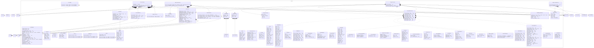
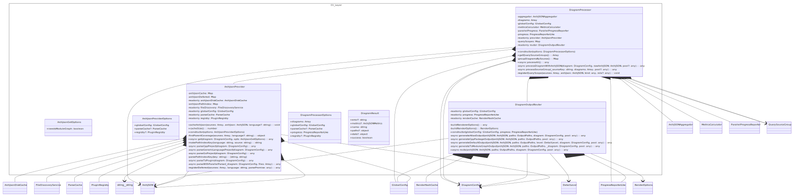

# ArchGuard

ArchGuard analyzes source code to extract architectural insights and generates **Mermaid diagrams** at multiple levels of detail. It supports TypeScript (stable), Go (stable), Java (beta), and Python (beta) through a plugin system, and exposes query and MCP workflows for architecture inspection.

## Screenshots

### Package-Level Overview


### Class-Level Diagram


### Method-Level Detail (CLI Module)


## Features

- **AI-Native MCP Interface**: Query architecture in natural language from Claude Code or Codex — analyze projects, trace dependencies, find implementers, detect cycles
- **Multi-Language Support**: TypeScript, Go, Java, Python via plugin system
- **Multi-Level Diagrams**: Package (high-level), Class (default), Method (low-level)
- **Go Architecture Atlas**: 4-layer visualization — package graph, capability graph, goroutine topology, flow graph
- **Parallel Processing**: High-performance parsing with configurable concurrency
- **Smart Caching**: File-based caching with SHA-256 hashing for fast repeated runs
- **Zero External Dependencies**: Local Mermaid rendering using isomorphic-mermaid
- **Five-Layer Validation**: Automatic syntax, structure, render, quality, and auto-repair validation
- **Configuration Files**: Project-level config with `archguard.config.json` support
- **Rich CLI**: Interactive progress display with real-time feedback

## Quick Start

### Installation

```bash
npm install -g @yalehwang/archguard
```

### Using with Claude Code

Register the MCP server (project scope):

```bash
claude mcp add --scope project archguard -- archguard mcp
```

Then ask Claude to analyze any project:

> Analyze the architecture of `/path/to/my-project` using archguard MCP.

Claude will call `archguard_analyze` to parse the project and build a query index. Once done, ask follow-up questions in natural language:

> Find all classes that implement `ILanguagePlugin`.

> Show me what depends on `ArchJSON`, depth 1.

> Detect circular dependencies in this project.

> Review this project's code and documentation using the archguard MCP and the `.archguard` output files.

> Based on the archguard analysis, suggest refactoring directions for reducing coupling.

**Re-using an existing analysis**: If the project was already analyzed in a previous session, query artifacts persist in `.archguard/query/`. You can skip re-analysis and query the cache directly:

> Using the existing archguard cache, show me what depends on `DiagramProcessor`.

### Using with Codex

Register the MCP server:

```bash
codex mcp add archguard -- archguard mcp
```

Or add to `~/.codex/config.toml`:

```toml
[mcp_servers.archguard]
command = "archguard"
args = ["mcp"]
```

Then prompt Codex in the same way. The same MCP tools are available.

### Analyzing an External Project

Point archguard at any project path — no configuration file needed:

> Analyze the architecture of `/home/user/work/my-project` using archguard MCP.

Archguard auto-detects the language and project structure, generates diagrams under `<project>/.archguard/`, and builds the query index for follow-up queries.

### Standalone CLI

Run directly without an AI assistant:

```bash
# Analyze current project (auto-detects language and structure)
archguard analyze

# Analyze an external project
archguard analyze -s /path/to/project/src

# Go project
archguard analyze -s ./cmd --lang go
```

## CLI Commands

### `analyze`

Analyze a project and generate architecture diagrams.

```bash
archguard analyze [options]
```

**Source & Selection:**

- `-s, --sources <paths...>` - Source directories; triggers auto-detection and multi-diagram generation
- `--diagrams <levels...>` - Filter by level: `package` | `class` | `method` (language-dependent)
- `--lang <language>` - Language: `typescript` | `go` | `java` | `python` (auto-detected)
- `--config <path>` - Config file path (default: `archguard.config.json`)

**Output:**

- `--work-dir <dir>` - ArchGuard work directory (default: `./.archguard`)
- `--cache-dir <dir>` - Cache directory (default: `<work-dir>/cache`)
- `--output-dir <dir>` - Output directory
- `-f, --format <type>` - Output format: `mermaid` | `json` (default: `mermaid`)
- `-e, --exclude <patterns...>` - Exclude glob patterns

**Performance:**

- `--no-cache` - Disable cache
- `-c, --concurrency <num>` - Parallel parsing workers (default: CPU cores)
- `-v, --verbose` - Verbose output

**Mermaid:**

- `--mermaid-theme <theme>` - Theme: `default` | `forest` | `dark` | `neutral`
- `--mermaid-renderer <renderer>` - Renderer: `isomorphic` | `cli`

**Go Atlas** (enabled by default for Go):

- `--atlas` - Enable Atlas mode
- `--no-atlas` - Disable Atlas mode, use standard Go parsing
- `--atlas-layers <layers>` - Comma-separated layers: `package,capability,goroutine,flow`
- `--atlas-strategy <strategy>` - Analysis strategy: `none` | `selective` | `full`
- `--atlas-no-tests` - Exclude test files from Atlas extraction
- `--atlas-include-tests` - Include test packages in Atlas
- `--atlas-protocols <protocols>` - Protocols included in flow graph

**Claude CLI:**

- `--cli-command <command>` - Claude CLI executable (default: `claude`)
- `--cli-args <args>` - Additional Claude CLI arguments

**Examples:**

```bash
# Basic analysis
archguard analyze

# Filter generated diagrams by level
archguard analyze --diagrams class method

# Generate JSON for tooling integration
archguard analyze -s ./src --output-dir . -f json

# Go project with Architecture Atlas
archguard analyze -s ./cmd --lang go

# Go without Atlas (faster, basic diagram)
archguard analyze -s ./cmd --lang go --no-atlas

# High concurrency
archguard analyze -s ./src -c 8 -v

# Exclude test files
archguard analyze -s ./src -e "**/*.test.ts" "**/*.spec.ts"

# Dark theme
archguard analyze -s ./src --mermaid-theme dark
```

### `query`

Query persisted architecture entities and relationships.

```bash
archguard query [options]
```

Common examples:

```bash
archguard query --summary
archguard query --entity "DiagramProcessor"
archguard query --entity "DiagramProcessor" --format json
archguard query --entity "DiagramProcessor" --format json --verbose
archguard query --deps-of "DiagramProcessor" --depth 2
archguard query --implementers-of "ILanguagePlugin"
archguard query --list-scopes
```

Typical architecture checking tasks:

- Dependency impact: `archguard query --deps-of "DiagramProcessor" --depth 2`
- Reverse impact: `archguard query --used-by "DiagramProcessor" --depth 2`
- Extension points: `archguard query --implementers-of "ILanguagePlugin"`
- Circular dependencies: `archguard query --cycles`
- Refactoring hotspots: `archguard query --high-coupling`
- Orphans: `archguard query --orphans`

See [Architecture Checking Scenarios](docs/user-guide/architecture-checking-scenarios.md) for task-oriented workflows.

### `mcp`

Start the ArchGuard MCP server over stdio.

```bash
archguard mcp [--arch-dir <dir>] [--scope <key>]
```

The MCP server exposes the query tools plus `archguard_analyze`, which refreshes query artifacts for the current MCP session. Query tools default to the persisted global scope and return summary entities unless `verbose: true` is requested.

**Claude Code** — add via CLI (project scope):

```bash
claude mcp add --scope project archguard -- archguard mcp
```

**Codex** — add via CLI or `~/.codex/config.toml`:

```bash
codex mcp add archguard -- archguard mcp
```

**Available MCP tools:**

| Tool | Purpose |
|------|---------|
| `archguard_summary` | Project overview: entity/relation counts, scope list |
| `archguard_find_entity` | Look up a named class, interface, or function |
| `archguard_get_dependencies` | Outgoing dependencies of an entity (what it uses) |
| `archguard_get_dependents` | Incoming dependencies of an entity (who uses it) |
| `archguard_find_implementers` | All implementations of an interface |
| `archguard_find_subclasses` | All subclasses of a base class |
| `archguard_get_file_entities` | All entities defined in a source file |
| `archguard_detect_cycles` | Circular dependency detection |
| `archguard_analyze` | Refresh query artifacts in the current session |

See [MCP Usage Guide](docs/user-guide/mcp-usage.md) for setup, tool reference, and usage patterns.

### `init`

Initialize configuration file:

```bash
archguard init
```

Creates `archguard.config.json` with defaults. Use `-f js` for a JavaScript config.

### `cache`

```bash
archguard cache stats   # View cache statistics
archguard cache clear   # Clear all cached data
archguard cache path    # Show cache directory
```

## Language Support

| Language   | Status | Parser                    | Features                                           |
|------------|--------|---------------------------|----------------------------------------------------|
| TypeScript | Stable | ts-morph (AST)            | Classes, interfaces, enums, dependencies, path aliases |
| Go         | Stable | tree-sitter + gopls       | Structs, interfaces, goroutines, Architecture Atlas |
| Java       | Beta   | tree-sitter               | Classes, interfaces, Maven/Gradle deps              |
| Python     | Beta   | tree-sitter               | Classes, functions, pip/Poetry deps                 |

### Go Architecture Atlas

For Go projects, ArchGuard generates a multi-layer architecture atlas showing:

- **Package Graph** — inter-package dependencies and coupling
- **Capability Graph** — functional capability clusters
- **Goroutine Topology** — concurrent execution patterns and channel topology
- **Flow Graph** — data and control flow paths

```bash
# Full Atlas (default when --lang go)
archguard analyze -s ./cmd --lang go

# Specific layers only
archguard analyze -s ./cmd --lang go --atlas-layers package,capability

# Standard diagram without Atlas
archguard analyze -s ./cmd --lang go --no-atlas
```

gopls is optional but improves interface detection accuracy from ~75% to ~95%:

```bash
go install golang.org/x/tools/gopls@latest
```

See [Go Plugin Usage Guide](docs/user-guide/golang-plugin-usage.md) for details.

## Configuration

### `archguard.config.json`

```json
{
  "format": "mermaid",
  "exclude": ["**/*.test.ts", "**/*.spec.ts", "**/node_modules/**"],
  "concurrency": 4,
  "workDir": "./.archguard",
  "outputDir": "./docs/architecture",
  "cache": { "enabled": true, "dir": "./.archguard/cache" },
  "mermaid": {
    "renderer": "isomorphic",
    "theme": "default",
    "transparentBackground": true
  },
  "cli": {
    "command": "claude",
    "args": [],
    "timeout": 60000
  }
}
```

### Multi-Diagram Configuration

Generate multiple diagrams with different sources and levels in one run:

```json
{
  "diagrams": [
    {
      "name": "overview",
      "sources": ["./src"],
      "level": "package"
    },
    {
      "name": "modules/cli",
      "sources": ["./src/cli"],
      "level": "class"
    },
    {
      "name": "modules/parser",
      "sources": ["./src/parser"],
      "level": "method"
    }
  ],
  "outputDir": "./docs/architecture"
}
```

```bash
# Generate all diagrams
archguard analyze

# Filter configured diagrams by level
archguard analyze --diagrams class method
```

### Configuration Fields

| Field | Type | Default | Description |
|-------|------|---------|-------------|
| `source` | string | `./src` | Source directory (single-diagram mode) |
| `diagrams` | array | — | Multi-diagram config (overrides `source`) |
| `format` | string | `mermaid` | Output format: `mermaid` or `json` |
| `exclude` | string[] | `[]` | Glob patterns to exclude |
| `concurrency` | number | CPU cores | Parallel parsing workers |
| `workDir` | string | `./.archguard` | Work directory for cache and query artifacts |
| `outputDir` | string | `./.archguard/output` | Output directory |
| `cache.enabled` | boolean | `true` | Enable file-based caching |
| `mermaid.theme` | string | `default` | Diagram theme |
| `mermaid.transparentBackground` | boolean | `true` | Transparent PNG background |
| `cli.command` | string | `claude` | Claude CLI executable |
| `cli.timeout` | number | `60000` | Claude CLI timeout (ms) |

## Output Formats

### Mermaid (default)

Generates `.mmd`, `.svg`, and `.png` files:

```
archguard/
├── overview/
│   ├── package.mmd
│   ├── package.svg
│   └── package.png
├── modules/
│   ├── cli.mmd
│   └── cli.png
└── index.md
```

Example `.mmd` output:

```
graph TD
  UserService[UserService<br/>+ getUser(id): Promise&lt;User&gt;<br/>+ createUser(data): Promise&lt;User&gt;]
  User[User<br/>+ id: string<br/>+ name: string]

  UserService --> User : uses
```

### ArchJSON

Structured JSON for tooling integration:

```json
{
  "version": "1.0",
  "language": "typescript",
  "timestamp": "2024-01-01T00:00:00.000Z",
  "entities": [
    {
      "id": "UserService",
      "name": "UserService",
      "type": "class",
      "members": [...]
    }
  ],
  "relations": [
    { "from": "UserService", "to": "User", "type": "dependency" }
  ]
}
```

## Performance

- **Parallel Processing**: Automatically uses all CPU cores for parsing
- **Smart Caching**: SHA-256 file hashing; 80%+ cache hit rate on repeated runs
- **Benchmark** (ArchGuard self-analysis, 30+ files):
  - First run: ~6–10 seconds
  - Cached run: < 3 seconds
  - Throughput: ~4–5 files/second
  - Memory: < 300 MB

Tune concurrency:

```bash
archguard analyze -s ./src -c 8     # custom workers
archguard analyze -s ./src -c 1     # sequential (debugging)
```

## Architecture

For current implementation details, see:

- [Architecture Checking Scenarios](docs/user-guide/architecture-checking-scenarios.md)
- [Architecture Overview](docs/dev-guide/architecture.md)
- [CLI Usage](docs/user-guide/cli-usage.md)

### Project Structure

```
archguard/
├── src/
│   ├── cli/                 # CLI commands and utilities
│   │   ├── commands/        # analyze, init, cache
│   │   ├── progress/        # Progress reporting
│   │   ├── processors/      # Diagram processing pipeline
│   │   └── utils/           # Config loader, error handler
│   ├── core/                # Plugin registry and interfaces
│   │   └── interfaces/      # ILanguagePlugin, IParser, IDependencyExtractor
│   ├── parser/              # TypeScript AST parsing
│   │   ├── typescript-parser.ts
│   │   ├── parallel-parser.ts
│   │   └── extractors/      # class, interface, enum, relation
│   ├── mermaid/             # Diagram generation
│   │   ├── diagram-generator.ts
│   │   ├── renderer.ts
│   │   ├── validation-pipeline.ts
│   │   └── validators/      # parse, structural, render, quality
│   ├── plugins/             # Language plugins
│   │   ├── typescript/      # Stable
│   │   ├── golang/          # Stable (tree-sitter + gopls + Atlas)
│   │   │   └── atlas/       # package, capability, goroutine, flow builders
│   │   ├── java/            # Beta
│   │   └── python/          # Beta
│   └── types/               # Core types (config, ArchJSON, extensions)
├── tests/
│   ├── unit/                # Unit tests
│   ├── integration/         # Integration tests
│   ├── plugins/             # Per-plugin tests
│   └── core/                # Plugin registry tests
└── docs/                    # Documentation and screenshots
```

### Data Flow

```
CLI / MCP entrypoint
    │
    ▼ Shared analysis core (`runAnalysis`)
Config normalization + diagram selection
    │
    ▼ DiagramProcessor
ArchJsonProvider + language plugins
    │
    ▼ ArchJSON (entities + relations + optional extensions)
    │
    ├─► Query artifacts (`.archguard/query/*`)
    ├─► Mermaid / JSON outputs (`.archguard/output/*`)
    └─► Go Atlas extension (package / capability / goroutine / flow)
    │
    ▼ QueryEngine / MCP query tools
Architecture inspection workflows
```

## Development

### Prerequisites

- Node.js >= 18.0.0
- npm or yarn

Optional, for enhanced features:
- **gopls** — Semantic interface detection for Go projects

### Setup

```bash
git clone https://github.com/yaleh/archguard.git
cd archguard
npm install
npm run build
npm test
```

### Testing

```bash
npm test                    # All tests (vitest)
npm run test:unit           # Unit tests
npm run test:integration    # Integration tests
npm run test:coverage       # With coverage report
npm run test:watch          # Watch mode
```

### Code Quality

```bash
npm run lint                # ESLint check
npm run lint:fix            # Auto-fix
npm run format              # Prettier
npm run type-check          # TypeScript check
npm run build && npm run lint && npm run type-check && npm test
```

### Self-Analysis

```bash
npm run build

# Analyze ArchGuard itself
node dist/cli/index.js analyze -v

# Package-level overview
node dist/cli/index.js analyze -l package -n overview

# Method-level detail for a module
node dist/cli/index.js analyze -s ./src/cli -l method -n cli-module
```

## Technology Stack

| Category | Technology | Version | Purpose |
|----------|-----------|---------|---------|
| Language | TypeScript | ^5.3.0 | Type-safe development |
| Runtime | Node.js | >=18.0.0 | JavaScript runtime |
| TS Parser | ts-morph | ^21.0.0 | TypeScript AST |
| Go Parser | tree-sitter + tree-sitter-go | ^0.25.0 | Go AST |
| Java/Python Parser | tree-sitter | ^0.25.0 | Java/Python AST |
| Go LSP | gopls | latest | Semantic interface detection |
| Diagram Generation | isomorphic-mermaid | ^0.1.1 | Local Mermaid rendering |
| Image Processing | sharp | ^0.34.5 | SVG → PNG conversion |
| Process Management | execa | ^8.0.0 | Subprocess execution |
| Testing | Vitest | ^1.2.0 | Unit/integration tests |
| CLI | commander | ^11.1.0 | Command-line interface |
| Progress | ora, chalk | ^8.x, ^5.x | Interactive CLI |
| Concurrency | p-limit | ^5.0.0 | Parallel processing |
| Configuration | zod | ^3.25.76 | Config validation |

## Troubleshooting

See [TROUBLESHOOTING.md](docs/user-guide/troubleshooting.md) for common issues.

Quick fixes:

- **Go interface detection low** — install gopls: `go install golang.org/x/tools/gopls@latest`
- **Slow first run** — normal; subsequent runs use cache (80%+ hit rate)
- **Render errors** — the five-layer validator auto-repairs most issues; run with `-v` for details
- **Install fails with missing `tree-sitter` binding** — use the packaged release tarball that bundles the required prebuilt `tree-sitter` binary for your platform/runtime; source rebuild fallback is disabled

## Documentation

- [CLI Usage Guide](docs/user-guide/cli-usage.md)
- [Architecture Checking Scenarios](docs/user-guide/architecture-checking-scenarios.md)
- [MCP Usage Guide](docs/user-guide/mcp-usage.md)
- [Configuration Reference](docs/user-guide/configuration.md)
- [Go Plugin Usage Guide](docs/user-guide/golang-plugin-usage.md)
- [Architecture Overview](docs/dev-guide/architecture.md)
- [Plugin Development Guide](docs/dev-guide/plugin-development-guide.md)
- [Plugin Registry](docs/user-guide/plugin-registry.md)
- [Troubleshooting](docs/user-guide/troubleshooting.md)

## Contributing

This project follows:

- **TDD Methodology**: Tests written before implementation
- **Plugin System**: Add new languages via `ILanguagePlugin`
- **Clean Code**: Readable, maintainable code

See [CONTRIBUTING.md](docs/CONTRIBUTING.md) for documentation management details.

## License

MIT

## Credits

Built with:
- [ts-morph](https://ts-morph.com/) for TypeScript parsing
- [tree-sitter](https://tree-sitter.github.io/) for Go/Java/Python parsing
- [Mermaid](https://mermaid.js.org/) for diagram syntax
- [isomorphic-mermaid](https://github.com/brede95/isomorphic-mermaid) for rendering
