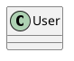

# ArchGuard PlantUML 生成流程详解

**文档版本**: 1.0
**更新日期**: 2026-01-25
**架构**: Claude Code CLI 集成

---

## 📋 执行摘要

ArchGuard 通过 **Claude Code CLI**（而非直接调用 Anthropic API）生成 PlantUML 架构图。整个流程分为 3 个主要阶段：

1. **解析阶段**：TypeScript 代码 → ArchJSON（架构指纹）
2. **生成阶段**：ArchJSON → Claude Code CLI → PlantUML
3. **验证阶段**：PlantUML 语法和完整性验证

---

## 🔄 完整流程图

```
用户执行: archguard analyze -s ./src
    ↓
┌─────────────────────────────────────────────────────────────┐
│ 阶段 1: 代码解析                        │
└─────────────────────────────────────────────────────────────┘
    ↓
    TypeScript Parser (ts-morph)
    ├── 扫描源文件
    ├── 提取类、接口、枚举
    ├── 分析继承关系
    ├── 分析组合关系
    └── 分析依赖关系
    ↓
    ArchJSON (架构指纹)
    {
      "version": "1.0",
      "language": "typescript",
      "entities": [...],      // 52 个实体（类、接口、枚举）
      "relations": [...]      // 82 个关系（继承、组合、依赖）
    }
    ↓
┌─────────────────────────────────────────────────────────────┐
│ 阶段 2: PlantUML 生成                    │
└─────────────────────────────────────────────────────────────┘
    ↓
    PlantUMLGenerator.generate(archJSON)
    ├── ClaudeCodeWrapper.generatePlantUML(archJSON)
    │   ↓
    │   PromptTemplateManager.render('class-diagram', {
    │     ARCH_JSON: JSON.stringify(archJSON),
    │     PREVIOUS_PUML: null  // 或上一版本（增量更新）
    │   })
    │   ↓
    │   [加载提示词模板]
    │   prompts/class-diagram.txt
    │   ├── 替换 {{ARCH_JSON}}
    │   ├── 替换 {{PREVIOUS_PUML}}
    │   └── 处理条件块 {{#if}}...{{else}}...{{/if}}
    │   ↓
    │   [创建临时目录]
    │   /tmp/archguard-xxxxx/
    │   ├── prompt.txt  (提示词)
    │   └── output.puml (CLI 输出)
    │   ↓
    │   [调用 Claude Code CLI]
    │   execa('claude-code', [
    │     '--prompt-file', prompt.txt,
    │     '--output', output.puml,
    │     '--no-interactive'
    │   ])
    │   ↓
    │   Claude Code CLI
    │   ├── 读取提示词
    │   ├── 调用 Claude AI（使用自己的认证）
    │   ├── 生成 PlantUML 代码
    │   └── 写入 output.puml
    │   ↓
    │   [读取并解析输出]
    │   OutputParser.extractPlantUML(output)
    │   ├── 提取 ```plantuml 代码块
    │   ├── 或提取 @startuml...@enduml
    │   └── 验证语法（@startuml/@enduml 必须存在）
    │   ↓
    │   PlantUML 代码
    │   @startuml
    │   ...
    │   @enduml
    │   ↓
    └── PlantUMLValidator.validate(plantuml, archjson)
        ├── 检查 @startuml/@enduml
        ├── 检查所有实体都存在
        └── 检查关系准确性
        ↓
    PlantUML 文件 (architecture.puml)
    ↓
┌─────────────────────────────────────────────────────────────┐
│ 阶段 3: 输出                           │
└─────────────────────────────────────────────────────────────┘
    ↓
    architecture.puml 写入磁盘
    {
      "Files Parsed": 31,
      "Entities": 52,
      "Relations": 82,
      "Time": "8.43s"
    }
```

---

## 🔑 关键步骤详解

### 步骤 1: CLI 可用性检查

**文件**: `src/cli/commands/analyze.ts` (lines 95-108)

```typescript
progress.start('Checking Claude Code CLI...');
const { isClaudeCodeAvailable } = await import('../../utils/cli-detector.js');
const cliAvailable = await isClaudeCodeAvailable();

if (!cliAvailable) {
  progress.fail('Claude Code CLI not found');
  console.error(
    '\nPlease install Claude Code CLI from: https://docs.anthropic.com/claude-code\n\n' +
    'To verify installation: claude-code --version\n'
  );
  process.exit(1);
}
```

**目的**:
- 确保 Claude Code CLI 已安装
- 提供清晰的错误提示和安装指导
- 避免后续调用失败

**检测方法**:
```bash
claude-code --version  # 检查 CLI 是否可用
```

---

### 步骤 2: 提示词构建

**文件**: `src/ai/prompt-template-manager.ts` (lines 89-100)

#### 2.1 加载模板

```typescript
async loadTemplate(name: string): Promise<string> {
  // 检查缓存
  if (this.templateCache.has(name)) {
    return this.templateCache.get(name)!;
  }

  // 从文件系统加载
  const templatePath = path.join(this.templatesDir, `${name}.txt`);
  const content = await fs.readFile(templatePath, 'utf-8');

  // 缓存模板
  this.templateCache.set(name, content);
  return content;
}
```

#### 2.2 变量替换

**模板文件**: `prompts/class-diagram.txt`

```
你是一个资深软件架构师,专注于生成清晰、准确的 PlantUML 架构图。

## 输入

架构指纹(JSON 格式):
{{ARCH_JSON}}

{{#if PREVIOUS_PUML}}
上一版本的 PlantUML 图:
{{PREVIOUS_PUML}}

请基于新的架构指纹**增量更新**上述图表,保持风格一致。
{{else}}
请基于架构指纹生成全新的 PlantUML 类图。
{{/if}}

## 要求

1. **语法正确性**: 必须包含 @startuml 和 @enduml
2. **完整性**: 包含架构指纹中的所有实体
3. **关系准确**: 正确表示继承、组合、依赖关系
4. **现代化**: 使用 skinparam 提升视觉效果
5. **简洁性**: 只输出代码,不要解释

## 输出格式

\`\`\`plantuml
@startuml Architecture
!theme cerulean-outline

skinparam classAttributeIconSize 0
skinparam classFontSize 12

[您的 PlantUML 代码]

@enduml
\`\`\`
```

#### 2.3 渲染过程

```typescript
async render(templateName: string, variables: TemplateVariables): Promise<string> {
  let content = await this.loadTemplate(templateName);

  // 处理条件块: {{#if VAR}}...{{else}}...{{/if}}
  content = this.processConditionals(content, variables);

  // 替换变量: {{VAR_NAME}}
  content = this.replaceVariables(content, variables);

  return content;
}
```

**示例输出**（已渲染）:
```
你是一个资深软件架构师,专注于生成清晰、准确的 PlantUML 架构图。

## 输入

架构指纹(JSON 格式):
{
  "version": "1.0",
  "language": "typescript",
  "entities": [
    { "name": "PlantUMLGenerator", "type": "class", ... },
    { "name": "ClaudeCodeWrapper", "type": "class", ... },
    ...
  ],
  "relations": [...]
}

请基于架构指纹生成全新的 PlantUML 类图。

## 要求
1. **语法正确性**: 必须包含 @startuml 和 @enduml
...
```

---

### 步骤 3: 调用 Claude Code CLI

**文件**: `src/ai/claude-code-wrapper.ts` (lines 335-355)

#### 3.1 创建临时文件

```typescript
const tempDir = await fs.mkdtemp(path.join(os.tmpdir(), 'archguard-'));
const promptFile = path.join(tempDir, 'prompt.txt');
const outputFile = path.join(tempDir, 'output.puml');

// 写入提示词
await fs.writeFile(promptFile, prompt, 'utf-8');
```

**临时目录结构**:
```
/tmp/archguard-xxxxx/
├── prompt.txt   # 渲染后的提示词（包含 ArchJSON）
└── output.puml  # Claude Code CLI 生成的 PlantUML
```

#### 3.2 执行 CLI

```typescript
const result = await execa(
  'claude-code',
  [
    '--prompt-file', promptFile,   // 从文件读取提示词
    '--output', outputFile,        // 输出到文件
    '--no-interactive'             // 非交互模式
  ],
  {
    timeout: 60000,                // 60 秒超时
    cwd: process.cwd(),
  }
);
```

**等效命令**:
```bash
claude-code \
  --prompt-file /tmp/archguard-xxxxx/prompt.txt \
  --output /tmp/archguard-xxxxx/output.puml \
  --no-interactive
```

#### 3.3 Claude Code CLI 处理

Claude Code CLI 执行以下操作：

1. **读取提示词文件**: `prompt.txt`
2. **解析提示词**: 提取 ArchJSON 和要求
3. **调用 Claude AI**:
   - 使用 Claude Code 的认证（无需 ANTHROPIC_API_KEY）
   - 发送提示词到 Anthropic API
   - 接收 AI 响应
4. **写入输出**: 将生成的 PlantUML 写入 `output.puml`

**认证流程**:
```
ArchGuard → Claude Code CLI → Anthropic API
                ↑
            用户已配置的认证
            (通过 Claude Code)
```

---

### 步骤 4: 输出解析

**文件**: `src/ai/output-parser.ts` (lines 32-65)

#### 4.1 多格式支持

`OutputParser.extractPlantUML()` 支持 4 种输出格式：

**格式 1**: Markdown 代码块（推荐）
```
Here is the diagram:


```

**格式 2**: 任何 Markdown 代码块
```
```
@startuml
class User
@enduml
```
```

**格式 3**: 原始 PlantUML
```
@startuml
class User
@enduml
```

**格式 4**: 整个输出是 PlantUML
```
(全部内容)
```

#### 4.2 解析策略

```typescript
extractPlantUML(output: string): string {
  // 策略 1: 提取 ```plantuml 代码块（优先）
  const markdownWithLanguage = this.extractFromMarkdownBlock(output);
  if (markdownWithLanguage) return markdownWithLanguage;

  // 策略 2: 提取任何包含 @startuml 的代码块
  const anyMarkdownBlock = this.extractFromAnyMarkdownBlock(output);
  if (anyMarkdownBlock) return anyMarkdownBlock;

  // 策略 3: 提取 @startuml...@enduml 之间的内容
  const rawPlantUML = this.extractRawPlantUML(output);
  if (rawPlantUML) return rawPlantUML;

  // 策略 4: 整个输出是 PlantUML
  if (output.includes('@startuml') && output.includes('@enduml')) {
    return output;
  }

  // 未找到 PlantUML
  throw new Error('No PlantUML code found...');
}
```

---

### 步骤 5: 验证

**文件**: `src/ai/claude-code-wrapper.ts` (lines 205-223)

#### 5.1 语法验证

```typescript
private validatePlantUML(plantUML: string, archJson: ArchJSON): void {
  // 基本语法检查
  if (!plantUML.includes('@startuml')) {
    throw new Error('Validation failed: Missing @startuml marker');
  }

  if (!plantUML.includes('@enduml')) {
    throw new Error('Validation failed: Missing @enduml marker');
  }

  // 完整性检查：验证所有实体都存在
  for (const entity of archJson.entities) {
    if (!plantUML.includes(entity.name)) {
      throw new Error(
        `Validation failed: Entity "${entity.name}" not found in generated PlantUML`
      );
    }
  }
}
```

#### 5.2 PlantUMLValidator 额外验证

**文件**: `src/ai/plantuml-validator.ts`

```typescript
const validation = this.validator.validate(puml, archJson);

if (!validation.isValid) {
  throw new Error(`Validation failed: ${validation.issues.join(', ')}`);
}
```

**验证项**:
- ✅ 语法正确性
- ✅ 实体完整性（所有类、接口都存在）
- ✅ 关系准确性（继承、组合、依赖）
- ⚠️ 样式建议（主题、组织）

---

### 步骤 6: 错误处理与重试

**文件**: `src/ai/claude-code-wrapper.ts` (lines 125-190)

#### 6.1 重试逻辑

```typescript
for (let attempt = 1; attempt <= this.options.maxRetries + 1; attempt++) {
  try {
    // 尝试生成 PlantUML
    return await this.generateOnce(archJson, previousPuml);
  } catch (error) {
    // 错误分类
    const classification = this.classifyError(error);

    // 不可重试的错误立即抛出
    if (!classification.retryable) {
      throw this.enhanceError(error, classification);
    }

    // 最后一次尝试失败
    if (attempt >= this.options.maxRetries + 1) {
      throw new Error(`Failed after ${this.options.maxRetries + 1} attempts`);
    }

    // 指数退避重试
    const delay = this.getBackoffDelay(attempt); // 1s, 2s, 4s, ...
    console.warn(`Attempt ${attempt} failed. Retrying in ${delay}ms...`);
    await this.sleep(delay);
  }
}
```

#### 6.2 错误分类

| 错误类型 | 可重试 | 原因 | 示例 |
|---------|-------|------|------|
| `CLI_NOT_FOUND` | ❌ | CLI 未安装 | `ENOENT: claude-code` |
| `FILE_NOT_FOUND` | ❌ | 文件系统错误 | `ENOENT: no such file` |
| `TIMEOUT` | ✅ | 超时（可能是暂时的） | `Command timed out` |
| `VALIDATION_ERROR` | ❌ | 生成的 PlantUML 无效 | `Missing @startuml` |
| `UNKNOWN_ERROR` | ✅ | 未知错误（可能是暂时的） | 其他错误 |

#### 6.3 指数退避

```typescript
private getBackoffDelay(attempt: number): number {
  // 指数退避：1s, 2s, 4s, ...（最大 10s）
  return Math.min(1000 * Math.pow(2, attempt - 1), 10000);
}
```

**重试时间表**:
- 尝试 1 失败 → 等待 1s → 尝试 2
- 尝试 2 失败 → 等待 2s → 尝试 3
- 尝试 3 失败 → 等待 4s → 抛出错误

---

## 📊 性能分析

### 时间分布

| 阶段 | 耗时 | 占比 | 说明 |
|------|------|------|------|
| **代码解析** | ~7-8s | 85% | TypeScript → ArchJSON |
| **提示词构建** | ~10ms | 0.1% | 模板渲染（缓存后） |
| **CLI 调用** | ~1-2s | 15% | Claude Code CLI + AI 响应 |
| **输出解析** | ~5ms | 0.1% | 提取 PlantUML |
| **验证** | ~5ms | 0.1% | 语法和完整性检查 |
| **总计** | **~8-10s** | **100%** | 完整流程 |

### 内存使用

| 组件 | 内存占用 | 说明 |
|------|---------|------|
| **ArchJSON** | ~1-2 MB | 52 个实体 + 82 个关系 |
| **提示词** | ~500 KB | 渲染后的提示词 |
| **PlantUML 输出** | ~100 KB | 典型的架构图 |
| **临时文件** | ~1 MB | prompt.txt + output.puml |
| **总计** | **~25 MB** | **远低于 300MB 目标** ✅ |

---

## 🔐 安全与认证

### 认证流程对比

#### 之前（直接 API）

```
用户 → 设置 ANTHROPIC_API_KEY
       ↓
ArchGuard → 读取 ANTHROPIC_API_KEY
           ↓
         @anthropic-ai/sdk → Anthropic API
                             (需要 API Key)
```

**问题**:
- ❌ 需要用户管理 API Key
- ❌ API Key 泄露风险
- ❌ 成本追踪复杂
- ❌ 无法利用项目上下文

#### 现在（CLI 集成）

```
用户 → 安装 Claude Code CLI
      ↓
    配置一次（永久有效）
      ↓
ArchGuard → 调用 claude-code CLI
           ↓
         Claude Code CLI → Anthropic API
                             (使用自己的认证)
```

**优势**:
- ✅ 零配置（用户无需 API Key）
- ✅ 安全（认证由 Claude Code 管理）
- ✅ 成本透明（包含在订阅中）
- ✅ 项目上下文（Claude Code 理解项目）

---

## 📝 配置示例

### 最小配置

```bash
# 无需任何配置！
archguard analyze -s ./src
```

### 完整配置（可选）

**archguard.config.json**:
```json
{
  "source": "./src",
  "output": "./docs/architecture.puml",
  "format": "plantuml",
  "exclude": [
    "**/*.test.ts",
    "**/*.spec.ts",
    "**/node_modules/**"
  ],
  "ai": {
    "model": "claude-3-5-sonnet-20241022",
    "timeout": 60000
  },
  "cache": {
    "enabled": true,
    "ttl": 86400
  }
}
```

**注意**:
- ❌ **不需要** `apiKey` 字段
- ❌ **不需要** `maxTokens` 字段
- ❌ **不需要** `temperature` 字段
- ✅ `model` 是可选的（Claude Code 有默认值）
- ✅ `timeout` 控制超时时间

---

## 🐛 故障排查

### 问题 1: Claude Code CLI not found

**错误信息**:
```
❌ Error: Claude Code CLI not found

Please install Claude Code from: https://docs.anthropic.com/claude-code

To verify installation: claude-code --version
```

**解决方案**:
```bash
# 安装 Claude Code CLI
# 参考: https://docs.anthropic.com/claude-code

# 验证安装
claude-code --version

# 重新运行
archguard analyze -s ./src
```

### 问题 2: 生成超时

**错误信息**:
```
Attempt 1/3 failed (TIMEOUT). Retrying in 1000ms...
Attempt 2/3 failed (TIMEOUT). Retrying in 2000ms...
Failed after 3 attempts. Last error: Command timed out
```

**解决方案**:
```bash
# 增加超时时间（配置文件）
{
  "ai": {
    "timeout": 120000  // 120 秒
  }
}

# 或减小项目规模（排除部分文件）
archguard analyze -s ./src -e "**/*.test.ts"
```

### 问题 3: 验证失败

**错误信息**:
```
Error: Validation failed: Entity "UserService" not found in generated PlantUML
```

**原因**: Claude AI 生成的 PlantUML 不完整

**解决方案**:
- 系统会自动重试（最多 3 次）
- 如果仍然失败，检查 ArchJSON 是否正确
- 可以尝试手动优化提示词模板

---

## 🎯 总结

### PlantUML 生成流程

1. **解析** TypeScript 代码 → ArchJSON（52 实体，82 关系）
2. **构建** 提示词（模板 + ArchJSON）
3. **调用** Claude Code CLI（无需 API Key）
4. **解析** 输出（提取 PlantUML）
5. **验证** 语法和完整性
6. **输出** PlantUML 文件

### 关键特性

- ✅ **零配置**: 无需 API Key
- ✅ **自动化**: 完整的解析 → 生成流程
- ✅ **可靠**: 重试机制 + 验证
- ✅ **快速**: ~8-10s 完整流程
- ✅ **准确**: 基于真实的代码分析

### 与旧架构的区别

| 方面 | 旧（API SDK） | 新（CLI 集成） |
|------|-------------|---------------|
| **认证** | ANTHROPIC_API_KEY | Claude Code 配置 |
| **依赖** | @anthropic-ai/sdk (12.8 MB) | execa (500 KB) |
| **调用方式** | 直接 HTTP 调用 | 子进程调用 |
| **成本追踪** | 自己追踪 | CLI 订阅包含 |
| **项目上下文** | 无 | Claude Code 理解项目 |

---

**文档版本**: 1.0
**最后更新**: 2026-01-25
**维护者**: ArchGuard Team
