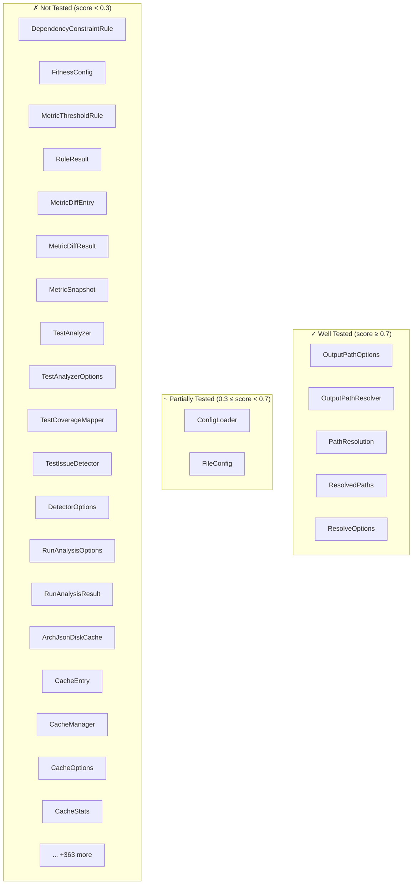

# Test Coverage Heatmap

> Generated from test analysis — four buckets by coverage score

```mermaid
graph TD
  subgraph WT["✓ Well Tested (score ≥ 0.7)"]
    OutputPathOptions["OutputPathOptions"]
    OutputPathResolver["OutputPathResolver"]
    PathResolution["PathResolution"]
    ResolvedPaths["ResolvedPaths"]
    ResolveOptions["ResolveOptions"]
  end
  subgraph PT["~ Partially Tested (0.3 ≤ score < 0.7)"]
    ConfigLoader["ConfigLoader"]
    FileConfig["FileConfig"]
  end
  subgraph NT["✗ Not Tested (score < 0.3)"]
    DependencyConstraintRule["DependencyConstraintRule"]
    FitnessConfig["FitnessConfig"]
    MetricThresholdRule["MetricThresholdRule"]
    RuleResult["RuleResult"]
    MetricDiffEntry["MetricDiffEntry"]
    MetricDiffResult["MetricDiffResult"]
    MetricSnapshot["MetricSnapshot"]
    TestAnalyzer["TestAnalyzer"]
    TestAnalyzerOptions["TestAnalyzerOptions"]
    TestCoverageMapper["TestCoverageMapper"]
    TestIssueDetector["TestIssueDetector"]
    DetectorOptions["DetectorOptions"]
    RunAnalysisOptions["RunAnalysisOptions"]
    RunAnalysisResult["RunAnalysisResult"]
    ArchJsonDiskCache["ArchJsonDiskCache"]
    CacheEntry["CacheEntry"]
    CacheEntry["CacheEntry"]
    CacheManager["CacheManager"]
    CacheOptions["CacheOptions"]
    CacheStats["CacheStats"]
    nt_more["... +363 more"]
  end
```
