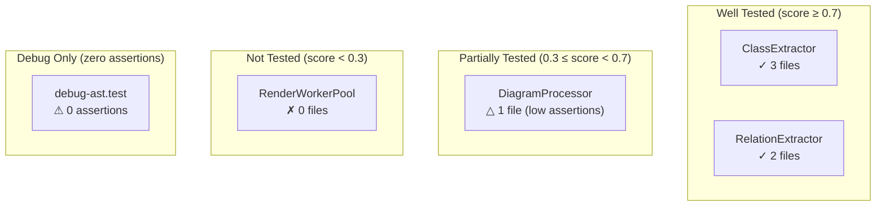

# Test System Analysis — Design Proposal

> Status: Draft (rev 2) — **Partially superseded**
> Branch: `feat/test-analysis` (future)
> Scope: 为 ArchGuard 增加测试体系分析能力。通过两阶段协作架构（方案 C），让 ArchGuard
> 在不执行测试、不依赖覆盖率报告的前提下，从源码结构中提取测试体系的静态信息，
> 输出测试覆盖关系图、测试质量问题清单和 MCP 查询工具。
>
> **Superseded notice (2026-03-12)**: The `archguard_get_test_coverage` MCP tool described in Component 5 of this proposal has been replaced by `archguard_get_entity_coverage` and the `includePackageBreakdown` parameter on `archguard_get_test_metrics`. See `docs/plans/plan-31-mcp-test-coverage-redesign.md` and `docs/proposals/proposal-mcp-test-coverage-redesign.md` for the redesign rationale. All other components of this proposal remain in effect.

---

## Design Principle

ArchGuard 对测试代码的分析遵循与源码分析相同的基本原则：**纯静态、无副作用、语言感知**。
分析结果存储在 `extensions.testAnalysis` 中，与现有 `goAtlas`、`tsAnalysis` 扩展槽并列，
遵循 ADR-002 的扩展设计模式。

测试分析不替代测试执行，也不尝试计算行级覆盖率。它的目标是提供
GIT 框架意义上的 **M_T1 层（审视层）** 能力：让工具自动识别零断言僵尸测试、
定位无测试覆盖的实体、量化测试体系的结构性健康度，为开发者和 AI 代理提供
可查询的测试状态视图。

### 准确性边界与 Pattern-First 设计

静态断言计数面临三个固有限制：

1. **多框架共存**：同一语言可能同时使用多个测试框架（如 TypeScript 项目同时用
   vitest + playwright + k6），每个框架的断言 API 各不相同。
2. **自定义断言**：`expect.extend()`、项目封装的 helper（如 `expectToBeDeepEqual()`）、
   snapshot 断言（`toMatchSnapshot()`）等无法被通用正则覆盖。
3. **测试类型的语义不透明**：`debug` 类型测试不能依赖命名约定（`debug-*.test.ts`）
   判定，因为项目可能没有此约定；Go 的 `_test.go` 文件和源码同目录，不存在
   路径层级语义。

为此，本 proposal 采用 **Pattern-First 设计**：ArchGuard 提供开箱即用的
best-effort 模式检测，并通过 `archguard_detect_test_patterns` MCP 工具将检测结果
暴露给 Claude Code。Claude Code 在调用分析工具前，**先探测项目约定、修正模式配置，
再以 `TestPatternConfig` 参数传入**，从而获得项目感知的准确分析结果。

`testType` 的分类优先遵循行为特征而非路径约定：`assertionCount === 0` 的测试
文件首先被归类为 `debug`，无论其路径或命名如何。路径约定作为次级分类依据，
且完全可由 `TestPatternConfig.typeClassificationRules` 覆盖。

---

## Evidence Base

对 ArchGuard 自身测试套件运行的静态分析暴露了以下具体问题，这些数据是本
proposal 每项设计的直接驱动：

| 问题 | 数据 | 静态可检测？ |
|------|------|------------|
| 零断言测试文件 | 4 个（`debug-ast/struct/fields/interface`） | **是** — 无 `expect()` 调用 |
| 单元/集成测试比 | 80 : 17 | **是** — 按路径分类 |
| 性能测试被排除出默认 CI | `vitest.config.ts` 显式排除 | **是** — 配置文件可读 |
| 最大测试文件 3311 行 | `mermaid-templates.test.ts` | **是** — 文件大小统计 |
| 无变异测试设施 | `package.json` 中无 stryker | **是** — 依赖缺失检测 |

这 5 项中的前 4 项无需执行测试即可通过纯静态分析得出。第 5 项（变异测试）
超出静态分析范围，在本 proposal 的 Out of Scope 中说明。

---

## Architecture Decision: Why Method C

三种可选架构方案及取舍：

| 方案 | 描述 | 主要问题 |
|------|------|---------|
| **A — 插件内部处理** | 每个语言插件同时处理源码和测试文件 | 插件职责膨胀；测试文件识别逻辑无法跨语言复用 |
| **B — 独立后处理层** | `TestAnalyzer` 在不依赖插件的情况下独立分析 | 需要独立 AST 解析，重复工作；无法利用插件的语言知识 |
| **C — 两阶段协作** | 插件提供原始测试结构；`TestAnalyzer` 做跨文件聚合 | 需要扩展 `ILanguagePlugin` 接口（小幅 breaking change） |

选择 **方案 C** 的理由：

- **符合现有模式**：GoAtlas 的 `BehaviorAnalyzer` 正是此模式——插件解析 AST，
  分析器做跨文件推理。`TestAnalyzer` 是同级别的跨语言协调层。
- **职责最小侵入**：插件只增加一个轻量的 `extractTestStructure()` 方法，
  不改变现有 `parseProject()` 流程。
- **跨语言复用**：测试覆盖映射、问题检测、指标计算全部在 `TestAnalyzer` 中
  实现一次，对所有语言生效。
- **Pattern-First 的天然分层**：`TestPatternConfig` 在 `TestAnalyzer` 层统一管理，
  插件通过参数接收，无需各自内嵌模式逻辑。

---

## Component 1 — ILanguagePlugin Interface Extension

### 新增类型与方法

在 `src/core/interfaces/language-plugin.ts` 的 `ILanguagePlugin` 接口中
增加两个可选方法，并引入 `RawTestFile`/`RawTestCase` 原始数据类型。
`TestPatternConfig` 的完整定义在 Component 2，此处仅引用。

```typescript
// src/core/interfaces/language-plugin.ts
import type { TestPatternConfig } from '@/types/extensions.js';

/**
 * 单个测试用例的原始结构（插件层提供）
 */
export interface RawTestCase {
  /** 测试名称（it()/test() 的第一个参数） */
  name: string;
  /** 是否被 skip/todo/xtest 标记 */
  isSkipped: boolean;
  /**
   * 静态计数：匹配 patternConfig.assertionPatterns 的调用次数。
   * 这是下界近似值——未被模式覆盖的自定义断言不计入。
   * TestAnalyzer 在结果中会标注所使用的 patternConfig 来源（auto/user）。
   */
  assertionCount: number;
}

/**
 * 一个测试文件的原始结构（插件层提供）
 */
export interface RawTestFile {
  filePath: string;
  /** 识别到的测试框架（可能多个，e.g. ['vitest', 'playwright']） */
  frameworks: string[];
  /**
   * 插件基于 patternConfig.typeClassificationRules 给出的路径分类提示。
   * TestAnalyzer 会用行为特征（assertionCount === 0）覆盖此值。
   */
  testTypeHint: 'unit' | 'integration' | 'e2e' | 'performance' | 'unknown';
  testCases: RawTestCase[];
  /** 测试文件中 import 的源码文件路径（已解析为绝对路径，排除 node_modules/vendor） */
  importedSourceFiles: string[];
}

export interface ILanguagePlugin extends IParser {
  // ... 现有方法不变 ...

  /**
   * 判断给定路径是否为测试文件。
   *
   * 当 patternConfig 提供了 testFileGlobs 时优先使用；
   * 否则使用语言内置的默认规则。
   *
   * @example TypeScript default: /\.(test|spec)\.(ts|tsx|js|jsx)$/
   * @example Go default: /_test\.go$/
   */
  isTestFile?(filePath: string, patternConfig?: TestPatternConfig): boolean;

  /**
   * 提取测试文件的原始结构（不执行测试）。
   *
   * 实现要求：
   * - 必须是纯静态分析，不执行任何代码
   * - 当 patternConfig 提供时，使用其 assertionPatterns/testCasePatterns/skipPatterns
   *   覆盖内置默认值；未提供时使用框架感知的内置模式
   * - importedSourceFiles 只包含项目内部文件
   * - 如果无法解析，返回 null（TestAnalyzer 会跳过该文件）
   *
   * @param filePath    - 测试文件的绝对路径
   * @param code        - 文件内容（避免重复读盘）
   * @param patternConfig - 可选的项目专有模式配置（由 AI 经 archguard_detect_test_patterns 修正后传入）
   */
  extractTestStructure?(
    filePath: string,
    code: string,
    patternConfig?: TestPatternConfig
  ): RawTestFile | null;
}
```

两个方法均为**可选**（`?`），存量插件无需修改即可继续工作。

### 各语言实现要点

**TypeScript / JavaScript**

```typescript
// src/plugins/typescript/index.ts

isTestFile(filePath: string, patternConfig?: TestPatternConfig): boolean {
  if (patternConfig?.testFileGlobs?.length) {
    return patternConfig.testFileGlobs.some(g => micromatch.isMatch(filePath, g));
  }
  // 内置默认规则
  return /\.(test|spec)\.(ts|tsx|js|jsx)$/.test(filePath);
}

extractTestStructure(
  filePath: string,
  code: string,
  patternConfig?: TestPatternConfig
): RawTestFile | null {
  // 使用 patternConfig 提供的模式，否则回退到框架感知内置值
  const assertionRegexes = (patternConfig?.assertionPatterns ?? this.defaultAssertionPatterns(code))
    .map(p => new RegExp(p, 'g'));
  const caseRegexes = (patternConfig?.testCasePatterns ?? [
    String.raw`\b(?:it|test)\s*\(\s*['"\`]`,
    String.raw`\bdescribe\s*\(\s*['"\`]`,
  ]).map(p => new RegExp(p, 'g'));
  const skipRegexes = (patternConfig?.skipPatterns ?? [
    String.raw`\b(?:it|test|describe)\.(?:skip|todo)\s*\(`,
    String.raw`^(?:xit|xtest)\s*\(`,
  ]).map(p => new RegExp(p, 'gm'));

  const testTypeHint = this.inferTestTypeHint(filePath, patternConfig?.typeClassificationRules);
  const frameworks = this.detectFrameworks(code);
  const importedSourceFiles = this.resolveTestImports(filePath, code);
  const testCases = this.extractTestCases(code, assertionRegexes, caseRegexes, skipRegexes);

  return { filePath, frameworks, testTypeHint, testCases, importedSourceFiles };
}

private defaultAssertionPatterns(code: string): string[] {
  // 根据已检测到的框架选择内置模式
  const patterns = [String.raw`\bexpect\s*\(`];
  if (code.includes('assert.')) patterns.push(String.raw`\bassert\.\w+\s*\(`);
  if (code.includes('.should')) patterns.push(String.raw`\.should\.\w+`);
  return patterns;
}

private inferTestTypeHint(
  filePath: string,
  rules?: TestPatternConfig['typeClassificationRules']
): RawTestFile['testTypeHint'] {
  // 优先使用 AI 提供的分类规则
  if (rules) {
    for (const rule of rules) {
      if (filePath.includes(rule.pathPattern)) return rule.type;
    }
  }
  // 内置路径约定作为保底（注意：testType 'debug' 不在此处判定）
  if (filePath.includes('/integration/')) return 'integration';
  if (filePath.includes('/e2e/'))         return 'e2e';
  if (filePath.includes('/performance/')) return 'performance';
  if (filePath.includes('/unit/'))        return 'unit';
  return 'unknown';
}
```

**Go**

```typescript
// src/plugins/golang/index.ts

isTestFile(filePath: string, patternConfig?: TestPatternConfig): boolean {
  if (patternConfig?.testFileGlobs?.length) {
    return patternConfig.testFileGlobs.some(g => micromatch.isMatch(filePath, g));
  }
  return filePath.endsWith('_test.go');
}

extractTestStructure(
  filePath: string,
  code: string,
  patternConfig?: TestPatternConfig
): RawTestFile | null {
  const assertionRegexes = (patternConfig?.assertionPatterns ?? [
    // 标准库
    String.raw`\bt\.(Error|Fatal|Errorf|Fatalf|Fail)\s*\(`,
    // testify（最常见的 Go 断言库）
    String.raw`\b(?:assert|require)\.\w+\s*\(`,
    // gomock
    String.raw`\.EXPECT\(\)`,
  ]).map(p => new RegExp(p, 'g'));

  return {
    filePath,
    frameworks: this.detectGoFrameworks(code),
    testTypeHint: this.inferTestTypeHint(filePath, patternConfig?.typeClassificationRules),
    testCases: this.extractGoTestCases(code, assertionRegexes, patternConfig),
    importedSourceFiles: this.resolveGoTestImports(filePath, code),
  };
}
```

**Java / Python** — 遵循相同模式；`assertionPatterns` 默认值分别涵盖
JUnit 4/5/TestNG 和 pytest/unittest/hypothesis。

> **依赖说明**：`isTestFile` 实现中的 `micromatch.isMatch(filePath, g)` 使用 `micromatch`。实现阶段须将其声明为直接依赖：`"micromatch": "^4.0.8"` 加入 `package.json` `dependencies`，`"@types/micromatch"` 加入 `devDependencies`。不应依赖其作为传递依赖存在。

### 新增 PluginCapabilities 字段

```typescript
export interface PluginCapabilities {
  // ... 现有字段 ...

  /**
   * 是否实现了 isTestFile() 和 extractTestStructure() 方法
   */
  testStructureExtraction?: boolean; // defaults to false for existing plugins
}
```

### Files changed

| 文件 | 变更 |
|------|------|
| `src/core/interfaces/language-plugin.ts` | 新增 `RawTestCase`, `RawTestFile`；`ILanguagePlugin` 新增 `isTestFile?()` 和 `extractTestStructure?(filePath, code, patternConfig?)` 可选方法；`PluginCapabilities` 新增 `testStructureExtraction` |
| `src/plugins/typescript/index.ts` | 实现上述方法；`defaultAssertionPatterns()` 按框架动态组装 |
| `src/plugins/golang/index.ts` | 同上；内置模式覆盖 std/testify/gomock |
| `src/plugins/java/index.ts` | 同上；覆盖 JUnit 4/5/TestNG |
| `src/plugins/python/index.ts` | 同上；覆盖 pytest/unittest/hypothesis |
| `src/plugins/cpp/index.ts` | 同上；测试文件识别：`*_test.{cpp,cc}`, `*Test.cpp`, `*_test.h` |
| `package.json` | 新增直接依赖 `micromatch@^4.0.8` 和 `devDependency` `@types/micromatch` |
| `tests/unit/cli/commands/analyze.test.ts` | 新增：`isTestFile` 正确识别 fixture；`extractTestStructure` 在有/无 `patternConfig` 时均返回正确计数 |

---

## Component 2 — ArchJSON Extensions: testAnalysis Slot

遵循 ADR-002 的扩展容器模式，在 `ArchJSONExtensions` 中增加 `testAnalysis` 槽。
`testAnalysis` 是**每个语言插件独立输出**，在多语言混合项目中，TypeScript 前端
和 Go 后端各自持有一份 `TestAnalysis`，存储在各自语言的 `ArchJSON` 中，
不由 `ArchJSONAggregator` 合并。

### TestPatternConfig — 项目专有模式配置

```typescript
// src/types/extensions.ts — 新增

/**
 * 项目专有测试模式配置。
 *
 * 由 archguard_detect_test_patterns 工具自动生成初始值，
 * Claude Code 审查修正后作为参数传入分析工具。
 * 所有字段均为可选——未提供时 ArchGuard 使用语言插件的内置默认值。
 */
export interface TestPatternConfig {
  /**
   * 断言调用的正则模式（字符串形式，运行时编译为 RegExp）。
   *
   * @example vitest/jest 默认: ["\\bexpect\\s*\\("]
   * @example 加入 chai:       ["\\bexpect\\s*\\(", "\\.should\\.\\w+", "assert\\.\\w+\\s*\\("]
   * @example 加入 snapshot:   ["\\bexpect\\s*\\(", "toMatchSnapshot\\s*\\(", "toMatchInlineSnapshot\\s*\\("]
   * @example Go testify:      ["\\b(?:assert|require)\\.\\w+\\s*\\("]
   * @example pytest:          ["\\bassert\\b"]   ← Python 原生 assert 语句
   */
  assertionPatterns?: string[];

  /**
   * 测试用例边界的正则模式（用于识别 it()/test()/func Test）。
   */
  testCasePatterns?: string[];

  /**
   * Skip 标记的正则模式。
   */
  skipPatterns?: string[];

  /**
   * 测试文件路径的 glob 模式（传给 isTestFile()）。
   * @example ["tests/**\/*.test.ts", "src/**\/*_test.go"]
   */
  testFileGlobs?: string[];

  /**
   * 路径分类规则：将包含 pathPattern 子串的测试文件归类为指定 type。
   * 规则按数组顺序评估，第一个匹配项生效。
   * 注意：行为分类（assertionCount === 0 → debug）优先于所有路径规则。
   *
   * @example [
   *   { pathPattern: '/integration/', type: 'integration' },
   *   { pathPattern: '/e2e/',         type: 'e2e' },
   *   { pathPattern: '/perf/',        type: 'performance' },  // 项目用 perf/ 而非 performance/
   * ]
   *
   * 注意：`explore-*.test.ts` 命名的文件无需在此写入规则——由于行为优先原则，
   * 这类文件若断言数为零，会自动被归类为 `'debug'`，无需路径规则介入。
   */
  typeClassificationRules?: Array<{
    pathPattern: string;
    type: 'unit' | 'integration' | 'e2e' | 'performance'; // debug 由行为判定，不可写入规则
  }>;
}

/**
 * archguard_detect_test_patterns 工具的返回结构。
 * 暴露 ArchGuard 的自动检测结果，供 Claude Code 审查和修正。
 */
export interface DetectedTestPatterns {
  /** 检测到的测试框架列表及其证据 */
  detectedFrameworks: Array<{
    name: string;
    confidence: 'high' | 'medium' | 'low';
    /** 作为证据的文件路径（最多 3 个示例） */
    evidenceFiles: string[];
  }>;
  /**
   * ArchGuard 根据检测结果生成的最优猜测配置。
   * Claude Code 可以直接使用，也可以修改后传给分析工具。
   */
  suggestedPatternConfig: TestPatternConfig;
  /**
   * 检测置信度说明，帮助 Claude Code 判断哪些字段需要人工修正。
   * @example ["assertionPatterns 未覆盖项目自定义的 expectToBeDeepEqual() helper",
   *           "发现 explore-*.test.ts 命名模式，已加入 typeClassificationRules"]
   */
  notes: string[];
}
```

### TestAnalysis 及相关类型

```typescript
// src/types/extensions.ts — 新增（续）

export const TEST_ANALYSIS_VERSION = '1.0';

/**
 * 测试体系分析扩展。
 * 每个语言插件独立生成，存储在该语言 ArchJSON.extensions.testAnalysis 中。
 */
export interface TestAnalysis {
  version: string;  // TEST_ANALYSIS_VERSION

  /**
   * 本次分析使用的模式配置来源。
   * 'auto'  = ArchGuard 自动检测（best-effort）
   * 'user'  = Claude Code 通过 patternConfig 参数提供（更准确）
   */
  patternConfigSource: 'auto' | 'user';

  /** 所有测试文件的结构视图 */
  testFiles: TestFileInfo[];

  /** 测试文件到源码实体的覆盖关系 */
  coverageMap: CoverageLink[];

  /** 静态可检测的测试质量问题 */
  issues: TestIssue[];

  /** 汇总指标 */
  metrics: TestMetrics;
}

/**
 * 一个测试文件的聚合视图（TestAnalyzer 生成）
 */
export interface TestFileInfo {
  id: string;           // 相对路径，e.g. "tests/unit/parser/class-extractor.test.ts"
  filePath: string;
  /** 识别到的测试框架（可多个） */
  frameworks: string[];
  /**
   * 测试类型。分类优先级：
   * 1. 行为优先：assertionCount === 0 → 'debug'（无论路径）
   * 2. patternConfig.typeClassificationRules（AI 提供的路径规则）
   * 3. 插件内置路径约定
   * 4. 'unknown'（兜底）
   */
  testType: 'unit' | 'integration' | 'e2e' | 'performance' | 'debug' | 'unknown';
  testCaseCount: number;
  assertionCount: number;  // 全文件合计（下界近似值，受 patternConfig 影响）
  skipCount: number;
  /** assertionCount / max(testCaseCount, 1)；0 = 无断言，≥ 1 = 每 case 平均至少 1 个断言 */
  assertionDensity: number;
  /** 该测试文件直接 import 的源码实体 ID 列表 */
  coveredEntityIds: string[];
}

/**
 * 源码实体 → 测试文件的覆盖关系
 */
export interface CoverageLink {
  sourceEntityId: string;
  coveredByTestIds: string[];
  /**
   * 覆盖分数 [0.0, 1.0]
   * 0.0 = 无任何测试文件关联
   * 0.3 = 仅路径命名约定匹配
   * 0.7 = import 分析确认
   * 1.0 = 多测试文件覆盖且断言密度充足
   */
  coverageScore: number;
}

/**
 * 静态可检测的测试质量问题
 */
export interface TestIssue {
  type:
    | 'zero_assertion'     // assertionCount === 0（testType 被设为 'debug'）
    | 'orphan_test'        // 无法关联到任何源码实体
    | 'skip_accumulation'  // skipCount / testCaseCount > 0.2
    | 'assertion_poverty'; // assertionDensity < 0.5
  severity: 'warning' | 'info';
  testFileId: string;
  message: string;
  suggestion?: string;
}

/**
 * 测试体系汇总指标
 */
export interface TestMetrics {
  totalTestFiles: number;
  byType: Record<TestFileInfo['testType'], number>;
  /** 源码实体中有测试覆盖（coverageScore > 0）的比例 [0, 1] */
  entityCoverageRatio: number;
  /** 全局断言密度（全部断言数 / 全部 case 数） */
  assertionDensity: number;
  skipRatio: number;
  issueCount: Record<TestIssue['type'], number>;
}
```

### ArchJSONExtensions 更新

```typescript
// src/types/extensions.ts

export interface ArchJSONExtensions {
  goAtlas?: GoAtlasExtension;
  tsAnalysis?: TsAnalysis;
  testAnalysis?: TestAnalysis;  // NEW
}
```

### Files changed

| 文件 | 变更 |
|------|------|
| `src/types/extensions.ts` | 新增 `TestPatternConfig`, `DetectedTestPatterns`, `TestAnalysis`, `TestFileInfo`, `CoverageLink`, `TestIssue`, `TestMetrics`；`ArchJSONExtensions` 新增 `testAnalysis?` 槽；导出 `TEST_ANALYSIS_VERSION` |
| `src/types/index.ts` | 新增 `export { TEST_ANALYSIS_VERSION }` re-export，与 `GO_ATLAS_EXTENSION_VERSION` 保持一致 |

---

## Component 3 — TestAnalyzer: Two-Phase Coordinator

`TestAnalyzer` 协调两阶段过程，并接收可选的 `TestPatternConfig`
向下传递给插件，同时负责行为优先的 `testType` 分类。

### 文件位置

```
src/analysis/
├── test-analyzer.ts         # 主协调器（新文件）
├── test-coverage-mapper.ts  # 覆盖关系推断（新文件）
└── test-issue-detector.ts   # 问题检测（新文件）
```

### TestAnalyzer 主类

```typescript
// src/analysis/test-analyzer.ts

import type { ArchJSON } from '@/types/index.js';
import type { ILanguagePlugin, RawTestFile } from '@/core/interfaces/index.js';
import type { TestAnalysis, TestFileInfo, TestPatternConfig } from '@/types/extensions.js';
import { TEST_ANALYSIS_VERSION } from '@/types/extensions.js';
import { TestCoverageMapper } from './test-coverage-mapper.js';
import { TestIssueDetector } from './test-issue-detector.js';
import fs from 'fs-extra';
import path from 'path';

export interface TestAnalyzerOptions {
  workspaceRoot: string;
  /**
   * 项目专有模式配置。
   * 来源：Claude Code 调用 archguard_detect_test_patterns 后修正的结果。
   * 未提供时，插件使用内置默认模式（best-effort）。
   */
  patternConfig?: TestPatternConfig;
  /** 额外的测试目录（默认自动发现 tests/, __tests__, spec/ 等） */
  testDirs?: string[];
  verbose?: boolean;
}

export class TestAnalyzer {
  private mapper = new TestCoverageMapper();
  private issueDetector = new TestIssueDetector();

  async analyze(
    archJson: ArchJSON,
    plugin: ILanguagePlugin,
    options: TestAnalyzerOptions
  ): Promise<TestAnalysis> {
    // Phase 1: 发现并提取测试文件原始结构
    const rawFiles = await this.collectRawTestFiles(plugin, options);

    // Phase 2: 聚合（含行为优先的 testType 分类）、映射、检测
    const testFiles = this.buildTestFileInfos(rawFiles, archJson, options.workspaceRoot);
    const coverageMap = this.mapper.buildCoverageMap(testFiles, archJson, options.workspaceRoot);
    const issues = this.issueDetector.detect(testFiles, coverageMap);
    const metrics = this.computeMetrics(testFiles, coverageMap, issues);

    return {
      version: TEST_ANALYSIS_VERSION,
      patternConfigSource: options.patternConfig ? 'user' : 'auto',
      testFiles,
      coverageMap,
      issues,
      metrics,
    };
  }
```

> **实现注意**：将 `testAnalysis` 写回 `archJson.extensions` 时需要 null guard：
> ```typescript
> archJson.extensions = archJson.extensions ?? {};
> archJson.extensions.testAnalysis = result;
> ```

```typescript
  /**
   * buildTestFileInfos 是 testType 分类的权威来源。
   *
   * 分类优先级（高→低）：
   * 1. 行为优先：全文件 assertionCount === 0 → 'debug'
   * 2. 插件的 testTypeHint（基于 patternConfig.typeClassificationRules 或内置路径约定）
   * 3. 'unknown'
   */
  private buildTestFileInfos(rawFiles: RawTestFile[], archJson: ArchJSON, workspaceRoot: string): TestFileInfo[] {
    return rawFiles.map(raw => {
      const assertionCount = raw.testCases.reduce((s, c) => s + c.assertionCount, 0);
      const testCaseCount = raw.testCases.length;
      const skipCount = raw.testCases.filter(c => c.isSkipped).length;

      // 行为优先分类
      const testType: TestFileInfo['testType'] =
        assertionCount === 0 && testCaseCount > 0
          ? 'debug'                  // 零断言文件，无论命名如何
          : raw.testTypeHint !== 'unknown'
            ? raw.testTypeHint       // 插件提示（含 AI 修正的路径规则）
            : 'unknown';

      const coveredEntityIds = this.resolveImportedEntityIds(
        raw.importedSourceFiles,
        archJson
      );

      return {
        id: path.relative(workspaceRoot, raw.filePath),
        filePath: raw.filePath,
        frameworks: raw.frameworks,
        testType,
        testCaseCount,
        assertionCount,
        skipCount,
        assertionDensity: assertionCount / Math.max(testCaseCount, 1),
        coveredEntityIds,
      };
    });
  }

  /**
   * 将测试文件 import 的源码文件路径列表解析为 ArchJSON 实体 ID 列表。
   * 匹配规则：对每个 importedSourceFile，在 archJson.entities 中查找
   * sourceLocation.file 以该路径结尾（或包含该路径）的实体，收集其 id。
   */
  private resolveImportedEntityIds(
    importedSourceFiles: string[],
    archJson: ArchJSON
  ): string[] {
    const result: string[] = [];
    for (const srcFile of importedSourceFiles) {
      for (const entity of archJson.entities) {
        if (entity.sourceLocation?.file?.endsWith(srcFile) ||
            entity.sourceLocation?.file?.includes(srcFile)) {
          result.push(entity.id);
        }
      }
    }
    return [...new Set(result)]; // deduplicate
  }

  private async collectRawTestFiles(
    plugin: ILanguagePlugin,
    options: TestAnalyzerOptions
  ): Promise<RawTestFile[]> {
    if (!plugin.isTestFile || !plugin.extractTestStructure) {
      return [];
    }

    const testFilePaths = await this.discoverTestFiles(plugin, options);
    const results: RawTestFile[] = [];

    for (const filePath of testFilePaths) {
      try {
        const code = await fs.readFile(filePath, 'utf-8');
        // patternConfig 传入插件，让其使用项目专有模式而非内置默认
        const raw = plugin.extractTestStructure(filePath, code, options.patternConfig);
        if (raw) results.push(raw);
      } catch {
        if (options.verbose) {
          console.warn(`[TestAnalyzer] Failed to extract test structure: ${filePath}`);
        }
      }
    }

    return results;
  }

  private async discoverTestFiles(
    plugin: ILanguagePlugin,
    options: TestAnalyzerOptions
  ): Promise<string[]> {
    const dirs = options.testDirs ?? this.inferTestDirs(options.workspaceRoot);
    const all: string[] = [];

    for (const dir of dirs) {
      if (!(await fs.pathExists(dir))) continue;
      const files = await this.walkDir(dir);
      // patternConfig 同样传给 isTestFile
      all.push(...files.filter(f => plugin.isTestFile!(f, options.patternConfig)));
    }

    return all;
  }

  private inferTestDirs(workspaceRoot: string): string[] {
    const candidates = ['tests', '__tests__', 'test', 'spec', 'src'];
    return candidates
      .map(d => path.join(workspaceRoot, d))
      .filter(d => fs.pathExistsSync(d));
  }
}
```

> **语言感知发现**：对于测试文件与源码同目录的语言（如 Go 的 `_test.go` 文件），`inferTestDirs()` 的候选列表不足以覆盖所有测试文件。实现时，若 `plugin.metadata.fileExtensions.includes('.go')`（或插件声明其测试文件需要 workspace-wide 扫描），`discoverTestFiles()` 应改为从 `workspaceRoot` 开始递归扫描整个工作区，而不仅限于上述候选目录。

### TestCoverageMapper — 两层映射链

```typescript
// src/analysis/test-coverage-mapper.ts

export class TestCoverageMapper {
  buildCoverageMap(
    testFiles: TestFileInfo[],
    archJson: ArchJSON,
    workspaceRoot: string
  ): CoverageLink[] {
    const links = new Map<string, CoverageLink>(
      archJson.entities.map(e => [e.id, { sourceEntityId: e.id, coveredByTestIds: [], coverageScore: 0.0 }])
    );

    for (const testFile of testFiles) {
      // 层 1: import 分析（可信度 0.85）
      // coveredEntityIds 由 TestAnalyzer.resolveImportedEntityIds 在 Phase 2 填充
      for (const entityId of testFile.coveredEntityIds) {
        if (links.has(entityId)) {
          this.addCoverage(links, entityId, testFile.id, 0.85);
        }
      }

      // 层 2: 路径命名约定匹配（可信度 0.6）
      for (const entityId of this.matchByPath(testFile.filePath, archJson, workspaceRoot)) {
        this.addCoverage(links, entityId, testFile.id, 0.6);
      }
    }

    for (const link of links.values()) {
      link.coverageScore = Math.min(1.0, link.coverageScore);
    }

    return Array.from(links.values());
  }

  private matchByPath(testFilePath: string, archJson: ArchJSON, workspaceRoot: string): string[] {
    const rel = path.relative(workspaceRoot, testFilePath);
    const stripped = rel
      .replace(/^tests?\/(?:unit\/|integration\/|e2e\/)?/, '')
      .replace(/\.(test|spec)\.[jt]sx?$/, '')
      .replace(/_test\.(go|py|java|cpp|cc)$/, '');

    return archJson.entities
      .filter(e => e.sourceLocation?.file?.includes(stripped))
      .map(e => e.id);
  }

  private addCoverage(
    links: Map<string, CoverageLink>,
    entityId: string,
    testId: string,
    confidence: number
  ): void {
    const link = links.get(entityId)!;
    if (!link.coveredByTestIds.includes(testId)) link.coveredByTestIds.push(testId);
    link.coverageScore = Math.min(1.0, link.coverageScore + confidence * 0.5);
  }
}
```

### TestIssueDetector

```typescript
// src/analysis/test-issue-detector.ts

export class TestIssueDetector {
  detect(testFiles: TestFileInfo[], coverageMap: CoverageLink[]): TestIssue[] {
    const issues: TestIssue[] = [];

    for (const tf of testFiles) {
      // 零断言（testType 已被设为 'debug'，此处同步输出 issue）
      if (tf.assertionCount === 0 && tf.testCaseCount > 0) {
        issues.push({
          type: 'zero_assertion',
          severity: 'warning',
          testFileId: tf.id,
          message: `${tf.id} 包含 ${tf.testCaseCount} 个测试用例但没有任何断言（已分类为 debug）`,
          suggestion: '将文件移至 tests/poc/ 目录或补充断言；若断言使用了自定义 helper，'
            + '请通过 archguard_detect_test_patterns 修正 assertionPatterns 后重新分析',
        });
      }

      // skip 堆积
      if (tf.testCaseCount > 0 && tf.skipCount / tf.testCaseCount > 0.2) {
        issues.push({
          type: 'skip_accumulation',
          severity: 'info',
          testFileId: tf.id,
          message: `${tf.id} 中 ${tf.skipCount}/${tf.testCaseCount} 个用例被 skip（${Math.round(tf.skipCount / tf.testCaseCount * 100)}%）`,
          suggestion: '清理长期 skip 的测试，或转为已知限制文档',
        });
      }

      // 断言贫乏（排除 debug 类型，它已经有 zero_assertion issue）
      if (tf.assertionCount > 0 && tf.assertionDensity < 0.5) {
        issues.push({
          type: 'assertion_poverty',
          severity: 'info',
          testFileId: tf.id,
          message: `${tf.id} 断言密度 ${tf.assertionDensity.toFixed(2)}（${tf.assertionCount} 个断言 / ${tf.testCaseCount} 个用例）`,
          suggestion: '若项目使用了自定义断言库，请先通过 archguard_detect_test_patterns 补全 assertionPatterns',
        });
      }

      // 孤立测试（排除 debug 类型，孤立是预期的）
      if (tf.coveredEntityIds.length === 0 && tf.testType !== 'debug') {
        issues.push({
          type: 'orphan_test',
          severity: 'info',
          testFileId: tf.id,
          message: `${tf.id} 无法关联到任何源码实体`,
          suggestion: '检查导入路径或命名约定是否与源码不一致',
        });
      }
    }

    return issues;
  }
}
```

### Files changed

| 文件 | 变更 |
|------|------|
| `src/analysis/test-analyzer.ts` | 新文件：主协调器，含行为优先 testType 分类逻辑 |
| `src/analysis/test-coverage-mapper.ts` | 新文件：两层映射链 |
| `src/analysis/test-issue-detector.ts` | 新文件：四种问题检测，debug 类型豁免孤立检查 |
| `tests/unit/analysis/test-analyzer.test.ts` | 新测试：零断言文件无论命名均被分类为 debug；patternConfig 覆盖内置模式 |
| `tests/unit/analysis/test-coverage-mapper.test.ts` | 新测试：路径映射、import 映射、分数叠加 |
| `tests/unit/analysis/test-issue-detector.test.ts` | 新测试：四种 issue 类型的边界条件，含 debug 豁免规则 |

---

## Component 4 — CLI Integration

### `--include-tests` 标志

```typescript
// src/cli/commands/analyze.ts

program
  .option('--include-tests', 'Include test system analysis in output')
  .option('--tests-only', 'Only run test analysis, skip source architecture diagrams');
```

**执行流程（`--include-tests`）**：

```
analyze -s ./src --include-tests
    │
    ├── 现有流程：parseProject() → ArchJSON → Mermaid diagrams
    │
    └── 新增流程：
            TestAnalyzer.analyze(archJson, plugin, { workspaceRoot })
                │
                ├── Phase 1: plugin.extractTestStructure(filePath, code, patternConfig?) × N 文件
                └── Phase 2: mapper + detector
                        │
                        ├── archJson.extensions.testAnalysis = result
                        └── 写出到 .archguard/test/
                                ├── coverage-heatmap.md   (Component 6)
                                ├── issues.md
                                └── metrics.md
```

**`--tests-only`** 跳过 Mermaid 图表生成，但仍需执行 `parseProject()` 以获取
实体列表（用于覆盖关系映射）。若存在有效缓存的 ArchJSON，则直接从缓存加载，
跳过重新解析。适用于已生成过架构分析、只需刷新测试体系健康度报告的场景。

### 缓存键策略

`testAnalysis` **纳入缓存键**。缓存键由以下部分组成：

```
cacheKey = hash(sourceFiles) + hash(testFiles) + hash(patternConfig ?? 'auto')
```

理由：
- 测试文件变更（新增/修改断言）必须触发重新分析，否则问题清单过期
- `patternConfig` 变更（AI 修正了断言模式）也必须触发重新分析
- 虽然测试文件变更频率低于源码，但合并到同一缓存键的实现成本低于维护独立缓存生命周期

`patternConfig` 序列化后参与 hash 计算；未提供时使用固定字符串 `'auto'`。

> **实现注意**：现有 `CacheManager` 使用基于单文件的 `(filePath, hash)` 缓存键（`getCacheKey` 方法）。测试分析的 session 级别复合缓存键需要在 `CacheManager` 中新增一个 `getCompositeKey(files: string[], configBlob: string): string` 方法，或在 `DiagramProcessor` 的测试分析路径中单独维护一个轻量的基于 SHA-256 的 composite key，与现有的 per-file 缓存不耦合。

> **patternConfigSource 标签一致性**：MCP 工具返回结果中的 `patternConfigSource` 值来自已缓存的 `TestAnalysis` 对象。只要 `patternConfig` 参数变化会触发缓存 key 变化（如上述策略），标签就保持一致。但当用户以 `patternConfig=undefined`（触发 `'auto'` key）查询、而缓存中恰好存储的是以 `'user'` patternConfig 计算的结果时，二者 key 不同，缓存会 miss 并触发重新分析——这是正确行为，无需特殊处理。

### 输出文件

```
.archguard/
├── overview/package.md         ← 现有
├── class/all-classes.md        ← 现有
├── test/
│   ├── coverage-heatmap.md     ← 新（Component 6）
│   ├── issues.md               ← 新：问题清单，按 severity 分组
│   └── metrics.md              ← 新：指标汇总表
└── index.md                    ← 更新：新增 test/ 链接
```

### Files changed

| 文件 | 变更 |
|------|------|
| `src/cli/commands/analyze.ts` | 新增 `--include-tests`、`--tests-only` 选项；调用 `TestAnalyzer.analyze()` |
| `src/cli/analyze/run-analysis.ts` | 新增：读取 `--include-tests`/`--tests-only` 选项，在分析流程中调用 `TestAnalyzer.analyze()`，并在完成后调用 `TestOutputWriter.write(testAnalysis, outputDir)` 写出 `test/issues.md`、`test/metrics.md` |
| `src/cli/processors/test-output-writer.ts` | 新文件：将 `TestAnalysis` 序列化为 Markdown 输出；单一职责，不依赖 `DiagramProcessor` |
| `src/cli/cache-manager.ts` | 缓存键计算纳入 testFiles hash 和 patternConfig hash |
| `tests/unit/cli/commands/analyze.test.ts` | 新增 `--include-tests` 选项解析测试 |
| `tests/unit/cli/cache-manager.test.ts` | 新增：patternConfig 变更触发缓存失效 |

---

## Component 5 — MCP Tools

MCP 工具层实现 Pattern-First 设计的用户侧协议：Claude Code 应先调用
`archguard_detect_test_patterns` 获取项目约定，审查修正后将 `patternConfig`
传入分析工具，从而获得项目感知的准确结果。

### Pattern-First 调用协议

```
Step 0  archguard_detect_test_patterns()
          → DetectedTestPatterns（含 suggestedPatternConfig + notes）
          → Claude Code 审查 suggestedPatternConfig：
              - 是否缺少自定义断言 helper？
              - typeClassificationRules 是否覆盖了项目约定？
              - 若 notes 中有警告，按提示补全
          → 产出经 AI 修正的 TestPatternConfig

Step 1  archguard_get_test_issues({ patternConfig })
        archguard_get_test_coverage({ patternConfig })
        archguard_get_test_metrics({ patternConfig })
          → 使用修正后的配置执行分析，结果准确
```

此协议写入每个分析工具的 `description` 字段，Claude Code 在调用时自动遵循。

### 四个 MCP 工具

```typescript
// src/cli/mcp/tools/test-analysis-tools.ts

/**
 * Tool: archguard_detect_test_patterns
 *
 * 探测项目的测试约定（框架、断言 API、文件命名、目录结构）。
 * 返回 ArchGuard 的自动检测结果和建议的 patternConfig。
 *
 * 推荐工作流：在调用其他测试分析工具前，先调用此工具获取 patternConfig，
 * 检查 notes 字段，补全项目专有的自定义断言和路径规则，再将修正后的
 * patternConfig 传入 archguard_get_test_issues / archguard_get_test_coverage。
 */
{
  name: 'archguard_detect_test_patterns',
  description: `Detect project-specific test conventions (frameworks, assertion APIs,
file naming, directory layout). Returns ArchGuard's best-effort analysis and a
suggested TestPatternConfig. Always call this first before running test analysis
tools. Review the returned 'notes' field — it lists known gaps such as unrecognized
custom assertion helpers. Correct the suggestedPatternConfig as needed, then pass
it to other test analysis tools via the patternConfig parameter.`,
  inputSchema: {}
}

/**
 * Tool: archguard_get_test_coverage
 *
 * 查询源码实体的测试覆盖情况。
 */
{
  name: 'archguard_get_test_coverage',
  description: `Get test coverage information for source entities. For accurate results,
first call archguard_detect_test_patterns to get the project's test conventions,
then pass the (optionally corrected) patternConfig here. Without patternConfig,
ArchGuard uses built-in heuristics which may undercount assertions for custom matchers.`,
  inputSchema: {
    entityId: {
      type: 'string',
      description: 'Entity ID. If omitted, returns entities sorted by coverageScore ascending (lowest coverage first)'
    },
    limit: { type: 'number', description: 'Max results when entityId is omitted (default: 20)' },
    minCoverageScore: { type: 'number', description: 'Only return entities with score below this value' },
    patternConfig: {
      type: 'object',
      description: 'Project-specific test patterns from archguard_detect_test_patterns (optionally corrected by you)'
    },
  }
}

/**
 * Tool: archguard_get_test_issues
 *
 * 返回静态检测到的测试质量问题清单。
 */
{
  name: 'archguard_get_test_issues',
  description: `Get statically detected test quality issues: zero_assertion (files with
no assertions, classified as 'debug'), orphan_test (files not linked to any source
entity), skip_accumulation (>20% of cases skipped), assertion_poverty (density < 0.5).

IMPORTANT: If the project uses custom assertion helpers (e.g. expectToBeValid(), toMatchMySchema()),
the built-in patterns will undercount assertions and generate false zero_assertion issues.
Call archguard_detect_test_patterns first, add the custom helpers to assertionPatterns,
then pass the corrected patternConfig here to get accurate results.`,
  inputSchema: {
    issueType: {
      type: 'string',
      enum: ['zero_assertion', 'orphan_test', 'skip_accumulation', 'assertion_poverty'],
      description: 'Filter by issue type (optional)'
    },
    severity: { type: 'string', enum: ['warning', 'info'] },
    patternConfig: {
      type: 'object',
      description: 'Project-specific test patterns (from archguard_detect_test_patterns)'
    },
  }
}

/**
 * Tool: archguard_get_test_metrics
 *
 * 返回测试体系汇总指标。
 */
{
  name: 'archguard_get_test_metrics',
  description: `Get aggregated test suite health metrics: file counts by type,
entity coverage ratio, assertion density, skip ratio, issue counts.
The returned 'patternConfigSource' field indicates whether metrics were computed
with auto-detected patterns ('auto') or user-provided patterns ('user').
'auto' results may be less accurate if the project uses custom assertion libraries.`,
  inputSchema: {
    patternConfig: {
      type: 'object',
      description: 'Project-specific test patterns (from archguard_detect_test_patterns)'
    },
  }
}
```

> **实现注意**：MCP 工具注册使用 `@modelcontextprotocol/sdk` 的 Zod schema API（参考 `mcp-server.ts` 现有工具的注册方式）。`patternConfig` 参数应使用 `z.object({...}).optional()` 包裹，`assertionPatterns`/`testCasePatterns`/`skipPatterns` 等数组字段使用 `z.array(z.string()).optional()`。工具代码示例中的 bare JSON-Schema 对象仅为说明接口语义，实现时须替换为 Zod schema。

### 典型 AI 使用场景

**场景 A：新增方法时检查测试覆盖**

```
用户：给 ClassExtractor 加一个新方法 extractEnumMembers。

AI 调用 archguard_detect_test_patterns()
→ {
    detectedFrameworks: [{ name: 'vitest', confidence: 'high', ... }],
    suggestedPatternConfig: { assertionPatterns: ['\\bexpect\\s*\\('] },
    notes: []  // 无警告，vitest 的 expect 已覆盖
  }

AI 调用 archguard_get_test_coverage({
  entityId: 'src/parser/class-extractor.ts.ClassExtractor',
  patternConfig: { assertionPatterns: ['\\bexpect\\s*\\('] }
})
→ { coverageScore: 0.87, coveredByTestIds: ['tests/unit/parser/class-extractor.test.ts'] }

AI：ClassExtractor 已有测试文件（覆盖分数 0.87）。新方法实现后，
    建议在 tests/unit/parser/class-extractor.test.ts 补充测试用例。
```

**场景 B：诊断零断言问题（含自定义断言的误判修正）**

```
用户：为什么有几个测试文件被标记为 zero_assertion？

AI 调用 archguard_detect_test_patterns()
→ {
    detectedFrameworks: [{ name: 'vitest', confidence: 'high' }],
    suggestedPatternConfig: { assertionPatterns: ['\\bexpect\\s*\\('] },
    notes: [
      '发现 tests/helpers/custom-matchers.ts 导出 expectStructure()、expectGraphNode()，
       但这些 helper 未加入 assertionPatterns——使用它们的测试可能被误判为零断言'
    ]
  }

AI 发现 notes 中的警告，检查 custom-matchers.ts，将两个 helper 加入 patternConfig：
patternConfig = {
  assertionPatterns: [
    '\\bexpect\\s*\\(',
    '\\bexpectStructure\\s*\\(',
    '\\bexpectGraphNode\\s*\\('
  ]
}

AI 调用 archguard_get_test_issues({
  issueType: 'zero_assertion',
  patternConfig
})
→ [
    { testFileId: 'tests/plugins/golang/debug-ast.test.ts',
      message: '包含 1 个测试用例但没有任何断言（已分类为 debug）',
      suggestion: '将文件移至 tests/poc/ ...' },
    // debug-struct, debug-fields, debug-interface — 3 more
    // 注意：之前被误判的使用 expectStructure() 的文件不再出现
  ]

AI：修正断言模式后，真正的零断言文件为 4 个（均为 debug-* 探索性测试）；
    之前被误报的文件是因为使用了项目自定义的 expectStructure() helper，
    已通过 patternConfig 修正。建议将 4 个 debug 文件移至 tests/poc/ 目录。
```

### Files changed

| 文件 | 变更 |
|------|------|
| `src/cli/mcp/tools/test-analysis-tools.ts` | 新文件：四个工具的定义和处理逻辑，含 patternConfig 参数处理 |
| `src/cli/mcp/mcp-server.ts` | 注册四个新工具；工具处理器遵循与现有工具相同的无状态模式：通过 `loadEngine()` 按需加载 ArchJSON，`testAnalysis` 从 `archJson.extensions.testAnalysis` 读取，无需新增共享状态字段 |
| `tests/unit/cli/mcp/mcp-server.test.ts` | 新增四个工具的调用测试；含场景 B 的 patternConfig 修正流程 |

---

## Component 6 — Coverage Heatmap Diagram (Phase D)

测试覆盖热力图是可选输出，依赖 Component 1–5 全部完成后实现。

### 图表格式



### Files changed

| 文件 | 变更 |
|------|------|
| `src/mermaid/test-coverage-renderer.ts` | 新文件：四分组热力图生成 |
| `src/cli/processors/diagram-processor.ts` | 新增 `generateTestCoverageHeatmap()` |
| `tests/unit/mermaid/test-coverage-renderer.test.ts` | 四分组阈值和节点截断逻辑 |

---

## Dependency Map and Delivery Phases

```
Component 2 (ArchJSON types: TestPatternConfig, TestAnalysis)
    │
    ├──► Component 1 (ILanguagePlugin: isTestFile, extractTestStructure)
    │         │
    │         └──► Component 3 (TestAnalyzer + mapper + detector)
    │                   │
    │                   ├──► Component 4 (CLI: --include-tests, cache key)
    │                   │         │
    │                   │         └──► Component 5 (MCP: 4 tools + pattern-first)
    │                   │                   │
    │                   │                   └──► Component 6 (Heatmap diagram)
    │                   │
    │                   └── (同步) Component 5 (archguard_detect_test_patterns 需要 TestAnalyzer)
    │
    └── (无依赖，可并行) Components 1, 3, 4, 5
```

| Phase | 内容 | 理由 |
|-------|------|------|
| **Phase A** | Component 2 | 基础类型定义：`TestPatternConfig`、`DetectedTestPatterns`、`TestAnalysis` 等；所有后续 component 依赖 |
| **Phase B** | Component 1 + Component 3 | 插件接口扩展和 TestAnalyzer 核心逻辑；可并行开发，Phase B 末合并 |
| **Phase C** | Component 4 + Component 5 | CLI 标志（含缓存键更新）和 MCP 工具（含 Pattern-First 协议）；依赖 Phase B |
| **Phase D** | Component 6 | 热力图可视化；依赖 Phase C；可延后或独立迭代 |

---

## Expected Outcomes

| 指标 | 当前状态 | Phase C 完成后 |
|------|---------|--------------|
| 零断言测试检测 | 手动发现（本文分析） | `archguard_get_test_issues` 自动报告，含误判修正工作流 |
| 无测试实体定位 | 不可知 | `archguard_get_test_coverage` 覆盖分数查询 |
| 测试体系健康度 | 无量化指标 | `TestMetrics` 提供 6 项指标，标注 patternConfigSource |
| AI 编程时的测试感知 | 无 | 4 个 MCP 工具（含 Pattern-First 探针工具） |
| 自定义断言误判 | 无法区分 | Pattern-First 流程让 Claude Code 在调用前修正模式 |
| ArchJSON 测试视图 | 无 | `extensions.testAnalysis` 完整结构，每语言独立 |

---

## Out of Scope

以下内容超出本 proposal 范围，留待后续：

- **变异测试（Mutation Testing）集成**：Stryker 等工具需要执行测试，不属于静态分析
- **测试执行结果导入**：解析 JUnit XML / vitest JSON 报告并与静态分析结果合并
- **多语言 testAnalysis 全局视图**：TypeScript 前端 + Go 后端的 testAnalysis 合并
  展示，需要 ArchJSONAggregator 的专项设计
- **断言语义分析**：区分"验证输出值"和"验证不崩溃"两种断言的信息论价值差异

---

**文档版本**: 2.2
**最后更新**: 2026-03-11
**变更记录**:
- v1.0: 初始版本
- v2.0:
  - **[决策]** `testAnalysis` 纳入缓存键（Component 4）
  - **[决策]** `testAnalysis` 为每个语言插件独立输出（Component 2 说明 + Out of Scope）
  - **[重设计]** `testType` 分类改为行为优先：`assertionCount === 0` → `'debug'`，
    优先于任何路径规则；从插件层迁移到 `TestAnalyzer.buildTestFileInfos()`
  - **[重设计]** `RawTestFile.testType` → `testTypeHint`，明确为插件提示而非权威值
  - **[新增]** `TestPatternConfig` 类型：项目专有模式配置，覆盖插件内置默认值
  - **[新增]** `DetectedTestPatterns` 类型：`archguard_detect_test_patterns` 的返回结构
  - **[新增]** `patternConfig?` 参数：贯穿 `extractTestStructure()`、`TestAnalyzerOptions`、所有分析型 MCP 工具
  - **[新增]** `archguard_detect_test_patterns` MCP 工具：Pattern-First 协议的入口
  - **[更新]** 所有分析型 MCP 工具的 `description` 加入 "先调用 detect_test_patterns" 引导语
  - **[新增]** `patternConfigSource: 'auto' | 'user'` 字段，让调用方知晓结果准确性前提
  - **[关闭]** 原 Open Questions Q1–Q4 全部通过上述变更解决
- v2.1: 修正 C1–C6 关键问题和 W1–W8 警告（Review Round 1）
- v2.2: 修正 C1–C2 关键问题和 W1–W5 警告（Review Round 2）
**状态**: Draft — 待评审
