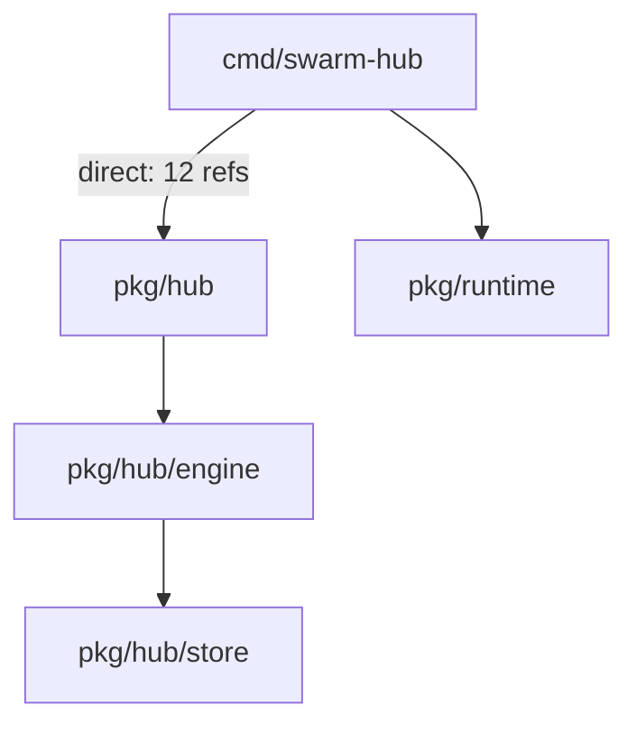
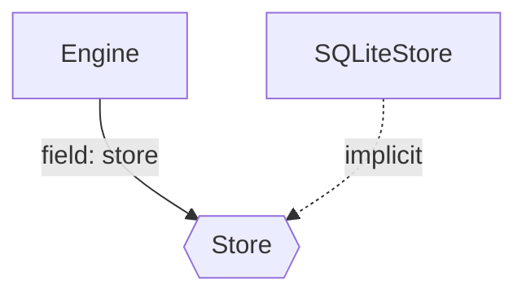
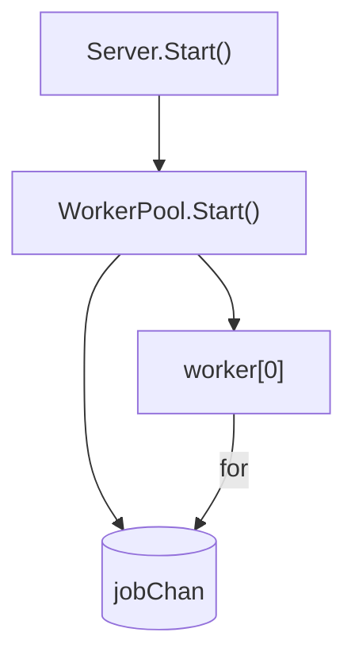

# Go Architecture Atlas: Go 语言架构可观测系统

**文档版本**: 5.1
**创建日期**: 2026-02-23
**最后修改**: 2026-02-24
**前置依赖**: 15-golang-support-proposal.md (Phase 0-4 已完成)
**状态**: 待评审 - 已响应架构审查 v5.0 反馈
**架构决策记录**:
- [ADR-001: GoAtlasPlugin 使用组合模式](../adr/001-goatlas-plugin-composition.md)
- [ADR-002: ArchJSON extensions 字段设计](../adr/002-archjson-extensions.md)

---

## 1. 执行摘要

### 1.1 核心洞察

> **OOP 语言可以从类型系统恢复 Architecture。**
> **Go 语言必须从行为模式恢复 Architecture。**

这是 ArchGuard 遇到的第一个"语言哲学级"断裂：

- **TypeScript/Java/C#**: 类 = 稳定抽象，类型关系 = 系统结构
- **Go**: 类型表达的是 data layout 和 minimal capability，真正的架构在：
  - package topology（包拓扑）
  - interface usage（接口使用）
  - runtime behavior patterns（运行时行为模式）
  - communication flow（通信流）

### 1.2 问题陈述

当前 Go 实现（Proposal 15 Phase 0-4）已成功：
- ✅ Tree-sitter 语法分析
- ✅ gopls 语义分析
- ✅ 隐式接口检测
- ✅ 方法提升

但生成的 Class Diagram 对 Go 项目的价值有限：

| 问题 | 根本原因 | 影响 |
|------|----------|------|
| 同名类混淆 | `pkg/hub.Server`, `pkg/worker.Server` 等 | 排名不稳定 |
| 数据模型无方法 | `Session`, `Task` 纯数据容器 | 核心类评分低 |
| 缺少行为信息 | 谁调用、谁拥有生命周期、是否并发 | 无法识别真实依赖 |
| 架构信息在函数中 | `UpdateRuntimeState()` 不在任何类中 | Class Diagram 缺失核心逻辑 |

### 1.3 解决方案

**Go Architecture Atlas** - 从单一 Class Diagram 升级为四层架构图：

```
┌─────────────────────────────────────────────────────────────────┐
│                    Go Architecture Atlas                         │
├─────────────────────────────────────────────────────────────────┤
│                                                                  │
│  ┌──────────────────┐  ┌──────────────────┐  ┌────────────────┐ │
│  │  Package Graph   │  │ Capability Graph │  │ Goroutine Graph│ │
│  │  (静态边界)       │  │  (抽象关系)       │  │  (执行结构)    │ │
│  │  100% 可恢复      │  │  80%+ 可恢复      │  │  静态模式识别   │ │
│  └────────┬─────────┘  └────────┬─────────┘  └───────┬────────┘ │
│           │                     │                    │          │
│           └─────────────────────┼────────────────────┘          │
│                                 ▼                               │
│                      ┌──────────────────┐                       │
│                      │   Flow Graph     │                       │
│                      │   (信息路径)      │                       │
│                      │  入口→调用链     │                       │
│                      └──────────────────┘                       │
│                                                                  │
└─────────────────────────────────────────────────────────────────┘
```

**关键洞察**：这四张图是互补的投影，而非替代关系。Go 的架构需要多视角叠加才能理解。

---

## 2. 理论基础

### 2.1 架构可恢复性差异

```
OOP (TypeScript/Java/C#):                    Go:
┌────────────────────────────┐           ┌────────────────────────────┐
│ 架构 = Type System        │           │ 架构 = Behavior Patterns   │
│                           │           │                           │
│ • class 继承               │           │ • package 依赖            │
│ • interface 实现           │           │ • interface 使用位置      │
│ • 字段类型                 │           │ • goroutine 启动模式      │
│ • 方法可见性               │           │ • channel 通信模式       │
│ • 依赖注入                 │           │ • 函数调用链             │
│                           │           │                           │
│ 👉 静态分析足够             │           │ 👉 需要行为分析           │
└────────────────────────────┘           └────────────────────────────┘
```

### 2.2 Machine-Recoverable Truth 重新定义

| 结构 | 可恢复性 | 技术限制 | 架构价值 |
|------|----------|----------|----------|
| **package imports** | 100% | 无 | ⭐⭐⭐⭐⭐ |
| **interface 定义位置** | 100% | 无 | ⭐⭐⭐ |
| **interface 使用点** | ~85% | 匿名函数、反射 | ⭐⭐⭐⭐⭐ |
| **goroutine 启动** | ~90% | 动态启动、条件分支 | ⭐⭐⭐⭐⭐ |
| **channel 创建** | ~95% | 动态创建、类型推断 | ⭐⭐⭐⭐ |
| **channel 通信边** | **< 20%** | **严重依赖数据流分析** | ⭐⭐⭐ |
| **HTTP 入口点** | ~70% | 框架差异 | ⭐⭐⭐⭐ |
| **函数调用链** | ~60% | **严重依赖类型推断 (gopls)** | ⭐⭐⭐ |
| **struct 继承** | N/A | Go 无继承 | - |
| **函数体行为** | ~80% | **需扩展 TreeSitterBridge** | ⭐⭐⭐⭐⭐ |

**说明**：
- "goroutine spawn 是 runtime truth" 的说法不准确，应为 "静态 spawn pattern"
- **修正**: "channel edges" 的静态可恢复性极低（< 20%），除非是局部变量传递。复杂的数据流分析不在初期版本范围内。
- **新增**: "函数体行为" 可恢复性取决于 TreeSitterBridge 扩展（见 4.6 节），包括调用表达式、goroutine spawn 点、channel 操作的静态识别。

---

## 3. 四层架构图设计

### 3.1 Package Dependency Graph

**可恢复性**: 100%
**技术限制**: 无
**架构价值**: ⭐⭐⭐⭐⭐

```
解析方式:
- go list -deps（获取完整依赖树）
- AST import 分析（获取直接依赖）
- 循环依赖检测（Kahn 算法）

输出示例:
┌─────────────────────────────────────────────────────────────┐
│  cmd/swarm-hub                                               │
│       │                                                      │
│       ├── pkg/hub ─────┐                                    │
│       │      │          │                                    │
│       │      ├── pkg/hub/engine                              │
│       │      │          │                                    │
│       │      │          └── pkg/hub/store ◄──┐              │
│       │      │                               │               │
│       │      └── pkg/hub/models              │               │
│       │                                     │               │
│       ├── pkg/runtime ──────────────────────┘               │
│       │                                                      │
│       └── pkg/config                                         │
│                                                              │
│  ⚠️ 检测到循环依赖: pkg/hub → pkg/runtime → pkg/hub           │
└─────────────────────────────────────────────────────────────┘
```

**关键价值**：Package Graph 是 Go 唯一的静态真相，它是理解系统边界的起点。

### 3.2 Capability Graph

**可恢复性**: ~85%
**技术限制**:
- 匿名函数中的接口参数无法关联到具体类型
- 反射调用无法静态分析
- 第三方库的接口使用点可能不可见

**架构价值**: ⭐⭐⭐⭐⭐

```
解析方式:
- interface 定义位置（AST）
- 字段类型是接口的字段
- 函数参数类型是接口的参数
- 隐式实现匹配（Proposal 15 已实现）

输出示例:
┌─────────────────────────────────────────────────────────────┐
│  pkg/hub/Store ─────────────────────────────┐               │
│     ▲                                   (interface)        │
│     │                                                      │
│     │ implements                                    uses    │
│     │                                                      │
│  ┌──┴──────┐                                           │    │
│  │SQLiteStore│ pkg/hub/Server ───────────────────────┘    │
│  │MemStore   │                                                │
│  └─────────┘│                                                │
│            │                                                │
│  pkg/hub/Engine ──────────────────────────────────uses─────│
│                                                              │
│  pkg/worker/Executor ───────┐                              │
│            ▲                │                              │
│            │ implements  ┌───┴─────┐                       │
│  pkg/worker/TaskExecutor ──│CLIAdapter│                       │
│            │            │CodexAdapter│                      │
│  pkg/worker/WorkerPool ────┴──────────┘                       │
│                                                              │
│  实线: 隐式实现          虚线: 字段注入/参数注入                │
└─────────────────────────────────────────────────────────────┘
```

**关键价值**：Capability Graph 揭示了"谁依赖谁的抽象"，这是理解系统解耦程度的关键。

### 3.3 Goroutine Topology

**可恢复性**: ~60-70% (仅限启动点和创建点)
**技术限制**:
- **数据流缺失**: Channel 作为参数传递或存储在结构体中时，静态追踪极为困难。
- **动态性**: 条件启动的 goroutine 无法确定运行时是否执行。

**架构价值**: ⭐⭐⭐⭐⭐

```
解析方式:
- go func() 调用模式匹配（需要 AST 函数体分析）
- make(chan) 调用模式匹配
- range/chan 模式识别（仅限局部变量）
- select 语句识别

输出示例（简化版）:
┌─────────────────────────────────────────────────────────────┐
│  Server.Start() ──go func──▶ runSessionGC()                  │
│       │                                                      │
│       └──go func──▶ WorkerPool.Start()                       │
│                          │                                   │
│                          ├── jobChan (chan Job, 100)        │
│                          ├── resultChan (chan Result)      │
│                          │                                   │
│                          ├──worker[N] (for i < poolSize)│
│                          │     │                             │
│                          │     └──for job := range jobChan│
│                          │                                   │
│                          └──resultAggregator               │
│                                                              │
│  ⚠️ 注意: 通信边仅为静态识别，复杂跨包通信可能丢失       │
└─────────────────────────────────────────────────────────────┘
```

**关键价值**：即使是简化版，Goroutine Topology 也能揭示并发架构的骨架，这是理解系统性能边界的关键。

### 3.4 Flow Graph

**可恢复性**: ~50-60% (**强依赖 gopls**)
**技术限制**:
- **纯静态分析极其有限**: 仅能识别同包内的直接函数调用。
- **接口调用黑盒**: 静态分析无法知道 `interface.Method()` 调用了哪个实现，必须依赖 gopls 的类型指针分析。

**架构价值**: ⭐⭐⭐⭐

```
解析方式:
- HTTP handler 注册点模式匹配
- 函数调用链追踪（AST + gopls call hierarchy）
- context.Context 传递分析
- error 返回路径分析

输出示例（HTTP 入口点）:
┌─────────────────────────────────────────────────────────────┐
│  POST /v1/tasks:dispatch                                      │
│       │                                                      │
│       ▼                                                      │
│  ┌──────────────────┐                                        │
│  │ Auth Middleware  │ ◄── token validation                   │
│  └────────┬─────────┘                                        │
│           │                                                  │
│           ▼                                                  │
│  ┌──────────────────┐                                        │
│  │ Engine.CreateTask │ ◄── state machine validation        │
│  └────────┬─────────┘                                        │
│           │                                                  │
│           ▼                                                  │
│  ┌──────────────────┐                                        │
│  │ Store.CreateTask │ ◄── persistence                        │
│  └────────┬─────────┘                                        │
│           │                                                  │
│           ▼                                                  │
│  ┌──────────────────┐                                        │
│  │ Engine.Broadcast │ ◄── TASK_CREATED event                 │
│  │    (to SSE)       │                                       │
│  └──────────────────┘                                        │
│                                                              │
│  ---. error path -------------------------------------------►│
│  │                                                          │
│  └──► ErrorHandler ──► HTTP 500                              │
└─────────────────────────────────────────────────────────────┘
```

**关键价值**：Flow Graph 揭示了"请求如何流转"，这是理解业务逻辑的关键。

#### 入口点检测模式匹配规则

**支持的 HTTP 框架和模式**:

| 框架 | 检测模式 | 示例代码 | 识别准确率 |
|------|----------|----------|------------|
| **net/http** | `http.HandleFunc()` 调用 | `http.HandleFunc("/path", handler)` | ~95% |
| **net/http** | `ServeMux.Handle()` 调用 | `mux.Handle("/path", handler)` | ~90% |
| **gin** | `router.GET/POST/...()` 调用 | `router.GET("/path", handler)` | ~85% |
| **gorilla/mux** | `router.HandleFunc()` 调用 | `router.HandleFunc("/path", handler)` | ~85% |
| **echo** | `router.GET/POST/...()` 调用 | `router.GET("/path", handler)` | ~80% |
| **grpc** | `Register*Server()` 调用 | `pb.RegisterServiceServer(server, srv)` | ~90% |

**检测局限性**:

1. **间接注册无法识别**:
   ```go
   // ❌ 无法静态识别 handler 是什么
   func setupRoutes(mux *http.ServeMux, handlers map[string]http.HandlerFunc) {
       for path, handler := range handlers {
           mux.HandleFunc(path, handler)  // handler 来自 map
       }
   }
   ```

2. **动态路由无法完全解析**:
   ```go
   // ❌ 只能识别 "GET /api/..." 模式，无法确定实际路径
   router.GET("/api/:id", handler)  // gin/echo 的路径参数
   ```

3. **中间件链顺序不确定**:
   ```go
   // ⚠️ 中间件可能动态注册
   r.Use(middleware1)
   // ... 其他代码 ...
   r.Use(middleware2)  // 顺序依赖运行时
   ```

**缓解策略**:
- **必须集成 gopls**: 使用 `gopls call hierarchy` API 追踪间接调用。
- 标注 `dynamic_route` 表示动态路由。
- 提供最大/最小中间件链范围。

---

## 4. 架构设计

### 4.1 系统架构原则

1. **组合优于继承**: `GoAtlasPlugin` 通过组合 `GoPlugin` 实例实现功能复用，而非继承（见 [ADR-001](../adr/001-goatlas-plugin-composition.md)）
2. **类型权威性**: Atlas 四层图数据结构以 [ADR-002](../adr/002-archjson-extensions.md) 为唯一权威定义，本文不重复定义
3. **核心类型不扩展**: 不向 `EntityType`/`RelationType` 添加 Go 特有类型，语言特定数据放在 `extensions` 中（见 ADR-002 决策）
4. **单次解析**: TreeSitterBridge 使用统一 `parseCode()` API，通过选项控制是否提取函数体，避免双重解析
5. **分层清晰**: 解析层（TreeSitter）→ 分析层（BehaviorAnalyzer）→ 映射层（AtlasMapper）职责分离
6. **渐进增强**: 函数体提取作为可选功能，通过 `functionBodyStrategy` 控制

### 4.2 系统架构

```
┌──────────────────────────────────────────────────────────────────────┐
│                    Go Atlas Architecture (v5.0)                      │
├──────────────────────────────────────────────────────────────────────┤
│                                                                       │
│  ┌─────────────────────────────────────────────────────────────────┐  │
│  │                    GoAtlasPlugin (组合模式)                     │  │
│  │         implements ILanguagePlugin + IGoAtlas                   │  │
│  ├─────────────────────────────────────────────────────────────────┤  │
│  │                                                                 │  │
│  │  ┌───────────────────────────────────────────────────────────┐ │  │
│  │  │  ILanguagePlugin 接口 (委托给 GoPlugin)                    │ │  │
│  │  │  • parseProject() → ArchJSON (标准模式 / Atlas 增强模式)   │ │  │
│  │  │  • canHandle() → boolean (委托)                            │ │  │
│  │  │  • initialize() / dispose() (协调初始化)                   │ │  │
│  │  └───────────────────────────────────────────────────────────┘ │  │
│  │                                                                 │  │
│  │  ┌───────────────────────────────────────────────────────────┐ │  │
│  │  │  IGoAtlas 接口 (Atlas 专用)                               │ │  │
│  │  │  • generateAtlas() → GoArchitectureAtlas (完整四层图)      │ │  │
│  │  │  • renderLayer() → RenderResult (分层渲染)                 │ │  │
│  │  └───────────────────────────────────────────────────────────┘ │  │
│  │                                                                 │  │
│  │  ┌─────────────────── 组合组件 ──────────────────────────────┐ │  │
│  │  │                                                           │ │  │
│  │  │  ┌─────────────┐  ┌───────────────┐  ┌────────────────┐  │ │  │
│  │  │  │  GoPlugin    │  │ GoplsClient   │  │ BehaviorAnalyzer│ │ │  │
│  │  │  │  (委托基础   │  │ (Optional)    │  │                │  │ │  │
│  │  │  │   解析)      │  │               │  │ • buildPkgGraph│  │ │  │
│  │  │  │             │  │ • call        │  │ • buildCapGraph│  │ │  │
│  │  │  │ • parseToRaw│  │   hierarchy   │  │ • buildGrtnTopo│  │ │  │
│  │  │  │   Data()    │  │ • type        │  │ • buildFlowGraph│ │ │  │
│  │  │  │ • parseProj │  │   inference   │  │                │  │ │  │
│  │  │  │   ect()     │  │               │  │                │  │ │  │
│  │  │  └─────────────┘  └───────────────┘  └────────────────┘  │ │  │
│  │  │                                                           │ │  │
│  │  │  ┌─────────────┐                                          │ │  │
│  │  │  │ AtlasMapper │                                          │ │  │
│  │  │  │ • toArchJSON│                                          │ │  │
│  │  │  └─────────────┘                                          │ │  │
│  │  └───────────────────────────────────────────────────────────┘ │  │
│  │                                                                 │  │
│  └─────────────────────────────────────────────────────────────────┘  │
│                                                                       │
└──────────────────────────────────────────────────────────────────────┘
```

### 4.3 核心数据结构

#### 4.3.1 类型定义权威性

Atlas 四层图的数据结构（`PackageGraph`、`CapabilityGraph`、`GoroutineTopology`、`FlowGraph`）以 [ADR-002](../adr/002-archjson-extensions.md) 为**唯一权威定义**。本文不重复定义这些类型，仅在需要补充说明时引用。

`GoArchitectureAtlas` 是 ADR-002 中 `GoAtlasExtension` 的别名：

```typescript
// plugins/golang/atlas/types.ts
import type { GoAtlasExtension } from '@/types/extensions.js';

/**
 * GoArchitectureAtlas 是 GoAtlasExtension 的别名
 * 四层图数据结构定义见 ADR-002
 */
export type GoArchitectureAtlas = GoAtlasExtension;
```

#### 4.3.2 ADR-002 类型修正

经过代码审查，ADR-002 中的类型定义需要以下修正（将同步更新 ADR-002）：

**1. `PackageGraph.cycles` 应使用结构化类型**

当前 ADR-002 定义为 `cycles: string[][]`，修正为：

```typescript
export interface PackageCycle {
  packages: string[];     // 循环依赖的包 ID 列表
  severity: 'warning' | 'error';
}

export interface PackageGraph {
  nodes: PackageNode[];
  edges: PackageDependency[];
  cycles: PackageCycle[];
}
```

**2. `PackageNode.type` 应涵盖更多分类**

```typescript
export interface PackageNode {
  id: string;           // 完整模块路径: "github.com/example/swarm/pkg/hub"
  name: string;         // 相对路径: "pkg/hub"
  type: 'internal' | 'external' | 'vendor' | 'std' | 'cmd';
  fileCount: number;
  stats?: PackageStats;
}

export interface PackageStats {
  structs: number;
  interfaces: number;
  functions: number;
}
```

**3. `CapabilityGraph` 应避免数据冗余**

当前 ADR-002 定义了独立的 `CapabilityNode` 和 `CapabilityRelation`，这是正确的。
但 Proposal v4.0 中的 `InterfaceCapability` 包含了冗余的 `implementors` 和 `consumers` 字段（这些关系已经在 `edges` 中表示）。

ADR-002 的简洁设计是正确的，不做修改。

**4. `GoroutineNode` 的 `spawnType` 缺失**

ADR-002 中 `GoroutineNode` 需要补充 spawn 类型：

```typescript
export interface GoroutineNode {
  id: string;
  name: string;
  type: 'main' | 'spawned';
  spawnType?: 'named_func' | 'anonymous_func' | 'method';
  package: string;
  location: { file: string; line: number; };
  pattern?: GoroutinePattern;
}
```

### 4.4 ArchGuard 核心架构调整

#### 4.4.1 扩展 ArchJSON Schema

仅添加 `extensions` 可选字段，**不扩展** `EntityType` 和 `RelationType`：

```typescript
// src/types/index.ts

/**
 * EntityType - 保持不变
 * 决策: 'package' 不适合作为 Entity（缺少 members/methods 概念）
 * Go 特有的包级数据放在 extensions.goAtlas 中
 */
export type EntityType =
  'class' | 'interface' | 'enum' | 'struct' | 'trait' | 'abstract_class' | 'function';

/**
 * RelationType - 保持不变
 * 决策: 'spawns'/'calls' 关系与 Goroutine Topology/Flow Graph 重复
 * 语言特定关系放在 extensions 中（见 ADR-002）
 */
export type RelationType =
  | 'inheritance'
  | 'implementation'
  | 'composition'
  | 'aggregation'
  | 'dependency'
  | 'association';

/**
 * ArchJSON - 新增 extensions 字段
 */
export interface ArchJSON {
  version: string;
  language: SupportedLanguage;
  timestamp: string;
  sourceFiles: string[];
  entities: Entity[];
  relations: Relation[];
  modules?: Module[];
  metadata?: Record<string, unknown>;

  // 新增: 类型化的语言特定扩展（见 ADR-002）
  extensions?: ArchJSONExtensions;
}

/**
 * 类型化的扩展容器（定义见 ADR-002）
 */
export interface ArchJSONExtensions {
  goAtlas?: GoAtlasExtension;
  // 未来: javaAtlas?, rustAtlas? 等
}
```

#### 4.4.2 ILanguagePlugin 接口 - 不修改

`ILanguagePlugin` 接口**不添加** `generateExtendedAnalysis` 方法。原因：

1. 该方法签名使用 `any` 类型（`options: any, returns: Promise<any>`），破坏类型安全
2. Atlas 功能通过 `GoAtlasPlugin` 的 `IGoAtlas` 接口暴露，不需要污染通用接口
3. `parseProject()` 返回的 `ArchJSON` 已包含 `extensions` 字段，足以承载 Atlas 数据

### 4.5 GoAtlasPlugin 设计（组合模式）

遵循 [ADR-001](../adr/001-goatlas-plugin-composition.md) 的决策，`GoAtlasPlugin` 使用组合而非继承。

#### 4.5.1 GoPlugin 公共 API 扩展

为支持组合模式，`GoPlugin` 需要暴露一个**公共方法**供 `GoAtlasPlugin` 调用：

```typescript
// plugins/golang/index.ts

export class GoPlugin implements ILanguagePlugin {
  // ... 现有 private 成员保持不变 ...

  /**
   * 公共方法: 解析项目为原始数据
   *
   * 供 GoAtlasPlugin 等组合使用者调用。
   * 返回 GoRawData 而非 ArchJSON，避免不必要的映射。
   *
   * @param workspaceRoot - 项目根目录
   * @param config - 解析配置，扩展 ParseConfig 支持函数体提取选项
   */
  async parseToRawData(
    workspaceRoot: string,
    config: ParseConfig & TreeSitterParseOptions
  ): Promise<GoRawData> {
    // 实现: 提取自现有 parseProject() 的前半部分逻辑
    // 包括文件发现、Tree-sitter 解析（传递 extractBodies/selectiveExtraction 选项）、
    // 包合并（按 fullName）、sourceFiles 填充
  }

  /**
   * 现有方法重构: 复用 parseToRawData()
   */
  async parseProject(workspaceRoot: string, config: ParseConfig): Promise<ArchJSON> {
    const rawData = await this.parseToRawData(workspaceRoot, config);

    // Match interface implementations
    const allStructs = rawData.packages.flatMap(p => p.structs);
    const allInterfaces = rawData.packages.flatMap(p => p.interfaces);
    const implementations = await this.matcher.matchWithGopls(
      allStructs,
      allInterfaces,
      this.goplsClient
    );

    // Map to ArchJSON
    const entities = this.mapper.mapEntities(rawData.packages);
    const relations = this.mapper.mapRelations(rawData.packages, implementations);

    return {
      version: '1.0',
      language: 'go',
      timestamp: new Date().toISOString(),
      sourceFiles: this.collectSourceFiles(rawData),
      entities,
      relations,
    };
  }

  // ... 其他现有方法保持不变 ...
}
```

**关键设计决策**:
- 使用 `public` 方法而非 `protected`（因为组合模式中 `GoAtlasPlugin` 不是子类）
- 不使用 `this.goPlugin['treeSitter']` 这种 bracket hack 访问私有成员
- `GoPlugin` 内部成员（`treeSitter`、`matcher`、`goplsClient`）保持 `private`

#### 4.5.2 GoAtlasPlugin 接口定义

```typescript
// plugins/golang/atlas/go-atlas-plugin.ts

/**
 * Go Atlas 专用接口
 */
export interface IGoAtlas {
  generateAtlas(
    rootPath: string,
    options?: AtlasGenerationOptions
  ): Promise<GoArchitectureAtlas>;

  renderLayer(
    atlas: GoArchitectureAtlas,
    layer: AtlasLayer,
    format: RenderFormat
  ): Promise<RenderResult>;
}

export type AtlasLayer = 'package' | 'capability' | 'goroutine' | 'flow' | 'all';
export type RenderFormat = 'mermaid' | 'json' | 'svg' | 'png';

export interface RenderResult {
  content: string;
  format: RenderFormat;
  layer: AtlasLayer;
}

/**
 * 渲染说明:
 * - 'mermaid' 格式: AtlasRenderer 生成 Mermaid DSL 字符串（graph/flowchart 语法），
 *   后续转 SVG/PNG 复用现有 src/ai/ 层的 MermaidGenerator 基础设施
 * - 'json' 格式: 直接序列化对应图层数据
 * - 'svg'/'png' 格式: 先生成 Mermaid DSL，再调用 MermaidGenerator 渲染
 */

/**
 * Atlas 生成选项
 */
export interface AtlasGenerationOptions {
  // 函数体提取策略
  functionBodyStrategy?: 'full' | 'selective' | 'none';

  // 选择性提取配置 (functionBodyStrategy === 'selective' 时使用)
  selectiveExtraction?: {
    /**
     * 触发函数体提取的 AST 节点类型
     * 仅当函数体包含这些节点类型时才提取
     * 默认: ['go_statement', 'send_statement', 'receive_expression']
     */
    triggerNodeTypes?: string[];
    excludeTestFiles?: boolean;
    maxFunctions?: number;
  };

  // 其他选项
  includeTests?: boolean;
  entryPointTypes?: EntryPointType[];
  followIndirectCalls?: boolean;
}
```

#### 4.5.3 GoAtlasPlugin 组合架构

```typescript
// plugins/golang/atlas/go-atlas-plugin.ts

/**
 * GoAtlasPlugin - Go Architecture Atlas 专用插件
 *
 * 通过组合 GoPlugin 实现基础解析功能（见 ADR-001）。
 * 通过 BehaviorAnalyzer 实现 Atlas 四层图生成。
 */
export class GoAtlasPlugin implements ILanguagePlugin, IGoAtlas {
  // ========== 组合组件 ==========
  private goPlugin: GoPlugin;
  private behaviorAnalyzer: BehaviorAnalyzer;
  private atlasRenderer: AtlasRenderer;
  private atlasMapper: AtlasMapper;

  // ========== 元数据 ==========
  readonly metadata: PluginMetadata = {
    name: 'golang',              // 复用 'golang' 名称，替代 GoPlugin（见 §4.5.5）
    version: '5.0.0',
    displayName: 'Go Architecture Atlas',
    fileExtensions: ['.go'],
    author: 'ArchGuard Team',
    minCoreVersion: '2.0.0',
    capabilities: {
      singleFileParsing: true,
      incrementalParsing: false,
      dependencyExtraction: true,
      typeInference: true,
    },
  };

  constructor() {
    this.goPlugin = new GoPlugin();
    this.behaviorAnalyzer = new BehaviorAnalyzer();
    this.atlasRenderer = new AtlasRenderer();
    this.atlasMapper = new AtlasMapper();
  }

  // ========== ILanguagePlugin 实现 (委托给 GoPlugin) ==========

  async initialize(config: PluginInitConfig): Promise<void> {
    await this.goPlugin.initialize(config);
  }

  canHandle(targetPath: string): boolean {
    return this.goPlugin.canHandle(targetPath);
  }

  readonly dependencyExtractor: IDependencyExtractor;

  // ... 在 constructor 中:
  // this.dependencyExtractor = this.goPlugin.dependencyExtractor;

  async parseProject(
    workspaceRoot: string,
    config: ParseConfig
  ): Promise<ArchJSON> {
    const atlasConfig = config.languageSpecific?.atlas as AtlasConfig | undefined;

    // 标准模式: 委托给 GoPlugin
    if (!atlasConfig?.enabled) {
      return this.goPlugin.parseProject(workspaceRoot, config);
    }

    // Atlas 增强模式（见 §4.5.6）
    const baseArchJSON = await this.goPlugin.parseProject(workspaceRoot, config);
    const atlas = await this.generateAtlas(workspaceRoot, {
      functionBodyStrategy: atlasConfig.functionBodyStrategy ?? 'selective',
      includeTests: atlasConfig.includeTests,
      entryPointTypes: atlasConfig.entryPointTypes,
      followIndirectCalls: atlasConfig.followIndirectCalls,
    });

    return {
      ...baseArchJSON,
      extensions: { goAtlas: atlas },
    };
  }

  // ========== IParser 可选方法委托（见 §4.5.7）==========

  parseCode(code: string, filePath?: string): ArchJSON {
    return this.goPlugin.parseCode(code, filePath);
  }

  async parseFiles(filePaths: string[]): Promise<ArchJSON> {
    return this.goPlugin.parseFiles(filePaths);
  }

  // ========== IGoAtlas 实现 ==========

  async generateAtlas(
    rootPath: string,
    options: AtlasGenerationOptions = {}
  ): Promise<GoArchitectureAtlas> {
    // 1. 获取原始数据（通过 GoPlugin 的公共 API）
    const rawData = await this.goPlugin.parseToRawData(rootPath, {
      workspaceRoot: rootPath,
      excludePatterns: ['**/vendor/**', '**/testdata/**'],
      extractBodies: options.functionBodyStrategy !== 'none',
      selectiveExtraction: options.functionBodyStrategy === 'selective',
    });

    // 2. 并行构建四层架构图
    //    函数体数据已在 parseToRawData() 中按 options 一次性提取，无需二次解析
    const [packageGraph, capabilityGraph, goroutineTopology, flowGraph] = await Promise.all([
      this.behaviorAnalyzer.buildPackageGraph(rawData),
      this.behaviorAnalyzer.buildCapabilityGraph(rawData),
      this.behaviorAnalyzer.buildGoroutineTopology(rawData, options),
      this.behaviorAnalyzer.buildFlowGraph(rawData, options),
    ]);

    return {
      version: '1.0',
      layers: { package: packageGraph, capability: capabilityGraph, goroutine: goroutineTopology, flow: flowGraph },
      metadata: this.buildAtlasMetadata(rawData, options, packageGraph, capabilityGraph, goroutineTopology, flowGraph),
    };
  }

  async renderLayer(
    atlas: GoArchitectureAtlas,
    layer: AtlasLayer = 'all',
    format: RenderFormat = 'mermaid'
  ): Promise<RenderResult> {
    return this.atlasRenderer.render(atlas, layer, format);
  }

  async dispose(): Promise<void> {
    await this.goPlugin.dispose();
  }
}
```

#### 4.5.4 Atlas 配置

Atlas 配置通过 `ParseConfig.languageSpecific.atlas` 传递，不修改 `ParseConfig` 类型定义：

```typescript
/**
 * Atlas 配置（通过 ParseConfig.languageSpecific.atlas 传递）
 *
 * 使用方式: config.languageSpecific = { atlas: { enabled: true, ... } }
 * ParseConfig.languageSpecific 类型为 Record<string, unknown>，
 * GoAtlasPlugin 内部将其断言为 AtlasConfig。
 */
export interface AtlasConfig {
  enabled: boolean;
  functionBodyStrategy?: 'none' | 'selective' | 'full';
  layers?: AtlasLayer[];
  includeTests?: boolean;
  entryPointTypes?: EntryPointType[];
  followIndirectCalls?: boolean;
}
```

**使用示例**:
```typescript
// 标准 Go 解析（无 Atlas）— 通过 ILanguagePlugin 接口
const archJSON = await plugin.parseProject('/path/to/go/project', {
  workspaceRoot: '/path/to/go/project',
  excludePatterns: ['**/vendor/**'],
  filePattern: '**/*.go',
});

// 启用 Atlas — 通过 languageSpecific 配置
const atlasArchJSON = await plugin.parseProject('/path/to/go/project', {
  workspaceRoot: '/path/to/go/project',
  excludePatterns: ['**/vendor/**'],
  filePattern: '**/*.go',
  languageSpecific: {
    atlas: {
      enabled: true,
      functionBodyStrategy: 'selective',
      layers: ['package', 'capability'],
    },
  },
});

// 直接使用 IGoAtlas 接口（推荐的 Atlas 入口）
const atlas = await (plugin as IGoAtlas).generateAtlas('/path/to/go/project', {
  functionBodyStrategy: 'selective',
});
```

#### 4.5.5 插件注册策略

**关键决策**: `GoAtlasPlugin` 使用 `name: 'golang'`，**替代**（而非并存） `GoPlugin`。

原因：
1. `GoAtlasPlugin` 是 `GoPlugin` 的**功能超集**（不启用 Atlas 时行为完全等价）
2. Plugin Registry 的 `DETECTION_RULES` 硬编码 `{ file: 'go.mod', plugin: 'golang' }`，使用相同名称可保证自动检测
3. 避免用户困惑（应该使用哪个插件？）

```typescript
// 注册 GoAtlasPlugin 替代 GoPlugin
registry.register(new GoAtlasPlugin(), { overwrite: true });

// 自动检测仍然有效：
// go.mod → DETECTION_RULES → getByName('golang') → GoAtlasPlugin
```

**向后兼容性**：`GoPlugin` 类仍然存在（作为 `GoAtlasPlugin` 的内部组件），但不再直接注册到 Registry。所有通过 `ILanguagePlugin` 接口的调用（`parseProject()`、`parseCode()` 等）行为保持不变。

#### 4.5.6 Atlas 模式触发方式

Atlas 模式有两个入口：

1. **通过 `IGoAtlas.generateAtlas()` 直接调用**（推荐）:
   - CLI 命令 `archguard analyze --lang go --atlas` 检测到 `--atlas` 标志后，将插件转型为 `IGoAtlas` 调用 `generateAtlas()`
   - 程序化使用时，调用者持有 `GoAtlasPlugin` 引用，直接调用 `generateAtlas()`

2. **通过 `ParseConfig.languageSpecific` 传递**:
   - `parseProject()` 检查 `config.languageSpecific?.atlas` 是否存在
   - 如果存在且 `enabled: true`，在标准 ArchJSON 基础上附加 `extensions.goAtlas`
   - 这种方式兼容现有工具链（不需要感知 `IGoAtlas` 接口）

```typescript
// GoAtlasPlugin.parseProject() 内部逻辑
async parseProject(workspaceRoot: string, config: ParseConfig): Promise<ArchJSON> {
  const atlasConfig = config.languageSpecific?.atlas as AtlasConfig | undefined;

  // 标准模式: 委托给 GoPlugin
  if (!atlasConfig?.enabled) {
    return this.goPlugin.parseProject(workspaceRoot, config);
  }

  // Atlas 增强模式
  const baseArchJSON = await this.goPlugin.parseProject(workspaceRoot, config);
  const atlas = await this.generateAtlas(workspaceRoot, {
    functionBodyStrategy: atlasConfig.functionBodyStrategy ?? 'selective',
    includeTests: atlasConfig.includeTests,
    entryPointTypes: atlasConfig.entryPointTypes,
    followIndirectCalls: atlasConfig.followIndirectCalls,
  });

  return {
    ...baseArchJSON,
    extensions: { goAtlas: atlas },
  };
}
```

#### 4.5.7 IParser 可选方法委托

`GoAtlasPlugin` 完整委托 `IParser` 的所有方法（包括可选方法），确保 `capabilities` 声明与实际行为一致：

```typescript
// 委托 parseCode (IParser 可选方法)
parseCode(code: string, filePath?: string): ArchJSON {
  return this.goPlugin.parseCode(code, filePath);
}

// 委托 parseFiles (IParser 可选方法)
async parseFiles(filePaths: string[]): Promise<ArchJSON> {
  return this.goPlugin.parseFiles(filePaths);
}
```

#### 4.5.8 BehaviorAnalyzer 公共 API

```typescript
/**
 * BehaviorAnalyzer - 四层架构图构建器
 *
 * 从 GoRawData 构建四层架构图。
 * 每个 build 方法接收 GoRawData 并返回对应的图层数据（ADR-002 类型）。
 */
export interface IBehaviorAnalyzer {
  /**
   * 构建 Package Dependency Graph
   * 数据来源: GoRawPackage.imports + GoRawPackage.fullName
   */
  buildPackageGraph(data: GoRawData): Promise<PackageGraph>;

  /**
   * 构建 Capability Graph (Interface Usage)
   * 数据来源: GoRawData.implementations + struct/interface 定义
   */
  buildCapabilityGraph(data: GoRawData): Promise<CapabilityGraph>;

  /**
   * 构建 Goroutine Topology
   * 数据来源: GoFunction.body.goSpawns + GoMethod.body.goSpawns
   * 需要函数体数据（extractBodies: true）
   */
  buildGoroutineTopology(
    data: GoRawData,
    options: Pick<AtlasGenerationOptions, 'includeTests'>
  ): Promise<GoroutineTopology>;

  /**
   * 构建 Flow Graph
   * 数据来源: GoFunction.body.calls + 入口点模式匹配
   * 需要函数体数据（extractBodies: true）
   */
  buildFlowGraph(
    data: GoRawData,
    options: Pick<AtlasGenerationOptions, 'entryPointTypes' | 'followIndirectCalls'>
  ): Promise<FlowGraph>;
}
```

### 4.6 扩展 GoRawData 类型

基于架构审查，需对 `GoRawData` 及相关类型进行以下扩展。

#### 4.6.1 GoRawPackage 增加 fullName

当前 `GoRawPackage` 仅有 `name`（包名如 "hub"），导致不同目录下的同名包在合并时会丢失数据。增加 `fullName` 字段表示模块内的相对路径：

```typescript
// plugins/golang/types.ts

export interface GoRawPackage {
  id: string;              // 唯一 ID（可等于 fullName）
  name: string;            // 包名: "hub"
  fullName: string;        // 模块相对路径: "pkg/hub"（用于消歧）
  dirPath: string;         // 文件系统路径
  imports: GoImport[];
  structs: GoRawStruct[];
  interfaces: GoRawInterface[];
  functions: GoFunction[];
  sourceFiles: string[];   // 该包包含的源文件路径列表
}
```

**`fullName` 计算方式**:

```typescript
// GoPlugin.parseProject() 中，解析文件后计算 fullName
const fileDirPath = path.dirname(file);
const relativeDirPath = path.relative(workspaceRoot, fileDirPath);

const pkg = this.treeSitter.parseCode(code, file, options);
pkg.dirPath = fileDirPath;
pkg.fullName = relativeDirPath || '.';  // 根目录文件用 '.'
pkg.id = pkg.fullName;
```

**包合并逻辑修正**：使用 `fullName`（而非 `name`）作为 Map key，确保不同目录的同名包不会被错误合并：

```typescript
// 修正前: packages.has(pkg.name)     → "hub" 会合并不同目录
// 修正后: packages.has(pkg.fullName)  → "pkg/hub" 和 "internal/hub" 分开
```

#### 4.6.2 GoFunction/GoMethod 增加可选 body 字段

```typescript
export interface GoFunction {
  name: string;
  packageName: string;
  parameters: GoField[];
  returnTypes: string[];
  exported: boolean;
  location: GoSourceLocation;
  body?: GoFunctionBody;      // 可选: Atlas 模式下填充
}

export interface GoMethod {
  name: string;
  receiver?: string;
  receiverType?: string;
  parameters: GoField[];
  returnTypes: string[];
  exported: boolean;
  location: GoSourceLocation;
  body?: GoFunctionBody;      // 可选: Atlas 模式下填充
}
```

#### 4.6.3 GoFunctionBody 定义

```typescript
/**
 * 函数体行为数据
 * 用于 Goroutine Topology 和 Flow Graph 分析
 */
export interface GoFunctionBody {
  calls: GoCallExpr[];        // 所有的函数调用
  goSpawns: GoSpawnStmt[];    // go func() / go namedFunc()
  channelOps: GoChannelOp[];  // ch <- x 或 <-ch
}

export interface GoCallExpr {
  functionName: string;       // 调用的函数名
  packageName?: string;       // 如果是跨包调用
  receiverType?: string;      // 如果是方法调用
  location: GoSourceLocation;
}

export interface GoSpawnStmt {
  call: GoCallExpr;           // 被 spawn 的函数调用
  location: GoSourceLocation;
}

export interface GoChannelOp {
  channelName: string;
  operation: 'send' | 'receive' | 'close' | 'make';
  location: GoSourceLocation;
}
```

#### 4.6.4 SourceLocation 统一

当前存在两个 SourceLocation 定义：
- `src/types/index.ts` 中的 `SourceLocation`（核心类型）
- `src/plugins/golang/types.ts` 中的 `GoSourceLocation`（Go 插件类型）

**决策**: Go 插件内部继续使用 `GoSourceLocation`（包含 `startColumn`/`endColumn`），Atlas 输出层（ADR-002）使用简化的 `{ file, line }` 格式。映射由 `AtlasMapper` 负责。

#### 4.6.5 GoRawData 扩展

```typescript
export interface GoRawData {
  packages: GoRawPackage[];
  moduleRoot: string;
  moduleName: string;
  implementations?: InferredImplementation[];  // 可选: 接口匹配结果
}
```

### 4.7 TreeSitterBridge 统一 API

基于架构审查（P0-2: 双重解析问题），**不**新增 `parseCodeWithBodies()` 方法，而是统一为单个 `parseCode()` 方法，通过选项控制行为。

```typescript
// plugins/golang/tree-sitter-bridge.ts

/**
 * 解析选项
 */
export interface TreeSitterParseOptions {
  /** 是否提取函数体行为数据 (默认 false) */
  extractBodies?: boolean;

  /** 选择性提取: 仅提取包含特定 AST 节点的函数体 */
  selectiveExtraction?: boolean;
}

export class TreeSitterBridge {
  private parser: Parser;

  /**
   * 解析单个 Go 源文件
   *
   * 统一 API: 通过 options 控制是否提取函数体。
   * 只调用一次 parser.parse()，避免双重解析。
   */
  parseCode(
    code: string,
    filePath: string,
    options?: TreeSitterParseOptions
  ): GoRawPackage {
    const tree = this.parser.parse(code);  // 只解析一次
    const rootNode = tree.rootNode;

    const packageName = this.extractPackageName(rootNode, code);
    const imports = this.extractImports(rootNode, code, filePath);
    const structs = this.extractStructs(rootNode, code, filePath, packageName);
    const interfaces = this.extractInterfaces(rootNode, code, filePath, packageName);

    // 提取函数（Phase 0-4 保持空数组，Atlas 模式下提取）
    let functions: GoFunction[] = [];
    if (options?.extractBodies) {
      functions = this.extractFunctions(rootNode, code, filePath, packageName, options);

      // 同时为方法提取 body
      for (const struct of structs) {
        this.enrichMethodBodies(struct, rootNode, code, filePath, options);
      }
    }

    return {
      id: packageName,
      name: packageName,
      fullName: '',  // 由调用者填充（需要 moduleRoot 信息）
      dirPath: '',
      imports,
      structs,
      interfaces,
      functions,
      sourceFiles: [filePath],
    };
  }

  /**
   * 选择性提取判断: 基于 AST 节点类型预扫描
   *
   * 不使用字符串匹配（如 codeSnippet.includes('go ')），
   * 而是检查函数体 AST 中是否包含目标节点类型。
   */
  private shouldExtractBody(
    blockNode: Parser.SyntaxNode
  ): boolean {
    const targetNodeTypes = [
      'go_statement',          // go func() / go namedFunc()
      'send_statement',        // ch <- value
      'receive_expression',    // <-ch
    ];

    return targetNodeTypes.some(nodeType =>
      blockNode.descendantsOfType(nodeType).length > 0
    );
  }

  // ... 其他现有提取方法保持不变 ...
}
```

**关键改进**:
1. **单次解析**: `parser.parse(code)` 只调用一次，无论是否提取函数体
2. **AST 预扫描**: `shouldExtractBody()` 使用 `descendantsOfType()` 而非字符串匹配，避免误判（如注释中的 `go ` 或变量名 `channel`）
3. **统一返回类型**: 始终返回 `GoRawPackage`，`body` 字段为可选

### 4.8 GoRawPackage.sourceFiles 字段

当前 `GoPlugin.parseProject()` 返回的 `ArchJSON.sourceFiles` 已从 glob 结果正确填充。但 `GoRawPackage` 缺少 `sourceFiles` 字段，导致无法在**包级别**追踪哪些文件属于哪个包（这对 Atlas 的 `PackageNode.fileCount` 和包级分析至关重要）。

**方案**: `GoRawPackage` 新增 `sourceFiles: string[]` 字段（见 4.6.1），在 TreeSitterBridge 解析时记录文件路径，在包合并时累加：

```typescript
// 包合并逻辑中
if (packages.has(pkg.fullName)) {
  const existing = packages.get(pkg.fullName)!;
  existing.sourceFiles.push(...pkg.sourceFiles);
  // ... merge structs, interfaces, functions, imports ...
}
```

`ArchJSON.sourceFiles` 保持现有逻辑（从 glob 结果填充），不变。

---

## 5. 技术限制与挑战

### 5.1 已知限制

| 层 | 限制 | 影响程度 | 缓解策略 |
|---|------|----------|----------|
| **Package Graph** | 无 | - | - |
| **Capability Graph** | 匿名函数中的接口参数 | 中 | 标注为 "unknown usage" |
| **Goroutine Topology** | channel 作为参数传递 | **高 (严重)** | 只识别创建点，标注 "untraced channel" |
| **Goroutine Topology** | 条件启动的 goroutine | 中 | 标注为 "conditional spawn" |
| **Flow Graph** | 间接调用（接口/函数值） | **高 (严重)** | **必须使用 gopls call hierarchy API** |
| **Flow Graph** | 第三方框架（gin/echo） | 中 | 支持常见框架的 pattern matching |

### 5.2 关键技术挑战

#### 挑战 1: Channel 边追踪

**问题场景**:
```go
func producer() <-chan int {
  ch := make(chan int, 10)
  go worker(ch)  // ch 发送给谁？
  return ch
}
```

**静态分析可以看到**:
- ✅ producer 创建 channel
- ✅ worker 接收 channel 参数
- ❌ producer 返回的 ch 发送给谁？未知

**缓解策略**:
- 标注 "channel source: unknown" 或 "channel flow: incomplete"
- **不尝试完整的静态通信图恢复**，仅提供 "交互点标注"

#### 挑战 2: 间接调用追踪

**问题场景**:
```go
type Handler interface {
  Handle(ctx Context) error
}

func router(h Handler) {
  h.Handle(ctx)  // h 的实际类型是什么？
}
```

**静态分析限制**:
- 无法知道 h 的运行时类型
- **没有类型推断，Flow Graph 几乎不可用**

**缓解策略**:
- **集成 gopls 是必须的**，不是可选的
- 使用 gopls call hierarchy API（需要额外 10-30 秒启动时间）
- 提供多个候选调用路径
- 标注为 "indirect call, possible targets: [...]"

#### 挑战 3: HTTP 框架多样性

**支持的框架**:
- ✅ net/http 标准库
- ✅ github.com/gin-gonic/gin
- ✅ github.com/gorilla/mux

**不支持的框架**:
- ❌ github.com/labstack/echo（需添加模式）
- ❌ grpc-gateway（需单独处理）
- ❌ 自定义框架（不可能通用支持）

**缓解策略**:
- 提供"框架检测"功能
- 允许用户注册自定义入口点模式
- 未识别的框架标注为 "custom_entry_point"

---

## 6. 与 ADR 的一致性声明

本提案 v5.0 与两个 ADR 保持完全一致：

### 与 ADR-001 的一致性

| ADR-001 决策 | 本提案实现 | 章节 |
|-------------|-----------|------|
| 使用组合模式 | `GoAtlasPlugin` 包含 `GoPlugin` 实例 | 4.5 |
| GoPlugin 保持封装性 | 内部成员保持 `private`，暴露 `parseToRawData()` 公共方法 | 4.5.1 |
| 清晰的职责分离 | GoPlugin(解析) / BehaviorAnalyzer(分析) / AtlasMapper(映射) | 4.2, 4.5.8 |
| 独立测试 | 每个组件可独立实例化和测试 | 4.5 |
| 插件替代注册 | `name: 'golang'` 替代 GoPlugin，兼容 Registry 自动检测 | 4.5.5 |

### 与 ADR-002 的一致性

| ADR-002 决策 | 本提案实现 | 章节 |
|-------------|-----------|------|
| 使用 `extensions` 字段 | `ArchJSON.extensions.goAtlas` | 4.4.1 |
| 不扩展核心 EntityType | 保持现有 7 种类型不变 | 4.4.1 |
| 不扩展核心 RelationType | 保持现有 6 种类型不变 | 4.4.1 |
| ADR-002 为类型权威 | 本提案引用而非重复定义 | 4.3.1 |

---

## 7. 验收标准

### 功能完整性

- **Package Graph**: 100% 可恢复性，准确检测循环依赖
- **Capability Graph**: >85% 可恢复性，准确识别接口使用点
- **Goroutine Topology**: >90% spawn 点识别（`'full'` 模式），>70% （`'selective'` 模式）
- **Flow Graph**: >80% HTTP 入口点识别，>70% 调用链深度准确率（启用 gopls）

### 架构兼容性

- **插件接口**: `GoAtlasPlugin` 实现 `ILanguagePlugin`（组合模式），通过现有工具链
- **工具集成**: CLI/Web UI/批处理模式自动支持 Atlas 功能
- **数据格式**: ArchJSON 支持 Atlas extensions（ADR-002 定义）

### 质量标准

- **测试覆盖率**: 核心逻辑 >90%，整体 >80%
- **性能标准**:
  - `'none'` 模式: 100 files < 10s (无函数体，与 Phase 0-4 一致)
  - `'selective'` 模式: 100 files < 30s (仅提取包含关键模式的函数)
  - `'full'` 模式: 100 files < 100s (完整函数体提取)
- **文档完整度**: API 文档 + 用户指南 + 示例 >90%

---

## 8. 相关文档

- **ADR-001**: [GoAtlasPlugin 组合模式](../adr/001-goatlas-plugin-composition.md)
- **ADR-002**: [ArchJSON extensions 字段设计](../adr/002-archjson-extensions.md)
- **实施计划**: [Go Architecture Atlas 实施计划](../plans/16-go-architecture-atlas-implementation-plan.md)
- **前置提案**: docs/refactoring/proposals/15-golang-support-proposal.md
- **Go 插件实现**: src/plugins/golang/
- **插件接口定义**: src/core/interfaces/language-plugin.ts

---

## 9. 附录

### 9.1 术语表

| 术语 | 定义 |
|------|------|
| **Package Graph** | 包级别的依赖关系图，展示模块边界和循环依赖 |
| **Capability Graph** | 接口使用关系图，揭示"谁依赖谁的抽象" |
| **Goroutine Topology** | 并发执行结构的静态识别，包括 spawn 点和 channel 创建点 |
| **Flow Graph** | 从入口点到调用链的信息流转路径 |
| **Usage Site** | 接口被使用的位置（字段/参数/返回值） |
| **Spawn Point** | goroutine 启动的代码位置 |

### 9.2 输出示例

#### Package Graph (Mermaid)



#### Capability Graph (Mermaid)



#### Goroutine Topology (Mermaid)



### 9.3 v4.0 → v5.0 → v5.1 变更摘要

| 变更 | v4.0 | v5.0 | v5.1 | 原因 |
|------|------|------|------|------|
| 插件架构 | 继承 `GoPlugin` | 组合 `GoPlugin` 实例 | 同 v5.0 | 与 ADR-001 保持一致 |
| 插件名称 | - | `'golang-atlas'` | `'golang'`（替代 GoPlugin） | 兼容 Registry 自动检测 |
| PluginMetadata | - | 缺少 `author`/`minCoreVersion` | 补全必填字段 | 满足 PluginMetadata 接口 |
| Atlas 触发方式 | - | `ParseConfig & { atlas? }` | `ParseConfig.languageSpecific.atlas` + `IGoAtlas` | 不修改 ParseConfig 类型 |
| parseToRawData 签名 | - | `(root, ParseConfig)` 传 `{}` | `(root, ParseConfig & TreeSitterParseOptions)` | 满足必填字段 + 集成 body 提取 |
| parseCode/parseFiles | - | 未委托 | 完整委托给 GoPlugin | 与 capabilities 声明一致 |
| dependencyExtractor | - | `get` getter | `readonly` 属性 | 与 GoPlugin 风格一致 |
| enrichWithFunctionBodies | - | 独立方法，可能双重解析 | 移除，body 提取集成到 parseToRawData | 消除双重解析 |
| selectiveExtraction.includePatterns | - | AST 节点类型 | 重命名为 `triggerNodeTypes` | 消除与 ADR-002 示例的语义冲突 |
| BehaviorAnalyzer | - | 未定义 API | 定义 IBehaviorAnalyzer 接口 | 明确职责边界 |
| sourceFiles 描述 | - | "修复空数组回归" | "新增包级 sourceFiles" | 修正不准确的问题描述 |
| fullName 计算 | - | 未说明 | 明确从 dirPath 相对于 workspaceRoot 推导 | 消除实现歧义 |
| 渲染与 MermaidGenerator | - | 未说明 | 说明复用 src/ai/ 基础设施 | 明确架构集成点 |

### 9.4 参考资料

- [Go AST Package](https://pkg.go.dev/go/ast)
- [Go Concurrent Patterns](https://go.dev/blog/pipelines)
- [gopls Documentation](https://github.com/golang/tools/tree/master/gopls)
- [Tree-sitter Go Grammar](https://github.com/tree-sitter/tree-sitter-go)

---

**文档版本**: 5.1 (架构审查 v5.0 响应版)
**修订日期**: 2026-02-24
**修订内容**:
v5.0 变更:
- 统一为组合模式（与 ADR-001 一致），移除所有继承相关代码
- 确立 ADR-002 为四层图类型的唯一权威定义
- 不扩展核心 EntityType/RelationType（与 ADR-002 一致）
- 删除 ILanguagePlugin.generateExtendedAnalysis()
- TreeSitterBridge 统一为单 parseCode() API，消除双重解析
- shouldExtractFunction 改为 AST 节点预扫描
- GoRawPackage 增加 fullName/sourceFiles，修复合并逻辑
- GoPlugin 暴露 public parseToRawData()，消除 bracket hack
- 移除工作量估计和具体实施计划

v5.1 变更 (响应架构审查 v5.0):
- P0-1: 补全 PluginMetadata 的 author/minCoreVersion 必填字段
- P0-2: 插件名称改为 'golang'（替代 GoPlugin），新增 §4.5.5 插件注册策略
- P0-3: parseToRawData 签名改为 ParseConfig & TreeSitterParseOptions，修复空对象传参
- P1-1: dependencyExtractor 从 getter 改为 readonly 属性
- P1-2: 新增 §4.5.6 Atlas 模式触发方式，使用 languageSpecific 传递配置
- P1-3: 修正 sourceFiles 问题描述（ArchJSON 级已正确，新增包级字段）
- P1-4: 明确 fullName 从 dirPath 相对于 workspaceRoot 推导
- P1-5: selectiveExtraction.includePatterns 重命名为 triggerNodeTypes
- P2-1: 新增 §4.5.7 parseCode/parseFiles 委托
- P2-2: 新增 §4.5.8 IBehaviorAnalyzer 接口定义
- P2-3: 说明 AtlasRenderer 复用 MermaidGenerator 基础设施
- P2-4: 移除 enrichWithFunctionBodies，body 提取集成到 parseToRawData
