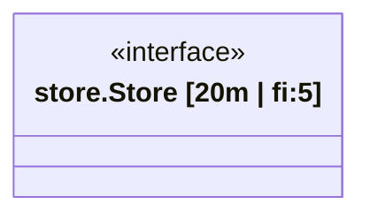

# Code Review: Go Atlas Enhancement Proposals

> Reviewer perspective: strict architect
> Based on: actual source code, not just summaries

---

## Summary verdict

Proposals 1 和 3 方向正确，细节有偏差。Proposal 2 **根因诊断错误，修复目标完全打错**。Proposal 4 遗漏了最关键的可行性约束。以下逐条说明。

---

## Proposal 1 — Structural Metrics

### 问题 1：Mermaid 语法写错了

Proposal 中的示例用的是 `classDiagram` 语法：



但实际代码 `mermaid-templates.ts:267` 中 `renderCapabilityGraph()` 生成的是 `flowchart LR`，不是 `classDiagram`。节点语法完全不同：

```typescript
// 实际代码，mermaid-templates.ts:293-297
if (node.type === 'interface') {
  output += `${indent}  ${mId}{{"${node.name}"}}\n`;  // 六边形
} else {
  output += `${indent}  ${mId}["${node.name}"]\n`;   // 矩形
}
```

Proposal 中的 Mermaid 示例在当前渲染器下是无效的，需要改为 flowchart 节点标签格式。

### 问题 2：`:::hotspot` classDef 不存在

Package 图的 renderer 有完整的 `classDef` 块（`cmd`、`tests`、`internal` 等），但 `renderCapabilityGraph()` **没有任何 classDef 声明**。Proposal 直接写 `:::hotspot` 是不会生效的，需要先在 renderer 中添加 classDef。

### 问题 3：fan-in/fan-out 的语义含混

原文中说：

> pkg/hub/store 被多少包引用，一眼看不清

但 Proposal 1 里给 `CapabilityNode` 加的 `fanIn`/`fanOut` 统计的是 capability 图中的**边数**，而不是包级别的依赖数。这两个是不同的指标：

- **包级 fan-in**：`pkg/hub/store` 被几个其他包 import → 应从 `PackageGraph.edges` 推导，或扩展 `PackageStats`
- **类型级 fan-in**：某个 `interface` 被几个 struct 实现 / 使用 → 这才是 `CapabilityNode.fanIn`

两者都有价值，但需要分清楚。Proposal 混用了这两个概念，且只实现了类型级的，却用了包级的动机来说明。

### 问题 4：`methodCount` 的边界未定义

`hub.Server` 若嵌入了 `sync.Mutex`，其方法集通过提升（promotion）包含 `Lock()`、`Unlock()`。`methodCount` 是否包含这些提升方法？当前 `GoRawStruct.methods` 只有**直接定义**在该 struct 上的 receiver 方法，不含 embedded 类型提升的方法。Proposal 应明确这一边界，避免实现时产生歧义。

---

## Proposal 2 — Fully Qualified Type Names ⚠️

### 根因诊断完全错误

Proposal 说：

> `GoCallExpr.packageName` 是 SHORT 名，不是 full path → capability 图出现跨包同名类型冲突

这个诊断是**错误的**。Capability 图的 "uses" 边来自**结构体字段类型**，代码路径如下（`capability-graph-builder.ts:121-170`）：

```typescript
for (const field of struct.fields) {
  const bareType = this.normalizeFieldType(field.type);   // 从字段类型字符串提取
  const qualifier = this.extractTypeQualifier(field.type); // 提取短包名（如 "engine"）
  const targetNodeId = qualifier
    ? pkgTypeToNodeId.get(`${qualifier}:${bareType}`)      // ← 关键
    : pkgTypeToNodeId.get(`${pkg.fullName}:${bareType}`);
```

`GoCallExpr` 是调用表达式，用于 **flow 图**的 call chain 追踪，**不参与 capability 图的边构建**。Proposal 把两个完全不相关的机制混为一谈。

### 实际的 bug 在哪里

`pkgTypeToNodeId` 的 key 格式是 `"shortPkgName:TypeName"`（如 `"engine:Engine"`）。当项目中存在两个短名相同的包，例如：

```
pkg/engine        → pkg.name = "engine"
pkg/adapter/engine → pkg.name = "engine"
```

`pkgTypeToNodeId.set("engine:Engine", ...)` 会发生**覆盖**，后注册的包的类型会覆盖先注册的，导致误配。

但注意 `capability-graph-builder.ts:87` **已经同时注册了 fullName key**：

```typescript
pkgTypeToNodeId.set(`${pkg.fullName}:${iface.name}`, `${pkg.fullName}.${iface.name}`);
```

问题在于 `extractTypeQualifier()` 只能从字段类型字符串（如 `*engine.Engine`）提取**短名** `"engine"`，然后用 `"engine:Engine"` 查 map，而不能用 `"pkg/engine:Engine"`。**它不知道 `engine` 对应哪个 full path**。

### 正确的修复方向

修复应在 `capability-graph-builder.ts` 内部完成：

在 `buildEdges()` 中，对每个 `pkg`，用 `pkg.imports: GoImport[]` 构造 qualifier → fullPath 的映射表。`GoImport` 已经包含完整 import path。当解析字段类型的 qualifier 时，先查这个映射表把 `"engine"` 解析为 `"pkg/engine"`，再用 `pkgTypeToNodeId.get("pkg/engine:Engine")`（即 fullName key），完全利用已有的双重注册机制。

**不需要**修改 `tree-sitter-bridge.ts`，**不需要**修改 `GoCallExpr`，**不需要**修改 `GoRawData` 的任何字段。这是一个纯粹的 `capability-graph-builder.ts` 内部修改，影响范围最小。

---

## Proposal 3 — Concrete vs Interface Usage

### 问题 1：边样式会造成视觉歧义

当前 capability 图有两种边：

- `implements` → `-.->|impl|`（虚线箭头）
- `uses` → `-->|uses|`（实线箭头）

Proposal 想添加第三种：interface-based uses → 虚线。这样 `implements` 和 interface-based `uses` 都是虚线，只靠标签文字区分，视觉负担很重。可以考虑用不同的箭头头形而不是实线/虚线来区分。

### 问题 2：`concreteUsage` 可以是 render-time 派生值

`CapabilityRelation.target` 指向一个 `CapabilityNode`，而 `CapabilityNode.type` 已经是 `'interface' | 'struct'`。在 renderer 里，`concreteUsage` 完全可以通过查 nodes map 派生，无需存入结构体。

如果是为了跨 renderer 边界传递（例如 JSON 导出时方便查阅），加这个字段可以接受，但应在 Proposal 中明确说明为什么不选 render-time 派生方案。

### 问题 3：文件 I/O 不应在 plugin 层做

Proposal 说 `index.ts` 应 emit `go-testability-risks.json`。但 `GoAtlasPlugin` 是一个数据生成层，它的职责是返回 `GoAtlasExtension`（纯数据结构）；文件写入由 CLI 层（`analyze` 命令）负责。在 plugin 里做文件 I/O 会：

1. 违反现有的分层约定
2. 破坏 `--format json` 模式（此时所有数据应走 stdout）
3. 让测试需要 mock 文件系统

**正确做法**：将 testability risks 数据加入 `GoAtlasExtension` 的某个字段，由 CLI 层决定如何输出。

---

## Proposal 4 — Goroutine Lifecycle

### 问题 1：可行性约束未解决（最严重）

Proposal 说检测 spawned goroutine 是否有 `<-ctx.Done()` 只需扫描 `GoFunctionBody`。但这个前提不成立。

Selective extraction（默认模式）的触发条件（`tree-sitter-bridge.ts:shouldExtractBody()`）是：

- `go_statement`
- `send_statement`
- `receive_expression`
- HTTP handler 模式

也就是说，**只有包含 goroutine spawn 或 channel 操作的函数**才会提取 body。被 spawn 的目标函数（如 `handleConn`）的 body **可能根本没有被提取**，尤其当它独立存在于一个没有 goroutine spawn 操作的文件里。

举例：

```go
// server.go：有 go_statement → body 被提取
func (s *Server) Start(ctx context.Context) {
  go s.handleConn(ctx)
}

// handler.go：没有 go_statement → body **不会**被提取（selective 模式）
func (s *Server) handleConn(ctx context.Context) {
  for {
    select {
    case <-ctx.Done():  // ← 我们要检测的东西，但 body 未被提取
      return
    }
  }
}
```

Lifecycle 检测需要的是 spawn **目标**函数的 body，而 goroutine topology 检测需要的是 spawn **来源**函数的 body——两者不重叠。

可选解决方案（需要在 Proposal 中选一个并说清楚）：
- 方案 A：lifecycle 检测只适用于 `functionBodyStrategy: 'full'` 模式，selective 模式下跳过并在 metadata 中标注
- 方案 B：在 goroutine topology 建立后，做第二次选择性提取，专门针对已识别的 spawn 目标函数名
- 方案 C：扩展 `shouldExtractBody()` 的触发条件，添加函数名白名单机制

如不解决此问题，Lifecycle 检测在默认配置下 **只能分析匿名 goroutine 和与 spawn 同文件的具名函数**，覆盖率极低。

### 问题 2：`GoroutineLifecycleSummary` 的存放位置模糊

Proposal 说"Add to `GoAtlasExtension.layers`"，但 `GoAtlasLayers` 是：

```typescript
export interface GoAtlasLayers {
  package?: PackageGraph;
  capability?: CapabilityGraph;
  goroutine?: GoroutineTopology;
  flow?: FlowGraph;
}
```

方案有三种，三者的影响面完全不同：

- **方案 A**：在 `GoroutineTopology` 内增加 `lifecycle?: GoroutineLifecycleSummary[]` 字段 → 数据共存，渲染时可直接访问
- **方案 B**：在 `GoAtlasLayers` 新增 `goroutineLifecycle?: GoroutineLifecycleSummary[]` → 第五个准 layer，渲染器 switch 需同步更新
- **方案 C**：新增真正的第五个 AtlasLayer → 需要修改 `AtlasLayer` union type、`AtlasRenderer.render()` switch、`completeness` 分数等

方案 A 影响最小且最合理（lifecycle 是 goroutine topology 的附属信息），但 Proposal 没有明确选择。

### 问题 3：渲染器签名需要同步修改

`MermaidTemplates.renderGoroutineTopology(topology: GoroutineTopology)` 只接受 `GoroutineTopology`。如果 lifecycle 注解要出现在图中，方法签名需要更新。Proposal 提到了渲染输出但没有涉及这个变更。

### 问题 4：`cancellationMechanism` 类型定义自相矛盾

```typescript
cancellationMechanism?: 'context' | 'channel' | 'signal' | 'none';
```

- 字段已经是 optional（`?:`），`undefined` 已经表达"未知/不适用"
- `'none'` 和 `undefined` 语义重叠，使消费者必须处理两种"没有取消机制"的表达
- `'signal'`（OS signal）是运行时行为，静态分析检测不到，这个值没有意义

应改为：`cancellationMechanism?: 'context' | 'channel'`，不存在取消机制时 `orphan: true` 已经足够表达。

---

## 横向问题

### extensions.ts (ADR-002) 变更的影响

四个 Proposal 都涉及 `extensions.ts` 的修改。ADR-002 是单一可信数据源，修改它意味着：

1. `atlas/types.ts` 的 re-export 需要同步
2. 所有引用被修改接口的测试需要更新
3. JSON 格式的版本号 `GO_ATLAS_EXTENSION_VERSION = '1.0'` 是否应升版？Proposal 没有提

### Proposal 2 是 bug fix，不应与 1、3 捆绑

Summary 表里把 1、2、3 归为"一批实现"。但 Proposal 2 是（正确诊断后的）bug fix，应单独 PR，否则 bug fix 混在 feature 变更中，回滚困难，review 也很难聚焦。

### `completeness` 分数的更新逻辑

`GoAtlasMetadata.completeness` 有 `goroutine: number` 等分数。增加 lifecycle 检测后，goroutine layer 的 completeness 逻辑需要更新（例如当 selective 模式下无法提取 spawn 目标函数时，得分应降低）。Proposal 4 没有提及。

---

## 修订建议摘要

| Proposal | 主要问题 | 建议动作 |
|----------|---------|---------|
| 1 | Mermaid 语法用错；fan-in/fan-out 语义含混；methodCount 边界未定 | 修正示例；分清包级/类型级指标；明确 embedded 方法的处理 |
| 2 | 根因诊断和修复目标都错了 | 重写"Fix"一节：从 `GoRawPackage.imports` 构造 qualifier→fullPath 映射，只改 `capability-graph-builder.ts` |
| 3 | 边样式三种后视觉歧义；文件 I/O 放错层 | 选择更清晰的边区分方案；将 risks 数据放入 GoAtlasExtension，由 CLI 层写文件 |
| 4 | selective 模式下 spawn 目标函数体不可用，整个方案前提不成立；存放位置模糊；类型定义自相矛盾 | 先选定对 full/selective 模式的处理策略；明确数据放在 GoroutineTopology 内；清理类型定义 |
