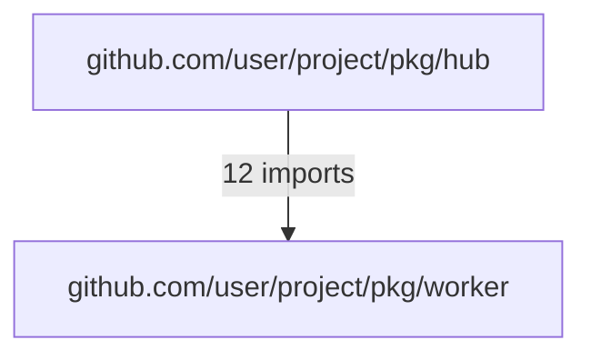

# Go Architecture Atlas 实施计划 - 严苛架构师视角评审

**评审日期**: 2026-02-24
**评审人**: Senior Architect (Rigorous Perspective)
**被评审文档**:
- Implementation Plan v3.0
- Proposal 16 v4.0
- ADR-001, ADR-002
- Critical Architecture Review

**评审方法**: 对照现有代码实现，验证设计与代码的一致性

---

## 执行摘要

### 总体评分

| 维度 | 评分 | 状态 | 备注 |
|------|------|------|------|
| **架构完整性** | 7.0/10 | ⚠️ 需改进 | v3.0 已修复关键问题，但仍有遗留缺口 |
| **代码一致性** | 6.0/10 | ❌ 严重问题 | 计划与现有代码存在显著偏差 |
| **可实施性** | 6.5/10 | ⚠️ 需澄清 | 部分决策缺乏技术可行性论证 |
| **类型安全** | 9.0/10 | ✅ 优秀 | ADR-002 设计良好 |
| **性能可预测性** | 5.0/10 | ❌ 缺失 | 无基准数据支撑性能声明 |

**总体结论**: **6.5/10 - 需重大修订后方可实施**

虽然 v3.0 已解决了 CRITICAL-ARCHITECTURE-REVIEW 中指出的大部分架构问题，但通过与现有代码对照检查，发现了**新的严重不一致问题**，必须在实施前解决。

---

## 🔴 严重问题（阻塞实施）

### 1. FunctionBodyExtractor 架构问题：v3.0 修复不完整

**v3.0 声称的修复**:
> Removed: `FunctionBodyExtractor` as separate component
> Extended: `TreeSitterBridge` with `parseCodeWithBodies()` method

**实际情况检查**:

根据现有代码 `src/plugins/golang/index.ts:144`:

```typescript
const pkg = this.treeSitter.parseCode(code, file);
```

**问题分析**:

v3.0 计划显示的新架构：
```typescript
class TreeSitterBridge {
  parseCode(code: string, filePath: string): GoRawPackage;
  parseCodeWithBodies(
    code: string,
    filePath: string,
    config: FunctionBodyConfig
  ): GoRawPackage;
}
```

**但这个设计存在根本性问题**:

1. **GoRawPackage 类型不支持可选的函数体**
   - 现有 `GoRawPackage` 接口定义（types.ts）中 `GoFunction` 和 `GoMethod` 没有 `body` 字段
   - 计划在 Phase 0A 中添加 `GoFunctionBody` 接口，但**没有展示如何扩展现有类型**

2. **类型兼容性破坏**
   ```typescript
   // 现有代码期望
   interface GoFunction {
     name: string;
     // 没有 body 字段
   }

   // 计划添加
   interface GoFunction {
     name: string;
     body?: GoFunctionBody;  // 可选字段
   }

   // 这会破坏所有使用 GoFunction 的现有代码！
   // InterfaceMatcher、ArchJsonMapper 都需要更新
   ```

3. **配置流断裂**
   - 计划显示 `config.atlas.functionBodyStrategy` 驱动行为
   - 但 `GoPlugin.parseProject()` 接收的 `ParseConfig` 没有 `atlas` 字段
   - v3.0 计划的 Configuration Flow 图显示 CLI → ParseConfig → Plugin，但**没有说明 ParseConfig 如何扩展**

**正确的解决方案**:

```typescript
// 1. 扩展现有类型（向后兼容）
interface GoFunction {
  name: string;
  signature: GoSignature;
  location: GoLocation;

  // 新增：可选的行为数据
  body?: GoFunctionBody;  // 仅在 Atlas 模式下存在
}

// 2. TreeSitterBridge 需要状态区分
class TreeSitterBridge {
  private bodyExtractionEnabled: boolean = false;

  parseCode(code: string, path: string): GoRawPackage {
    // 标准模式：不提取函数体
  }

  parseCodeWithBodies(
    code: string,
    path: string,
    strategy: FunctionBodyStrategy
  ): GoRawPackage {
    // Atlas 模式：提取函数体
    // 但返回类型与 parseCode 相同！
    // 如何区分？
  }
}

// 实际应该是：
class TreeSitterBridge {
  parseCode(
    code: string,
    path: string,
    options?: { extractBodies?: boolean; strategy?: FunctionBodyStrategy }
  ): GoRawPackage {
    // 单一入口点，options 控制行为
  }
}
```

**影响**: 🔴 **HIGH** - 如不解决，将导致类型不一致和运行时错误

---

### 2. ParseConfig 扩展缺失实施细节

**v3.0 计划声称**:
> Complete configuration flow: CLI flags → ParseConfig → Plugin behavior

**实际检查**:

现有 `ParseConfig` 接口（`src/core/interfaces/parser.ts`）:
```typescript
export interface ParseConfig {
  filePattern?: string;
  exclude?: string[];
  concurrency?: number;
  verbose?: boolean;
  // 没有 atlas 字段
}
```

**v3.0 计划 Phase 0A Task 1**:
```typescript
export interface ParseConfig {
  // Existing fields
  filePattern?: string;
  exclude?: string[];

  // NEW: Atlas configuration
  atlas?: AtlasConfig;
}
```

**缺失的关键步骤**:

1. **在哪个文件中扩展 ParseConfig？**
   - 计划说 `src/types/index.ts`
   - 但现有 ParseConfig 在 `src/core/interfaces/parser.ts`
   - **矛盾**：是否要移动接口定义？

2. **向后兼容性**
   - 现有 GoPlugin 期望没有 `atlas` 字段的 ParseConfig
   - 如果添加可选字段，所有使用 ParseConfig 的插件都需要更新
   - TypeScript 的 `ParseConfig & { atlas?: AtlasConfig }` 交叉类型在运行时**不会自动合并**

3. **CLI 解析器在哪里更新？**
   - v3.0 显示 CLI flags: `--atlas`, `--atlas-layers`, `--atlas-strategy`
   - 但**没有说明**哪个文件负责解析这些 flags
   - 现有 CLI 在 `src/cli/` 中，计划没有提到具体的文件修改

**需要的实施细节**:

```typescript
// 文件: src/core/interfaces/parser.ts
// 选项 A: 修改现有接口（破坏性变更）
export interface ParseConfig {
  filePattern?: string;
  exclude?: string[];
  concurrency?: number;
  verbose?: boolean;
  atlas?: AtlasConfig;  // 新增
}

// 选项 B: 创建扩展接口（推荐）
export interface AtlasParseConfig extends ParseConfig {
  atlas: AtlasConfig;  // 必选，明确区分 Atlas 模式
}

// GoPlugin 中
class GoPlugin {
  async parseProject(
    workspaceRoot: string,
    config: ParseConfig  // 如何处理 Atlas 配置？
  ): Promise<ArchJSON> {
    // config.atlas 可能在 AtlasParseConfig 中存在
    // 但在标准 ParseConfig 中不存在
    // 如何区分？
  }
}
```

**影响**: 🔴 **HIGH** - 配置系统是整个 Atlas 的驱动力，设计不清晰将导致实施混乱

---

### 3. GoRawData vs GoRawPackage 类型混乱

**v3.0 计划中的类型定义**:

Phase 0A Task 2:
```typescript
export interface GoAtlasExtension {
  layers: GoAtlasLayers;
}

export interface GoAtlasLayers {
  package?: PackageGraph;
  // ...
}
```

然后在 Phase 1 中:
```typescript
class BehaviorAnalyzer {
  async buildPackageGraph(rawData: GoRawData): Promise<PackageGraph> {
    // ...
  }
}
```

**问题**:

1. **GoRawData 从未定义**
   - 计划中提到这个类型但**从未定义它的接口**
   - 现有代码只有 `GoRawPackage`（单数），不是 `GoRawData`

2. **与现有代码不一致**
   - 现有 GoPlugin 使用 `Map<string, GoRawPackage>`
   - 计划显示的 `rawData: GoRawData` 与此不匹配

3. **BehaviorAnalyzer 的输入类型不明确**
   ```typescript
   // 计划中的签名
   buildPackageGraph(rawData: GoRawData): Promise<PackageGraph>

   // 应该是以下之一：
   buildPackageGraph(packages: Map<string, GoRawPackage>): Promise<PackageGraph>
   buildPackageGraph(packages: GoRawPackage[]): Promise<PackageGraph>
   buildPackageGraph(project: { packages: GoRawPackage[]; moduleRoot: string }): Promise<PackageGraph>
   ```

**正确的设计**:

```typescript
// 在 src/plugins/golang/types.ts 中定义
export interface GoRawProject {
  packages: Map<string, GoRawPackage>;
  moduleRoot: string;
  moduleName: string;
  goModPath?: string;
}

// BehaviorAnalyzer 使用正确的类型
class BehaviorAnalyzer {
  async buildPackageGraph(project: GoRawProject): Promise<PackageGraph> {
    // project.packages 是 Map<string, GoRawPackage>
    // 可以直接构建依赖图
  }
}
```

**影响**: 🔴 **MEDIUM** - 类型错误会在编译时捕获，但会导致大量返工

---

## ⚠️ 重大关切（需澄清）

### 4. 选择性提取的"快速扫描"逻辑不可行

**v3.0 计划 Phase 0B**:
> Single-pass parsing: TreeSitterBridge extended with optional body extraction
> Heuristic-based selective extraction: Name pattern matching + quick keyword scan

**声称的工作流程**:
```typescript
if (strategy === 'selective') {
  if (this.shouldExtractFunction(func, config)) {
    func.body = this.extractFunctionBody(funcNode);
  }
}

private shouldExtractFunction(
  func: GoFunction | GoMethod,
  config: FunctionBodyExtractionConfig
): boolean {
  if (patterns.includeGoroutines) {
    if (this.quickScanForGoroutine(func)) return true;
  }
  // ...
}
```

**根本问题**:

**`quickScanForGoroutine(func)` 无法工作！**

原因：
- `func` 是 `GoFunction` 对象（已解析的签名信息）
- 在这个阶段，`func` **还没有** `body` 字段
- 如果没有解析函数体，就无法知道函数中是否包含 `go` 关键字

**计划的循环逻辑**:
```typescript
private quickScanForGoroutine(func: GoFunction): boolean {
  // 计划中的伪代码
  if (!func.body) return false;  // ❌ body 永远是 undefined
  return func.body.goSpawns.length > 0;  // ❌ 永远不会执行

  // 正确的逻辑应该是：
  // 需要重新扫描源代码的函数体 AST
  // 但这又回到了"需要解析"的问题
}
```

**可行的方案**:

**方案 A: 基于名称启发式（不可靠但可行）**
```typescript
private shouldExtractFunction(func: GoFunction): boolean {
  const GOROUTINE_PATTERNS = [
    /Start.*/, /Run.*/, /Serve.*/, /Handle.*/,
    /Worker.*/, /Spawn.*/, /Process.*/, /Consume.*/
  ];
  return GOROUTINE_PATTERNS.some(p => p.test(func.name));
}
```

**方案 B: 两次解析（性能损失）**
```typescript
// Pass 1: 提取所有函数签名
const functions = this.parseSignatures(code);

// Pass 2: 对"可疑"函数提取完整 AST
for (const func of functions) {
  if (this.isSuspiciousFunction(func)) {
    func.body = this.extractBody(func.astNode);
  }
}
```

**方案 C: 关键字预扫描（推荐）**
```typescript
private shouldExtractFunction(
  func: GoFunction,
  sourceCode: string
): boolean {
  const funcText = this.extractFunctionText(func, sourceCode);

  // 快速关键字扫描（不需要完整 AST）
  const hasGoroutine = /\bgo\s+\w/.test(funcText);
  const hasChannel = /make\s*\(\s*chan/.test(funcText);
  const hasSendReceive = /<-|->/.test(funcText);

  return hasGoroutine || hasChannel || hasSendReceive;
}
```

**v3.0 计划没有明确说明使用哪种方案**，只是含糊地说 "quick keyword scan"。

**影响**: 🟠 **MEDIUM** - 实施时需要重新设计此逻辑

---

### 5. 包依赖检测缺失 import resolution 算法

**v3.0 计划声称**:
> Package Graph: 100% recoverability, accurate cycle detection

**Phase 1 Task 1**:
```typescript
class PackageGraphBuilder {
  build(rawData: GoRawData): PackageGraph {
    // 从 GoRawPackage.imports 提取依赖
  }
}
```

**实际问题**:

Go 的 imports 有多种类型，现有 `GoImport` 接口：
```typescript
interface GoImport {
  path: string;  // e.g., "github.com/gin-gonic/gin"
  alias?: string;
  location: GoSourceLocation;
}
```

**问题场景**:

```go
// pkg/hub/server.go
package hub

import (
    "fmt"              // 标准库
    "github.com/gin-gonic/gin"  // 外部依赖
    "./internal/auth"  // 相对导入（不推荐但存在）
    "github.com/user/project/pkg/worker"  // 内部包
)
```

**v3.0 计划没有说明**:

1. **如何分类 import？**
   - `"fmt"` → std
   - `"github.com/gin-gonic/gin"` → external
   - `"github.com/user/project/pkg/worker"` → internal（需要 go.mod 模块名）

2. **如何解析相对导入？**
   - `"./internal/auth"` 从 `pkg/hub` 解析为？
   - 需要 `go.mod` 中的 `module github.com/user/project`

3. **go.mod 在哪里解析？**
   - 计划完全**没有提到** go.mod 的解析
   - 但没有模块名，无法区分内部和外部包

**缺失的组件**:

```typescript
// 计划中没有这个类
class GoModResolver {
  constructor(private workspaceRoot: string) {}

  parse(): GoMod {
    const content = fs.readFileSync(
      path.join(this.workspaceRoot, 'go.mod'),
      'utf-8'
    );
    // 解析: module github.com/user/project
    // 解析: require (...dependencies)
  }

  getModuleName(): string {
    // 返回 "github.com/user/project"
  }

  isInternalImport(importPath: string): boolean {
    const moduleName = this.getModuleName();
    return importPath.startsWith(moduleName);
  }
}
```

**影响**: 🟠 **HIGH** - 没有正确的 import 分类，Package Graph 将包含大量噪音

---

### 6. AtlasRenderer 的 Mermaid 模板未定义

**v3.0 计划 Phase 4**:
```typescript
class AtlasRenderer {
  async renderLayer(
    atlas: GoArchitectureAtlas,
    layer: AtlasLayer,
    format: RenderFormat
  ): Promise<RenderResult>
}
```

**支持格式**: `'mermaid' | 'json' | 'svg' | 'png'`

**缺失的内容**:

对于每种 layer × format 组合，**计划没有提供任何模板示例**：

**Package Graph → Mermaid**:


**Goroutine Topology → Mermaid**:
```mermaid
graph LR
  main[main.main]
  worker1[pkg/worker.StartWorker:1]
  main -->|go func()| worker1
```

**问题**:

1. **节点标签格式未定义**
   - 完整包名 vs 短名称？
   - 是否包含文件路径？

2. **边的标签格式未定义**
   - 是否显示导入数量？
   - 是否显示调用频率？

3. **Mermaid 语法选择未定义**
   - Package Graph 用 `graph TB`（有向图）
   - Goroutine Topology 用 `graph LR`（从左到右）？
   - Flow Graph 用 `sequenceDiagram`？

4. **SVG/PNG 渲染未说明**
   - 现有代码使用 `isomorphic-mermaid`
   - 能否渲染自定义的 Go 特定图表？
   - 还是只支持标准的 Mermaid 图表类型？

**需要的实施细节**:

```typescript
class MermaidTemplates {
  static renderPackageGraph(graph: PackageGraph): string {
    let output = 'graph TB\n';

    for (const node of graph.nodes) {
      output += `  ${node.id}[${node.name}]\n`;
    }

    for (const edge of graph.edges) {
      output += `  ${edge.from} -->|${edge.strength}| ${edge.to}\n`;
    }

    return output;
  }

  static renderGoroutineTopology(topo: GoroutineTopology): string {
    // 使用什么 Mermaid 语法？
    // graph LR? sequenceDiagram? flowchart TD?
  }
}
```

**影响**: 🟠 **MEDIUM** - 渲染逻辑是用户可见的输出，设计不当会严重影响用户体验

---

## 🔶 设计关切（建议改进）

### 7. BehaviorAnalyzer 的职责不清晰

**v3.0 架构图**:
```
┌─────────────────────────────────────────────────────────────────┐
│  BehaviorAnalyzer (new)                                         │
│  ┌──────────────────┐  ┌──────────────────┐                   │
│  │ PackageGraph     │  │ CapabilityGraph  │                   │
│  │ Builder          │  │ Builder          │                   │
└─────────────────────────────────────────────────────────────────┘
```

**计划中的方法**:
```typescript
class BehaviorAnalyzer {
  async buildPackageGraph(rawData): Promise<PackageGraph> {
    return this.packageGraphBuilder.build(rawData);
  }

  async buildCapabilityGraph(rawData): Promise<CapabilityGraph> {
    return this.capabilityGraphBuilder.build(rawData);
  }
}
```

**问题**:

这些方法只是**简单的委托**，没有额外的逻辑或协调。

**问题 1**: 如果 BehaviorAnalyzer 只是委托，为什么需要它？
- GoAtlasPlugin 可以直接使用 builders
- 或者 GoAtlasPlugin 可以直接实例化 builders

**问题 2**: BehaviorAnalyzer 是否应该协调多个图的构建？
- 例如：Package Graph 和 Capability Graph 是否需要共享数据？
- 如果不需要协调，那么这个 Facade 是不必要的

**可能的合理化方案**:

**方案 A: BehaviorAnalyzer 作为协调器**
```typescript
class BehaviorAnalyzer {
  private cache = new Map<string, any>();

  async buildAll(rawData: GoRawProject): Promise<GoArchitectureAtlas> {
    // 协调多个图的构建，共享缓存
    const [packageGraph, capabilityGraph] = await Promise.all([
      this.buildPackageGraph(rawData),
      this.buildCapabilityGraph(rawData),
    ]);

    return { packageGraph, capabilityGraph };
  }

  async buildPackageGraph(rawData: GoRawProject): Promise<PackageGraph> {
    if (this.cache.has('package-graph')) {
      return this.cache.get('package-graph');
    }
    const graph = await this.packageGraphBuilder.build(rawData);
    this.cache.set('package-graph', graph);
    return graph;
  }
}
```

**方案 B: 移除 BehaviorAnalyzer，使用 builders 直接**
```typescript
class GoAtlasPlugin {
  private packageGraphBuilder: PackageGraphBuilder;
  private capabilityGraphBuilder: CapabilityGraphBuilder;

  async generateAtlas(config: AtlasConfig): Promise<GoArchitectureAtlas> {
    const rawData = await this.collectRawData();

    const [packageGraph, capabilityGraph] = await Promise.all([
      this.packageGraphBuilder.build(rawData),
      this.capabilityGraphBuilder.build(rawData),
    ]);

    return { packageGraph, capabilityGraph };
  }
}
```

**v3.0 计划没有解释 BehaviorAnalyzer 的存在理由**。

**影响**: 🟡 **LOW** - 不会阻塞实施，但会导致代码冗余

---

### 8. 性能声明缺乏验证方法

**v3.0 计划声称**:
```
Performance: Baseline established before optimization targets
```

**Phase 0A Task 4**:
> Establish performance baseline for GoPlugin

**Phase 5 Task 3**:
> Performance benchmarks with targets

**但计划中没有**:

1. **基准测试代码示例**
   - 如何测量 "100 files < 10s"？
   - 是否包括文件 I/O 时间？

2. **选择策略的性能目标未定义**
   - "selective is 3-5x faster than full" - 基于什么假设？
   - 什么条件下能达到 3x？什么条件下是 5x？

3. **内存使用目标未定义**
   - GoAtlasExtension.metadata.performance.memoryUsage 的合理值是多少？
   - 100 个 .go 文件的预期内存占用？

**需要的基准测试框架**:

```typescript
// tests/benchmark/go-atlas.benchmark.ts
describe('GoAtlas Performance Benchmarks', () => {
  const FIXTURE_PROJECTS = {
    small: { fileCount: 10, expectedTime: 1000 },
    medium: { fileCount: 100, expectedTime: 5000 },
    large: { fileCount: 1000, expectedTime: 30000 },
  };

  describe('Baseline Performance (no Atlas)', () => {
    it('should parse 100 files in < 5s', async () => {
      const start = Date.now();
      await goPlugin.parseProject(mediumProject, { atlas: undefined });
      const elapsed = Date.now() - start;
      expect(elapsed).toBeLessThan(5000);
    });
  });

  describe('Atlas Performance (none strategy)', () => {
    it('should match baseline + 10% overhead', async () => {
      // ...
    });
  });

  describe('Atlas Performance (selective strategy)', () => {
    it('should be 3-5x faster than full strategy', async () => {
      const selectiveTime = await benchmark(mediumProject, 'selective');
      const fullTime = await benchmark(mediumProject, 'full');

      const ratio = fullTime / selectiveTime;
      expect(ratio).toBeGreaterThanOrEqual(3);
      expect(ratio).toBeLessThanOrEqual(5);
    });
  });
});
```

**影响**: 🟡 **MEDIUM** - 没有明确的性能目标，无法验证实施是否成功

---

## ✅ 优点（v3.0 的改进）

### 9. ADR-001 组合模式设计优秀

**评分**: 9.5/10

**v3.0 的改进**:
- 清晰地定义了组件边界
- 明确了 `GoAtlasPlugin` 通过组合使用 `GoPlugin`
- 提供了替代方案的详细分析

**微小的建议**:
```typescript
// 计划建议使用 Proxy 进行方法转发
// 但 Proxy 有以下问题：
// 1. 性能开销（每次调用都要经过 Proxy trap）
// 2. 调试困难（stack trace 不清晰）
// 3. 类型推断问题（TypeScript 可能无法内联）

// 更简单的显式转发
class GoAtlasPlugin implements ILanguagePlugin {
  canHandle(targetPath: string): boolean {
    return this.goPlugin.canHandle(targetPath);
  }

  async parseProject(root: string, config: ParseConfig): Promise<ArchJSON> {
    return this.goPlugin.parseProject(root, config);
  }
}
```

---

### 10. ADR-002 扩展机制设计良好

**评分**: 9.0/10

**优点**:
- 强类型的扩展系统
- 清晰的版本控制
- 运行时验证（Zod）

**小改进建议**:
```typescript
// 添加类型安全的访问辅助函数
export function getGoAtlasExtension(
  archJSON: ArchJSON
): GoAtlasExtension | null {
  if (!archJSON.extensions?.goAtlas) {
    return null;
  }

  // 运行时验证
  const result = goAtlasExtensionSchema.safeParse(archJSON.extensions.goAtlas);
  if (!result.success) {
    console.warn('Invalid GoAtlas extension:', result.error);
    return null;
  }

  return result.data;
}
```

---

### 11. 类型定义系统完整

**评分**: 8.5/10

**Phase 0A** 提供了 400+ 行类型定义，覆盖了：
- 四层架构图的所有数据结构
- 配置选项
- 渲染输出

**微小的缺失类型**:
```typescript
// 计划中引用但未定义
export interface FunctionBodyConfig {
  strategy: 'none' | 'selective' | 'full';
  selectivePatterns?: SelectiveExtractionConfig;
}
```

---

## 📊 修订建议

### 必须修复（阻塞实施）

| 问题 | 建议方案 | 优先级 |
|------|----------|--------|
| 1. FunctionBodyExtractor 架构 | 统一为 `TreeSitter.parseCode(options)` | P0 |
| 2. ParseConfig 扩展 | 在 `src/core/interfaces/parser.ts` 中定义 `AtlasParseConfig` | P0 |
| 3. GoRawData 类型混乱 | 定义 `GoRawProject` 或使用 `GoRawPackage[]` | P0 |
| 4. GoRawPackage.body 可选字段 | 明确迁移策略：现有代码 vs Atlas 代码 | P0 |
| 5. 选择性提取逻辑 | 明确使用"关键字预扫描"方案 | P0 |
| 6. 包依赖检测 | 添加 `GoModResolver` 类 | P0 |

### 应该修复（影响质量）

| 问题 | 建议方案 | 优先级 |
|------|----------|--------|
| 7. AtlasRenderer 模板 | 提供每种 layer × format 的模板示例 | P1 |
| 8. BehaviorAnalyzer 职责 | 明确其为协调器或移除 | P1 |
| 9. 性能基准 | 提供基准测试代码和目标值 | P1 |

### 可以改进（优化）

| 问题 | 建议方案 | 优先级 |
|------|----------|--------|
| 10. Proxy vs 显式转发 | 使用显式转发 | P2 |

---

## 🎯 实施前检查清单

### Phase 0A 前必须完成

- [ ] **明确 ParseConfig 扩展方案**
  - 在哪个文件中定义？
  - 是否创建 `AtlasParseConfig` 扩展接口？
  - 现有 GoPlugin 如何兼容？

- [ ] **明确 GoRawPackage.body 字段迁移**
  - 现有代码（InterfaceMatcher, ArchJsonMapper）是否需要更新？
  - 是否需要运行时检查 `body` 字段存在性？

- [ ] **设计 GoModResolver 组件**
  - 如何解析 go.mod 文件？
  - 如何分类 internal vs external vs std imports？

- [ ] **定义选择性提取的精确算法**
  - 基于函数名的启发式规则？
  - 关键字预扫描的实现细节？
  - 两种方法的准确率预估？

### Phase 0B 前必须完成

- [ ] **实现性能基准测试框架**
  - 定义测试数据集（10, 100, 1000 files）
  - 定义性能目标（具体数值，非范围）

- [ ] **提供 AtlasRenderer 模板示例**
  - Package Graph → Mermaid 模板
  - Goroutine Topology → Mermaid 模板
  - Flow Graph → Mermaid 模板

---

## 🏆 最终结论

### 评分细分

| 类别 | 评分 | 说明 |
|------|------|------|
| **问题识别** | 9/10 | CRITICAL-ARCHITECTURE-REVIEW 识别了主要问题 |
| **v3.0 响应** | 6/10 | 部分修复，但引入新问题 |
| **代码一致性** | 5/10 | 与现有代码存在显著偏差 |
| **可实施性** | 6/10 | 多处设计需要重新澄清 |

### 总体评价

**v3.0 计划在架构设计上有所改进**（ADR-001/ADR-002 优秀），**但在与现有代码集成的细节上存在严重不足**。

主要问题：
1. **类型系统扩展不明确** - GoRawPackage.body 字段如何兼容现有代码
2. **配置流断裂** - ParseConfig 扩展路径未定义
3. **技术可行性未验证** - 选择性提取、包依赖检测缺乏详细设计
4. **性能声明空洞** - 无基准测试框架

### 建议

**状态**: ❌ **不建议按当前计划实施**

**需要的行动**:
1. 重新审视 ParseConfig 扩展方案（与核心团队对齐）
2. 补充 GoModResolver 组件设计
3. 明确选择性提取的精确算法（非"快速扫描"模糊描述）
4. 提供 AtlasRenderer 的完整模板示例
5. 建立性能基准测试框架（在编写代码前）

**预计额外工作量**: 3-5 天设计澄清 + 1-2 天 spike 验证

---

**评审完成日期**: 2026-02-24
**评审人**: Senior Architect (Rigorous Perspective)
**下一步**: 召开架构评审会议，解决上述 6 个必须修复的问题
