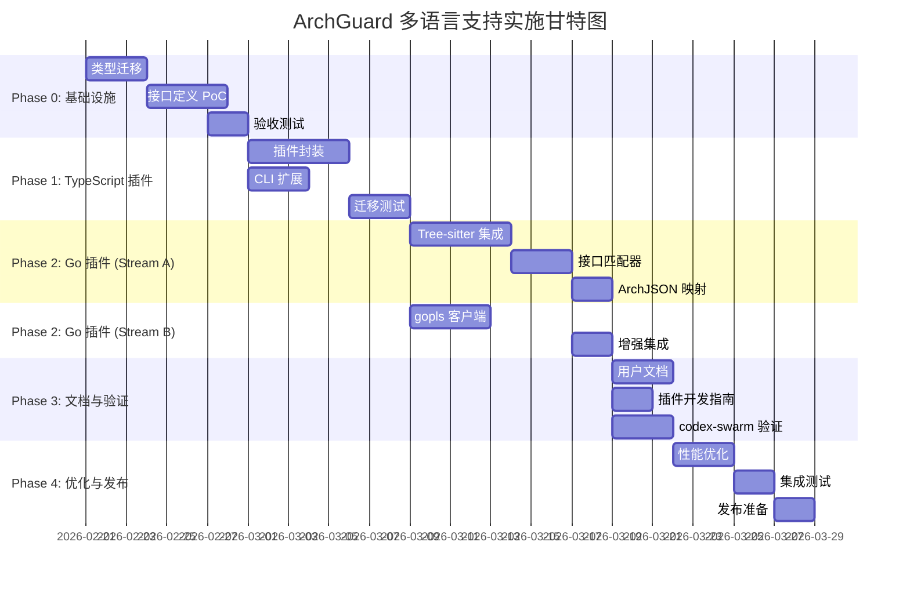

# ArchGuard 多语言支持实施计划

**版本**: 1.1
**创建日期**: 2026-02-20
**最后修改**: 2026-02-20
**关联文档**:
- `proposals/03-multi-language-support.md` (v2.2)
- `proposals/15-golang-support-proposal.md` (v3.2)

---

## 版本历史

**v1.1 变更 (2026-02-20)**:
- 修复 T2.B.3 循环依赖：从依赖 T2.A.3 改为 T2.A.5
- 更新 T2.B.3 验收标准：明确 gopls 初始化时机
- 同步 Proposal 03 v2.2 和 Proposal 15 v3.2 的变更
- 标准化测试覆盖率目标：统一使用 80% 作为基准（之前混用 75%/80%/85%）

---

## 执行摘要

本计划基于 Proposal 03 (多语言支持) 和 Proposal 15 (Go 语言支持) 制定，采用**多工作流并行**策略，优化 Agent 并发执行效率。

**关键指标**:
- 总工期：**8-10 周**
- 并行工作流：**4 个主流程**
- 关键路径：Phase 0 → Phase 1 → Phase 2 (Go) → Phase 4
- 估算加速比：**2.5x**（相比串行执行 18-20 周）

---

## 并行工作流设计



---

## Phase 0: 基础设施搭建 (Week 1-2)

**目标**: 完成类型迁移和插件接口定义，为后续开发奠定基础

### 工作流 0.1: 类型系统迁移

**负责 Agent**: `type-migration-agent`
**优先级**: P0 (阻塞所有后续工作)
**工期**: 3 天

**任务清单**:

```yaml
- id: T0.1.1
  name: 扩展 ArchJSON 类型定义
  description: |
    修改 src/types/index.ts，扩展以下类型：
    - SupportedLanguage: 'typescript' | 'go' | 'java' | 'python' | 'rust'
    - EntityType: 增加 'struct', 'trait', 'function'
    - MemberType: 增加 'field'
    - RelationType: 增加 'association'
    - Decorator.arguments: 改为 string[] | Record<string, unknown>
  acceptance:
    - TypeScript 编译通过
    - 所有现有测试通过 (370+ tests)
  files:
    - src/types/index.ts
  effort: 4h

- id: T0.1.2
  name: 编写类型迁移测试
  description: |
    创建 tests/types/migration.test.ts，验证：
    - 新语言类型被接受
    - 向后兼容 typescript 字面量
    - field MemberType 可用
    - struct EntityType 可用
  acceptance:
    - 测试覆盖所有新增类型
    - 测试通过率 100%
  files:
    - tests/types/migration.test.ts
  effort: 3h
  depends_on: [T0.1.1]

- id: T0.1.3
  name: 更新现有代码中的类型引用
  description: |
    确保所有使用 ArchJSON 的代码适配新类型定义
    （大部分应自动兼容，检查 Parser、Extractor、Mermaid 生成器）
  acceptance:
    - npm run type-check 通过
    - npm test 通过
  files:
    - src/parser/**/*.ts
    - src/mermaid/**/*.ts
  effort: 2h
  depends_on: [T0.1.1]
```

**并行提示**: 此流程阻塞所有其他工作流，必须优先完成。

---

### 工作流 0.2: 插件接口定义与 PoC

**负责 Agent**: `plugin-arch-agent`
**优先级**: P0
**工期**: 4 天

**任务清单**:

```yaml
- id: T0.2.1
  name: 创建核心接口定义
  description: |
    创建 src/core/interfaces/ 目录，定义：
    - IParser (parser.ts)
    - IDependencyExtractor (dependency.ts)
    - IValidator (validation.ts)
    - ILanguagePlugin (language-plugin.ts)
    - Dependency, ValidationResult 类型
  acceptance:
    - 所有接口定义完整
    - TypeScript 类型检查通过
    - 接口文档完善（JSDoc）
  files:
    - src/core/interfaces/parser.ts
    - src/core/interfaces/dependency.ts
    - src/core/interfaces/validation.ts
    - src/core/interfaces/language-plugin.ts
    - src/core/interfaces/index.ts
  effort: 6h
  depends_on: [T0.1.1]

- id: T0.2.2
  name: 实现 PluginRegistry
  description: |
    创建 src/core/plugin-registry.ts，实现：
    - 插件注册与版本管理
    - 文件扩展名映射
    - 目录语言检测
    - ESM 动态加载
  acceptance:
    - 支持插件注册、查询、版本管理
    - 单元测试覆盖率 > 80%  # 标准基准
  files:
    - src/core/plugin-registry.ts
    - tests/core/plugin-registry.test.ts
  effort: 8h
  depends_on: [T0.2.1]

- id: T0.2.3
  name: 创建 Mock 插件验证 PoC
  description: |
    创建 tests/fixtures/mock-plugin/ 用于验证：
    - 插件能被正确注册
    - getPluginForFile 返回正确插件
    - detectPluginForDirectory 工作正常
    - 版本冲突检测有效
  acceptance:
    - Mock 插件测试全部通过
    - PluginRegistry 集成测试通过
    - 测试覆盖率 > 80%
  files:
    - tests/fixtures/mock-plugin/index.ts
    - tests/core/plugin-registry.integration.test.ts
  effort: 4h
  depends_on: [T0.2.2]
```

**并行提示**: T0.2.1 可与 T0.1.2, T0.1.3 并行执行（不依赖类型迁移完成）。

---

### Phase 0 验收检查点

**Checkpoint P0**: 基础设施就绪

- [ ] 所有现有测试通过（370+ tests）
- [ ] 新增类型迁移测试通过
- [ ] PluginRegistry 单元测试通过（覆盖率 > 80%）
- [ ] Mock 插件集成测试通过
- [ ] 性能回归 < 2%
- [ ] 文档更新（CHANGELOG, README）

**决策点**: 如未通过，修复后方可进入 Phase 1。

---

## Phase 1: TypeScript 插件迁移 (Week 3-5)

**目标**: 将现有 TypeScript 解析器封装为插件，验证架构可行性

### 工作流 1.1: TypeScript 插件实现

**负责 Agent**: `ts-plugin-agent`
**优先级**: P1
**工期**: 5 天

**任务清单**:

```yaml
- id: T1.1.1
  name: 创建 TypeScriptPlugin 骨架
  description: |
    创建 plugins/typescript/index.ts，实现：
    - ILanguagePlugin 接口
    - metadata 定义
    - initialize/dispose 生命周期
    - canHandle 文件/目录检测
  acceptance:
    - TypeScript 编译通过
    - 插件能被 PluginRegistry 加载
  files:
    - plugins/typescript/index.ts
    - plugins/typescript/package.json (如需独立发布)
  effort: 4h
  depends_on: [T0.2.3]

- id: T1.1.2
  name: 封装现有 TypeScriptParser
  description: |
    实现 parseProject, parseCode, parseFiles 方法，
    复用现有 TypeScriptParser 和 ParallelParser：
    - parseCode -> TypeScriptParser.parseCode
    - parseProject -> TypeScriptParser.parseProject
    - parseFiles -> ParallelParser.parseFiles
  acceptance:
    - 所有解析方法工作正常
    - 输出 ArchJSON 格式正确
  files:
    - plugins/typescript/index.ts
  effort: 6h
  depends_on: [T1.1.1]

- id: T1.1.3
  name: 实现 DependencyExtractor
  description: |
    实现 extractDependencies 方法：
    - 解析 package.json
    - 提取 dependencies, devDependencies, peerDependencies
    - 返回 Dependency[] 格式
  acceptance:
    - 能正确提取依赖
    - 单元测试覆盖率 > 80%
  files:
    - plugins/typescript/index.ts
    - tests/plugins/typescript/dependency.test.ts
  effort: 3h
  depends_on: [T1.1.1]

- id: T1.1.4
  name: 实现 Validator
  description: |
    实现 validate 方法：
    - 验证 ArchJSON 必需字段
    - 验证实体引用完整性
    - 生成 ValidationResult
  acceptance:
    - 验证器能检测缺失字段
    - 验证器能检测悬空引用
    - 单元测试覆盖率 > 80%
  files:
    - plugins/typescript/index.ts
    - tests/plugins/typescript/validator.test.ts
  effort: 4h
  depends_on: [T1.1.1]

- id: T1.1.5
  name: TypeScript 插件集成测试
  description: |
    创建完整的插件测试套件：
    - 测试所有公开方法
    - 测试错误处理
    - 测试与 PluginRegistry 集成
  acceptance:
    - 插件测试覆盖率 > 80%  # 标准基准
    - 所有测试通过
  files:
    - tests/plugins/typescript/index.test.ts
  effort: 6h
  depends_on: [T1.1.2, T1.1.3, T1.1.4]
```

---

### 工作流 1.2: CLI 扩展与集成

**负责 Agent**: `cli-integration-agent`
**优先级**: P1
**工期**: 3 天

**任务清单**:

```yaml
- id: T1.2.1
  name: 扩展 analyze 命令添加 --lang 参数
  description: |
    修改 src/cli/commands/analyze.ts：
    - 添加 --lang <language> 选项
    - 实现语言自动检测逻辑
    - 集成 PluginRegistry
  acceptance:
    - CLI 接受 --lang 参数
    - 自动检测工作正常
    - 帮助文档更新
  files:
    - src/cli/commands/analyze.ts
  effort: 4h
  depends_on: [T1.1.1]

- id: T1.2.2
  name: 修改 DiagramProcessor 使用插件
  description: |
    修改 src/cli/processors/diagram-processor.ts：
    - 从 PluginRegistry 获取 parser
    - 替换硬编码的 TypeScriptParser
    - 保持向后兼容
  acceptance:
    - 现有功能不受影响
    - 能使用插件系统解析
  files:
    - src/cli/processors/diagram-processor.ts
  effort: 5h
  depends_on: [T1.2.1, T1.1.2]

- id: T1.2.3
  name: CLI 集成测试
  description: |
    创建 CLI 端到端测试：
    - 测试 --lang typescript
    - 测试自动检测
    - 测试错误处理
  acceptance:
    - E2E 测试通过
    - 现有 CLI 测试仍然通过
  files:
    - tests/integration/cli/analyze-multilang.test.ts
  effort: 4h
  depends_on: [T1.2.2]
```

**并行提示**: T1.2.1 可与 T1.1.3, T1.1.4 并行执行。

---

### 工作流 1.3: 迁移验证与文档

**负责 Agent**: `migration-validation-agent`
**优先级**: P1
**工期**: 3 天

**任务清单**:

```yaml
- id: T1.3.1
  name: 回归测试验证
  description: |
    确保所有现有测试在新架构下通过：
    - 运行完整测试套件
    - 修复破坏的测试（如有）
    - 验证输出一致性
  acceptance:
    - 370+ 测试全部通过
    - 输出与迁移前一致
  effort: 8h
  depends_on: [T1.2.2, T1.1.5]

- id: T1.3.2
  name: 性能基准测试
  description: |
    对比迁移前后性能：
    - 解析速度
    - 内存占用
    - 并发处理能力
  acceptance:
    - 性能回归 < 5%
    - 基准测试报告生成
  files:
    - tests/benchmarks/plugin-vs-legacy.bench.ts
  effort: 4h
  depends_on: [T1.3.1]

- id: T1.3.3
  name: 更新用户文档
  description: |
    更新 CLAUDE.md, README.md：
    - 添加 --lang 参数说明
    - 更新架构图
    - 添加迁移说明
  acceptance:
    - 文档准确反映新功能
    - 示例代码可运行
  files:
    - CLAUDE.md
    - README.md
    - docs/architecture.md
  effort: 3h
  depends_on: [T1.3.1]
```

---

### Phase 1 验收检查点

**Checkpoint P1**: TypeScript 插件就绪

- [ ] TypeScript 插件所有测试通过（覆盖率 > 80%）
- [ ] CLI `--lang` 参数工作正常
- [ ] 所有现有测试通过（370+）
- [ ] 性能回归 < 5%
- [ ] 文档更新完成
- [ ] 自测通过：`npm run build && node dist/cli/index.js analyze -v`

**决策点**: 如未通过，修复后方可进入 Phase 2。

---

## Phase 2: Go 语言支持 (Week 6-10)

**目标**: 实现完整的 Go 语言插件，验证多语言架构

### 并行策略

Phase 2 采用 **2 个并行工作流**：
- **Stream A**: Tree-sitter 语法解析（核心路径）
- **Stream B**: gopls 语义分析（可选增强）

两个流在 **T2.A.3 完成后汇合**。

---

### 工作流 2.A: Tree-sitter 核心解析

**负责 Agent**: `go-treesitter-agent`
**优先级**: P0 (关键路径)
**工期**: 10 天

**任务清单**:

```yaml
- id: T2.A.1
  name: Tree-sitter Go 集成
  description: |
    创建 plugins/golang/tree-sitter-bridge.ts：
    - 集成 tree-sitter 和 tree-sitter-go
    - 实现 parseCode, parseFile, parseFiles
    - 提取 struct, interface, function, method
  acceptance:
    - 能解析 Go 代码为 AST
    - 单元测试覆盖率 > 80%
  files:
    - plugins/golang/tree-sitter-bridge.ts
    - plugins/golang/types.ts
    - tests/plugins/golang/tree-sitter.test.ts
  effort: 16h
  depends_on: [T1.3.1]

- id: T2.A.2
  name: GoRawData 聚合器
  description: |
    实现包级别数据聚合：
    - 组织文件到 GoRawPackage
    - 解析 go.mod 获取模块信息
    - 构建 GoRawData 结构
  acceptance:
    - 能将多文件聚合为包结构
    - 模块信息提取正确
  files:
    - plugins/golang/tree-sitter-bridge.ts
    - tests/plugins/golang/aggregator.test.ts
  effort: 8h
  depends_on: [T2.A.1]

- id: T2.A.3
  name: 接口匹配器实现
  description: |
    创建 plugins/golang/interface-matcher.ts：
    - 实现 buildMethodSet (值/指针方法集)
    - 实现 resolveEmbeddedMethods (方法提升)
    - 实现 checkImplementation (签名匹配)
    - 处理边界情况（循环嵌入、冲突方法）
  acceptance:
    - 隐式接口检测准确率 > 75% (无 gopls)
    - 嵌入方法提升准确率 > 95%
    - 单元测试覆盖率 > 80%  # 标准基准
  files:
    - plugins/golang/interface-matcher.ts
    - tests/plugins/golang/interface-matcher.test.ts
  effort: 12h
  depends_on: [T2.A.2]

- id: T2.A.4
  name: ArchJSON 映射器
  description: |
    创建 plugins/golang/arch-json-mapper.ts：
    - 映射 struct -> Entity
    - 映射 interface -> Entity
    - 映射 embedded -> Relation (composition)
    - 映射 InferredImplementation -> Relation
  acceptance:
    - 映射正确性 > 95%
    - 使用 source/target 字段
    - 单元测试覆盖率 > 80%
  files:
    - plugins/golang/arch-json-mapper.ts
    - tests/plugins/golang/mapper.test.ts
  effort: 8h
  depends_on: [T2.A.3]

- id: T2.A.5
  name: GoPlugin 主类实现
  description: |
    创建 plugins/golang/index.ts：
    - 实现 ILanguagePlugin 接口
    - 整合 TreeSitterBridge, InterfaceMatcher, Mapper
    - 实现 parseProject, parseCode
    - 实现文件发现逻辑
  acceptance:
    - 插件能被 PluginRegistry 加载
    - 能解析简单 Go 项目
  files:
    - plugins/golang/index.ts
    - tests/plugins/golang/index.test.ts
  effort: 10h
  depends_on: [T2.A.4]
```

---

### 工作流 2.B: gopls 语义分析（并行）

**负责 Agent**: `go-gopls-agent`
**优先级**: P2
**工期**: 6 天

**任务清单**:

```yaml
- id: T2.B.1
  name: GoplsClient 基础实现
  description: |
    创建 plugins/golang/gopls-client.ts：
    - 启动 gopls 进程
    - 建立 LSP 连接（vscode-jsonrpc）
    - 实现 initialize/shutdown
  acceptance:
    - 能成功启动和关闭 gopls
    - LSP 握手成功
  files:
    - plugins/golang/gopls-client.ts
    - tests/plugins/golang/gopls-client.test.ts
  effort: 8h
  depends_on: [T1.3.1]

- id: T2.B.2
  name: 实现 LSP 请求方法
  description: |
    实现 gopls 查询方法：
    - getImplementations (textDocument/implementation)
    - getTypeInfo (textDocument/hover)
    - parseImplementations, parseTypeInfo
  acceptance:
    - 能获取接口实现信息
    - 能获取类型信息
    - 单元测试覆盖率 > 80%  # 标准基准
  files:
    - plugins/golang/gopls-client.ts
    - tests/plugins/golang/gopls-requests.test.ts
  effort: 8h
  depends_on: [T2.B.1]

- id: T2.B.3
  name: gopls 增强集成
  description: |
    在 GoPlugin 中集成 gopls：
    - 在 parseProject 时初始化 gopls（注意：不在 plugin.initialize 时）
    - 使用 gopls 增强接口检测
    - 优雅降级（gopls 不可用时）
  acceptance:
    - 有 gopls 时准确率 > 95%
    - 无 gopls 时优雅降级
    - gopls 初始化时机正确（在 parseProject 中）
  files:
    - plugins/golang/index.ts
  effort: 6h
  depends_on: [T2.B.2, T2.A.5]  # 修正：依赖 GoPlugin 主类（T2.A.5），而非接口匹配器（T2.A.3）
```

**并行提示**: T2.B.1, T2.B.2 可与 T2.A.1-T2.A.3 完全并行执行。

---

### 工作流 2.C: 集成测试与验证

**负责 Agent**: `go-validation-agent`
**优先级**: P1
**工期**: 3 天

**任务清单**:

```yaml
- id: T2.C.1
  name: codex-swarm 项目测试
  description: |
    在 /home/yale/work/codex-swarm 上验证：
    - 结构体提取完整性
    - 接口提取完整性
    - 隐式接口检测准确率
    - 嵌入方法提升准确率
  acceptance:
    - 结构体提取 > 95%（手动抽样 20 个）
    - 接口提取 > 95%（手动抽样 10 个）
    - 隐式接口检测 > 75% (无 gopls) / > 95% (有 gopls)
  files:
    - tests/integration/golang/codex-swarm.test.ts
  effort: 8h
  depends_on: [T2.A.5, T2.B.3]

- id: T2.C.2
  name: 性能基准测试
  description: |
    测试 Go 插件性能：
    - 200 文件项目 < 3s
    - 500 文件项目 < 10s
    - 内存占用 < 500MB
  acceptance:
    - 性能目标达成
    - 基准测试报告生成
  files:
    - tests/benchmarks/golang-plugin.bench.ts
  effort: 4h
  depends_on: [T2.C.1]

- id: T2.C.3
  name: 跨语言一致性测试
  description: |
    创建跨语言测试 fixtures：
    - 等价的 TypeScript/Go 代码
    - 验证输出 ArchJSON 一致性
    - 实体数量、方法数量对比
  acceptance:
    - 一致性测试通过
    - 一致性 > 90%
  files:
    - tests/cross-language/consistency.test.ts
    - tests/fixtures/cross-language/
  effort: 6h
  depends_on: [T2.A.5]
```

---

### Phase 2 验收检查点

**Checkpoint P2**: Go 插件就绪

- [ ] Go 插件所有测试通过（覆盖率 > 80%）
- [ ] codex-swarm 验证通过（准确率达标）
- [ ] 性能基准达标（< 3s/200 files）
- [ ] 跨语言一致性 > 90%
- [ ] 有/无 gopls 两种模式均工作
- [ ] 自测通过：`node dist/cli/index.js analyze -s /home/yale/work/codex-swarm --lang golang`

**决策点**: 如未通过，修复后方可进入 Phase 3/4。

---

## Phase 3: 文档与社区准备 (Week 9-10, 并行于 Phase 2 后期)

**目标**: 完善文档，准备社区发布

### 工作流 3.1: 文档编写

**负责 Agent**: `documentation-agent`
**优先级**: P2
**工期**: 5 天

**任务清单**:

```yaml
- id: T3.1.1
  name: 插件开发指南
  description: |
    创建 docs/plugin-development-guide.md：
    - 快速开始模板
    - 接口说明
    - 最佳实践
    - 发布流程
  acceptance:
    - 开发者能按指南创建插件
    - 示例代码可运行
  files:
    - docs/plugin-development-guide.md
  effort: 6h
  depends_on: [T2.A.4]

- id: T3.1.2
  name: Go 插件用户文档
  description: |
    更新 CLAUDE.md 和 README.md：
    - Go 项目分析说明
    - 配置选项（gopls, build tags 等）
    - 使用示例
    - 常见问题
  acceptance:
    - 用户能按文档使用 Go 插件
    - 示例准确
  files:
    - CLAUDE.md
    - README.md
  effort: 4h
  depends_on: [T2.C.1]

- id: T3.1.3
  name: 架构文档更新
  description: |
    更新 docs/architecture.md：
    - 添加插件架构图
    - 更新数据流图
    - 添加 Go 插件说明
  acceptance:
    - 架构图准确
    - 设计决策有记录
  files:
    - docs/architecture.md
  effort: 3h
  depends_on: [T2.A.5]

- id: T3.1.4
  name: CHANGELOG 和 Migration Guide
  description: |
    创建版本迁移文档：
    - CHANGELOG.md 记录所有变更
    - MIGRATION.md 指导用户升级
    - Breaking changes 说明
  acceptance:
    - 变更记录完整
    - 迁移路径清晰
  files:
    - CHANGELOG.md
    - docs/MIGRATION-v3.0.md
  effort: 3h
  depends_on: [T2.C.2]
```

**并行提示**: 整个 Phase 3 可与 Phase 2 后期并行执行。

---

## Phase 4: 优化与发布 (Week 11)

**目标**: 性能优化、集成测试、发布准备

### 工作流 4.1: 性能优化

**负责 Agent**: `performance-agent`
**优先级**: P2
**工期**: 3 天

**任务清单**:

```yaml
- id: T4.1.1
  name: 解析性能优化
  description: |
    优化热点路径：
    - Tree-sitter 解析缓存
    - 方法签名规范化缓存
    - 嵌入类型解析缓存
  acceptance:
    - 性能提升 > 20%
    - 内存占用无明显增加
  files:
    - plugins/golang/tree-sitter-bridge.ts
    - plugins/golang/interface-matcher.ts
  effort: 8h
  depends_on: [T2.C.2]

- id: T4.1.2
  name: 并发处理优化
  description: |
    优化并发策略：
    - 包级并行解析
    - 控制 gopls 并发请求
    - 优化线程池大小
  acceptance:
    - 大型项目性能提升 > 30%
    - CPU 利用率提升
  files:
    - plugins/golang/index.ts
  effort: 6h
  depends_on: [T4.1.1]
```

---

### 工作流 4.2: 集成测试与发布

**负责 Agent**: `release-agent`
**优先级**: P1
**工期**: 4 天

**任务清单**:

```yaml
- id: T4.2.1
  name: 端到端集成测试
  description: |
    完整流程测试：
    - 多语言项目混合分析
    - CLI 所有参数组合
    - 错误场景处理
  acceptance:
    - E2E 测试套件通过
    - 覆盖所有主要场景
  files:
    - tests/integration/e2e/multilang.test.ts
  effort: 8h
  depends_on: [T4.1.2, T3.1.4]

- id: T4.2.2
  name: 发布前检查清单
  description: |
    执行发布检查：
    - 所有测试通过（单元、集成、E2E）
    - 文档完整性检查
    - 示例代码验证
    - 性能基准验证
    - License 检查
  acceptance:
    - 所有检查项通过
  files:
    - scripts/pre-release-check.sh
  effort: 4h
  depends_on: [T4.2.1]

- id: T4.2.3
  name: 版本发布
  description: |
    发布流程：
    - 更新版本号（v3.0.0）
    - 生成 release notes
    - 创建 git tag
    - npm publish
  acceptance:
    - 版本发布成功
    - npm 包可安装
  effort: 2h
  depends_on: [T4.2.2]
```

---

### Phase 4 验收检查点

**Checkpoint P4**: 发布就绪

- [ ] 所有测试通过（单元、集成、E2E）
- [ ] 性能优化目标达成
- [ ] 文档完整且准确
- [ ] 发布检查清单全部通过
- [ ] CHANGELOG 和 Migration Guide 完整
- [ ] 示例项目验证通过

**最终决策点**: 通过后发布 v3.0.0。

---

## 资源分配与并行优化

### Agent 工作负载分布

| Agent ID | 主要职责 | 活跃阶段 | 工作量 (人日) |
|----------|---------|---------|--------------|
| `type-migration-agent` | 类型系统迁移 | Phase 0 | 1.5 |
| `plugin-arch-agent` | 插件架构 | Phase 0 | 2.5 |
| `ts-plugin-agent` | TypeScript 插件 | Phase 1 | 3 |
| `cli-integration-agent` | CLI 集成 | Phase 1 | 1.5 |
| `migration-validation-agent` | 迁移验证 | Phase 1 | 2 |
| `go-treesitter-agent` | Go Tree-sitter | Phase 2 | 6 |
| `go-gopls-agent` | Go gopls | Phase 2 (并行) | 3 |
| `go-validation-agent` | Go 验证 | Phase 2 | 2.5 |
| `documentation-agent` | 文档编写 | Phase 3 (并行) | 2 |
| `performance-agent` | 性能优化 | Phase 4 | 2 |
| `release-agent` | 发布准备 | Phase 4 | 2 |

**总工作量**: ~28 人日
**串行执行**: ~20 周（4h/天）
**并行执行**: ~8-10 周（4 个并行流）
**加速比**: ~2.5x

---

### 关键路径分析

```
Critical Path (关键路径):
T0.1.1 (类型迁移)
  → T0.2.1 (接口定义)
  → T0.2.2 (PluginRegistry)
  → T1.1.2 (TypeScript 插件)
  → T1.2.2 (CLI 集成)
  → T2.A.1 (Tree-sitter)
  → T2.A.3 (接口匹配)
  → T2.A.5 (GoPlugin)
  → T2.C.1 (验证)
  → T4.2.1 (E2E)

总工期: ~10 周
```

**优化建议**:
1. 优先分配资源到关键路径任务
2. 非关键路径任务（gopls, 文档）可延后或并行
3. 如需压缩工期，可增加 Phase 2 并行度（再拆分 Tree-sitter 实现）

---

## 风险管理

### 高风险项

| 风险 | 概率 | 影响 | 缓解措施 | 负责人 |
|------|------|------|---------|--------|
| 类型迁移破坏现有功能 | 中 | 高 | 完整回归测试，渐进式迁移 | type-migration-agent |
| Go 隐式接口检测不准确 | 中 | 中 | 降低置信度阈值，提供 gopls 增强 | go-treesitter-agent |
| gopls 集成困难 | 中 | 低 | 设计为可选功能，有降级方案 | go-gopls-agent |
| 性能不达标 | 低 | 中 | 预留 Phase 4 优化时间 | performance-agent |
| 工期延误 | 中 | 中 | 并行流设计，关键路径监控 | PM |

---

## 验收标准总结

### 功能验收

- [ ] 支持 TypeScript 和 Go 两种语言
- [ ] 插件系统可扩展（能添加新语言）
- [ ] CLI `--lang` 参数工作正常
- [ ] 自动语言检测准确率 > 95%
- [ ] Go 隐式接口检测：无 gopls > 75%，有 gopls > 95%
- [ ] 跨语言一致性 > 90%

### 质量验收

- [ ] 所有测试通过（单元、集成、E2E）
- [ ] 代码覆盖率 > 80%
- [ ] 性能回归 < 5%（TypeScript）
- [ ] Go 插件性能达标（< 3s/200 files）
- [ ] 内存占用 < 500MB（大型项目）

### 文档验收

- [ ] 用户文档完整（README, CLAUDE.md）
- [ ] 开发者文档完整（Plugin Guide, Architecture）
- [ ] CHANGELOG 和 Migration Guide 完整
- [ ] 所有示例代码可运行

---

## 下一步行动

1. **立即**: 评审本实施计划
2. **Week 1 Day 1**: 启动 Phase 0.1 (类型迁移)
3. **Week 1 Day 2**: 并行启动 Phase 0.2 (接口定义)
4. **Week 1 End**: Phase 0 验收检查点
5. **Week 3**: 启动 Phase 1 (TypeScript 插件)
6. **Week 6**: 启动 Phase 2 (Go 插件，双流并行)
7. **Week 11**: Phase 4 发布

**建议**: 使用 GitHub Projects 或 Linear 跟踪所有任务，每日站会同步进度。
