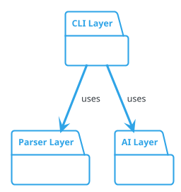

# ArchGuard 多层次架构图生成 - 实施计划 (RLM PLANNING)

**文档版本**: 1.0
**创建日期**: 2026-01-26
**RLM 阶段**: PLANNING
**关联 Proposal**: [09-multi-level-architecture-diagrams.md](../proposals/09-multi-level-architecture-diagrams.md)
**项目代号**: MULTI-LEVEL-DIAGRAMS-v2.0
**目标版本**: ArchGuard v2.0.0 (Breaking Change)
**预估工期**: 5-7 个工作日（纯开发），7 周总计（含测试和发布）

---

## 执行摘要

本文档是 RLM PLANNING 阶段的详细实施计划，将 Proposal 09 中的统一参数机制重构转化为可执行的开发任务。这是一个**Breaking Change**，将完全重构 ArchGuard 的参数机制和处理流程。

**核心目标**:
1. **统一参数机制** - 移除"单图 vs 批处理"二分法，统一为 `DiagramConfig` 抽象
2. **详细程度控制** - 支持 package、class、method 三种详细程度
3. **配置优先设计** - 复杂场景用配置文件，简单场景用 CLI 快捷方式
4. **单一处理流程** - 统一的 `DiagramProcessor`，无代码分支

**核心改进**:
- 代码复杂度降低 50%（移除批处理分支）
- 灵活性提升 10x（任意组合模块）
- 学习成本降低 60%（一致的概念模型）
- 配置能力提升 1000%（支持多图+多层次）

**关键决策**:
- ⚠️ Breaking Change: 移除 `--batch`、`-o`、`--stdin` 参数
- ⚠️ 配置文件结构完全重构（必须使用 `diagrams[]`）
- ✅ 提供自动迁移工具
- ✅ 发布 beta 版本收集反馈

---

## 1. 技术架构设计

### 1.1 系统架构对比

#### 当前架构（v1.x）

```
┌─────────────────────────────────────────┐
│         CLI (analyze.ts)                │
├─────────────────────────────────────────┤
│  if (options.batch && sources > 1) {    │
│    // 批处理路径                         │
│    BatchProcessor.processBatch()        │
│    return;                              │
│  }                                      │
│                                         │
│  // 单图路径                             │
│  if (format === 'json') { ... }         │
│  else { ... }                           │
└─────────────────────────────────────────┘
```

**问题**: 两条完全不同的代码路径，逻辑分叉

---

#### 新架构（v2.0）

```
┌──────────────────────────────────────────────────────────┐
│                  CLI (analyze.ts)                        │
│  - 解析参数                                               │
│  - 加载配置                                               │
├──────────────────────────────────────────────────────────┤
│              normalizeToDiagrams()                       │
│  统一转换：CLI快捷方式 → DiagramConfig[]                  │
└──────────────────┬───────────────────────────────────────┘
                   │
                   ▼
┌──────────────────────────────────────────────────────────┐
│              filterDiagrams()                            │
│  如果指定 --diagrams → 过滤                               │
└──────────────────┬───────────────────────────────────────┘
                   │
                   ▼
┌──────────────────────────────────────────────────────────┐
│          DiagramProcessor (统一处理器)                    │
│  ┌────────────────────────────────────────────┐          │
│  │ for each diagram:                          │          │
│  │   1. FileDiscoveryService.discoverFiles()  │          │
│  │   2. ParallelParser.parseFiles()           │          │
│  │   3. ArchJSONAggregator.aggregate(level)   │  ◄───┐   │
│  │   4. PlantUMLGenerator.generate()          │      │   │
│  │   5. Save to paths                         │      │   │
│  └────────────────────────────────────────────┘      │   │
└──────────────────┬───────────────────────────────────┼───┘
                   │                                   │
                   ▼                                   │
┌──────────────────────────────────────────────────────┼───┐
│          IndexGenerator                              │   │
│  if diagrams.length > 1 → generate index.md          │   │
└──────────────────────────────────────────────────────┼───┘
                                                       │
                   ┌───────────────────────────────────┘
                   │
                   ▼
             ArchJSONAggregator
             (新组件 - 核心创新)
             ┌─────────────────────┐
             │ package level       │ - 只显示包结构
             │ class level         │ - 显示类和公共方法
             │ method level        │ - 显示所有方法
             └─────────────────────┘
```

**关键改进**:
- ✅ **单一代码路径**：无 `if (batch)` 分支
- ✅ **统一抽象**：所有图都是 `DiagramConfig`
- ✅ **透明转换**：CLI 快捷方式自动转换
- ✅ **详细程度控制**：新增 `ArchJSONAggregator`

---

### 1.2 核心类型定义

```typescript
// src/types/config.ts

/**
 * 详细程度级别
 */
export type DetailLevel = 'package' | 'class' | 'method';

/**
 * 单个图表配置 (核心抽象)
 */
export interface DiagramConfig {
  /** 输出名称（支持子目录，如 "modules/auth"） */
  name: string;

  /** 源路径数组 */
  sources: string[];

  /** 详细程度级别 */
  level: DetailLevel;

  /** 描述信息（可选，用于索引页面） */
  description?: string;

  /** 输出格式（可选，默认继承全局配置） */
  format?: 'plantuml' | 'json' | 'svg';

  /** 排除模式（可选，默认继承全局配置） */
  exclude?: string[];
}

/**
 * 全局配置
 */
export interface GlobalConfig {
  /** 输出根目录 */
  outputDir: string;

  /** 默认输出格式 */
  format: 'plantuml' | 'json' | 'svg';

  /** 默认排除模式 */
  exclude: string[];

  /** Claude CLI 配置 */
  cli: {
    command: string;
    args: string[];
    timeout: number;
  };

  /** 缓存配置 */
  cache: {
    enabled: boolean;
    ttl: number;
  };

  /** 并发数 */
  concurrency: number;

  /** 详细输出 */
  verbose: boolean;
}

/**
 * 完整配置（文件格式）
 */
export interface ArchGuardConfig extends GlobalConfig {
  /**
   * 图表定义数组 (核心变更)
   *
   * 设计原则：一切皆 Diagram
   * - 单图：diagrams.length === 1
   * - 多图：diagrams.length > 1
   */
  diagrams: DiagramConfig[];
}
```

---

### 1.3 CLI 接口变更

#### 移除的参数

```bash
# ❌ 移除
--batch              # 不再需要模式开关
--no-batch-index     # 索引生成自动判断
--stdin              # 暂时移除（后续版本恢复）
-o, --output <path>  # 改为 --output-dir + name
```

#### 新增的参数

```bash
# ✅ 新增
-l, --level <level>         # 详细程度：package|class|method
--diagrams <names...>       # 过滤要生成的图
```

#### 保留的参数

```bash
# ✅ 保留
-s, --sources <paths...>    # 源路径（快捷方式，始终生成单图）
-n, --name <name>           # 图表名称
-f, --format <type>         # 输出格式
--output-dir <dir>          # 输出目录
-e, --exclude <patterns...> # 排除模式
--no-cache                  # 禁用缓存
-c, --concurrency <num>     # 并发数
-v, --verbose               # 详细输出
--cli-command <command>     # Claude CLI 命令
--cli-args <args>           # Claude CLI 参数
```

---

## 2. 实施阶段划分

### Phase 1: 类型定义和配置 (Day 1)

**目标**: 建立新的类型系统和配置加载机制

#### 任务 1.1: 定义核心类型 (2小时)

**文件**: `src/types/config.ts`

**任务清单**:
- [ ] 定义 `DetailLevel` 类型
- [ ] 定义 `DiagramConfig` 接口
- [ ] 定义 `GlobalConfig` 接口
- [ ] 定义 `ArchGuardConfig` 接口
- [ ] 添加 JSDoc 注释
- [ ] 导出所有类型

**验收标准**:
- ✅ TypeScript 编译无错误
- ✅ 所有字段有详细 JSDoc 注释
- ✅ 类型定义覆盖所有配置项

---

#### 任务 1.2: 扩展 ConfigLoader (3小时)

**文件**: `src/cli/config-loader.ts`

**任务清单**:
- [ ] 更新 Zod schema 添加 `diagrams` 字段
- [ ] 移除旧的 `source`、`output` 字段
- [ ] 添加 `diagrams[]` 验证规则
- [ ] 添加 `level` 字段验证
- [ ] 更新默认配置
- [ ] 更新配置合并逻辑

**实施代码**:
```typescript
const configSchema = z.object({
  // 全局配置
  outputDir: z.string().default('./archguard'),
  format: z.enum(['plantuml', 'json', 'svg']).default('plantuml'),
  exclude: z.array(z.string()).default([
    '**/*.test.ts',
    '**/*.spec.ts',
    '**/node_modules/**'
  ]),

  cli: z.object({
    command: z.string().default('claude'),
    args: z.array(z.string()).default([]),
    timeout: z.number().default(60000)
  }).default({}),

  cache: z.object({
    enabled: z.boolean().default(true),
    ttl: z.number().default(86400)
  }).default({}),

  concurrency: z.number().optional(),
  verbose: z.boolean().optional(),

  // ✨ 核心变更：diagrams 数组
  diagrams: z.array(
    z.object({
      name: z.string(),
      sources: z.array(z.string()),
      level: z.enum(['package', 'class', 'method']),
      description: z.string().optional(),
      format: z.enum(['plantuml', 'json', 'svg']).optional(),
      exclude: z.array(z.string()).optional()
    })
  ).default([]),
});
```

**验收标准**:
- ✅ 配置验证通过
- ✅ 加载旧配置报错（Breaking Change）
- ✅ 加载新配置成功
- ✅ 默认值正确

---

#### 任务 1.3: 简化 CLI 接口 (3小时)

**文件**: `src/cli/commands/analyze.ts`

**任务清单**:
- [ ] 移除 `--batch` 参数
- [ ] 移除 `--no-batch-index` 参数
- [ ] 移除 `--stdin` 参数
- [ ] 移除 `-o, --output` 参数
- [ ] 添加 `-l, --level` 参数
- [ ] 添加 `--diagrams` 参数
- [ ] 更新参数描述

**实施代码**:
```typescript
export function createAnalyzeCommand(): Command {
  return new Command('analyze')
    .description('Analyze TypeScript project and generate architecture diagrams')

    // ========== 方式 1：从配置文件（推荐） ==========
    .option('--config <path>', 'Config file path (default: archguard.config.json)')
    .option('--diagrams <names...>', 'Generate specific diagrams (comma-separated)')

    // ========== 方式 2：快捷方式（单图） ==========
    .option('-s, --sources <paths...>', 'Source directories (creates single diagram)')
    .option('-l, --level <level>', 'Detail level: package|class|method (default: class)')
    .option('-n, --name <name>', 'Diagram name (default: architecture)')

    // ========== 全局配置覆盖 ==========
    .option('-f, --format <type>', 'Output format: plantuml|json|svg')
    .option('--output-dir <dir>', 'Output directory')
    .option('-e, --exclude <patterns...>', 'Exclude patterns')
    .option('--no-cache', 'Disable cache')
    .option('-c, --concurrency <num>', 'Parallel parsing concurrency')
    .option('-v, --verbose', 'Verbose output')

    // ========== Claude CLI 配置 ==========
    .option('--cli-command <command>', 'Claude CLI command')
    .option('--cli-args <args>', 'Additional CLI arguments')

    .action(analyzeCommandHandler);
}
```

**验收标准**:
- ✅ CLI 参数解析正确
- ✅ 移除的参数不再出现
- ✅ 新参数工作正常
- ✅ 帮助信息更新

---

### Phase 2: 核心组件 (Day 2-3)

**目标**: 实现统一处理器和聚合器

#### 任务 2.1: 实现 DiagramProcessor (6小时)

**文件**: `src/cli/processors/diagram-processor.ts`

**任务清单**:
- [ ] 创建 `DiagramProcessor` 类
- [ ] 实现 `processAll()` 方法
- [ ] 实现 `processDiagram()` 方法
- [ ] 集成 `FileDiscoveryService`
- [ ] 集成 `ParallelParser`
- [ ] 集成 `ArchJSONAggregator`
- [ ] 集成 `PlantUMLGenerator`
- [ ] 添加错误处理
- [ ] 添加进度报告

**实施代码**:
```typescript
// src/cli/processors/diagram-processor.ts

export interface DiagramProcessorOptions {
  diagrams: DiagramConfig[];
  globalConfig: GlobalConfig;
  progress: ProgressReporter;
}

export interface DiagramResult {
  name: string;
  success: boolean;
  paths?: {
    puml: string;
    png: string;
  };
  stats?: {
    entities: number;
    relations: number;
    parseTime: number;
  };
  error?: string;
}

/**
 * DiagramProcessor - 统一的图表处理器
 *
 * 核心设计：
 * - 单一处理流程，无模式分支
 * - 每个 DiagramConfig 独立处理
 * - 失败不影响其他图
 */
export class DiagramProcessor {
  private fileDiscovery: FileDiscoveryService;
  private parser: ParallelParser;
  private aggregator: ArchJSONAggregator;
  private generator: PlantUMLGenerator;

  constructor(private options: DiagramProcessorOptions) {
    const { globalConfig } = options;

    this.fileDiscovery = new FileDiscoveryService();
    this.parser = new ParallelParser({
      concurrency: globalConfig.concurrency,
      continueOnError: true
    });
    this.aggregator = new ArchJSONAggregator();
    this.generator = new PlantUMLGenerator(globalConfig);
  }

  /**
   * 处理所有图表
   */
  async processAll(): Promise<DiagramResult[]> {
    const results: DiagramResult[] = [];

    for (const diagram of this.options.diagrams) {
      try {
        this.options.progress.start(`Processing: ${diagram.name}`);
        const result = await this.processDiagram(diagram);
        results.push(result);
        this.options.progress.succeed(`Generated: ${diagram.name}`);
      } catch (error) {
        this.options.progress.fail(`Failed: ${diagram.name}`);
        results.push({
          name: diagram.name,
          success: false,
          error: error instanceof Error ? error.message : String(error)
        });
      }
    }

    return results;
  }

  /**
   * 处理单个图表
   */
  private async processDiagram(diagram: DiagramConfig): Promise<DiagramResult> {
    // 1. 发现文件
    const files = await this.fileDiscovery.discoverFiles({
      sources: diagram.sources,
      exclude: diagram.exclude || this.options.globalConfig.exclude,
      skipMissing: false
    });

    // 2. 解析文件
    const metrics = await this.parser.parseFilesWithMetrics(files);
    let archJSON = metrics.result;

    // 3. 聚合（根据 level）
    archJSON = this.aggregator.aggregate(archJSON, diagram.level);

    // 4. 解析输出路径
    const pathResolver = new OutputPathResolver(this.options.globalConfig);
    const paths = pathResolver.resolve({ name: diagram.name });
    await pathResolver.ensureDirectory();

    // 5. 生成和渲染
    const format = diagram.format || this.options.globalConfig.format;

    if (format === 'json') {
      // JSON 输出
      await fs.writeFile(paths.paths.json, JSON.stringify(archJSON, null, 2));
    } else {
      // PlantUML 输出
      await this.generator.generateAndRender(archJSON, paths, diagram.level);
    }

    return {
      name: diagram.name,
      success: true,
      paths: {
        puml: paths.paths.puml,
        png: paths.paths.png
      },
      stats: {
        entities: archJSON.entities.length,
        relations: archJSON.relations.length,
        parseTime: metrics.parseTime
      }
    };
  }
}
```

**验收标准**:
- ✅ 可以处理多个图表
- ✅ 每个图表独立处理
- ✅ 失败不影响其他图
- ✅ 返回详细结果

---

#### 任务 2.2: 实现 ArchJSONAggregator (6小时)

**文件**: `src/parser/archjson-aggregator.ts`

**任务清单**:
- [ ] 创建 `ArchJSONAggregator` 类
- [ ] 实现 `aggregate()` 方法
- [ ] 实现 `aggregateToPackageLevel()` 方法
- [ ] 实现 `aggregateToClassLevel()` 方法
- [ ] 实现 `aggregateToMethodLevel()` 方法
- [ ] 实现 `extractPackages()` 辅助方法
- [ ] 实现 `analyzePackageDependencies()` 方法
- [ ] 添加单元测试

**实施代码**:
```typescript
// src/parser/archjson-aggregator.ts

export class ArchJSONAggregator {
  /**
   * 聚合 ArchJSON 到指定详细程度
   */
  aggregate(archJSON: ArchJSON, level: DetailLevel): ArchJSON {
    switch (level) {
      case 'package':
        return this.aggregateToPackageLevel(archJSON);
      case 'class':
        return this.aggregateToClassLevel(archJSON);
      case 'method':
        return archJSON; // 保留所有细节
    }
  }

  /**
   * Package 级别聚合
   * - 只保留包信息
   * - 移除所有类和方法
   * - 保留包之间的依赖关系
   */
  private aggregateToPackageLevel(archJSON: ArchJSON): ArchJSON {
    // 1. 提取所有包名
    const packages = this.extractPackages(archJSON.entities);

    // 2. 创建包实体（空类定义）
    const packageEntities: Entity[] = packages.map(pkg => ({
      name: pkg,
      type: 'package',
      location: { file: '', line: 0, package: pkg },
      methods: [],
      properties: [],
      decorators: []
    }));

    // 3. 分析包间依赖
    const packageRelations = this.analyzePackageDependencies(
      archJSON.entities,
      archJSON.relations
    );

    return {
      ...archJSON,
      entities: packageEntities,
      relations: packageRelations
    };
  }

  /**
   * Class 级别聚合（默认行为）
   * - 保留类和接口
   * - 保留公共方法
   * - 移除私有方法
   */
  private aggregateToClassLevel(archJSON: ArchJSON): ArchJSON {
    return {
      ...archJSON,
      entities: archJSON.entities.map(entity => ({
        ...entity,
        methods: entity.methods.filter(m => m.visibility === 'public' || !m.visibility),
        properties: entity.properties.filter(p => p.visibility === 'public' || !p.visibility)
      }))
    };
  }

  /**
   * 提取包名列表
   */
  private extractPackages(entities: Entity[]): string[] {
    const packages = new Set<string>();
    entities.forEach(entity => {
      if (entity.location.package) {
        packages.add(entity.location.package);
      }
    });
    return Array.from(packages).sort();
  }

  /**
   * 分析包间依赖关系
   */
  private analyzePackageDependencies(
    entities: Entity[],
    relations: Relation[]
  ): Relation[] {
    // 构建实体到包的映射
    const entityToPackage = new Map<string, string>();
    entities.forEach(entity => {
      if (entity.location.package) {
        entityToPackage.set(entity.name, entity.location.package);
      }
    });

    // 聚合关系到包级别
    const packageRelations = new Map<string, Relation>();
    relations.forEach(rel => {
      const fromPkg = entityToPackage.get(rel.from);
      const toPkg = entityToPackage.get(rel.to);

      if (fromPkg && toPkg && fromPkg !== toPkg) {
        const key = `${fromPkg}->${toPkg}`;
        if (!packageRelations.has(key)) {
          packageRelations.set(key, {
            from: fromPkg,
            to: toPkg,
            type: 'dependency',
            label: 'uses'
          });
        }
      }
    });

    return Array.from(packageRelations.values());
  }
}
```

**验收标准**:
- ✅ Package 级别：只有包，无类
- ✅ Class 级别：有类，只有公共方法
- ✅ Method 级别：完整信息
- ✅ 单元测试覆盖率 > 80%

---

#### 任务 2.3: 实现 normalizeToDiagrams (2小时)

**文件**: `src/cli/commands/analyze.ts`

**任务清单**:
- [ ] 实现 `normalizeToDiagrams()` 函数
- [ ] 实现 `filterDiagrams()` 函数
- [ ] 更新命令处理器使用新函数
- [ ] 添加单元测试

**实施代码**:
```typescript
/**
 * 规范化：将 CLI 快捷方式转换为 DiagramConfig[]
 */
function normalizeToDiagrams(
  config: ArchGuardConfig,
  cliOptions: CLIOptions
): DiagramConfig[] {
  // 如果配置文件有 diagrams，使用配置文件
  if (config.diagrams && config.diagrams.length > 0) {
    return config.diagrams;
  }

  // 否则，从 CLI 快捷方式构造单个 diagram
  if (cliOptions.sources && cliOptions.sources.length > 0) {
    return [{
      name: cliOptions.name || 'architecture',
      sources: cliOptions.sources,
      level: cliOptions.level || 'class',
      format: cliOptions.format,
      exclude: cliOptions.exclude
    }];
  }

  // 默认配置
  return [{
    name: 'architecture',
    sources: ['./src'],
    level: 'class'
  }];
}

/**
 * 过滤：根据 --diagrams 参数过滤
 */
function filterDiagrams(
  diagrams: DiagramConfig[],
  selectedNames?: string[]
): DiagramConfig[] {
  if (!selectedNames || selectedNames.length === 0) {
    return diagrams;
  }

  return diagrams.filter(d => selectedNames.includes(d.name));
}
```

**验收标准**:
- ✅ 配置优先
- ✅ CLI 快捷方式生成单图
- ✅ 默认配置正确
- ✅ 过滤功能正常

---

#### 任务 2.4: 删除旧代码 (2小时)

**任务清单**:
- [ ] 删除 `src/cli/utils/batch-processor.ts`
- [ ] 删除 `analyze.ts` 中的批处理分支
- [ ] 删除旧的类型定义
- [ ] 更新导入语句
- [ ] 验证编译通过

**验收标准**:
- ✅ 代码编译通过
- ✅ 无未使用的导入
- ✅ 无死代码

---

### Phase 3: Prompt 和 AI (Day 3-4)

**目标**: 扩展 Prompt 模板支持详细程度控制

#### 任务 3.1: 扩展 Prompt 模板 (3小时)

**文件**: `prompts/class-diagram.txt`

**任务清单**:
- [ ] 添加 `{{DETAIL_LEVEL}}` 变量
- [ ] 添加 package 级别规则
- [ ] 添加 class 级别规则
- [ ] 添加 method 级别规则
- [ ] 添加示例

**实施内容**:
```plaintext
{{#if DETAIL_LEVEL}}
## 📊 详细程度要求

当前详细程度: **{{DETAIL_LEVEL}}**

{{#if DETAIL_LEVEL == "package"}}
### Package 级别规则（总览图）

**生成要求**:
- ✅ 只显示 package 结构（使用 `package "模块名" { }` 包裹）
- ✅ 显示 package 之间的依赖关系
- ❌ **不要显示类、接口、方法**
- ❌ **不要在 package 内部定义任何实体**
- ✅ Package 为空（无成员）

**示例**:

{{/if}}

{{#if DETAIL_LEVEL == "class"}}
### Class 级别规则（默认）

**生成要求**:
- ✅ 显示类、接口和公共方法
- ✅ 显示类之间的关系
- ✅ 使用 package 组织模块
- ❌ 不显示私有方法
- ✅ 适合模块详细设计
{{/if}}

{{#if DETAIL_LEVEL == "method"}}
### Method 级别规则（完整细节）

**生成要求**:
- ✅ 显示所有方法（包括私有）
- ✅ 显示所有属性（包括私有）
- ✅ 显示完整的方法签名
- ✅ 适合深度分析和代码审查
{{/if}}

{{/if}}
```

**验收标准**:
- ✅ 模板渲染正确
- ✅ 条件逻辑工作正常
- ✅ 生成的图符合要求

---

#### 任务 3.2: 更新 PlantUMLGenerator (2小时)

**文件**: `src/ai/plantuml-generator.ts`

**任务清单**:
- [ ] 更新 `generateAndRender()` 方法签名
- [ ] 传递 `level` 参数到模板
- [ ] 更新调用处

**实施代码**:
```typescript
async generateAndRender(
  archJSON: ArchJSON,
  paths: PathResolution,
  level: DetailLevel  // ✨ 新参数
): Promise<void> {
  const templateManager = new PromptTemplateManager();
  const detector = new ExternalTypeDetector();

  const externalTypes = detector.detect(archJSON);

  // 渲染模板时传入 level
  const prompt = await templateManager.render('class-diagram', {
    ARCH_JSON: JSON.stringify(archJSON, null, 2),
    DETAIL_LEVEL: level,  // ✨ 传递 level
    EXTERNAL_TYPES: externalTypes.length > 0
      ? JSON.stringify(externalTypes, null, 2)
      : null
  });

  const wrapper = new ClaudeCodeWrapper(this.config);
  const plantuml = await wrapper.generatePlantUML(archJSON);

  await fs.writeFile(paths.paths.puml, plantuml);
  // ... 渲染 PNG
}
```

**验收标准**:
- ✅ level 正确传递
- ✅ 生成的图符合 level 要求

---

### Phase 4: 测试 (Day 5-6)

**目标**: 全面测试新实现

#### 任务 4.1: 单元测试 (4小时)

**测试文件**:
- `tests/unit/parser/archjson-aggregator.test.ts`
- `tests/unit/cli/processors/diagram-processor.test.ts`
- `tests/unit/cli/commands/analyze.test.ts`

**测试清单**:
- [ ] `ArchJSONAggregator.aggregate()` - package level
- [ ] `ArchJSONAggregator.aggregate()` - class level
- [ ] `ArchJSONAggregator.aggregate()` - method level
- [ ] `DiagramProcessor.processAll()` - 多图处理
- [ ] `DiagramProcessor.processDiagram()` - 单图处理
- [ ] `normalizeToDiagrams()` - 配置优先
- [ ] `normalizeToDiagrams()` - CLI 快捷方式
- [ ] `filterDiagrams()` - 过滤逻辑

**目标**:
- ✅ 单元测试覆盖率 > 80%
- ✅ 所有测试通过

---

#### 任务 4.2: 集成测试 (4小时)

**测试文件**:
- `tests/integration/multi-diagram.test.ts`
- `tests/integration/detail-levels.test.ts`

**测试场景**:
1. 从配置文件生成多图
2. Package 级别生成验证
3. Class 级别生成验证
4. Method 级别生成验证
5. CLI 快捷方式验证
6. 索引生成验证

**目标**:
- ✅ 所有集成测试通过
- ✅ 生成的图符合预期

---

#### 任务 4.3: E2E 测试 (2小时)

**测试命令**:
```bash
# 测试 1: CLI 快捷方式（单图）
npm run build
node dist/cli/index.js analyze -s ./src -l package -n overview
ls -la archguard/

# 测试 2: 配置文件（多图）
node dist/cli/index.js analyze
ls -la archguard/

# 测试 3: 过滤特定图
node dist/cli/index.js analyze --diagrams overview,parser
ls -la archguard/

# 测试 4: 详细程度
node dist/cli/index.js analyze -s ./src -l method
```

**验证**:
- ✅ 命令执行成功
- ✅ 输出文件存在
- ✅ 图表内容正确

---

### Phase 5: 文档和迁移 (Day 7)

**目标**: 完善文档和迁移工具

#### 任务 5.1: 更新 CLAUDE.md (2小时)

**文件**: `CLAUDE.md`

**更新内容**:
- [ ] 更新使用说明
- [ ] 添加 Detail Level 说明
- [ ] 添加配置文件示例
- [ ] 更新 CLI 参数列表
- [ ] 移除旧参数说明

---

#### 任务 5.2: 编写迁移指南 (3小时)

**文件**: `docs/MIGRATION.md`

**内容清单**:
- [ ] Breaking Changes 说明
- [ ] 参数对照表
- [ ] 配置文件迁移示例
- [ ] 常见问题解答
- [ ] 迁移步骤

---

#### 任务 5.3: 创建迁移工具 (3小时)

**文件**: `scripts/migrate-config.ts`

**功能**:
- [ ] 读取旧配置文件
- [ ] 转换为新格式
- [ ] 保存新配置
- [ ] 显示迁移结果

**命令**:
```bash
npx archguard migrate-config ./archguard.config.json
```

---

## 3. 质量门控

### 3.1 测试覆盖率

| 模块 | 目标覆盖率 | 验证命令 |
|------|----------|---------|
| `archjson-aggregator.ts` | ≥ 85% | `npm run test:coverage -- archjson-aggregator` |
| `diagram-processor.ts` | ≥ 80% | `npm run test:coverage -- diagram-processor` |
| `analyze.ts` | ≥ 75% | `npm run test:coverage -- analyze` |
| **总体** | **≥ 80%** | `npm run test:coverage` |

---

### 3.2 性能基准

| 指标 | 目标 | 验证方式 |
|------|------|---------|
| 解析速度 | 无回归（±5%） | 基准测试对比 |
| 内存使用 | 无回归（±10%） | 内存监控 |
| 生成速度 | 无回归（±10%） | E2E 时间对比 |

---

### 3.3 代码质量

| 检查项 | 目标 | 验证命令 |
|--------|------|---------|
| TypeScript 编译 | 0 错误 | `npm run type-check` |
| Lint 检查 | 0 错误 | `npm run lint` |
| 格式检查 | 0 错误 | `npm run format:check` |

---

## 4. 风险管理

### 4.1 技术风险

| 风险 | 概率 | 影响 | 缓解措施 |
|------|------|------|---------|
| Prompt 质量不稳定 | 中 | 高 | 多次测试，收集反馈，迭代优化 |
| 性能回归 | 低 | 中 | 基准测试，持续监控 |
| 类型推断错误 | 低 | 中 | 完善单元测试 |
| Package 依赖分析不准确 | 中 | 中 | 算法优化，增加测试用例 |

---

### 4.2 项目风险

| 风险 | 概率 | 影响 | 缓解措施 |
|------|------|------|---------|
| Breaking Change 导致用户流失 | 中 | 高 | 提供迁移工具，详细文档，beta 测试 |
| 实施时间超期 | 中 | 中 | 预留缓冲时间，优先级管理 |
| 社区反馈负面 | 低 | 高 | 提前沟通，收集反馈，快速响应 |

---

## 5. 发布计划

### 5.1 版本路线图

| 版本 | 时间 | 内容 | 目标 |
|------|------|------|------|
| **v2.0.0-alpha.1** | Week 1 | 内部测试 | 验证核心功能 |
| **v2.0.0-beta.1** | Week 2 | 公开测试 | 收集社区反馈 |
| **v2.0.0-beta.2** | Week 3 | Bug 修复 | 稳定性提升 |
| **v2.0.0-rc.1** | Week 4 | 发布候选 | 最终验证 |
| **v2.0.0** | Week 5 | 正式发布 | 生产就绪 |

---

### 5.2 发布清单

#### Alpha 发布
- [ ] 核心功能完成
- [ ] 单元测试通过
- [ ] 内部自测通过

#### Beta 发布
- [ ] 集成测试通过
- [ ] 文档完善
- [ ] 迁移工具可用
- [ ] 发布 npm beta 版本
- [ ] 发布公告

#### RC 发布
- [ ] 社区反馈处理
- [ ] Bug 修复完成
- [ ] 性能验证通过
- [ ] 文档最终审查

#### 正式发布
- [ ] 所有测试通过
- [ ] 文档完整
- [ ] CHANGELOG 更新
- [ ] 发布 npm 正式版本
- [ ] 发布公告和迁移指南

---

## 6. 监控与持续改进

### 6.1 监控指标

#### 功能采用率
- `multi_diagram_usage` - 使用多图的用户比例
- `level_distribution` - package/class/method 使用分布
- `config_vs_cli` - 配置文件 vs CLI 快捷方式使用比例

#### 质量指标
- `generation_success_rate` - 生成成功率
- `error_rate_by_level` - 各 level 的错误率
- `average_diagrams_per_config` - 平均每个配置文件的图数量

---

### 6.2 反馈收集

**收集渠道**:
1. GitHub Issues（标签：`v2.0-feedback`）
2. 社区讨论
3. 用户调研

**关键问题**:
- 迁移是否顺利？
- 新设计是否更清晰？
- 是否需要恢复某些旧参数？
- Detail level 是否满足需求？

---

### 6.3 持续改进计划

**短期（1-3 个月）**:
- [ ] 根据反馈优化 Prompt 模板
- [ ] 恢复 `--stdin` 支持
- [ ] 添加更多示例配置

**中期（3-6 个月）**:
- [ ] 并行生成多图（性能优化）
- [ ] 支持自定义聚合规则
- [ ] 支持更多输出格式（Mermaid、D2）

**长期（6-12 个月）**:
- [ ] 交互式配置生成器
- [ ] Web UI
- [ ] IDE 插件（VS Code）

---

## 7. 总结

### 7.1 核心价值

1. ✅ **架构清晰**：统一抽象，单一流程，代码复杂度降低 50%
2. ✅ **多层次文档**：package/class/method 三级控制，适应不同场景
3. ✅ **灵活分组**：任意组合模块，灵活性提升 10x
4. ✅ **配置化**：版本控制、可复用、CI/CD 友好
5. ✅ **降低学习成本**：一致的概念模型，学习成本降低 60%

---

### 7.2 实施时间表

```
Week 1 (Day 1-3): 核心开发
├─ Day 1: 类型定义和配置
├─ Day 2-3: 核心组件（Processor + Aggregator）
└─ Day 3-4: Prompt 和 AI

Week 2 (Day 4-7): 测试和文档
├─ Day 5-6: 测试（单元 + 集成 + E2E）
├─ Day 7: 文档和迁移工具
└─ Week 2-5: Beta 测试和发布
```

**开发时间**：5-7 个工作日
**总时间**：7 周（含测试和发布）

---

### 7.3 成功度量

**定量指标**:
- ✅ 代码复杂度降低 ≥ 20%
- ✅ 测试覆盖率 ≥ 80%
- ✅ 功能采用率 > 40%（6个月内）
- ✅ 生成成功率 > 95%
- ✅ 迁移成功率 > 90%

**定性指标**:
- ✅ 用户反馈积极
- ✅ 社区认可新设计
- ✅ 被大型项目采用

---

**文档状态**: ✅ 完成（v1.0）
**下一步**: 开始 Phase 1 实施
**负责人**: 待分配
**计划开始**: 待定
