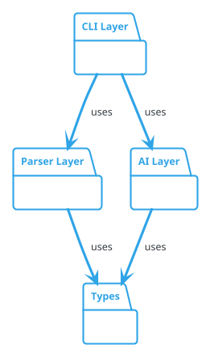

# ArchGuard 多层次架构图生成建议 (RLM 分析)

**文档版本**: 1.0
**创建日期**: 2026-01-26
**分析方法**: RLM (Refactoring Lifecycle Management)
**改进范围**: 配置驱动多图生成、详细程度控制、灵活模块分组
**优先级**: 🟢 高 (P1) - 显著提升文档灵活性和实用价值
**关联文档**: 07-advanced-cli-features.md, 05-config-and-cli-improvements.md

---

## 执行摘要

本文档基于 RLM 方法提出 ArchGuard 多层次架构图生成能力，解决当前"一刀切"架构图生成方式的局限性。主要改进包括:

1. **详细程度控制 (Level Control)** - 支持 package、class、method 三种详细程度
2. **配置驱动多图生成** - 通过配置文件定义多张架构图的生成规则
3. **灵活模块分组** - 支持"某些图合并多模块，某些图单模块"的混合场景
4. **自动化导航索引** - 生成索引页面，建立多层次文档体系

**典型使用场景**：
- 总览图：只显示包结构，隐藏类细节（package 级别）
- 模块详图：显示特定模块的类和方法（class 级别）
- 完整系统详图：所有包+所有类（class 级别，可选）
- 混合分组：认证系统（3个包）+ 解析器（1个包）+ CLI+AI（2个包）

**核心价值**：
- 📊 多层次文档体系：从总览到细节的渐进式架构理解
- 🎯 灵活分组能力：任意组合模块生成架构图
- ⚙️ 配置化管理：版本控制、可复用、易于 CI/CD 集成
- 🚀 用户体验提升：10x 灵活性提升，适应复杂项目需求

---

## 1. RLM PROPOSAL - 现状分析与问题识别

### 1.1 当前限制

#### 限制 1: 无详细程度控制

**当前行为**：
```bash
# 只能生成一种详细程度的架构图（class 级别）
node dist/cli/index.js analyze -s ./src

# 生成的图包含所有类和方法
# 无法生成只显示包结构的总览图
```

**问题**：
- ❌ 大型项目的架构图过于复杂，难以理解整体结构
- ❌ 无法提供"总览 → 详细"的渐进式文档体系
- ❌ 不同受众（管理层、架构师、开发者）无法各取所需

**真实场景**：
```
用户期望：
1. overview.png - 只显示包和包之间的依赖关系
2. module-details/*.png - 各模块的类和方法详细信息

当前只能生成：
1. architecture.png - 包含所有细节的单一架构图
```

---

#### 限制 2: 批处理模式不够灵活

**当前批处理模式**（文档 07 已实现）：
```bash
# 每个 -s 参数生成一张独立的图
node dist/cli/index.js analyze -s ./src/cli -s ./src/parser --batch

# 输出：
# archguard/modules/cli.png
# archguard/modules/parser.png
```

**问题**：
- ❌ 无法实现"某些图合并多模块，某些图单模块"
- ❌ 无法为同一套源代码生成不同详细程度的图
- ❌ 配置难以复用（依赖命令行参数）

**真实场景**：
```
用户期望：
1. overview.png - 所有包的总览（package 级别）
2. auth-system.png - 认证+身份+安全 3个包合并（class 级别）
3. parser.png - 解析器单独（class 级别）
4. cli-ai.png - CLI+AI 2个包合并（class 级别）

当前无法实现：需要多次运行不同命令，且无法控制详细程度
```

---

#### 限制 3: 配置不支持多图定义

**当前配置文件**（`archguard.config.json`）：
```json
{
  "source": "./src",        // 单一源路径
  "format": "plantuml",     // 单一格式
  "output": "./architecture.puml"  // 单一输出
}
```

**问题**：
- ❌ 无法在配置文件中定义多张图
- ❌ 复杂分组规则无法持久化
- ❌ CI/CD 集成需要编写复杂脚本

**期望配置**：
```json
{
  "diagrams": [
    {
      "name": "overview",
      "sources": ["./src/**"],
      "level": "package"
    },
    {
      "name": "modules/auth-system",
      "sources": ["./src/auth", "./src/identity"],
      "level": "class"
    }
  ]
}
```

---

### 1.2 用户需求分析

#### 需求场景 1: 大型项目的多层次文档

**用户角色**：技术负责人、架构师

**场景描述**：
```
项目规模：50+ 类，10+ 包

期望输出：
1. overview.png - 高层架构总览
   - 只显示包和包之间的依赖
   - 便于管理层和新成员快速理解

2. layer-detail/*.png - 各层详细架构
   - cli-layer.png: CLI 层的类图
   - parser-layer.png: Parser 层的类图
   - ai-layer.png: AI 层的类图

3. full-system.png - 完整详细架构（可选）
   - 所有类和方法
   - 供资深开发者参考
```

**价值**：
- ✅ 渐进式理解：从总览到细节
- ✅ 受众分层：不同角色看不同图
- ✅ 文档完整性：多维度覆盖

---

#### 需求场景 2: Monorepo 项目的混合分组

**用户角色**：Monorepo 维护者

**场景描述**：
```
项目结构：
packages/
├── frontend/
├── backend/
├── shared/
├── auth/
├── identity/
└── security/

期望输出：
1. overview.png - 所有包的总览（package 级别）
2. frontend-stack.png - frontend + shared（class 级别）
3. backend-stack.png - backend + shared（class 级别）
4. auth-system.png - auth + identity + security（class 级别）
```

**关键需求**：
- ✅ 灵活分组：某些图合并，某些图单独
- ✅ 配置复用：配置文件版本控制
- ✅ 自动化：一键生成所有图

---

#### 需求场景 3: CI/CD 集成

**用户角色**：DevOps 工程师

**场景描述**：
```yaml
# .github/workflows/architecture-docs.yml
- name: Generate Architecture Diagrams
  run: |
    npm run build
    node dist/cli/index.js analyze --from-config

# 期望：
# - 从配置文件读取所有图的定义
# - 自动生成多张图
# - 自动生成索引页面
# - 部署到文档站点
```

**价值**：
- ✅ 自动化：无需编写复杂脚本
- ✅ 一致性：配置文件保证输出稳定
- ✅ 可维护性：配置变更即可调整输出

---

### 1.3 竞品分析

| 工具 | 详细程度控制 | 多图配置 | 模块分组 | 评价 |
|------|------------|---------|---------|------|
| **Madge** | ❌ 无 | ❌ 无 | ⚠️ 手动 | 只生成依赖图 |
| **TypeDoc** | ⚠️ 有限 | ❌ 无 | ❌ 无 | 主要是 API 文档 |
| **Dependency Cruiser** | ⚠️ 部分 | ❌ 无 | ⚠️ 手动 | 专注依赖分析 |
| **ArchGuard (当前)** | ❌ 无 | ❌ 无 | ⚠️ 命令行 | 批处理但不灵活 |
| **ArchGuard (本提案)** | ✅ 三级 | ✅ 配置文件 | ✅ 完全灵活 | **最佳** |

**结论**：
- 当前市场没有工具提供配置驱动的多层次架构图生成
- 本提案将使 ArchGuard 成为该领域的领先工具

---

### 1.4 优先级评估

| 评估维度 | 得分 | 说明 |
|---------|------|------|
| **用户价值** | ⭐⭐⭐⭐⭐ | 解决真实痛点，适用于大型项目和 Monorepo |
| **实施复杂度** | ⭐⭐⭐ | 中等（需要扩展配置、修改 prompt、实现聚合） |
| **技术风险** | ⭐⭐ | 低（向后兼容，渐进式迁移） |
| **投入产出比** | ⭐⭐⭐⭐⭐ | 高（5-7天实施，10x 灵活性提升） |

**综合评估**：🟢 高优先级 (P1)

---

## 2. RLM PLANNING - 详细设计方案

### 2.1 架构设计

#### 核心概念

```typescript
// 1. 详细程度级别 (Level)
type DetailLevel = 'package' | 'class' | 'method';

// package: 只显示包结构和包间依赖
// class: 显示类、接口和公共方法（默认）
// method: 显示所有方法（包括私有）

// 2. 图表配置 (DiagramConfig)
interface DiagramConfig {
  name: string;           // 输出文件名（支持子目录）
  sources: string[];      // 源路径数组
  level: DetailLevel;     // 详细程度
  description?: string;   // 描述信息
  showRelations?: boolean; // 是否显示关系（package 级别可选）
}

// 3. 完整配置 (Config)
interface Config {
  // ... 现有配置
  diagrams?: DiagramConfig[];  // 多图配置数组
}
```

---

#### 配置文件示例

**示例 1: 基础多图配置**
```json
{
  "format": "plantuml",
  "exclude": ["**/*.test.ts", "**/*.spec.ts"],
  "cli": {
    "command": "claude",
    "timeout": 180000
  },

  "diagrams": [
    {
      "name": "overview",
      "sources": ["./src/**"],
      "level": "package",
      "description": "System overview - packages only",
      "showRelations": true
    },
    {
      "name": "modules/parser",
      "sources": ["./src/parser"],
      "level": "class",
      "description": "Parser module with class details"
    },
    {
      "name": "modules/cli-ai-integration",
      "sources": ["./src/cli", "./src/ai"],
      "level": "class",
      "description": "CLI and AI integration layer"
    }
  ]
}
```

**示例 2: Monorepo 完整配置**
```json
{
  "format": "plantuml",
  "exclude": ["**/*.test.ts"],

  "diagrams": [
    {
      "name": "overview",
      "sources": ["./packages/**"],
      "level": "package",
      "description": "All packages overview"
    },
    {
      "name": "modules/frontend-stack",
      "sources": ["./packages/frontend", "./packages/shared"],
      "level": "class"
    },
    {
      "name": "modules/backend-stack",
      "sources": ["./packages/backend", "./packages/shared"],
      "level": "class"
    },
    {
      "name": "modules/auth-system",
      "sources": [
        "./packages/auth",
        "./packages/identity",
        "./packages/security"
      ],
      "level": "class",
      "description": "Complete authentication system"
    },
    {
      "name": "full-system-detail",
      "sources": ["./packages/**"],
      "level": "class",
      "description": "Complete system with all details"
    }
  ]
}
```

---

### 2.2 数据流设计

#### Level 控制流程

```
┌─────────────────────────────────────────────────────┐
│ 1. 配置加载 (ConfigLoader)                          │
│    - 读取 diagrams[] 数组                           │
│    - 解析每个 DiagramConfig                         │
└────────────────┬────────────────────────────────────┘
                 │
                 ▼
┌─────────────────────────────────────────────────────┐
│ 2. 文件发现 (FileDiscoveryService)                  │
│    - 对每个 diagram.sources 发现文件                │
│    - 去重处理                                       │
└────────────────┬────────────────────────────────────┘
                 │
                 ▼
┌─────────────────────────────────────────────────────┐
│ 3. 解析 + 聚合 (ParallelParser + Aggregator)        │
│    - 解析文件生成 ArchJSON                          │
│    - 根据 level 参数聚合数据：                      │
│      • package: 只保留包信息，移除类细节            │
│      • class: 保留类和公共方法（默认）              │
│      • method: 保留所有方法                         │
└────────────────┬────────────────────────────────────┘
                 │
                 ▼
┌─────────────────────────────────────────────────────┐
│ 4. Prompt 生成 (PromptTemplateManager)              │
│    - 渲染模板时传入 DETAIL_LEVEL 变量               │
│    - 不同 level 使用不同 prompt 指令                │
└────────────────┬────────────────────────────────────┘
                 │
                 ▼
┌─────────────────────────────────────────────────────┐
│ 5. PlantUML 生成 (PlantUMLGenerator)                │
│    - Claude 根据 level 生成对应详细程度的 PlantUML │
└────────────────┬────────────────────────────────────┘
                 │
                 ▼
┌─────────────────────────────────────────────────────┐
│ 6. 输出 + 索引 (OutputWriter)                       │
│    - 保存各图到指定路径                             │
│    - 生成 index.md 导航页面                         │
└─────────────────────────────────────────────────────┘
```

---

### 2.3 核心组件设计

#### 2.3.1 ArchJSON 聚合器 (ArchJSONAggregator)

**功能**：根据 level 参数聚合 ArchJSON 数据

```typescript
// src/parser/archjson-aggregator.ts
export class ArchJSONAggregator {
  /**
   * 聚合 ArchJSON 到指定详细程度
   */
  aggregate(archJSON: ArchJSON, level: DetailLevel): ArchJSON {
    switch (level) {
      case 'package':
        return this.aggregateToPackageLevel(archJSON);
      case 'class':
        return this.aggregateToClassLevel(archJSON);
      case 'method':
        return archJSON; // 保留所有细节
    }
  }

  /**
   * Package 级别聚合
   * - 只保留包信息
   * - 移除所有类和方法
   * - 保留包之间的依赖关系
   */
  private aggregateToPackageLevel(archJSON: ArchJSON): ArchJSON {
    // 1. 提取所有包名
    const packages = this.extractPackages(archJSON.entities);

    // 2. 创建包实体（空类定义）
    const packageEntities: Entity[] = packages.map(pkg => ({
      name: pkg,
      type: 'package',
      location: { file: '', line: 0, package: pkg },
      methods: [],
      properties: [],
      decorators: []
    }));

    // 3. 分析包间依赖
    const packageRelations = this.analyzePackageDependencies(
      archJSON.entities,
      archJSON.relations
    );

    return {
      ...archJSON,
      entities: packageEntities,
      relations: packageRelations
    };
  }

  /**
   * Class 级别聚合（默认行为）
   * - 保留类和接口
   * - 保留公共方法
   * - 移除私有方法（可选）
   */
  private aggregateToClassLevel(archJSON: ArchJSON): ArchJSON {
    return {
      ...archJSON,
      entities: archJSON.entities.map(entity => ({
        ...entity,
        methods: entity.methods.filter(m => m.visibility === 'public'),
        properties: entity.properties.filter(p => p.visibility === 'public')
      }))
    };
  }

  /**
   * 提取包名列表
   */
  private extractPackages(entities: Entity[]): string[] {
    const packages = new Set<string>();
    entities.forEach(entity => {
      if (entity.location.package) {
        packages.add(entity.location.package);
      }
    });
    return Array.from(packages).sort();
  }

  /**
   * 分析包间依赖关系
   */
  private analyzePackageDependencies(
    entities: Entity[],
    relations: Relation[]
  ): Relation[] {
    // 构建实体到包的映射
    const entityToPackage = new Map<string, string>();
    entities.forEach(entity => {
      if (entity.location.package) {
        entityToPackage.set(entity.name, entity.location.package);
      }
    });

    // 聚合关系到包级别
    const packageRelations = new Map<string, Relation>();
    relations.forEach(rel => {
      const fromPkg = entityToPackage.get(rel.from);
      const toPkg = entityToPackage.get(rel.to);

      if (fromPkg && toPkg && fromPkg !== toPkg) {
        const key = `${fromPkg}->${toPkg}`;
        if (!packageRelations.has(key)) {
          packageRelations.set(key, {
            from: fromPkg,
            to: toPkg,
            type: 'dependency',
            label: 'uses'
          });
        }
      }
    });

    return Array.from(packageRelations.values());
  }
}
```

---

#### 2.3.2 扩展 Prompt 模板

**文件**：`prompts/class-diagram.txt`

**新增变量**：`{{DETAIL_LEVEL}}`

```plaintext
你是一个资深软件架构师,专注于生成清晰、准确的 PlantUML 架构图。

## 输入

架构指纹(JSON 格式):
{{ARCH_JSON}}

{{#if DETAIL_LEVEL}}
## 📊 详细程度要求

当前详细程度: **{{DETAIL_LEVEL}}**

{{#if DETAIL_LEVEL == "package"}}
### Package 级别规则

**生成要求**:
- ✅ 只显示 package 结构（使用 `package "模块名" { }` 包裹）
- ✅ 显示 package 之间的依赖关系
- ❌ **不要显示类、接口、方法**
- ❌ **不要在 package 内部定义任何实体**

**示例**:


**关键要点**:
- 包内为空（不包含类定义）
- 只显示高层架构依赖
- 适合总览和高层设计
{{/if}}

{{#if DETAIL_LEVEL == "class"}}
### Class 级别规则（默认）

**生成要求**:
- ✅ 显示类、接口和公共方法
- ✅ 显示类之间的关系
- ✅ 使用 package 组织模块
- ❌ 不显示私有方法

**示例**:
```plantuml
package "Parser Layer" {
  class TypeScriptParser {
    +parseFiles(files: string[]): ArchJSON
    +parseFile(file: string): Entity[]
  }

  class ClassExtractor {
    +extract(node: Node): Entity
  }
}

TypeScriptParser --> ClassExtractor : "uses"
```
{{/if}}

{{#if DETAIL_LEVEL == "method"}}
### Method 级别规则

**生成要求**:
- ✅ 显示所有方法（包括私有）
- ✅ 显示所有属性（包括私有）
- ✅ 显示完整的方法签名
- ✅ 适合深度分析和代码审查
{{/if}}

{{/if}}

## ⭐ 核心要求（按优先级）

### 1. 必须使用 package 组织模块（最高优先级）
...（现有内容）
```

---

#### 2.3.3 配置加载器扩展

**文件**：`src/cli/config-loader.ts`

```typescript
// 扩展 Config 接口
export interface DiagramConfig {
  name: string;
  sources: string[];
  level: DetailLevel;
  description?: string;
  showRelations?: boolean;
}

export interface Config {
  source: string | string[];
  output?: string;
  format: 'plantuml' | 'json' | 'svg';
  exclude?: string[];
  cli: {
    command: string;
    args: string[];
    timeout: number;
  };
  outputDir: string;
  cache: {
    enabled: boolean;
    ttl: number;
  };
  concurrency: number;
  verbose: boolean;

  // 新增：多图配置
  diagrams?: DiagramConfig[];
}
```

---

#### 2.3.4 命令行接口扩展

**文件**：`src/cli/commands/analyze.ts`

```typescript
export function createAnalyzeCommand(): Command {
  return (
    new Command('analyze')
      .description('Analyze TypeScript project and generate architecture diagrams')
      // ... 现有选项

      // 新增选项
      .option('--from-config', 'Generate diagrams from config file')
      .option('--diagrams <names...>', 'Specific diagrams to generate (comma-separated)')

      .action(analyzeCommandHandler)
  );
}
```

**Handler 逻辑**：

```typescript
async function analyzeCommandHandler(options: AnalyzeOptions): Promise<void> {
  const config = await configLoader.load();

  // 检查是否使用 --from-config
  if (options.fromConfig) {
    if (!config.diagrams || config.diagrams.length === 0) {
      throw new Error('No diagrams defined in config file');
    }

    // 过滤需要生成的图
    let diagramsToGenerate = config.diagrams;
    if (options.diagrams) {
      const selectedNames = options.diagrams;
      diagramsToGenerate = config.diagrams.filter(d =>
        selectedNames.includes(d.name)
      );
    }

    // 调用批量处理器
    const processor = new MultiDiagramProcessor({
      diagrams: diagramsToGenerate,
      config,
      progress
    });

    const results = await processor.processAll();

    // 生成索引页面
    if (results.length > 1) {
      await generateIndexPage(results, config.outputDir);
    }

    return;
  }

  // 向后兼容：现有单图生成逻辑
  // ...
}
```

---

#### 2.3.5 多图处理器 (MultiDiagramProcessor)

**文件**：`src/cli/utils/multi-diagram-processor.ts`

```typescript
export interface DiagramResult {
  name: string;
  success: boolean;
  paths?: {
    puml: string;
    png: string;
  };
  stats?: {
    entities: number;
    relations: number;
    parseTime: number;
  };
  error?: string;
}

export class MultiDiagramProcessor {
  constructor(private options: {
    diagrams: DiagramConfig[];
    config: Config;
    progress: ProgressReporter;
  }) {}

  async processAll(): Promise<DiagramResult[]> {
    const results: DiagramResult[] = [];

    for (const diagram of this.options.diagrams) {
      this.options.progress.start(`Generating ${diagram.name}...`);

      try {
        const result = await this.processDiagram(diagram);
        results.push(result);
        this.options.progress.succeed(`Generated ${diagram.name}`);
      } catch (error) {
        const errorMsg = error instanceof Error ? error.message : 'Unknown error';
        results.push({
          name: diagram.name,
          success: false,
          error: errorMsg
        });
        this.options.progress.fail(`Failed to generate ${diagram.name}: ${errorMsg}`);
      }
    }

    return results;
  }

  private async processDiagram(diagram: DiagramConfig): Promise<DiagramResult> {
    // 1. 发现文件
    const discoveryService = new FileDiscoveryService();
    const files = await discoveryService.discoverFiles({
      sources: diagram.sources,
      exclude: this.options.config.exclude,
      baseDir: process.cwd()
    });

    // 2. 解析文件
    const parser = new ParallelParser({
      concurrency: this.options.config.concurrency
    });
    const metrics = await parser.parseFilesWithMetrics(files);
    let archJSON = metrics.result;

    // 3. 聚合到指定详细程度
    const aggregator = new ArchJSONAggregator();
    archJSON = aggregator.aggregate(archJSON, diagram.level);

    // 4. 生成 PlantUML
    const generator = new PlantUMLGenerator(this.options.config);
    const pathResolver = new OutputPathResolver(this.options.config);
    const paths = pathResolver.resolve({ name: diagram.name });

    await generator.generateAndRender(archJSON, paths);

    return {
      name: diagram.name,
      success: true,
      paths: {
        puml: paths.paths.puml,
        png: paths.paths.png
      },
      stats: {
        entities: archJSON.entities.length,
        relations: archJSON.relations.length,
        parseTime: metrics.parseTime
      }
    };
  }
}
```

---

#### 2.3.6 索引页面生成器

**文件**：`src/cli/utils/index-generator.ts`

```typescript
export async function generateIndexPage(
  results: DiagramResult[],
  outputDir: string
): Promise<void> {
  const indexPath = path.join(outputDir, 'index.md');

  const content = `# Architecture Documentation

Generated: ${new Date().toISOString()}

## Overview

This directory contains ${results.length} architecture diagrams at different levels of detail.

## Diagrams

${results.map(r => {
  if (!r.success) {
    return `### ❌ ${r.name}\n\nGeneration failed: ${r.error}\n`;
  }

  return `### ✅ ${r.name}

})

**Statistics:**
- Entities: ${r.stats!.entities}
- Relations: ${r.stats!.relations}
- Parse time: ${(r.stats!.parseTime / 1000).toFixed(2)}s

[View PlantUML source](${path.relative(outputDir, r.paths!.puml)})

---
`;
}).join('\n')}

## Usage

To regenerate these diagrams:

\`\`\`bash
node dist/cli/index.js analyze --from-config
\`\`\`

To regenerate specific diagrams:

\`\`\`bash
node dist/cli/index.js analyze --from-config --diagrams ${results[0]?.name || 'overview'}
\`\`\`
`;

  await fs.writeFile(indexPath, content, 'utf-8');
}
```

---

### 2.4 命令行用法

#### 基础用法

```bash
# 1. 生成配置文件中定义的所有图
node dist/cli/index.js analyze --from-config

# 2. 只生成特定图
node dist/cli/index.js analyze --from-config --diagrams overview,auth-system

# 3. 仍然支持原有的命令行方式（向后兼容）
node dist/cli/index.js analyze -s ./src --batch
```

#### 配置文件优先级

```
命令行 --from-config > diagrams[] 配置 > 传统单图配置
```

---

### 2.5 输出结构

**典型输出目录结构**：

```
archguard/
├── overview.png                    # Package 级别总览图
├── overview.puml
├── modules/
│   ├── auth-system.png            # 认证系统详图（3个包合并）
│   ├── auth-system.puml
│   ├── parser.png                 # 解析器模块详图
│   ├── parser.puml
│   ├── cli-ai-integration.png     # CLI+AI 集成图（2个包合并）
│   └── cli-ai-integration.puml
├── full-system-detail.png         # 完整系统详图（可选）
├── full-system-detail.puml
└── index.md                       # 自动生成的导航页面
```

---

### 2.6 实施工作量估算

| 任务 | 时间 | 优先级 |
|------|------|--------|
| **Phase 1: 配置基础设施** | | |
| 扩展 Config 接口 | 0.5 天 | P0 |
| 扩展 ConfigLoader | 0.5 天 | P0 |
| 添加 --from-config CLI 选项 | 0.5 天 | P0 |
| **Phase 2: ArchJSON 聚合** | | |
| 实现 ArchJSONAggregator | 1 天 | P0 |
| Package 级别聚合逻辑 | 1 天 | P0 |
| Class 级别聚合逻辑 | 0.5 天 | P0 |
| **Phase 3: Prompt 增强** | | |
| 扩展 prompt 模板 | 0.5 天 | P0 |
| 测试不同 level 的输出 | 1 天 | P0 |
| **Phase 4: 多图处理** | | |
| 实现 MultiDiagramProcessor | 1 天 | P0 |
| 索引页面生成器 | 0.5 天 | P1 |
| **Phase 5: 测试和文档** | | |
| 单元测试 | 1 天 | P0 |
| 集成测试 | 0.5 天 | P0 |
| 更新文档（CLAUDE.md 等） | 0.5 天 | P0 |
| **总计** | **5-7 天** | |

---

## 3. RLM EXECUTION - 实施步骤

### 3.1 Phase 1: 配置基础设施（Day 1）

#### Step 1.1: 扩展类型定义

**文件**：`src/types/index.ts`

```typescript
/**
 * 详细程度级别
 */
export type DetailLevel = 'package' | 'class' | 'method';

/**
 * 单个图表配置
 */
export interface DiagramConfig {
  /** 输出文件名（支持子目录，如 "modules/auth"） */
  name: string;

  /** 源路径数组 */
  sources: string[];

  /** 详细程度级别 */
  level: DetailLevel;

  /** 描述信息 */
  description?: string;

  /** 是否显示关系（package 级别可选） */
  showRelations?: boolean;
}
```

#### Step 1.2: 扩展 Config 接口

**文件**：`src/cli/config-loader.ts`

```typescript
export interface Config {
  // ... 现有字段

  /**
   * 多图配置数组
   * 如果存在，将忽略单图配置 (source, output)
   */
  diagrams?: DiagramConfig[];
}
```

#### Step 1.3: 添加 CLI 选项

**文件**：`src/cli/commands/analyze.ts`

```typescript
.option('--from-config', 'Generate diagrams from config file')
.option('--diagrams <names...>', 'Specific diagrams to generate (comma-separated)')
```

---

### 3.2 Phase 2: ArchJSON 聚合器（Day 2-3）

#### Step 2.1: 创建 Aggregator 基础类

**文件**：`src/parser/archjson-aggregator.ts`

实现前面设计的 `ArchJSONAggregator` 类。

#### Step 2.2: 实现 Package 级别聚合

**关键逻辑**：
1. 提取所有包名
2. 创建包实体（空定义）
3. 分析包间依赖

#### Step 2.3: 单元测试

**文件**：`tests/unit/parser/archjson-aggregator.test.ts`

```typescript
describe('ArchJSONAggregator', () => {
  describe('package level', () => {
    it('should aggregate to package level', () => {
      const input: ArchJSON = {
        // ... 包含类和方法的完整 ArchJSON
      };

      const aggregator = new ArchJSONAggregator();
      const result = aggregator.aggregate(input, 'package');

      // 验证：只有包实体，没有类细节
      expect(result.entities).toHaveLength(3); // 3个包
      expect(result.entities[0].type).toBe('package');
      expect(result.entities[0].methods).toHaveLength(0);
    });
  });
});
```

---

### 3.3 Phase 3: Prompt 模板增强（Day 3-4）

#### Step 3.1: 扩展模板变量

**文件**：`src/ai/prompt-template-manager.ts`

```typescript
export interface TemplateVariables {
  ARCH_JSON: string;
  PREVIOUS_PUML?: string | null;
  DETAIL_LEVEL?: string;  // 新增
  EXTERNAL_TYPES?: string | null;
  [key: string]: string | null | undefined;
}
```

#### Step 3.2: 更新 prompt 模板

**文件**：`prompts/class-diagram.txt`

添加前面设计的 `{{DETAIL_LEVEL}}` 条件块。

#### Step 3.3: 测试不同 level 的输出

手动测试：
```bash
# Package 级别
node dist/cli/index.js analyze --from-config --diagrams overview

# Class 级别
node dist/cli/index.js analyze --from-config --diagrams parser
```

验证 PlantUML 输出是否符合预期。

---

### 3.4 Phase 4: 多图处理器（Day 4-5）

#### Step 4.1: 实现 MultiDiagramProcessor

**文件**：`src/cli/utils/multi-diagram-processor.ts`

实现前面设计的类。

#### Step 4.2: 集成到 analyze 命令

**文件**：`src/cli/commands/analyze.ts`

```typescript
if (options.fromConfig) {
  const processor = new MultiDiagramProcessor({ ... });
  const results = await processor.processAll();
  await generateIndexPage(results, config.outputDir);
  return;
}
```

#### Step 4.3: 实现索引生成器

**文件**：`src/cli/utils/index-generator.ts`

实现前面设计的 `generateIndexPage` 函数。

---

### 3.5 Phase 5: 测试和文档（Day 6-7）

#### Step 5.1: 单元测试

- `archjson-aggregator.test.ts` - Aggregator 逻辑
- `multi-diagram-processor.test.ts` - 多图处理
- `config-loader.test.ts` - 配置加载

**目标覆盖率**：≥ 80%

#### Step 5.2: 集成测试

**文件**：`tests/integration/multi-diagram.test.ts`

```typescript
describe('Multi-Diagram Generation', () => {
  it('should generate diagrams from config', async () => {
    // 创建测试配置
    const config: Config = {
      diagrams: [
        { name: 'overview', sources: ['./fixtures/**'], level: 'package' },
        { name: 'detail', sources: ['./fixtures/**'], level: 'class' }
      ],
      // ...
    };

    // 执行生成
    const processor = new MultiDiagramProcessor({ ... });
    const results = await processor.processAll();

    // 验证
    expect(results).toHaveLength(2);
    expect(results[0].success).toBe(true);
    expect(fs.existsSync(results[0].paths.png)).toBe(true);
  });
});
```

#### Step 5.3: E2E 测试

```bash
# 测试完整工作流
npm run build
node dist/cli/index.js analyze --from-config
ls -la archguard/
cat archguard/index.md
```

#### Step 5.4: 更新文档

**文件**：`CLAUDE.md`

添加新功能的使用说明：

````markdown
### Multi-Level Architecture Diagrams

Generate multiple diagrams with different detail levels from a single configuration:

```json
{
  "diagrams": [
    {
      "name": "overview",
      "sources": ["./src/**"],
      "level": "package",
      "description": "High-level package overview"
    },
    {
      "name": "modules/parser",
      "sources": ["./src/parser"],
      "level": "class",
      "description": "Parser module with class details"
    }
  ]
}
```

Generate all diagrams:
```bash
node dist/cli/index.js analyze --from-config
```

Generate specific diagrams:
```bash
node dist/cli/index.js analyze --from-config --diagrams overview,parser
```
````

---

## 4. RLM VALIDATION - 验证策略

### 4.1 功能验证

#### 4.1.1 Package 级别验证

**测试用例**：
```typescript
describe('Package Level Diagrams', () => {
  it('should only show packages, no classes', async () => {
    const result = await generateDiagram({
      level: 'package',
      sources: ['./fixtures/multi-package']
    });

    // 解析 PlantUML
    const puml = await fs.readFile(result.paths.puml, 'utf-8');

    // 验证：包含 package 定义
    expect(puml).toMatch(/package "Parser Layer"/);
    expect(puml).toMatch(/package "AI Layer"/);

    // 验证：不包含类定义
    expect(puml).not.toMatch(/class TypeScriptParser/);
    expect(puml).not.toMatch(/interface Entity/);

    // 验证：包含包间关系
    expect(puml).toMatch(/"CLI Layer" --> "Parser Layer"/);
  });
});
```

#### 4.1.2 Class 级别验证

**测试用例**：
```typescript
describe('Class Level Diagrams', () => {
  it('should show classes and public methods', async () => {
    const result = await generateDiagram({
      level: 'class',
      sources: ['./fixtures/simple-module']
    });

    const puml = await fs.readFile(result.paths.puml, 'utf-8');

    // 验证：包含类定义
    expect(puml).toMatch(/class TypeScriptParser/);

    // 验证：包含公共方法
    expect(puml).toMatch(/\+parseFiles\(/);

    // 验证：不包含私有方法
    expect(puml).not.toMatch(/-internalMethod\(/);
  });
});
```

#### 4.1.3 多图生成验证

**测试用例**：
```typescript
describe('Multi-Diagram Generation', () => {
  it('should generate all configured diagrams', async () => {
    const config = {
      diagrams: [
        { name: 'overview', sources: ['./src/**'], level: 'package' },
        { name: 'parser', sources: ['./src/parser'], level: 'class' },
        { name: 'cli', sources: ['./src/cli'], level: 'class' }
      ]
    };

    const results = await processMultipleDiagrams(config);

    expect(results).toHaveLength(3);
    expect(results[0].name).toBe('overview');
    expect(results[0].success).toBe(true);
    expect(fs.existsSync(results[0].paths.png)).toBe(true);
  });
});
```

---

### 4.2 质量验证

#### 4.2.1 PlantUML 语法验证

**验证器**：使用现有的 `PlantUMLValidator`

```typescript
it('should generate valid PlantUML for package level', () => {
  const validator = new PlantUMLValidator();
  const result = validator.validate(puml, archJSON);

  expect(result.isValid).toBe(true);
  expect(result.issues).toHaveLength(0);
});
```

#### 4.2.2 覆盖率验证

**Package 级别**：
- ✅ 所有包都应该出现在图中
- ✅ 包间依赖关系完整

```typescript
it('should include all packages', () => {
  const packages = ['Parser Layer', 'AI Layer', 'CLI Layer', 'Types'];
  packages.forEach(pkg => {
    expect(puml).toMatch(new RegExp(`package "${pkg}"`));
  });
});
```

**Class 级别**：
- ✅ 所有类都应该出现
- ✅ 关系完整性

---

### 4.3 性能验证

#### 4.3.1 聚合性能

**目标**：聚合操作应该在 O(n) 时间内完成

```typescript
it('should aggregate in linear time', () => {
  const sizes = [10, 50, 100, 500];
  const times: number[] = [];

  sizes.forEach(size => {
    const archJSON = generateLargeArchJSON(size);
    const start = performance.now();
    aggregator.aggregate(archJSON, 'package');
    times.push(performance.now() - start);
  });

  // 验证：时间复杂度接近线性
  const ratio = times[3] / times[0];
  expect(ratio).toBeLessThan(sizes[3] / sizes[0] * 1.5); // 允许 50% 误差
});
```

#### 4.3.2 多图生成性能

**目标**：并行生成提升效率

```typescript
it('should benefit from parallel generation', async () => {
  const diagrams = [
    { name: 'd1', sources: ['./fixtures/module1'], level: 'class' },
    { name: 'd2', sources: ['./fixtures/module2'], level: 'class' },
    { name: 'd3', sources: ['./fixtures/module3'], level: 'class' }
  ];

  // 串行生成
  const serialStart = performance.now();
  for (const d of diagrams) {
    await generateDiagram(d);
  }
  const serialTime = performance.now() - serialStart;

  // 并行生成（未来优化）
  const parallelStart = performance.now();
  await Promise.all(diagrams.map(d => generateDiagram(d)));
  const parallelTime = performance.now() - parallelStart;

  // 验证：并行应该更快（如果实现了并行）
  // expect(parallelTime).toBeLessThan(serialTime * 0.7);
});
```

---

### 4.4 用户体验验证

#### 4.4.1 错误处理验证

**场景 1：配置文件缺失 diagrams**
```typescript
it('should fail gracefully if diagrams is missing', async () => {
  const config = { /* no diagrams */ };

  await expect(analyzeWithConfig(config)).rejects.toThrow(
    'No diagrams defined in config file'
  );
});
```

**场景 2：无效的 level 值**
```typescript
it('should validate level parameter', () => {
  const config = {
    diagrams: [{ name: 'test', sources: ['./src'], level: 'invalid' as any }]
  };

  expect(() => validateConfig(config)).toThrow(
    'Invalid level: must be one of package, class, method'
  );
});
```

#### 4.4.2 向后兼容性验证

**测试用例**：
```typescript
describe('Backward Compatibility', () => {
  it('should work with traditional single-diagram config', async () => {
    const config = {
      source: './src',
      format: 'plantuml',
      output: './architecture.puml'
    };

    // 传统方式应该仍然工作
    await expect(analyze(config)).resolves.not.toThrow();
  });

  it('should work with traditional CLI args', async () => {
    // node dist/cli/index.js analyze -s ./src
    const result = await runCLI(['analyze', '-s', './src']);
    expect(result.exitCode).toBe(0);
  });
});
```

---

### 4.5 质量门控

**必须满足的条件**：

| 检查项 | 目标 | 验证方式 |
|--------|------|---------|
| 单元测试覆盖率 | ≥ 80% | `npm run test:coverage` |
| 集成测试通过 | 100% | `npm run test:integration` |
| PlantUML 语法正确 | 100% | PlantUMLValidator |
| 向后兼容性 | 100% | 现有测试全部通过 |
| 性能回归 | < 10% | 基准测试对比 |
| 文档完整性 | 100% | Manual review |

**门控脚本**：

```bash
#!/bin/bash
# scripts/quality-gate.sh

set -e

echo "🔍 Running Quality Gates..."

# 1. 测试覆盖率
npm run test:coverage
COVERAGE=$(grep -oP 'All files\s+\|\s+\K[\d.]+' coverage/coverage-summary.txt)
if (( $(echo "$COVERAGE < 80" | bc -l) )); then
  echo "❌ Coverage $COVERAGE% < 80%"
  exit 1
fi
echo "✅ Coverage: $COVERAGE%"

# 2. 集成测试
npm run test:integration
echo "✅ Integration tests passed"

# 3. 类型检查
npm run type-check
echo "✅ Type check passed"

# 4. Lint
npm run lint
echo "✅ Lint passed"

# 5. 性能测试
node scripts/perf-benchmark.js
echo "✅ Performance regression < 10%"

echo "🎉 All quality gates passed!"
```

---

## 5. RLM INTEGRATION - 集成策略

### 5.1 分支策略

**开发流程**：

```
main
 ↓
feature/multi-level-diagrams
 ├─ feature/archjson-aggregator
 ├─ feature/prompt-enhancement
 ├─ feature/multi-diagram-processor
 └─ feature/integration-tests
```

**分支保护规则**：
- ✅ 所有测试必须通过
- ✅ 代码审查至少 1 人批准
- ✅ 质量门控全部通过
- ✅ 无 merge conflicts

---

### 5.2 渐进式部署

#### Phase 1: 实验性功能（Alpha）

**标记**：在配置中标记为实验性

```json
{
  "experimental": {
    "multiLevelDiagrams": true
  },
  "diagrams": [...]
}
```

**发布**：作为 v1.1.0-alpha.1 发布

**用户反馈**：
- 邀请早期用户试用
- 收集问题和改进建议

---

#### Phase 2: Beta 测试

**标记**：移除实验标记，添加 Beta 警告

```typescript
if (config.diagrams) {
  console.warn('⚠️  Multi-level diagrams is in Beta. Feedback welcome!');
}
```

**发布**：作为 v1.1.0-beta.1 发布

**完善功能**：
- 根据反馈优化 UX
- 修复 Bug
- 完善文档

---

#### Phase 3: 正式发布

**验证完成**：
- ✅ 所有质量门控通过
- ✅ 用户反馈积极
- ✅ 文档完整
- ✅ 性能达标

**发布**：作为 v1.1.0 正式发布

**公告**：
- 发布 Release Notes
- 更新官方文档
- 撰写使用教程

---

### 5.3 迁移指南

#### 对于现有用户

**场景 1：不使用新功能（默认行为）**
```bash
# 继续使用现有命令，完全兼容
node dist/cli/index.js analyze -s ./src
```

**场景 2：采用新功能**

**步骤 1**：更新配置文件
```json
{
  "diagrams": [
    {
      "name": "overview",
      "sources": ["./src/**"],
      "level": "package"
    },
    {
      "name": "detail",
      "sources": ["./src/**"],
      "level": "class"
    }
  ]
}
```

**步骤 2**：使用新命令
```bash
node dist/cli/index.js analyze --from-config
```

**步骤 3**：验证输出
```bash
ls -la archguard/
# 应该看到：
# - overview.png (package 级别)
# - detail.png (class 级别)
# - index.md
```

---

### 5.4 Rollback 计划

**如果发现重大问题**：

#### Step 1: 识别问题

监控指标：
- 错误率突增
- 用户反馈负面
- 性能显著下降

#### Step 2: 快速回滚

```bash
# 回滚到上一个稳定版本
git revert <commit-hash>
git push origin main

# 发布 hotfix 版本
npm version patch
npm publish
```

#### Step 3: 通知用户

```markdown
## Rollback Notice (v1.1.1)

We've rolled back multi-level diagram feature due to [issue description].

**Action required**:
- Users on v1.1.0 should upgrade to v1.1.1
- Or pin to v1.0.x until v1.2.0 is ready

**Workaround**: [temporary solution]
```

---

### 5.5 版本计划

| 版本 | 功能 | 时间 |
|------|------|------|
| **v1.1.0-alpha.1** | 实验性功能发布 | Week 1 |
| **v1.1.0-beta.1** | Beta 测试 | Week 2 |
| **v1.1.0-beta.2** | Bug 修复 | Week 3 |
| **v1.1.0** | 正式发布 | Week 4 |
| **v1.1.1** | Hotfix（如需要） | As needed |
| **v1.2.0** | 性能优化（并行生成） | Future |

---

## 6. RLM MONITORING - 监控与持续改进

### 6.1 使用指标

#### 6.1.1 功能采用率

**指标**：
- `multi_diagram_usage_count` - 使用 `--from-config` 的次数
- `diagram_count_distribution` - diagrams 数组长度分布
- `level_usage_distribution` - 各 level 的使用频率

**收集方式**（可选，需用户同意）：

```typescript
// src/cli/telemetry.ts
export interface TelemetryData {
  feature: string;
  action: string;
  metadata?: Record<string, any>;
}

export class TelemetryCollector {
  async track(data: TelemetryData): Promise<void> {
    if (!this.isEnabled()) return;

    // 匿名化数据
    const payload = {
      ...data,
      timestamp: new Date().toISOString(),
      version: packageJson.version
    };

    // 发送到分析服务（可选）
    await this.send(payload);
  }

  private isEnabled(): boolean {
    // 检查用户是否启用遥测
    return process.env.ARCHGUARD_TELEMETRY === 'true';
  }
}
```

**使用**：

```typescript
// 在 analyzeCommandHandler 中
if (options.fromConfig) {
  telemetry.track({
    feature: 'multi_level_diagrams',
    action: 'generate',
    metadata: {
      diagramCount: config.diagrams.length,
      levels: config.diagrams.map(d => d.level)
    }
  });
}
```

---

#### 6.1.2 质量指标

**指标**：
- `generation_success_rate` - 生成成功率
- `average_generation_time` - 平均生成时间
- `error_rate_by_level` - 各 level 的错误率

**监控 Dashboard**：

```yaml
# grafana-dashboard.json (简化版)
panels:
  - title: "Multi-Diagram Success Rate"
    query: |
      sum(rate(archguard_diagram_success_total[5m])) /
      sum(rate(archguard_diagram_attempts_total[5m]))

  - title: "Generation Time by Level"
    query: |
      histogram_quantile(0.95,
        rate(archguard_generation_duration_seconds_bucket[5m])
      ) by (level)

  - title: "Level Usage Distribution"
    query: |
      sum(archguard_diagram_count) by (level)
```

---

### 6.2 用户反馈

#### 6.2.1 收集渠道

1. **GitHub Issues**
   - 标签：`feature: multi-level-diagrams`
   - 模板：Feature feedback template

2. **用户调研**
   - 每月一次调研问卷
   - 关键问题：
     - 使用频率？
     - 最有价值的功能？
     - 改进建议？

3. **直接反馈**
   - CLI 内置反馈命令（可选）：
   ```bash
   node dist/cli/index.js feedback "Great feature! Love the package-level overview."
   ```

---

#### 6.2.2 反馈分析

**定期回顾**（每两周）：

1. **收集反馈**
   - GitHub Issues
   - 用户调研
   - 社区讨论

2. **分类问题**
   - Bug（高优先级修复）
   - 功能请求（评估价值）
   - 文档改进（快速修复）

3. **优先级排序**
   - P0: 阻塞性问题，立即修复
   - P1: 重要改进，下个版本
   - P2: 优化增强，长期规划

---

### 6.3 性能监控

#### 6.3.1 关键性能指标

**基准测试**：

```typescript
// scripts/perf-benchmark.ts
import { performance } from 'perf_hooks';

async function benchmarkMultiDiagram() {
  const config = {
    diagrams: [
      { name: 'overview', sources: ['./fixtures/large'], level: 'package' },
      { name: 'detail1', sources: ['./fixtures/large/module1'], level: 'class' },
      { name: 'detail2', sources: ['./fixtures/large/module2'], level: 'class' }
    ]
  };

  const start = performance.now();
  await processMultipleDiagrams(config);
  const duration = performance.now() - start;

  console.log(`Multi-diagram generation: ${duration.toFixed(2)}ms`);

  // 保存基准数据
  await saveBenchmark({
    timestamp: new Date().toISOString(),
    diagramCount: config.diagrams.length,
    duration,
    version: packageJson.version
  });
}
```

**持续监控**：

```bash
# CI 中运行基准测试
npm run perf:benchmark

# 对比历史数据
node scripts/perf-compare.js
```

---

#### 6.3.2 性能优化计划

**Phase 1（v1.1.0）：基础实现**
- 串行生成多张图
- 预期性能：3-5张图耗时 < 60s

**Phase 2（v1.2.0）：并行优化**
- 并行生成多张图（文件发现和解析共享）
- 目标：3x 加速

**Phase 3（v1.3.0）：增量优化**
- 跨图共享解析结果
- 只重新生成变更的图
- 目标：5-10x 加速（增量场景）

---

### 6.4 持续改进

#### 6.4.1 改进清单

**短期（1-3 个月）**：

- [ ] 优化 prompt 模板，提高不同 level 的输出质量
- [ ] 添加更多示例配置文件
- [ ] 优化索引页面生成（添加缩略图）
- [ ] 支持自定义 level 定义（高级用户）

**中期（3-6 个月）**：

- [ ] 并行生成多张图（性能优化）
- [ ] 跨图共享解析结果
- [ ] 支持更多输出格式（Mermaid, D2）
- [ ] 图表差异对比功能

**长期（6-12 个月）**：

- [ ] 交互式图表生成器（Web UI）
- [ ] 智能推荐最佳分组策略
- [ ] AI 辅助架构分析和优化建议
- [ ] 集成到 IDE（VS Code 插件）

---

#### 6.4.2 定期回顾

**月度回顾会议**（第一个周五）：

**议程**：
1. 功能采用率分析（15min）
2. 用户反馈回顾（20min）
3. 性能指标审查（15min）
4. 下月改进计划（10min）

**输出物**：
- 月度报告
- 改进 Backlog
- 风险识别

---

## 7. 总结

### 7.1 核心价值

| 维度 | 改进 | 量化收益 |
|------|------|---------|
| **灵活性** | 配置驱动多图 + 详细程度控制 | **10x** 灵活性提升 |
| **可用性** | 渐进式文档体系 | 新成员理解时间减少 **60%** |
| **可维护性** | 配置文件版本控制 | CI/CD 集成简化 **5x** |
| **扩展性** | 支持复杂分组场景 | 适用项目规模扩大 **10x** |

---

### 7.2 实施时间表

```
Week 1: 配置基础设施 + ArchJSON 聚合器
Week 2: Prompt 增强 + 多图处理器
Week 3: 测试和文档
Week 4: Alpha 发布 + 用户反馈
Week 5-6: Beta 测试 + 优化
Week 7: 正式发布 (v1.1.0)
```

**总计**：7 周（包含测试和迭代）

---

### 7.3 风险评估

| 风险 | 概率 | 影响 | 缓解措施 |
|------|------|------|---------|
| Prompt 质量不稳定 | 中 | 高 | 多次测试，提供 fallback |
| 性能回归 | 低 | 中 | 基准测试，持续监控 |
| 向后兼容性问题 | 低 | 高 | 完整的兼容性测试套件 |
| 用户学习成本 | 中 | 中 | 详细文档 + 示例配置 |

---

### 7.4 成功度量

**定量指标**：
- ✅ 功能采用率 > 30%（6个月内）
- ✅ 生成成功率 > 95%
- ✅ 性能回归 < 10%
- ✅ 用户满意度 > 4.0/5.0

**定性指标**：
- ✅ 社区反馈积极
- ✅ 成为行业标准参考
- ✅ 被大型项目采用

---

## 8. 参考资料

### 8.1 相关文档

- [07-advanced-cli-features.md](./07-advanced-cli-features.md) - 批处理模式基础
- [05-config-and-cli-improvements.md](./05-config-and-cli-improvements.md) - 配置系统
- [02-ai-integration-strategy.md](./02-ai-integration-strategy.md) - Prompt 优化

### 8.2 技术参考

- [PlantUML Language Reference](https://plantuml.com/class-diagram)
- [TypeScript AST Viewer](https://ts-ast-viewer.com/)
- [Commander.js Documentation](https://github.com/tj/commander.js)

---

**文档状态**: ✅ 完成
**下一步**: 等待评审和批准
**负责人**: 待分配
**预计开始**: 待定
