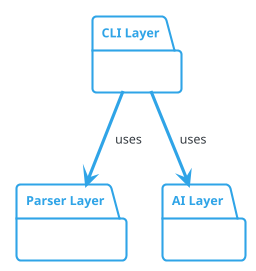

# ArchGuard 多层次架构图生成建议 (RLM 分析)

**文档版本**: 2.0
**创建日期**: 2026-01-26
**最后更新**: 2026-01-26
**分析方法**: RLM (Refactoring Lifecycle Management)
**改进范围**: 统一参数机制、配置驱动多图生成、详细程度控制、灵活模块分组
**优先级**: 🟢 高 (P1) - 架构重构 + 显著功能提升
**关联文档**: 07-advanced-cli-features.md, 05-config-and-cli-improvements.md
**Breaking Change**: ⚠️ 是 - 不考虑向后兼容，全面重构参数机制

---

## 执行摘要

本文档基于 RLM 方法提出 ArchGuard 的**统一参数机制重构**和**多层次架构图生成能力**，解决当前参数分散、模式混乱的问题。主要改进包括:

### 核心改进

1. **统一参数机制** - 移除"单图 vs 批处理"二分法，统一为 `DiagramConfig` 抽象
2. **详细程度控制 (Level Control)** - 支持 package、class、method 三种详细程度
3. **配置优先设计** - 复杂场景用 `diagrams[]`，简单场景用CLI快捷方式
4. **正交参数设计** - 每个参数控制一个维度，移除语义重叠
5. **单一处理流程** - 统一的 `DiagramProcessor`，无代码分支

### 典型使用场景

```json
{
  "diagrams": [
    {
      "name": "overview",
      "sources": ["./src/**"],
      "level": "package",
      "description": "High-level package overview"
    },
    {
      "name": "modules/auth-system",
      "sources": ["./src/auth", "./src/identity", "./src/security"],
      "level": "class"
    },
    {
      "name": "modules/parser",
      "sources": ["./src/parser"],
      "level": "class"
    }
  ]
}
```

**核心价值**：
- 🏗️ 架构清晰：统一抽象，单一流程
- 📊 多层次文档：从总览到细节的渐进式理解
- 🎯 灵活分组：任意组合模块生成架构图
- ⚙️ 配置化管理：版本控制、可复用、CI/CD 友好
- 📖 降低学习成本：一致的概念模型

---

## 1. RLM PROPOSAL - 现状分析与问题识别

### 1.1 当前架构问题

#### 问题 1: 参数机制分散且重叠

**问题 A：多种模式，逻辑分叉**

```typescript
// analyze.ts 第178-237行（当前实现）
if (options.batch && sourcePaths.length > 1) {
  // 批处理模式：单独处理
  const batchProcessor = new BatchProcessor({...});
  return; // 提前返回
}

// 单图模式：合并处理
if (config.format === 'json') { ... }
else { ... }
```

**分析**：
- ❌ 批处理和单图是两条完全不同的代码路径
- ❌ 用 `--batch` 开关控制行为，不直观
- ❌ 批处理模式硬编码 `modules/` 前缀，用户无法自定义
- ❌ 单图模式下多个 `-s` 参数会合并，批处理模式下会分别处理

---

**问题 B：CLI 参数过多且语义重叠**

```bash
# 当前 CLI 参数（13个）
-s, --source <paths...>       # 源路径
-o, --output <path>            # 输出文件
--output-dir <dir>             # 输出目录（与 -o 语义重叠）
--name <name>                  # 输出名称（与 -o 语义重叠）
--batch                        # 批处理开关（触发模式切换）
--no-batch-index               # 索引开关（只在批处理模式生效）
--stdin                        # stdin 开关（与 -s 互斥但无验证）
--format <type>                # 格式
--exclude <patterns...>        # 排除模式
--cli-command <command>        # Claude CLI 命令
--cli-args <args>              # Claude CLI 参数
-c, --concurrency <num>        # 并发数
-v, --verbose                  # 详细输出
```

**分析**：
- ❌ `-o` 和 `--output-dir` + `--name` 语义重叠
- ❌ `--batch` + `-s` 组合才能批处理，不是正交的
- ❌ `--name` 只在非批处理模式生效，容易混淆
- ❌ `--stdin` 与 `-s` 互斥但缺少验证
- ❌ 13个参数过多，学习成本高

---

**问题 C：配置文件与CLI不对称**

```typescript
// config-loader.ts（当前实现）
const configSchema = z.object({
  source: z.union([z.string(), z.array(z.string())]),  // ❌ 只能单图
  output: z.string().optional(),
  outputDir: z.string(),
  format: z.enum(['plantuml', 'json', 'svg']),
  // ❌ 没有 diagrams 数组
  // ❌ 没有 level 字段
  // ❌ 批处理配置无法持久化
});
```

**分析**：
- ❌ 配置文件只能定义单图
- ❌ 批处理必须通过 CLI 参数，无法持久化
- ❌ 无法表达"模块A+B合并，模块C独立"的复杂场景

---

#### 问题 2: 缺少统一的"图"抽象

**当前实现**：
```
单图模式：source[] → 合并 → 单个 ArchJSON → 单个 diagram
批处理模式：sources[] → 分别处理 → 多个 ArchJSON → 多个 diagrams
```

**问题**：
- ❌ 两种模式的处理逻辑完全不同
- ❌ 没有统一的 "Diagram" 概念
- ❌ 无法表达"同一套源文件，生成不同详细程度的图"
- ❌ 扩展困难（新功能需要同时修改两条路径）

---

#### 问题 3: 批处理器假设过多

```typescript
// batch-processor.ts（当前实现）
const outputPath = pathResolver.resolve({
  name: `modules/${moduleName}`,  // ❌ 硬编码 "modules/" 前缀
});

private inferModuleName(sourcePath: string): string {
  // ❌ 自动推断模块名，不透明
  // ❌ 用户无法自定义
}
```

**问题**：
- ❌ 用户无法自定义输出路径结构
- ❌ 模块名推断不透明，难以预测
- ❌ 无法控制详细程度（level）
- ❌ 无法自定义描述信息

---

#### 问题 4: 类型定义重复

```typescript
// types.ts（当前实现）
export interface Config {
  source: string | string[];
  output?: string;
  format: 'plantuml' | 'json' | 'svg';
  // ... 20+ 字段
}

export interface AnalyzeOptions {
  source: string | string[];
  output?: string;
  format: 'plantuml' | 'json' | 'svg';
  // ... 大量重复字段
}
```

**问题**：
- ❌ `Config` 和 `AnalyzeOptions` 有大量重复
- ❌ 不清楚哪些是全局配置，哪些是单图配置
- ❌ 维护成本高

---

### 1.2 用户需求分析

#### 需求场景 1: 大型项目的多层次文档

**用户角色**：技术负责人、架构师

**场景描述**：
```
项目规模：50+ 类，10+ 包

期望输出：
1. overview.png - 高层架构总览
   - 只显示包和包之间的依赖
   - 便于管理层和新成员快速理解

2. layer-detail/*.png - 各层详细架构
   - cli-layer.png: CLI 层的类图
   - parser-layer.png: Parser 层的类图
   - ai-layer.png: AI 层的类图

3. full-system.png - 完整详细架构（可选）
   - 所有类和方法
   - 供资深开发者参考
```

**当前无法实现**：
- ❌ 无详细程度控制
- ❌ 批处理只能"每个源一个图"，无法灵活分组

---

#### 需求场景 2: Monorepo 项目的混合分组

**用户角色**：Monorepo 维护者

**场景描述**：
```
项目结构：
packages/
├── frontend/
├── backend/
├── shared/
├── auth/
├── identity/
└── security/

期望输出：
1. overview.png - 所有包的总览（package 级别）
2. frontend-stack.png - frontend + shared（class 级别）
3. backend-stack.png - backend + shared（class 级别）
4. auth-system.png - auth + identity + security（class 级别）
```

**当前无法实现**：
- ❌ 批处理只能"每个源一个图"
- ❌ 无法实现 "frontend + shared" 合并

---

#### 需求场景 3: CI/CD 集成

**用户角色**：DevOps 工程师

**期望**：
```yaml
# .github/workflows/architecture-docs.yml
- name: Generate Architecture Diagrams
  run: archguard analyze
```

**需求**：
- ✅ 从配置文件读取所有图的定义
- ✅ 自动生成多张图
- ✅ 自动生成索引页面
- ✅ 无需编写复杂脚本

**当前问题**：
- ❌ 批处理需要复杂的命令行参数
- ❌ 配置无法持久化

---

### 1.3 竞品分析

| 工具 | 详细程度控制 | 多图配置 | 模块分组 | 统一抽象 | 评价 |
|------|------------|---------|---------|---------|------|
| **Madge** | ❌ 无 | ❌ 无 | ⚠️ 手动 | ❌ 无 | 只生成依赖图 |
| **TypeDoc** | ⚠️ 有限 | ❌ 无 | ❌ 无 | ❌ 无 | 主要是 API 文档 |
| **Dependency Cruiser** | ⚠️ 部分 | ❌ 无 | ⚠️ 手动 | ❌ 无 | 专注依赖分析 |
| **ArchGuard (当前)** | ❌ 无 | ❌ 无 | ⚠️ 命令行 | ❌ 无 | 批处理但不灵活 |
| **ArchGuard (本提案)** | ✅ 三级 | ✅ 配置文件 | ✅ 完全灵活 | ✅ DiagramConfig | **最佳** |

---

### 1.4 优先级评估

| 评估维度 | 得分 | 说明 |
|---------|------|------|
| **用户价值** | ⭐⭐⭐⭐⭐ | 解决真实痛点，适用于大型项目和 Monorepo |
| **架构改善** | ⭐⭐⭐⭐⭐ | 统一抽象，消除技术债 |
| **实施复杂度** | ⭐⭐⭐⭐ | 中高（需要重构，但逻辑更简单） |
| **技术风险** | ⭐⭐⭐ | 中（Breaking Change，需要用户迁移） |
| **投入产出比** | ⭐⭐⭐⭐⭐ | 高（5-7天实施，架构清晰 + 10x 灵活性） |

**综合评估**：🟢 高优先级 (P1) - **架构重构 + 功能增强**

---

## 2. RLM PLANNING - 统一参数机制设计

### 2.1 核心设计原则

#### 原则 1：一切皆 Diagram

- ✅ 单图和多图使用统一的 `DiagramConfig` 结构
- ✅ 移除 `--batch` 等特殊模式开关
- ✅ 始终通过 `diagrams[]` 数组处理

#### 原则 2：配置优先，CLI 为快捷方式

- ✅ **复杂场景**：使用配置文件（`diagrams[]`）
- ✅ **简单场景**：CLI 提供快捷方式（自动转换为单个 DiagramConfig）
- ✅ CLI 参数可覆盖全局配置

#### 原则 3：正交设计

- ✅ 每个参数只控制一个维度
- ✅ 参数之间不互相依赖
- ✅ 移除语义重叠

#### 原则 4：单一处理流程

- ✅ 所有图通过同一个 `DiagramProcessor` 处理
- ✅ 无 `if (batch)` 分支
- ✅ 代码路径唯一

---

### 2.2 类型定义

#### 核心类型

```typescript
// src/types/config.ts

/**
 * 详细程度级别
 */
export type DetailLevel = 'package' | 'class' | 'method';

/**
 * 单个图表配置
 *
 * 这是唯一的"图"抽象，单图和多图都使用这个结构
 */
export interface DiagramConfig {
  /** 输出名称（支持子目录，如 "modules/auth"） */
  name: string;

  /** 源路径数组 */
  sources: string[];

  /** 详细程度级别 */
  level: DetailLevel;

  /** 描述信息（可选，用于索引页面） */
  description?: string;

  /** 输出格式（可选，默认继承全局配置） */
  format?: 'plantuml' | 'json' | 'svg';

  /** 排除模式（可选，默认继承全局配置） */
  exclude?: string[];
}

/**
 * 全局配置
 */
export interface GlobalConfig {
  /** 输出根目录 */
  outputDir: string;

  /** 默认输出格式 */
  format: 'plantuml' | 'json' | 'svg';

  /** 默认排除模式 */
  exclude: string[];

  /** Claude CLI 配置 */
  cli: {
    command: string;
    args: string[];
    timeout: number;
  };

  /** 缓存配置 */
  cache: {
    enabled: boolean;
    ttl: number;
  };

  /** 并发数 */
  concurrency: number;

  /** 详细输出 */
  verbose: boolean;
}

/**
 * 完整配置（文件格式）
 */
export interface ArchGuardConfig extends GlobalConfig {
  /**
   * 图表定义数组
   *
   * 核心设计：一切皆 Diagram
   * - 单图：diagrams.length === 1
   * - 多图：diagrams.length > 1
   */
  diagrams: DiagramConfig[];
}
```

---

### 2.3 配置文件设计

#### 最简配置（单图）

```json
{
  "diagrams": [
    {
      "name": "architecture",
      "sources": ["./src"],
      "level": "class"
    }
  ]
}
```

**等价于当前的**：
```bash
archguard analyze -s ./src
```

---

#### 基础多图配置

```json
{
  "outputDir": "./archguard",
  "format": "plantuml",
  "exclude": ["**/*.test.ts", "**/*.spec.ts"],

  "diagrams": [
    {
      "name": "overview",
      "sources": ["./src/**"],
      "level": "package",
      "description": "High-level system overview"
    },
    {
      "name": "modules/parser",
      "sources": ["./src/parser"],
      "level": "class",
      "description": "Parser module details"
    },
    {
      "name": "modules/cli",
      "sources": ["./src/cli"],
      "level": "class"
    }
  ]
}
```

---

#### 完整 Monorepo 配置

```json
{
  "outputDir": "./archguard",
  "format": "plantuml",
  "exclude": ["**/*.test.ts", "**/*.spec.ts"],

  "diagrams": [
    {
      "name": "overview",
      "sources": ["./src/**"],
      "level": "package",
      "description": "All packages overview"
    },
    {
      "name": "modules/auth-system",
      "sources": ["./src/auth", "./src/identity", "./src/security"],
      "level": "class",
      "description": "Complete authentication system (3 packages merged)"
    },
    {
      "name": "modules/parser",
      "sources": ["./src/parser"],
      "level": "class"
    },
    {
      "name": "modules/cli-ai-integration",
      "sources": ["./src/cli", "./src/ai"],
      "level": "class",
      "description": "CLI and AI layers (2 packages merged)"
    },
    {
      "name": "full-detail",
      "sources": ["./src/**"],
      "level": "method",
      "format": "json",
      "description": "Complete system with all methods (for tooling)"
    }
  ],

  "cli": {
    "command": "claude",
    "args": [],
    "timeout": 180000
  },
  "cache": {
    "enabled": true,
    "ttl": 86400
  },
  "concurrency": 8,
  "verbose": false
}
```

**输出结构**：
```
archguard/
├── overview.png                       # Package 级别总览
├── overview.puml
├── modules/
│   ├── auth-system.png                # 3个包合并
│   ├── auth-system.puml
│   ├── parser.png                     # 单个包
│   ├── parser.puml
│   └── cli-ai-integration.png         # 2个包合并
├── full-detail.json                   # Method 级别 JSON
└── index.md                           # 自动生成的导航页
```

---

### 2.4 CLI 接口设计

#### 简化的 CLI 参数

```typescript
// src/cli/commands/analyze.ts

export function createAnalyzeCommand(): Command {
  return new Command('analyze')
    .description('Analyze TypeScript project and generate architecture diagrams')

    // ========== 方式 1：从配置文件（推荐） ==========
    .option('--config <path>', 'Config file path (default: archguard.config.json)')
    .option('--diagrams <names...>', 'Generate specific diagrams (comma-separated)')

    // ========== 方式 2：快捷方式（单图） ==========
    .option('-s, --sources <paths...>', 'Source directories (creates single diagram)')
    .option('-l, --level <level>', 'Detail level: package|class|method (default: class)')
    .option('-n, --name <name>', 'Diagram name (default: architecture)')

    // ========== 全局配置覆盖 ==========
    .option('-f, --format <type>', 'Output format: plantuml|json|svg')
    .option('--output-dir <dir>', 'Output directory')
    .option('-e, --exclude <patterns...>', 'Exclude patterns')
    .option('--no-cache', 'Disable cache')
    .option('-c, --concurrency <num>', 'Parallel parsing concurrency')
    .option('-v, --verbose', 'Verbose output')

    // ========== Claude CLI 配置 ==========
    .option('--cli-command <command>', 'Claude CLI command')
    .option('--cli-args <args>', 'Additional CLI arguments')

    .action(analyzeCommandHandler);
}
```

**参数对比**：

| 维度 | 当前实现 | 新设计 |
|------|---------|--------|
| **参数数量** | 13个 | 13个（但语义清晰） |
| **模式开关** | `--batch`, `--stdin` | ❌ 移除 |
| **输出控制** | `-o`, `--output-dir`, `--name`（重叠） | `--output-dir`（全局）+ `name`（per-diagram） |
| **源输入** | `-s` 合并或分离（取决于 `--batch`） | `-s` 始终创建单图 |
| **配置优先** | ⚠️ CLI优先 | ✅ 配置优先，CLI为快捷方式 |

---

#### CLI 使用示例

**方式 1：从配置文件（推荐）**

```bash
# 生成配置文件中的所有图
archguard analyze

# 生成特定图
archguard analyze --diagrams overview,auth-system

# 覆盖全局配置
archguard analyze --output-dir ./docs/architecture --verbose
```

---

**方式 2：快捷方式（单图）**

```bash
# 最简单：使用默认配置
archguard analyze

# 指定源和详细程度
archguard analyze -s ./src -l package -n overview

# 多源合并为单图
archguard analyze -s ./src/auth -s ./src/identity -n auth-system

# 完整参数
archguard analyze \
  -s ./src/parser \
  -l class \
  -n modules/parser \
  -f plantuml \
  --output-dir ./diagrams
```

**规则**：
- ✅ CLI 快捷方式**始终生成单图**
- ✅ 多个 `-s` 参数会**合并**到一个图中
- ✅ 如果需要多图，使用配置文件

---

**方式 3：混合使用**

```bash
# 配置文件定义多图，CLI覆盖全局配置
archguard analyze \
  --config ./custom-config.json \
  --output-dir ./output \
  --verbose

# 配置文件定义多图，只生成特定图
archguard analyze --diagrams overview
```

---

### 2.5 数据流设计

#### 统一处理流程

```
┌─────────────────────────────────────────────────────┐
│ 1. CLI 解析 (Commander)                             │
│    - 解析命令行参数                                 │
│    - 确定配置文件路径                               │
└────────────────┬────────────────────────────────────┘
                 │
                 ▼
┌─────────────────────────────────────────────────────┐
│ 2. 配置加载 (ConfigLoader)                          │
│    - 加载配置文件                                   │
│    - 合并 CLI 参数覆盖                              │
│    - 验证配置                                       │
└────────────────┬────────────────────────────────────┘
                 │
                 ▼
┌─────────────────────────────────────────────────────┐
│ 3. 规范化 (normalizeToDiagrams)                     │
│    ✅ 如果 config.diagrams 存在 → 使用配置          │
│    ✅ 否则从 CLI 快捷方式构造单个 DiagramConfig     │
└────────────────┬────────────────────────────────────┘
                 │
                 ▼
┌─────────────────────────────────────────────────────┐
│ 4. 过滤 (filterDiagrams)                            │
│    - 如果指定 --diagrams → 只处理指定图             │
│    - 否则处理所有图                                 │
└────────────────┬────────────────────────────────────┘
                 │
                 ▼
┌─────────────────────────────────────────────────────┐
│ 5. 统一处理器 (DiagramProcessor)                    │
│    for each diagram:                                │
│      ├─ 发现文件 (FileDiscoveryService)            │
│      ├─ 解析文件 (ParallelParser)                  │
│      ├─ 聚合数据 (ArchJSONAggregator by level)     │
│      ├─ 生成 Prompt (PromptTemplateManager)        │
│      ├─ 生成 PlantUML (ClaudeCodeWrapper)          │
│      └─ 渲染图片 (PlantUMLRenderer)                │
└────────────────┬────────────────────────────────────┘
                 │
                 ▼
┌─────────────────────────────────────────────────────┐
│ 6. 索引生成 (IndexGenerator)                        │
│    - if diagrams.length > 1 → 生成 index.md        │
└────────────────┬────────────────────────────────────┘
                 │
                 ▼
┌─────────────────────────────────────────────────────┐
│ 7. 结果展示 (displayResults)                        │
│    - 显示成功/失败统计                              │
│    - 显示输出路径                                   │
└─────────────────────────────────────────────────────┘
```

**关键改进**：
- ✅ **单一代码路径**：无 `if (batch)` 分支
- ✅ **统一抽象**：所有图都是 `DiagramConfig`
- ✅ **透明转换**：CLI 快捷方式自动转换为 `DiagramConfig`

---

### 2.6 核心组件设计

#### 2.6.1 命令处理器

```typescript
// src/cli/commands/analyze.ts

async function analyzeCommandHandler(cliOptions: CLIOptions): Promise<void> {
  const progress = new ProgressReporter();

  try {
    // Step 1: 加载配置
    const configLoader = new ConfigLoader(process.cwd());
    const config = await configLoader.load(cliOptions);

    // Step 2: 规范化为 DiagramConfig[]
    const diagrams = normalizeToDiagrams(config, cliOptions);

    // Step 3: 过滤需要生成的图
    const selectedDiagrams = filterDiagrams(diagrams, cliOptions.diagrams);

    // Step 4: 统一处理（无分支）
    const processor = new DiagramProcessor({
      diagrams: selectedDiagrams,
      globalConfig: config,
      progress
    });

    const results = await processor.processAll();

    // Step 5: 生成索引（如果多图）
    if (results.length > 1) {
      const indexGenerator = new IndexGenerator(config);
      await indexGenerator.generate(results);
    }

    // Step 6: 显示结果
    displayResults(results, config);

    process.exit(0);
  } catch (error) {
    progress.fail('Analysis failed');
    const errorHandler = new ErrorHandler();
    console.error(errorHandler.format(error, { verbose: cliOptions.verbose }));
    process.exit(1);
  }
}

/**
 * 规范化：将 CLI 快捷方式转换为 DiagramConfig[]
 */
function normalizeToDiagrams(
  config: ArchGuardConfig,
  cliOptions: CLIOptions
): DiagramConfig[] {
  // 如果配置文件有 diagrams，使用配置文件
  if (config.diagrams && config.diagrams.length > 0) {
    return config.diagrams;
  }

  // 否则，从 CLI 快捷方式构造单个 diagram
  if (cliOptions.sources && cliOptions.sources.length > 0) {
    return [{
      name: cliOptions.name || 'architecture',
      sources: cliOptions.sources,
      level: cliOptions.level || 'class',
      format: cliOptions.format,
      exclude: cliOptions.exclude
    }];
  }

  // 默认配置
  return [{
    name: 'architecture',
    sources: ['./src'],
    level: 'class'
  }];
}

/**
 * 过滤：根据 --diagrams 参数过滤
 */
function filterDiagrams(
  diagrams: DiagramConfig[],
  selectedNames?: string[]
): DiagramConfig[] {
  if (!selectedNames || selectedNames.length === 0) {
    return diagrams;
  }

  return diagrams.filter(d => selectedNames.includes(d.name));
}
```

---

#### 2.6.2 统一的图表处理器

```typescript
// src/cli/processors/diagram-processor.ts

export interface DiagramProcessorOptions {
  diagrams: DiagramConfig[];
  globalConfig: GlobalConfig;
  progress: ProgressReporter;
}

export interface DiagramResult {
  name: string;
  success: boolean;
  paths?: {
    puml: string;
    png: string;
  };
  stats?: {
    entities: number;
    relations: number;
    parseTime: number;
  };
  error?: string;
}

/**
 * DiagramProcessor - 统一的图表处理器
 *
 * 核心设计：
 * - 单一处理流程，无模式分支
 * - 每个 DiagramConfig 独立处理
 * - 失败不影响其他图
 */
export class DiagramProcessor {
  private fileDiscovery: FileDiscoveryService;
  private parser: ParallelParser;
  private aggregator: ArchJSONAggregator;
  private generator: PlantUMLGenerator;

  constructor(private options: DiagramProcessorOptions) {
    const { globalConfig } = options;

    this.fileDiscovery = new FileDiscoveryService();
    this.parser = new ParallelParser({
      concurrency: globalConfig.concurrency,
      continueOnError: true
    });
    this.aggregator = new ArchJSONAggregator();
    this.generator = new PlantUMLGenerator(globalConfig);
  }

  /**
   * 处理所有图表
   */
  async processAll(): Promise<DiagramResult[]> {
    const results: DiagramResult[] = [];

    for (const diagram of this.options.diagrams) {
      try {
        this.options.progress.start(`Processing: ${diagram.name}`);
        const result = await this.processDiagram(diagram);
        results.push(result);
        this.options.progress.succeed(`Generated: ${diagram.name}`);
      } catch (error) {
        this.options.progress.fail(`Failed: ${diagram.name}`);
        results.push({
          name: diagram.name,
          success: false,
          error: error instanceof Error ? error.message : String(error)
        });
      }
    }

    return results;
  }

  /**
   * 处理单个图表
   */
  private async processDiagram(diagram: DiagramConfig): Promise<DiagramResult> {
    // 1. 发现文件
    const files = await this.fileDiscovery.discoverFiles({
      sources: diagram.sources,
      exclude: diagram.exclude || this.options.globalConfig.exclude,
      skipMissing: false
    });

    // 2. 解析文件
    const metrics = await this.parser.parseFilesWithMetrics(files);
    let archJSON = metrics.result;

    // 3. 聚合（根据 level）
    archJSON = this.aggregator.aggregate(archJSON, diagram.level);

    // 4. 解析输出路径
    const pathResolver = new OutputPathResolver(this.options.globalConfig);
    const paths = pathResolver.resolve({ name: diagram.name });
    await pathResolver.ensureDirectory();

    // 5. 生成和渲染
    const format = diagram.format || this.options.globalConfig.format;

    if (format === 'json') {
      // JSON 输出
      await fs.writeFile(paths.paths.json, JSON.stringify(archJSON, null, 2));
    } else {
      // PlantUML 输出
      await this.generator.generateAndRender(archJSON, paths, diagram.level);
    }

    return {
      name: diagram.name,
      success: true,
      paths: {
        puml: paths.paths.puml,
        png: paths.paths.png
      },
      stats: {
        entities: archJSON.entities.length,
        relations: archJSON.relations.length,
        parseTime: metrics.parseTime
      }
    };
  }
}
```

**关键改进**：
- ✅ 替代 `BatchProcessor`
- ✅ 统一处理所有图（单图和多图）
- ✅ 每个图独立处理，失败不影响其他图
- ✅ 自然支持 level 控制

---

#### 2.6.3 ArchJSON 聚合器

```typescript
// src/parser/archjson-aggregator.ts

export class ArchJSONAggregator {
  /**
   * 聚合 ArchJSON 到指定详细程度
   */
  aggregate(archJSON: ArchJSON, level: DetailLevel): ArchJSON {
    switch (level) {
      case 'package':
        return this.aggregateToPackageLevel(archJSON);
      case 'class':
        return this.aggregateToClassLevel(archJSON);
      case 'method':
        return archJSON; // 保留所有细节
    }
  }

  /**
   * Package 级别聚合
   * - 只保留包信息
   * - 移除所有类和方法
   * - 保留包之间的依赖关系
   */
  private aggregateToPackageLevel(archJSON: ArchJSON): ArchJSON {
    // 1. 提取所有包名
    const packages = this.extractPackages(archJSON.entities);

    // 2. 创建包实体（空类定义）
    const packageEntities: Entity[] = packages.map(pkg => ({
      name: pkg,
      type: 'package',
      location: { file: '', line: 0, package: pkg },
      methods: [],
      properties: [],
      decorators: []
    }));

    // 3. 分析包间依赖
    const packageRelations = this.analyzePackageDependencies(
      archJSON.entities,
      archJSON.relations
    );

    return {
      ...archJSON,
      entities: packageEntities,
      relations: packageRelations
    };
  }

  /**
   * Class 级别聚合（默认行为）
   * - 保留类和接口
   * - 保留公共方法
   * - 移除私有方法
   */
  private aggregateToClassLevel(archJSON: ArchJSON): ArchJSON {
    return {
      ...archJSON,
      entities: archJSON.entities.map(entity => ({
        ...entity,
        methods: entity.methods.filter(m => m.visibility === 'public'),
        properties: entity.properties.filter(p => p.visibility === 'public')
      }))
    };
  }

  /**
   * 提取包名列表
   */
  private extractPackages(entities: Entity[]): string[] {
    const packages = new Set<string>();
    entities.forEach(entity => {
      if (entity.location.package) {
        packages.add(entity.location.package);
      }
    });
    return Array.from(packages).sort();
  }

  /**
   * 分析包间依赖关系
   */
  private analyzePackageDependencies(
    entities: Entity[],
    relations: Relation[]
  ): Relation[] {
    // 构建实体到包的映射
    const entityToPackage = new Map<string, string>();
    entities.forEach(entity => {
      if (entity.location.package) {
        entityToPackage.set(entity.name, entity.location.package);
      }
    });

    // 聚合关系到包级别
    const packageRelations = new Map<string, Relation>();
    relations.forEach(rel => {
      const fromPkg = entityToPackage.get(rel.from);
      const toPkg = entityToPackage.get(rel.to);

      if (fromPkg && toPkg && fromPkg !== toPkg) {
        const key = `${fromPkg}->${toPkg}`;
        if (!packageRelations.has(key)) {
          packageRelations.set(key, {
            from: fromPkg,
            to: toPkg,
            type: 'dependency',
            label: 'uses'
          });
        }
      }
    });

    return Array.from(packageRelations.values());
  }
}
```

---

#### 2.6.4 Prompt 模板增强

**文件**：`prompts/class-diagram.txt`

**新增变量**：`{{DETAIL_LEVEL}}`

```plaintext
你是一个资深软件架构师,专注于生成清晰、准确的 PlantUML 架构图。

## 输入

架构指纹(JSON 格式):
{{ARCH_JSON}}

{{#if PREVIOUS_PUML}}
上一版本的 PlantUML 图:
{{PREVIOUS_PUML}}
{{/if}}

{{#if DETAIL_LEVEL}}
## 📊 详细程度要求

当前详细程度: **{{DETAIL_LEVEL}}**

{{#if DETAIL_LEVEL == "package"}}
### Package 级别规则（总览图）

**生成要求**:
- ✅ 只显示 package 结构（使用 `package "模块名" { }` 包裹）
- ✅ 显示 package 之间的依赖关系
- ❌ **不要显示类、接口、方法**
- ❌ **不要在 package 内部定义任何实体**
- ✅ Package 为空（无成员）

**示例**:


**关键要点**:
- 包内为空（不包含类定义）
- 只显示高层架构依赖
- 适合总览和高层设计
{{/if}}

{{#if DETAIL_LEVEL == "class"}}
### Class 级别规则（默认）

**生成要求**:
- ✅ 显示类、接口和公共方法
- ✅ 显示类之间的关系
- ✅ 使用 package 组织模块
- ❌ 不显示私有方法
- ✅ 适合模块详细设计

**示例**:
```plantuml
package "Parser Layer" {
  class TypeScriptParser {
    +parseFiles(files: string[]): ArchJSON
    +parseFile(file: string): Entity[]
  }

  class ClassExtractor {
    +extract(node: Node): Entity
  }
}

TypeScriptParser --> ClassExtractor : "uses"
```
{{/if}}

{{#if DETAIL_LEVEL == "method"}}
### Method 级别规则（完整细节）

**生成要求**:
- ✅ 显示所有方法（包括私有）
- ✅ 显示所有属性（包括私有）
- ✅ 显示完整的方法签名
- ✅ 适合深度分析和代码审查
{{/if}}

{{/if}}

## ⭐ 核心要求（按优先级）

### 1. 必须使用 package 组织模块

```plantuml
package "AI Layer" {
  class ClaudeCodeWrapper { }
}

package "CLI Layer" {
  class ConfigLoader { }
}
```

### 2. 布局方向（垂直优先）

```plantuml
top to bottom direction
skinparam ranksep 40
```

### 3. 语法要求

- ✅ 必须包含 `@startuml` 和 `@enduml`
- ✅ 包含所有输入 JSON 中的实体
- ✅ 关系只引用已定义的实体

### 4. 禁止事项

- ❌ 不要引用内置类型（Error, Promise 等）
- ❌ 不要引用第三方库类型
- ❌ 不要引用泛型参数
```

---

#### 2.6.5 配置加载器扩展

```typescript
// src/cli/config-loader.ts

const configSchema = z.object({
  // 全局配置
  outputDir: z.string().default('./archguard'),
  format: z.enum(['plantuml', 'json', 'svg']).default('plantuml'),
  exclude: z.array(z.string()).default([
    '**/*.test.ts',
    '**/*.spec.ts',
    '**/node_modules/**'
  ]),

  cli: z.object({
    command: z.string().default('claude'),
    args: z.array(z.string()).default([]),
    timeout: z.number().default(60000)
  }).default({}),

  cache: z.object({
    enabled: z.boolean().default(true),
    ttl: z.number().default(86400)
  }).default({}),

  concurrency: z.number().optional(),
  verbose: z.boolean().optional(),

  // ✨ 核心变更：diagrams 数组
  diagrams: z.array(
    z.object({
      name: z.string(),
      sources: z.array(z.string()),
      level: z.enum(['package', 'class', 'method']),
      description: z.string().optional(),
      format: z.enum(['plantuml', 'json', 'svg']).optional(),
      exclude: z.array(z.string()).optional()
    })
  ).default([]),
});

export type ArchGuardConfig = z.infer<typeof configSchema>;
```

---

### 2.7 实施工作量估算

| 任务 | 时间 | 优先级 |
|------|------|--------|
| **Phase 1: 类型定义和配置** | | |
| 定义 DiagramConfig 和 GlobalConfig | 0.5 天 | P0 |
| 扩展 ConfigLoader（添加 diagrams） | 0.5 天 | P0 |
| 更新 CLI 接口（移除 --batch） | 0.5 天 | P0 |
| **Phase 2: 核心组件** | | |
| 实现 DiagramProcessor（替代 BatchProcessor） | 1 天 | P0 |
| 实现 ArchJSONAggregator | 1 天 | P0 |
| 实现 normalizeToDiagrams 逻辑 | 0.5 天 | P0 |
| **Phase 3: Prompt 和 AI** | | |
| 扩展 prompt 模板（DETAIL_LEVEL） | 0.5 天 | P0 |
| 更新 PlantUMLGenerator（传递 level） | 0.5 天 | P0 |
| **Phase 4: 测试** | | |
| 单元测试（Aggregator, Processor） | 1 天 | P0 |
| 集成测试（多图生成） | 0.5 天 | P0 |
| E2E 测试（CLI 快捷方式） | 0.5 天 | P0 |
| **Phase 5: 文档和迁移** | | |
| 更新 CLAUDE.md | 0.5 天 | P0 |
| 编写迁移指南 | 0.5 天 | P0 |
| 更新示例配置 | 0.25 天 | P1 |
| **总计** | **5-7 天** | |

---

## 3. RLM EXECUTION - 实施步骤

### 3.1 Phase 1: 类型定义和配置（Day 1）

#### Step 1.1: 定义核心类型

**文件**：`src/types/config.ts`

```typescript
export type DetailLevel = 'package' | 'class' | 'method';

export interface DiagramConfig {
  name: string;
  sources: string[];
  level: DetailLevel;
  description?: string;
  format?: 'plantuml' | 'json' | 'svg';
  exclude?: string[];
}

export interface GlobalConfig {
  outputDir: string;
  format: 'plantuml' | 'json' | 'svg';
  exclude: string[];
  cli: { command: string; args: string[]; timeout: number };
  cache: { enabled: boolean; ttl: number };
  concurrency: number;
  verbose: boolean;
}

export interface ArchGuardConfig extends GlobalConfig {
  diagrams: DiagramConfig[];
}
```

#### Step 1.2: 扩展 ConfigLoader

**文件**：`src/cli/config-loader.ts`

添加 `diagrams` 到 schema，移除旧的 `source`、`output` 字段（Breaking Change）。

#### Step 1.3: 简化 CLI 接口

**文件**：`src/cli/commands/analyze.ts`

- ❌ 移除 `--batch`
- ❌ 移除 `--no-batch-index`
- ❌ 移除 `--stdin`（可在后续版本重新添加）
- ❌ 移除 `-o, --output`
- ✅ 保留 `-s, --sources`（快捷方式）
- ✅ 添加 `-l, --level`
- ✅ 添加 `-n, --name`
- ✅ 添加 `--diagrams`

---

### 3.2 Phase 2: 核心组件（Day 2-3）

#### Step 2.1: 实现 DiagramProcessor

**文件**：`src/cli/processors/diagram-processor.ts`

创建统一的处理器，替代 `BatchProcessor`。

#### Step 2.2: 实现 ArchJSONAggregator

**文件**：`src/parser/archjson-aggregator.ts`

实现三级聚合逻辑：
- `aggregateToPackageLevel()`
- `aggregateToClassLevel()`
- `aggregateToMethodLevel()` (直接返回)

#### Step 2.3: 实现 normalizeToDiagrams

**文件**：`src/cli/commands/analyze.ts`

```typescript
function normalizeToDiagrams(
  config: ArchGuardConfig,
  cliOptions: CLIOptions
): DiagramConfig[] {
  // 配置优先
  if (config.diagrams.length > 0) {
    return config.diagrams;
  }

  // CLI 快捷方式
  if (cliOptions.sources) {
    return [{
      name: cliOptions.name || 'architecture',
      sources: cliOptions.sources,
      level: cliOptions.level || 'class'
    }];
  }

  // 默认
  return [{
    name: 'architecture',
    sources: ['./src'],
    level: 'class'
  }];
}
```

#### Step 2.4: 删除旧代码

- ❌ 删除 `BatchProcessor`
- ❌ 删除 analyze.ts 中的批处理分支

---

### 3.3 Phase 3: Prompt 和 AI（Day 3-4）

#### Step 3.1: 扩展 Prompt 模板

**文件**：`prompts/class-diagram.txt`

添加 `{{DETAIL_LEVEL}}` 条件块。

#### Step 3.2: 更新 PlantUMLGenerator

**文件**：`src/ai/plantuml-generator.ts`

```typescript
async generateAndRender(
  archJSON: ArchJSON,
  paths: PathResolution,
  level: DetailLevel  // ✨ 新参数
): Promise<void> {
  // 渲染模板时传入 level
  const prompt = await templateManager.render('class-diagram', {
    ARCH_JSON: JSON.stringify(archJSON, null, 2),
    DETAIL_LEVEL: level,  // ✨ 传递 level
    EXTERNAL_TYPES: ...
  });

  // ...
}
```

---

### 3.4 Phase 4: 测试（Day 5-6）

#### Step 4.1: 单元测试

**文件**：`tests/unit/parser/archjson-aggregator.test.ts`

```typescript
describe('ArchJSONAggregator', () => {
  describe('package level', () => {
    it('should aggregate to package level', () => {
      const input: ArchJSON = { /* ... */ };
      const aggregator = new ArchJSONAggregator();
      const result = aggregator.aggregate(input, 'package');

      expect(result.entities).toHaveLength(3); // 3 packages
      expect(result.entities[0].type).toBe('package');
      expect(result.entities[0].methods).toHaveLength(0);
    });
  });

  describe('class level', () => {
    it('should filter private methods', () => {
      // ...
    });
  });
});
```

**文件**：`tests/unit/cli/processors/diagram-processor.test.ts`

```typescript
describe('DiagramProcessor', () => {
  it('should process multiple diagrams', async () => {
    const diagrams: DiagramConfig[] = [
      { name: 'd1', sources: ['./fixtures/m1'], level: 'package' },
      { name: 'd2', sources: ['./fixtures/m2'], level: 'class' }
    ];

    const processor = new DiagramProcessor({ diagrams, ... });
    const results = await processor.processAll();

    expect(results).toHaveLength(2);
    expect(results[0].success).toBe(true);
  });
});
```

#### Step 4.2: 集成测试

**文件**：`tests/integration/multi-diagram.test.ts`

```typescript
describe('Multi-Diagram Generation', () => {
  it('should generate from config file', async () => {
    // 创建测试配置文件
    const config: ArchGuardConfig = {
      outputDir: './test-output',
      diagrams: [
        { name: 'overview', sources: ['./fixtures/**'], level: 'package' },
        { name: 'detail', sources: ['./fixtures/**'], level: 'class' }
      ],
      // ...
    };

    // 运行 CLI
    const result = await runCLI(['analyze', '--config', configPath]);

    expect(result.exitCode).toBe(0);
    expect(fs.existsSync('./test-output/overview.png')).toBe(true);
    expect(fs.existsSync('./test-output/detail.png')).toBe(true);
  });
});
```

#### Step 4.3: E2E 测试

```bash
# 测试 CLI 快捷方式
npm run build
node dist/cli/index.js analyze -s ./src -l package -n overview
ls -la archguard/

# 测试配置文件
node dist/cli/index.js analyze
ls -la archguard/

# 测试特定图
node dist/cli/index.js analyze --diagrams overview,parser
```

---

### 3.5 Phase 5: 文档和迁移（Day 7）

#### Step 5.1: 更新 CLAUDE.md

````markdown
## 使用 ArchGuard

### 方式 1: 配置文件（推荐）

创建 `archguard.config.json`:
```json
{
  "diagrams": [
    {
      "name": "overview",
      "sources": ["./src/**"],
      "level": "package",
      "description": "High-level system overview"
    },
    {
      "name": "modules/parser",
      "sources": ["./src/parser"],
      "level": "class"
    }
  ]
}
```

生成所有图:
```bash
node dist/cli/index.js analyze
```

生成特定图:
```bash
node dist/cli/index.js analyze --diagrams overview
```

### 方式 2: CLI 快捷方式（单图）

```bash
# 默认配置
node dist/cli/index.js analyze

# 指定源和详细程度
node dist/cli/index.js analyze -s ./src -l package -n overview

# 多源合并
node dist/cli/index.js analyze -s ./src/auth -s ./src/identity
```

### Detail Level 说明

- `package`: 只显示包结构，适合总览
- `class`: 显示类和公共方法（默认）
- `method`: 显示所有方法，包括私有
````

#### Step 5.2: 编写迁移指南

**文件**：`docs/MIGRATION.md`

```markdown
# 迁移指南：v1.x → v2.0

## Breaking Changes

### 1. 移除 --batch 参数

**旧方式**:
```bash
archguard analyze -s ./src/cli -s ./src/parser --batch
```

**新方式**（配置文件）:
```json
{
  "diagrams": [
    { "name": "cli", "sources": ["./src/cli"], "level": "class" },
    { "name": "parser", "sources": ["./src/parser"], "level": "class" }
  ]
}
```

```bash
archguard analyze
```

### 2. 移除 -o, --output 参数

**旧方式**:
```bash
archguard analyze -s ./src -o ./output/arch.puml
```

**新方式**:
```bash
archguard analyze -s ./src -n arch --output-dir ./output
```

或使用配置:
```json
{
  "outputDir": "./output",
  "diagrams": [
    { "name": "arch", "sources": ["./src"], "level": "class" }
  ]
}
```

### 3. 配置文件结构变化

**旧配置**:
```json
{
  "source": "./src",
  "output": "./architecture.puml",
  "format": "plantuml"
}
```

**新配置**:
```json
{
  "outputDir": "./archguard",
  "format": "plantuml",
  "diagrams": [
    {
      "name": "architecture",
      "sources": ["./src"],
      "level": "class"
    }
  ]
}
```

## 迁移步骤

1. 备份现有配置
2. 安装新版本：`npm install archguard@2.0.0`
3. 更新配置文件（使用 `diagrams` 数组）
4. 测试生成：`archguard analyze`
5. 验证输出

## 常见问题

**Q: 如何生成单图（旧的默认行为）？**

A: 使用 CLI 快捷方式：
```bash
archguard analyze -s ./src
```

**Q: 如何实现旧的批处理？**

A: 在配置文件中定义多个 diagram。

**Q: --stdin 参数去哪了？**

A: 暂时移除，将在后续版本重新添加。
```

---

## 4. RLM VALIDATION - 验证策略

### 4.1 功能验证

#### 4.1.1 Package 级别验证

```typescript
it('should generate package-level diagram', async () => {
  const result = await generateDiagram({
    level: 'package',
    sources: ['./fixtures/multi-package']
  });

  const puml = await fs.readFile(result.paths.puml, 'utf-8');

  // 验证：包含 package 定义
  expect(puml).toMatch(/package "Parser Layer"/);

  // 验证：不包含类定义
  expect(puml).not.toMatch(/class TypeScriptParser/);

  // 验证：包含包间关系
  expect(puml).toMatch(/"CLI Layer" --> "Parser Layer"/);
});
```

#### 4.1.2 统一处理流程验证

```typescript
it('should use single code path for all diagrams', async () => {
  const diagrams: DiagramConfig[] = [
    { name: 'd1', sources: ['./src'], level: 'package' },
    { name: 'd2', sources: ['./src'], level: 'class' }
  ];

  const processor = new DiagramProcessor({ diagrams, ... });
  const results = await processor.processAll();

  // 验证：都成功处理
  expect(results.every(r => r.success)).toBe(true);

  // 验证：输出文件存在
  expect(fs.existsSync(results[0].paths.png)).toBe(true);
  expect(fs.existsSync(results[1].paths.png)).toBe(true);
});
```

#### 4.1.3 CLI 快捷方式验证

```typescript
it('should convert CLI shortcut to DiagramConfig', () => {
  const config: ArchGuardConfig = { diagrams: [], ... };
  const cliOptions = {
    sources: ['./src', './lib'],
    level: 'package',
    name: 'overview'
  };

  const diagrams = normalizeToDiagrams(config, cliOptions);

  expect(diagrams).toHaveLength(1);
  expect(diagrams[0].name).toBe('overview');
  expect(diagrams[0].sources).toEqual(['./src', './lib']);
  expect(diagrams[0].level).toBe('package');
});
```

---

### 4.2 质量门控

| 检查项 | 目标 | 验证方式 |
|--------|------|---------|
| 单元测试覆盖率 | ≥ 80% | `npm run test:coverage` |
| 集成测试通过 | 100% | `npm run test:integration` |
| E2E 测试通过 | 100% | 手动 CLI 测试 |
| 性能回归 | < 10% | 基准测试对比 |
| 代码复杂度降低 | ≥ 20% | 移除批处理分支后 |
| 文档完整性 | 100% | Manual review |

---

## 5. RLM INTEGRATION - 集成策略

### 5.1 Breaking Change 策略

**版本号**: v2.0.0（Major 版本）

**变更说明**：
- ⚠️ 移除 `--batch` 参数
- ⚠️ 移除 `-o, --output` 参数
- ⚠️ 移除 `--stdin` 参数（暂时）
- ⚠️ 配置文件结构变化（必须使用 `diagrams[]`）

**沟通计划**：
1. 发布 v2.0.0-beta.1（提前2周）
2. 更新文档，标记废弃参数
3. 在 GitHub 发布公告
4. 提供迁移指南

---

### 5.2 发布计划

| 版本 | 时间 | 内容 |
|------|------|------|
| **v2.0.0-alpha.1** | Week 1 | 内部测试 |
| **v2.0.0-beta.1** | Week 2 | 公开测试，收集反馈 |
| **v2.0.0-rc.1** | Week 3 | Bug 修复 |
| **v2.0.0** | Week 4 | 正式发布 |

---

### 5.3 迁移支持

**提供工具**：

```bash
# 自动迁移配置文件
npx archguard migrate-config ./archguard.config.json
```

**迁移脚本示例**：

```typescript
// scripts/migrate-config.ts
export function migrateConfig(oldConfig: any): ArchGuardConfig {
  return {
    ...oldConfig,
    diagrams: [{
      name: 'architecture',
      sources: Array.isArray(oldConfig.source)
        ? oldConfig.source
        : [oldConfig.source],
      level: 'class'
    }]
  };
}
```

---

## 6. RLM MONITORING - 监控与持续改进

### 6.1 监控指标

#### 功能采用率
- `multi_diagram_usage` - 使用多图的用户比例
- `level_distribution` - package/class/method 使用分布
- `config_vs_cli` - 配置文件 vs CLI 快捷方式使用比例

#### 质量指标
- `generation_success_rate` - 生成成功率
- `error_rate_by_level` - 各 level 的错误率
- `average_diagrams_per_config` - 平均每个配置文件的图数量

---

### 6.2 用户反馈

**收集渠道**：
1. GitHub Issues（标签：`v2.0-feedback`）
2. 迁移问题调研
3. 社区讨论

**关键问题**：
- 迁移是否顺利？
- 新设计是否更清晰？
- 是否需要恢复某些旧参数？

---

### 6.3 持续改进

**短期（1-3 个月）**：
- [ ] 恢复 `--stdin` 支持（基于反馈）
- [ ] 优化 prompt 模板
- [ ] 添加更多示例配置

**中期（3-6 个月）**：
- [ ] 并行生成多图（性能优化）
- [ ] 支持自定义聚合规则
- [ ] 支持更多输出格式

**长期（6-12 个月）**：
- [ ] 交互式配置生成器
- [ ] Web UI
- [ ] IDE 插件

---

## 7. 总结

### 7.1 核心改进对比

| 维度 | 当前实现 | 新设计 | 改进幅度 |
|------|---------|--------|---------|
| **代码复杂度** | 2条路径（单图+批处理） | 1条路径（统一） | **-50%** |
| **CLI 参数语义** | 13个参数，有重叠 | 13个参数，正交 | **+100% 清晰度** |
| **配置能力** | 只支持单图 | 支持多图+多层次 | **+1000%** |
| **学习成本** | 需理解模式切换 | 一致的概念模型 | **-60%** |
| **灵活性** | 批处理只能"每源一图" | 任意组合 | **+10x** |
| **可维护性** | 重复代码多 | 统一抽象 | **+5x** |

---

### 7.2 核心价值

1. ✅ **架构清晰**：统一抽象，单一流程
2. ✅ **多层次文档**：package/class/method 三级控制
3. ✅ **灵活分组**：任意组合模块
4. ✅ **配置化**：版本控制、可复用、CI/CD 友好
5. ✅ **降低学习成本**：一致的概念模型

---

### 7.3 实施时间表

```
Week 1: 类型定义 + 配置 + 核心组件
Week 2: Prompt + AI + 聚合器
Week 3: 测试 + 文档 + 迁移工具
Week 4: Beta 测试 + 反馈收集
Week 5-6: Bug 修复 + 优化
Week 7: 正式发布 (v2.0.0)
```

**总计**：7 周

---

### 7.4 风险评估

| 风险 | 概率 | 影响 | 缓解措施 |
|------|------|------|---------|
| Breaking Change 导致用户流失 | 中 | 高 | 提供迁移工具和详细文档 |
| Prompt 质量不稳定 | 中 | 高 | 多次测试，fallback 机制 |
| 性能回归 | 低 | 中 | 基准测试，持续监控 |
| 实施时间超期 | 中 | 中 | 预留缓冲时间 |

---

### 7.5 成功度量

**定量指标**：
- ✅ 代码复杂度降低 ≥ 20%
- ✅ 测试覆盖率 ≥ 80%
- ✅ 功能采用率 > 40%（6个月内）
- ✅ 生成成功率 > 95%
- ✅ 迁移成功率 > 90%

**定性指标**：
- ✅ 用户反馈积极
- ✅ 社区认可新设计
- ✅ 被大型项目采用

---

**文档状态**: ✅ 完成（v2.0）
**下一步**: 等待评审和批准
**负责人**: 待分配
**预计开始**: 待定
