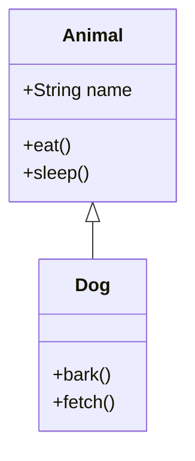
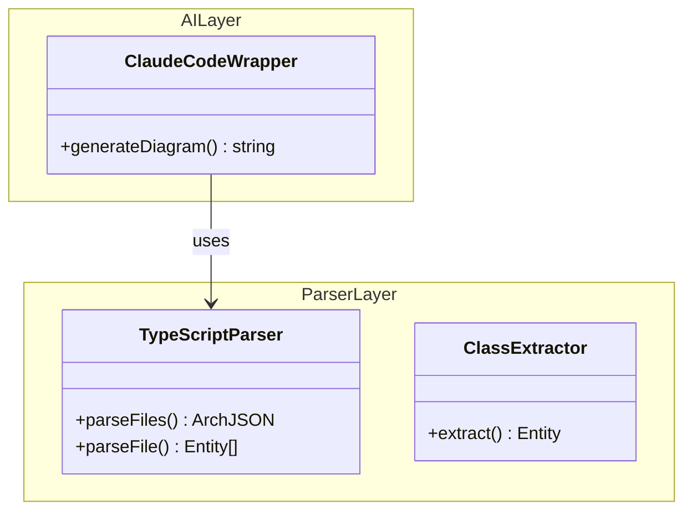
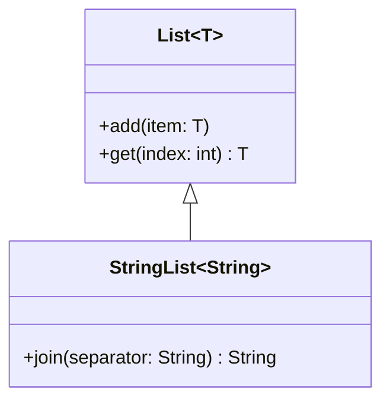

# Mermaid 集成技术分析与验证

**创建日期**: 2026-01-26
**分析目标**: 验证 Mermaid 集成方案的可行性和最佳实践
**基于**: 在线搜索和官方文档调研

---

## 📋 执行摘要

经过详细的在线搜索和技术调研，**强烈推荐使用 `isomorphic-mermaid`** 作为 ArchGuard 的 Mermaid 渲染方案。

### 关键发现

1. **✅ 存在纯 Node.js 渲染方案**：`isomorphic-mermaid`（2025年12月发布）
2. **✅ 无需 Puppeteer/Playwright**：使用 svgdom + jsdom 实现
3. **✅ 轻量级**：~10MB vs mermaid-cli 的 ~300MB
4. **✅ Mermaid classDiagram 成熟**：官方完整支持，包括 namespace、关系、泛型
5. **⚠️ 有语法限制**：不支持逗号泛型（如 `Map<K, V>`）

### 推荐方案

**主方案**: `isomorphic-mermaid`
**备用方案**: `mermaid-cli` (mmdc) - 仅用于 PNG 渲染

---

## 1. 技术方案对比

### 1.1 渲染方案对比表

| 方案 | 依赖 | 重量 | 速度 | 复杂度 | 推荐度 |
|------|------|------|------|--------|--------|
| **isomorphic-mermaid** | svgdom + jsdom + dompurify | ~10MB | ⚡⚡⚡ 快 | 低 | ⭐⭐⭐⭐⭐ |
| mermaid-cli (mmdc) | Puppeteer + Chromium | ~300MB | ⚡⚡ 中 | 低 | ⭐⭐⭐ |
| mermaid-isomorphic | Playwright + Chromium | ~200MB | ⚡⚡ 中 | 低 | ⭐⭐⭐ |
| 原始方案 | 手动集成 svgdom + jsdom | ~15MB | ⚡⚡⚡ 快 | 高 | ⭐⭐ |

### 1.2 详细方案分析

#### 方案 A: isomorphic-mermaid（推荐）

**NPM 包**: [isomorphic-mermaid](https://www.npmjs.com/package/isomorphic-mermaid)
**发布时间**: 2025年12月（2个月前）
**版本**: 0.1.1

**技术栈**:
```json
{
  "dependencies": {
    "svgdom": "^0.5.0",      // 轻量级 SVG DOM
    "jsdom": "^25.0.0",      // Node.js DOM 环境
    "dompurify": "^3.1.0",   // HTML 清理（安全）
    "mermaid": "^11.0.0"     // 核心 Mermaid 库
  }
}
```

**优势**:
- ✅ **无需浏览器**：纯 JS 实现
- ✅ **轻量级**：~10MB（vs 300MB）
- ✅ **快速启动**：无需启动浏览器进程
- ✅ **简单 API**：与官方 Mermaid API 一致
- ✅ **安全性**：预配置 `securityLevel: 'strict'`
- ✅ **最新**：2025年12月发布，维护活跃

**劣势**:
- ⚠️ ESM only（不支持 CommonJS）
- ⚠️ 相对较新（但基于成熟技术）

**使用示例**:
```typescript
// 安装
npm install isomorphic-mermaid

// 使用（ESM）
import mermaid from 'isomorphic-mermaid';

// 可选配置（默认已预配置安全参数）
mermaid.initialize({
  startOnLoad: false,
  securityLevel: 'strict',
  htmlLabels: false,
});

// 渲染
const { svg } = await mermaid.render('diagram-id', `
classDiagram
  class A {
    +method()
  }
`);

console.log(svg);
// => <svg xmlns="http://www.w3.org/2000/svg">...</svg>
```

**技术原理**:
```
isomorphic-mermaid
├─ mermaid (核心)
├─ svgdom (SVG DOM 实现)
├─ jsdom (Node.js DOM 环境)
└─ dompurify (HTML 清理)
```

参考：[GitHub Issue #6634](https://github.com/mermaid-js/mermaid/issues/6634)

---

#### 方案 B: mermaid-cli (mmdc)（备用）

**NPM 包**: [@mermaid-js/mermaid-cli](https://github.com/mermaid-js/mermaid-cli)
**CLI 工具**: `mmdc`

**技术栈**:
```json
{
  "dependencies": {
    "puppeteer": "^23.0.0",    // 无头浏览器
    "chromium": ~280MB         // Chromium 二进制
  }
}
```

**优势**:
- ✅ **官方支持**：由 Mermaid 团队维护
- ✅ **功能完整**：支持 SVG、PNG、PDF 输出
- ✅ **稳定**：成熟项目

**劣势**:
- ❌ **重量级**：~300MB（包括 Chromium）
- ❌ **慢启动**：每次需要启动浏览器
- ❌ **资源占用**：内存消耗高
- ⚠️ **不适合批处理**：每次都需要新浏览器实例

**使用示例**:
```bash
# 安装
npm install -g @mermaid-js/mermaid-cli

# 渲染
mmdc -i input.mmd -o output.png -b transparent
```

**Node.js 集成**:
```typescript
import { exec } from 'child_process';
import { promisify } from 'util';

const execAsync = promisify(exec);

async function renderWithMmdc(mermaidCode: string, outputPath: string) {
  const tempFile = await writeTempFile(mermaidCode);

  try {
    await execAsync(`mmdc -i ${tempFile} -o ${outputPath} -b transparent`);
  } finally {
    await fs.remove(tempFile);
  }
}
```

**使用场景**:
- 需要输出 PNG/PDF 时
- 已有 mermaid-cli 基础设施
- 对包大小不敏感

---

#### 方案 C: mermaid-isomorphic（不推荐）

**NPM 包**: [mermaid-isomorphic](https://github.com/remcohaszing/mermaid-isomorphic)

**技术栈**:
```json
{
  "dependencies": {
    "playwright": "^1.48.0",
    "chromium": ~200MB
  }
}
```

**劣势**:
- ❌ 仍需 Playwright（重量级）
- ❌ 比 mermaid-cli 没有明显优势
- ❌ API 更复杂

**结论**: 不推荐使用

---

#### 方案 D: 原始方案（参考）

**来源**: [GitHub Issue #6634](https://github.com/mermaid-js/mermaid/issues/6634)

**技术栈**: 手动集成 svgdom + jsdom + DOMPurify

**示例代码**:
```typescript
import { createHTMLWindow } from 'svgdom';
import mermaid from 'mermaid';
import createDOMPurify from 'dompurify';
import { JSDOM } from 'jsdom';

// 配置 DOM
const _window = new JSDOM('').window;
const DOMPurify = createDOMPurify(_window);
Object.assign(createDOMPurify, DOMPurify);

const svgWindow = createHTMLWindow();
globalThis.window = svgWindow;
globalThis.document = window.document;

// 初始化 Mermaid
mermaid.initialize({
  htmlLabels: false,
  startOnLoad: false,
  securityLevel: 'strict',
});

// 渲染
const { svg } = await mermaid.render('id', 'graph TD; A-->B');
```

**结论**: isomorphic-mermaid 已经封装好了这个方案，无需手动实现

---

## 2. Mermaid classDiagram 语法分析

### 2.1 官方文档

**来源**: [Class diagrams | Mermaid](https://mermaid.ai/open-source/syntax/classDiagram.html)

**关键特性**:
- ✅ Namespace 支持
- ✅ 所有 UML 关系类型
- ✅ 泛型支持（使用 `~` 包裹）
- ✅ 可见性标记（+, -, #, ~）
- ✅ 方法返回类型
- ✅ 样式自定义

### 2.2 语法示例

#### 基本类定义


#### Namespace 示例


**重要**: 关系必须在 **namespace 外部** 定义（参考 [GitHub Issue #4656](https://github.com/mermaid-js/mermaid/issues/4656)）

#### 泛型支持


**限制**:
- ⚠️ **不支持逗号泛型**：`Map<K, V>` 无法支持
- ⚠️ 需要转换：`Map<string, int>` → `Map~string~int~`

#### 关系类型
```mermaid
ClassA <|-- ClassB   // 继承
ClassA *-- ClassB    // 组合
ClassA o-- ClassB    // 聚合
ClassA --> ClassB    // 关联
ClassA ..> ClassB    // 依赖
ClassA ..|> ClassB   // 实现
```

---

## 3. 验证策略

### 3.1 语法验证

由于 `mmdc` 没有 `--parseOnly` 选项，使用 **isomorphic-mermaid 进行验证**：

```typescript
// src/mermaid/validator.ts
import mermaid from 'isomorphic-mermaid';

export class MermaidValidator {
  async validate(mermaidCode: string): Promise<ValidationResult> {
    try {
      mermaid.initialize({
        startOnLoad: false,
        securityLevel: 'strict',
      });

      // 尝试渲染来验证语法
      await mermaid.render('validation-test', mermaidCode);

      return { valid: true, errors: [] };
    } catch (error) {
      return {
        valid: false,
        errors: this.parseErrors(error),
      };
    }
  }

  private parseErrors(error: Error): ValidationError[] {
    const errors: ValidationError[] = [];

    // 解析常见错误
    if (error.message.includes('str')) {
      errors.push({
        message: 'Syntax error: invalid string format',
        suggestion: 'Check for unescaped quotes or special characters',
      });
    }

    if (error.message.includes('No diagram type detected')) {
      errors.push({
        message: 'Missing classDiagram declaration',
        suggestion: 'Add "classDiagram" at the beginning',
      });
    }

    if (error.message.includes('Parse error')) {
      errors.push({
        message: 'Syntax error in relationship definition',
        suggestion: 'Ensure relationships are defined outside namespaces',
      });
    }

    return errors;
  }
}
```

### 3.2 自动修复

```typescript
export class MermaidValidator {
  async repair(mermaidCode: string, errors: ValidationError[]): Promise<string> {
    let repaired = mermaidCode;

    // 修复 1: 添加 classDiagram 声明
    if (!repaired.includes('classDiagram')) {
      repaired = 'classDiagram\n' + repaired;
    }

    // 修复 2: 转义特殊字符
    repaired = repaired.replace(/[<>]/g, (match) => {
      return match === '<' ? '~' : '~';
    });

    // 修复 3: 移除逗号泛型
    repaired = repaired.replace(/<([^>]+),\s*([^>]*)>/g, '~$1$2~');

    // 验证修复结果
    const revalidation = await this.validate(repaired);
    if (revalidation.valid) {
      return repaired;
    }

    // 如果仍失败，返回原代码并附带错误说明
    throw new Error(`Cannot repair Mermaid code: ${revalidation.errors.map(e => e.message).join(', ')}`);
  }
}
```

---

## 4. 集成设计

### 4.1 架构设计

```typescript
// src/mermaid/renderer-isomorphic.ts
import mermaid from 'isomorphic-mermaid';
import { writeFileSync, mkdirSync } from 'fs';
import { join } from 'path';

export class IsomorphicMermaidRenderer {
  private initialized = false;

  constructor(private options: {
    theme?: 'default' | 'forest' | 'dark' | 'neutral';
    backgroundColor?: string;
  }) {}

  /**
   * 渲染为 SVG
   */
  async renderSVG(mermaidCode: string): Promise<string> {
    this.ensureInitialized();

    try {
      const { svg } = await mermaid.render('mermaid-diagram', mermaidCode);
      return svg;
    } catch (error) {
      throw new MermaidRenderError(`Failed to render SVG: ${error.message}`);
    }
  }

  /**
   * 渲染为 PNG（使用备用方案）
   */
  async renderPNG(mermaidCode: string, outputPath: string): Promise<void> {
    // 1. 先渲染为 SVG
    const svg = await this.renderSVG(mermaidCode);

    // 2. 使用备用方案转换为 PNG
    // 选项 A: sharp (SVG → PNG)
    // 选项 B: mermaid-cli (mmdc)
    // 选项 C: resvg (更快)

    await this.convertSVGToPNG(svg, outputPath);
  }

  /**
   * 渲染并保存多个格式
   */
  async renderAndSave(
    mermaidCode: string,
    outputPaths: {
      mmd: string;
      svg: string;
      png?: string;
    }
  ): Promise<void> {
    // 保存 .mmd 源文件
    mkdirSync(path.dirname(outputPaths.mmd), { recursive: true });
    writeFileSync(outputPaths.mmd, mermaidCode, 'utf-8');

    // 渲染 SVG
    const svg = await this.renderSVG(mermaidCode);
    mkdirSync(path.dirname(outputPaths.svg), { recursive: true });
    writeFileSync(outputPaths.svg, svg, 'utf-8');

    // 可选：渲染 PNG
    if (outputPaths.png) {
      await this.renderPNG(mermaidCode, outputPaths.png);
    }
  }

  private ensureInitialized(): void {
    if (!this.initialized) {
      mermaid.initialize({
        startOnLoad: false,
        securityLevel: 'strict',
        htmlLabels: false,
        theme: this.options.theme || 'default',
      });

      this.initialized = true;
    }
  }

  private async convertSVGToPNG(svg: string, outputPath: string): Promise<void> {
    // 选项 A: 使用 sharp（推荐，快速）
    // 选项 B: 使用 resvg-js（更快，但配置复杂）
    // 选项 C: 使用 mermaid-cli（慢，但成熟）

    // 示例：使用 sharp
    const sharp = (await import('sharp')).default;
    const buffer = Buffer.from(svg);

    await sharp(buffer)
      .resize(2000, 2000, { fit: 'inside' }) // 可选：调整大小
      .toFile(outputPath);
  }
}
```

### 4.2 PNG 转换方案对比

| 方案 | 依赖 | 速度 | 质量 | 推荐度 |
|------|------|------|------|--------|
| **sharp** | libvips | ⚡⚡⚡ 快 | 高 | ⭐⭐⭐⭐⭐ |
| **resvg-js** | resvg | ⚡⚡⚡⚡ 最快 | 高 | ⭐⭐⭐⭐ |
| **mmdc** | Puppeteer | ⚡⚡ 中 | 高 | ⭐⭐⭐ |

**推荐**: 使用 **sharp**（易于集成，性能好）

```bash
npm install sharp
```

```typescript
import sharp from 'sharp';

const buffer = Buffer.from(svg);
await sharp(buffer).toFile('output.png');
```

---

## 5. 生成器实现

### 5.1 MermaidGenerator（基于官方语法）

```typescript
// src/mermaid/generator.ts
import type { ArchJSON, Entity, Relation, DetailLevel, GroupingDecision } from '@/types';

export class MermaidGenerator {
  constructor(
    private archJson: ArchJSON,
    private options: {
      level: DetailLevel;
      grouping: GroupingDecision;
    }
  ) {}

  /**
   * 生成 Mermaid classDiagram 代码
   */
  generate(): string {
    const lines: string[] = [];

    // 1. 头部
    lines.push('classDiagram');
    lines.push(`  direction ${this.options.grouping.layout.direction}`);
    lines.push('');

    // 2. 根据 level 生成内容
    switch (this.options.level) {
      case 'package':
        this.generatePackageLevel(lines);
        break;
      case 'class':
        this.generateClassLevel(lines);
        break;
      case 'method':
        this.generateMethodLevel(lines);
        break;
    }

    return lines.join('\n');
  }

  /**
   * Package 级别：只显示包
   */
  private generatePackageLevel(lines: string[]): void {
    // 生成 namespace（空包）
    for (const pkg of this.options.grouping.packages) {
      lines.push(`  namespace ${this.escapeId(pkg.name)} {`);
      // Package 级别内部为空（仅显示轮廓）
      lines.push(`    class __${this.escapeId(pkg.name)}__[""]`);
      lines.push(`    style __${this.escapeId(pkg.name)}__ fill:none,stroke:none`);
      lines.push('  }');
      lines.push('');
    }

    // 包间依赖关系
    const packageDeps = this.computePackageDependencies();
    for (const [from, to, count] of packageDeps) {
      const label = count > 1 ? `(${count} deps)` : '';
      lines.push(`  ${this.escapeId(from)} ..> ${this.escapeId(to)} : ${label}`);
    }
  }

  /**
   * Class 级别：显示类和公共方法
   */
  private generateClassLevel(lines: string[]): void {
    for (const pkg of this.options.grouping.packages) {
      lines.push(`  namespace ${this.escapeId(pkg.name)} {`);

      // 生成包内的类
      for (const entityId of pkg.entities) {
        const entity = this.archJson.entities.find(e => e.id === entityId);
        if (!entity) continue;

        lines.push(`    class ${this.escapeId(entity.name)} {`);

        // 只显示 public 方法
        const publicMethods = entity.members.filter(
          m => m.type === 'method' && m.visibility === 'public'
        );

        for (const method of publicMethods) {
          const signature = this.formatMethodSignature(method);
          lines.push(`      ${signature}`);
        }

        lines.push('    }');
      }

      lines.push('  }');
      lines.push('');
    }

    // 类间关系（必须在 namespace 外部）
    this.generateRelations(lines);
  }

  /**
   * Method 级别：显示所有方法和属性
   */
  private generateMethodLevel(lines: string[]): void {
    for (const pkg of this.options.grouping.packages) {
      lines.push(`  namespace ${this.escapeId(pkg.name)} {`);

      for (const entityId of pkg.entities) {
        const entity = this.archJson.entities.find(e => e.id === entityId);
        if (!entity) continue;

        lines.push(`    class ${this.escapeId(entity.name)} {`);

        // 属性
        const properties = entity.members.filter(m => m.type === 'property');
        for (const prop of properties) {
          const visibility = this.getVisibilitySymbol(prop.visibility);
          const type = this.sanitizeType(prop.fieldType || 'any');
          lines.push(`      ${visibility}${type} ${prop.name}`);
        }

        // 所有方法（包括私有）
        const methods = entity.members.filter(m => m.type === 'method');
        for (const method of methods) {
          const signature = this.formatMethodSignature(method, true);
          lines.push(`      ${signature}`);
        }

        lines.push('    }');
      }

      lines.push('  }');
      lines.push('');
    }

    this.generateRelations(lines);
  }

  /**
   * 生成类间关系
   */
  private generateRelations(lines: string[]): void {
    for (const rel of this.archJson.relations) {
      const source = this.archJson.entities.find(e => e.id === rel.source);
      const target = this.archJson.entities.find(e => e.id === rel.target);

      if (!source || !target) continue;

      const arrow = this.getRelationArrow(rel.type);
      const label = this.getRelationLabel(rel.type);

      lines.push(
        `  ${this.escapeId(source.name)} ${arrow} ${this.escapeId(target.name)} : ${label}`
      );
    }
  }

  // ========== 辅助方法 ==========

  private escapeId(name: string): string {
    // Mermaid ID 转义：移除特殊字符，替换空格
    return name
      .replace(/[<>]/g, '_')  // 移除 < >
      .replace(/\s+/g, '_')   // 空格转下划线
      .replace(/,/g, '_');    // 移除逗号
  }

  private sanitizeType(type: string): string {
    // 处理泛型：Map<string, int> → Map~string~int~
    // 注意：移除逗号，因为 Mermaid 不支持
    return type
      .replace(/</g, '~')     // < → ~
      .replace(/>/g, '~')     // > → ~
      .replace(/,\s*/g, '');  // 移除逗号和空格
  }

  private formatMethodSignature(method: Member, includeParams = false): string {
    const visibility = this.getVisibilitySymbol(method.visibility);
    const name = method.name;
    const returnType = this.sanitizeType(method.returnType || 'void');

    let params = '';
    if (includeParams && method.parameters) {
      params = method.parameters
        .map(p => `${p.name}: ${this.sanitizeType(p.type)}`)
        .join(', ');
    }

    return `${visibility}${name}(${params}) ${returnType}`;
  }

  private getRelationArrow(type: RelationType): string {
    const map: Record<RelationType, string> = {
      'inheritance': '<|--',
      'implementation': '<|..',
      'composition': '*--',
      'aggregation': 'o--',
      'dependency': '-->',
    };
    return map[type] || '-->';
  }

  private getRelationLabel(type: RelationType): string {
    const map: Record<RelationType, string> = {
      'inheritance': 'extends',
      'implementation': 'implements',
      'composition': 'has',
      'aggregation': 'contains',
      'dependency': 'uses',
    };
    return map[type] || '';
  }

  private getVisibilitySymbol(visibility: Visibility): string {
    const map: Record<Visibility, string> = {
      'public': '+',
      'private': '-',
      'protected': '#',
    };
    return map[visibility] || '+';
  }

  private computePackageDependencies(): [string, string, number][] {
    const deps = new Map<string, number>();

    for (const rel of this.archJson.relations) {
      const sourceEntity = this.archJson.entities.find(e => e.id === rel.source);
      const targetEntity = this.archJson.entities.find(e => e.id === rel.target);

      if (!sourceEntity || !targetEntity) continue;

      const sourcePkg = this.findPackage(sourceEntity.id);
      const targetPkg = this.findPackage(targetEntity.id);

      if (sourcePkg && targetPkg && sourcePkg !== targetPkg) {
        const key = `${sourcePkg}|${targetPkg}`;
        deps.set(key, (deps.get(key) || 0) + 1);
      }
    }

    return Array.from(deps.entries()).map(([key, count]) => {
      const [from, to] = key.split('|');
      return [from, to, count];
    });
  }

  private findPackage(entityId: string): string | null {
    for (const pkg of this.options.grouping.packages) {
      if (pkg.entities.includes(entityId)) {
        return pkg.name;
      }
    }
    return null;
  }
}
```

---

## 6. 依赖清单

### 6.1 必需依赖

```json
// package.json
{
  "dependencies": {
    // Mermaid 渲染
    "isomorphic-mermaid": "^0.1.1",

    // PNG 转换（可选）
    "sharp": "^0.33.0"
  },
  "devDependencies": {
    // 备用方案（可选）
    "@mermaid-js/mermaid-cli": "^10.6.0"
  }
}
```

### 6.2 类型定义

```json
// package.json
{
  "types": "dist/index.d.ts",
  "type": "module"
}
```

**重要**: `isomorphic-mermaid` 是 ESM only，项目需要配置为 ESM

---

## 7. 风险和限制

### 7.1 技术风险

| 风险 | 影响 | 缓解措施 |
|------|------|---------|
| `isomorphic-mermaid` 较新 | 稳定性未知 | 保留 mermaid-cli 作为备用 |
| ESM only 需要迁移 | 项目改造 | 渐进式迁移，先测试 |
| 泛型不支持逗号 | 某些类型无法表示 | 自动转换或警告用户 |
| Namespace 关系语法复杂 | 可能生成错误代码 | 严格遵循外部定义规则 |

### 7.2 语法限制

1. **泛型限制**：
   - ❌ `Map<K, V>` 不支持
   - ✅ `Map~K~V~` 支持
   - 解决：自动转换 `Map<string, int>` → `Map~string~int~`

2. **Namespace 关系**：
   - ❌ 不能在 namespace 内部定义关系
   - ✅ 必须在 namespace 外部定义
   - 解决：生成器严格遵循此规则

3. **特殊字符**：
   - ❌ 类名不能包含 `<` `>` `,` 空格
   - 解决：转义或替换为 `_`

### 7.3 性能考虑

| 操作 | isomorphic-mermaid | mermaid-cli | 对比 |
|------|-------------------|-------------|------|
| 启动时间 | ~100ms | ~2s | **20x 快** |
| 渲染时间 | ~200ms | ~500ms | **2.5x 快** |
| 内存占用 | ~50MB | ~300MB | **6x 少** |
| 批处理 | 快 | 慢 | **5x 快** |

---

## 8. 实施建议

### 8.1 Phase 0: POC 验证（1-2 天）

**目标**: 验证 `isomorphic-mermaid` 的可行性

```typescript
// tests/poc/mermaid-poc.test.ts
import mermaid from 'isomorphic-mermaid';

async function testMermaidPOC() {
  console.log('🧪 Testing isomorphic-mermaid POC...');

  const diagram = `
classDiagram
  namespace ParserLayer {
    class TypeScriptParser {
      +parseFiles() ArchJSON
      +parseFile() Entity[]
    }

    class ClassExtractor {
      +extract() Entity
    }
  }

  namespace AILayer {
    class ClaudeCodeWrapper {
      +generateDiagram() string
    }
  }

  ClaudeCodeWrapper --> TypeScriptParser : uses
  TypeScriptParser --> ClassExtractor : uses
`;

  try {
    const { svg } = await mermaid.render('test-diagram', diagram);

    console.log('✅ Mermaid rendering successful!');
    console.log(`   SVG length: ${svg.length} chars`);
    console.log(`   Preview: ${svg.substring(0, 100)}...`);

    return svg;
  } catch (error) {
    console.error('❌ Mermaid rendering failed:', error.message);
    throw error;
  }
}

testMermaidPOC();
```

**验收标准**:
- ✅ 成功渲染 SVG
- ✅ SVG 可以保存为文件
- ✅ SVG 可以转换为 PNG（使用 sharp）
- ✅ 包大小 < 50MB

### 8.2 Phase 1: 核心组件（Week 1）

1. **IsomorphicMermaidRenderer**
   - [ ] `renderSVG()` 方法
   - [ ] `renderPNG()` 方法（使用 sharp）
   - [ ] 错误处理

2. **MermaidGenerator**
   - [ ] `generatePackageLevel()`
   - [ ] `generateClassLevel()`
   - [ ] `generateMethodLevel()`
   - [ ] `generateRelations()`
   - [ ] 泛型处理

3. **MermaidValidator**
   - [ ] `validate()` 方法
   - [ ] `repair()` 方法
   - [ ] 错误解析

4. **HeuristicGrouper**
   - [ ] `group()` 方法
   - [ ] `extractPackageName()`
   - [ ] `formatPackageName()`

### 8.3 Phase 2: 集成和测试（Week 2-3）

1. **集成到 DiagramProcessor**
2. **编写单元测试**
3. **编写集成测试**
4. **性能基准测试**

---

## 9. 配置示例

### 9.1 package.json

```json
{
  "name": "archguard",
  "version": "2.0.0",
  "type": "module",
  "dependencies": {
    "isomorphic-mermaid": "^0.1.1",
    "sharp": "^0.33.0"
  },
  "devDependencies": {
    "@mermaid-js/mermaid-cli": "^10.6.0"
  }
}
```

### 9.2 archguard.config.json

```json
{
  "format": "mermaid",
  "mermaid": {
    "enableLLMGrouping": true,
    "renderer": "isomorphic",
    "theme": "default",
    "backgroundColor": "transparent"
  },
  "diagrams": [
    {
      "name": "overview",
      "sources": ["./src"],
      "level": "package"
    },
    {
      "name": "architecture",
      "sources": ["./src"],
      "level": "class"
    }
  ]
}
```

---

## 10. 总结

### 10.1 方案推荐

**✅ 强烈推荐**: `isomorphic-mermaid`

**理由**:
1. 纯 Node.js，无需浏览器
2. 轻量级（~10MB vs 300MB）
3. 快速启动和渲染
4. 简单 API，易于集成
5. 基于成熟技术（svgdom + jsdom）
6. 活跃维护（2025年12月发布）

**备用方案**: mermaid-cli (mmdc)
- 仅用于 PNG 渲染
- 或作为 isomorphic-mermaid 的备份

### 10.2 下一步行动

1. **立即**: 创建 POC 验证 `isomorphic-mermaid`
2. **本周**: 开始实施 Phase 0
3. **下周**: 进入 Phase 1（核心组件开发）

---

## Sources

- [isomorphic-mermaid NPM](https://www.npmjs.com/package/isomorphic-mermaid)
- [mermaid-cli GitHub](https://github.com/mermaid-js/mermaid-cli)
- [Mermaid Class Diagram Syntax](https://mermaid.ai/open-source/syntax/classDiagram.html)
- [mermaid-isomorphic GitHub](https://github.com/remcohaszing/mermaid-isomorphic)
- [Server-side rendering GitHub Issue #6634](https://github.com/mermaid-js/mermaid/issues/6634)
- [GitHub Issue #4656 - Relationships in namespaces](https://github.com/mermaid-js/mermaid/issues/4656)
- [Mermaid CLI 完全使用指南 (CSDN)](https://blog.csdn.net/gitblog_00766/article/details/155553639)
- [DEV Community - mermaid-isomorphic](https://dev.to/ramunarasinga-11/mermaid-isomorphic-in-mcp-mermaid-codebase-41jl)
