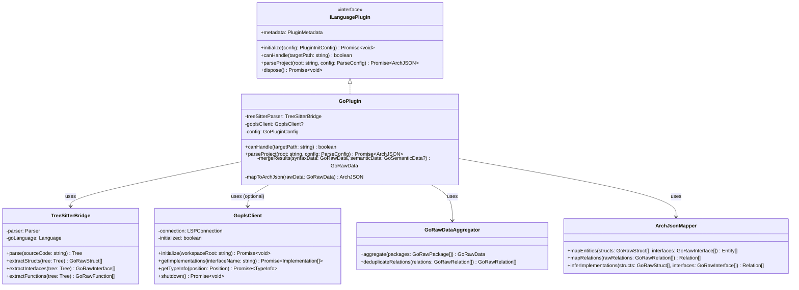

# ArchGuard Go 语言支持实施建议 (Proposal v3.0)

**文档版本**: 3.0
**创建日期**: 2026-02-20
**最后修改**: 2026-02-20
**关联文档**: 03-multi-language-support.md (前置依赖)
**目标示例项目**: `/home/yale/work/codex-swarm`

---

## 1. 执行摘要与目标

本文档规划为 ArchGuard 引入对 Go 语言（Golang）微服务及系统编程项目的深度架构分析支持。

**v3.0 主要变更**:
- 承认 WASM 技术方案的局限性，改为 **Tree-sitter + gopls 混合架构**
- 详细定义隐式接口（Duck Typing）检测算法
- 明确前置依赖版本锁定规则
- 使用 Mermaid 替代 PlantUML（与项目规范一致）
- 对齐 CLI 命令与现有 API
- 定义 GoRawData → ArchJSON 的完整映射规则
- 添加量化验收标准

**核心目标：**
- 依赖 Proposal 03 v2.0+ 的 `ILanguagePlugin` 基础设施
- 采用 **Tree-sitter (语法分析) + gopls LSP (语义分析)** 混合架构
- 实现包级别（Package-level）的语义类型分析，解决 Go 的隐式接口实现提取
- 支持 Go Modules 配置

---

## 2. 技术选型分析

### 2.1 WASM 方案的局限性（原 v2.0 方案）

原方案提出使用 `golang.org/x/tools/go/packages` 编译为 WASM，经技术验证存在以下问题：

| 问题 | 说明 | 严重程度 |
|------|------|----------|
| `go/packages` 依赖外部工具链 | 需要执行 `go list` 等命令，WASM 沙箱不支持 | 致命 |
| 文件系统访问受限 | WASM 无法直接访问本地文件系统 | 致命 |
| 无成熟社区实现 | 截至 2026-02，无可用的 `go/packages` WASM 封装 | 高 |
| 内存限制 | 大型项目可能导致 WASM 内存溢出 | 中 |

### 2.2 推荐方案：Tree-sitter + gopls 混合架构

```
┌─────────────────────────────────────────────────────────────────┐
│                        GoPlugin (Node.js)                        │
├─────────────────────────────────────────────────────────────────┤
│                                                                 │
│  ┌─────────────────────┐    ┌─────────────────────────────────┐ │
│  │   Tree-sitter Go    │    │        gopls LSP Client         │ │
│  │  (语法级 AST 分析)   │    │   (语义级类型分析 - 可选)        │ │
│  │                     │    │                                 │ │
│  │  - Struct 定义      │    │  - 隐式接口实现检测              │ │
│  │  - Interface 定义   │    │  - 类型推导                      │ │
│  │  - Method 签名      │    │  - 跨包引用解析                  │ │
│  │  - Field 提取       │    │                                 │ │
│  └─────────┬───────────┘    └───────────────┬─────────────────┘ │
│            │                                │                   │
│            └───────────┬────────────────────┘                   │
│                        ▼                                        │
│              ┌─────────────────────┐                            │
│              │   GoRawData 聚合    │                            │
│              └──────────┬──────────┘                            │
│                         ▼                                       │
│              ┌─────────────────────┐                            │
│              │  ArchJSON Mapper    │                            │
│              └──────────┬──────────┘                            │
│                         ▼                                       │
│                    ArchJSON                                     │
└─────────────────────────────────────────────────────────────────┘
```

**方案对比**：

| 维度 | Tree-sitter 纯方案 | Tree-sitter + gopls | WASM (原方案) |
|------|-------------------|---------------------|---------------|
| 可行性 | ✅ 可行 | ✅ 可行 | ❌ 不可行 |
| 语法分析 | ✅ 完整 | ✅ 完整 | ✅ 完整 |
| 类型推导 | ❌ 无 | ✅ 完整 | ✅ 完整 |
| 隐式接口检测 | ⚠️ 启发式 | ✅ 精确 | ✅ 精确 |
| 依赖分发 | 无 | 需要 gopls | 无 |
| 性能 | 快 (< 1s/100 files) | 中等 (< 5s/100 files) | 不适用 |

**推荐**: 采用 **Tree-sitter + gopls** 混合方案，gopls 作为可选增强（用户可选择仅使用 Tree-sitter 以获得更快速度）。

---

## 3. 核心架构设计

### 3.1 前置依赖版本锁定

**强制前置条件**：本提案实施前，必须满足以下条件：

| 依赖项 | 版本要求 | 验收检查点 |
|--------|----------|------------|
| Proposal 03 Phase 0 | 完成 | `ILanguagePlugin` 接口已合并到 main 分支 |
| Proposal 03 Phase 1 | 完成 | `TypeScriptPlugin` 已迁移并通过所有测试 |
| PluginRegistry | v1.0.0+ | 支持插件注册、发现、版本管理 |
| ArchJSON Schema | v1.0+ | 包含 `struct` EntityType |

**版本锁定规则**：
- 本提案基于 Proposal 03 v2.0 接口定义
- 若 Proposal 03 接口变更，需同步更新本提案
- 接口兼容性通过 TypeScript 类型检查验证

### 3.2 核心类图 (Mermaid)



### 3.3 核心数据结构

#### 3.3.1 Go 原始数据结构 (TypeScript 侧)

```typescript
// plugins/golang/types.ts

/**
 * 由 Tree-sitter 提取的 Go 语义数据
 */
interface GoRawData {
  packages: GoRawPackage[];
  moduleRoot: string;
  moduleName: string;  // go.mod 中的 module 名
}

interface GoRawPackage {
  /** 包路径 (e.g., "github.com/example/swarm/net") */
  id: string;
  /** 包名 (e.g., "net") */
  name: string;
  /** 目录路径 */
  dirPath: string;
  /** 导入的其他包 ID */
  imports: GoImport[];
  /** 结构体定义 */
  structs: GoRawStruct[];
  /** 接口定义 */
  interfaces: GoRawInterface[];
  /** 顶层函数 */
  functions: GoRawFunction[];
}

interface GoImport {
  path: string;
  alias?: string;
}

interface GoRawStruct {
  name: string;
  /** 是否导出（首字母大写） */
  exported: boolean;
  fields: GoRawField[];
  /** 绑定到此结构体的方法 */
  methods: GoRawMethod[];
  /** 嵌入的其他类型 (组合关系) */
  embedded: GoEmbedded[];
  /** 文档注释 */
  doc?: string;
  /** 源码位置 */
  location: SourceLocation;
}

interface GoEmbedded {
  /** 嵌入的类型名 */
  typeName: string;
  /** 是否为指针嵌入 */
  isPointer: boolean;
  /** 来源包（如果是外部包） */
  packagePath?: string;
}

interface GoRawInterface {
  name: string;
  exported: boolean;
  /** 接口方法签名 */
  methods: GoMethodSignature[];
  /** 嵌入的其他接口 */
  embedded: string[];
  doc?: string;
  location: SourceLocation;
}

interface GoMethodSignature {
  name: string;
  /** 规范化签名 (e.g., "Load() error") */
  signature: string;
  /** 参数列表 */
  params: GoParam[];
  /** 返回值列表 */
  returns: GoParam[];
}

interface GoRawMethod {
  name: string;
  /** 接收器类型 (e.g., "*Service", "Service") */
  receiverType: string;
  /** 接收器名称 (e.g., "s") */
  receiverName: string;
  /** 是否为指针接收器 */
  isPointerReceiver: boolean;
  /** 规范化签名 */
  signature: string;
  params: GoParam[];
  returns: GoParam[];
  doc?: string;
  location: SourceLocation;
}

interface GoRawField {
  name: string;
  type: string;
  /** 是否导出 */
  exported: boolean;
  /** struct tag (e.g., `json:"name"`) */
  tag?: string;
}

interface GoRawFunction {
  name: string;
  exported: boolean;
  params: GoParam[];
  returns: GoParam[];
  doc?: string;
  location: SourceLocation;
}

interface GoParam {
  name: string;
  type: string;
}

interface SourceLocation {
  file: string;
  startLine: number;
  endLine: number;
  startCol?: number;
  endCol?: number;
}
```

#### 3.3.2 Go 配置类型

```typescript
// plugins/golang/config.ts

interface GoPluginConfig {
  /** go.mod 所在根目录，默认为分析根目录 */
  goWorkspace?: string;

  /** 是否启用 gopls 语义分析（默认 true） */
  enableGopls?: boolean;

  /** gopls 可执行文件路径（默认从 PATH 查找） */
  goplsPath?: string;

  /** 是否分析 _test.go 文件（默认 false） */
  analyzeTests?: boolean;

  /** 排除的包路径模式 */
  excludePackages?: string[];

  /** 自动过滤标准库和第三方包（默认 true） */
  ignoreExternalPackages?: boolean;

  /** Build tags */
  buildTags?: string[];

  /** 隐式接口检测的置信度阈值 (0-1，默认 0.8) */
  implicitInterfaceConfidenceThreshold?: number;
}
```

---

## 4. 隐式接口实现检测算法

### 4.1 问题定义

Go 使用结构化类型（Duck Typing），接口实现是隐式的：

```go
// 定义接口
type Loader interface {
    Load() error
}

// MyService 隐式实现了 Loader，但没有任何显式声明
type MyService struct {}
func (s *MyService) Load() error { return nil }
```

### 4.2 检测算法

#### 4.2.1 纯 Tree-sitter 方案（启发式）

```typescript
// plugins/golang/interface-matcher.ts

interface MethodSignature {
  name: string;
  normalizedSignature: string;  // "Load() error"
}

/**
 * 启发式接口实现匹配
 *
 * 算法复杂度: O(S × I × M)
 * - S = 结构体数量
 * - I = 接口数量
 * - M = 平均方法数量
 *
 * 对于典型项目 (S=100, I=50, M=5)，约 25,000 次比较，< 100ms
 */
function matchImplicitImplementations(
  structs: GoRawStruct[],
  interfaces: GoRawInterface[],
  config: { confidenceThreshold: number }
): InferredImplementation[] {
  const results: InferredImplementation[] = [];

  for (const struct of structs) {
    // 构建结构体的方法集（包括指针接收器和值接收器）
    const structMethods = buildMethodSet(struct);

    for (const iface of interfaces) {
      // 跳过空接口
      if (iface.methods.length === 0) continue;

      // 检查结构体是否实现了接口的所有方法
      const matchResult = checkImplementation(structMethods, iface);

      if (matchResult.matches) {
        results.push({
          structName: struct.name,
          interfaceName: iface.name,
          confidence: matchResult.confidence,
          matchedMethods: matchResult.matchedMethods,
          source: 'inferred'
        });
      }
    }
  }

  // 按置信度过滤
  return results.filter(r => r.confidence >= config.confidenceThreshold);
}

/**
 * 构建方法集
 *
 * Go 规则:
 * - 值接收器方法：属于 T 和 *T 的方法集
 * - 指针接收器方法：仅属于 *T 的方法集
 */
function buildMethodSet(struct: GoRawStruct): MethodSet {
  const valueMethodSet = new Map<string, MethodSignature>();
  const pointerMethodSet = new Map<string, MethodSignature>();

  for (const method of struct.methods) {
    const sig: MethodSignature = {
      name: method.name,
      normalizedSignature: normalizeSignature(method)
    };

    if (method.isPointerReceiver) {
      // 指针接收器：仅加入 *T 方法集
      pointerMethodSet.set(method.name, sig);
    } else {
      // 值接收器：加入 T 和 *T 方法集
      valueMethodSet.set(method.name, sig);
      pointerMethodSet.set(method.name, sig);
    }
  }

  // 处理嵌入类型的方法提升
  for (const embedded of struct.embedded) {
    // TODO: 需要跨结构体查找嵌入类型的方法
  }

  return { valueMethodSet, pointerMethodSet };
}

/**
 * 检查实现匹配
 */
function checkImplementation(
  methodSet: MethodSet,
  iface: GoRawInterface
): MatchResult {
  const requiredMethods = iface.methods.length;
  let matchedMethods = 0;
  const matched: string[] = [];

  // 使用指针方法集（包含所有可用方法）
  const available = methodSet.pointerMethodSet;

  for (const ifaceMethod of iface.methods) {
    const structMethod = available.get(ifaceMethod.name);

    if (structMethod && signaturesMatch(structMethod.normalizedSignature, ifaceMethod.signature)) {
      matchedMethods++;
      matched.push(ifaceMethod.name);
    }
  }

  // 计算置信度
  const confidence = matchedMethods / requiredMethods;

  return {
    matches: matchedMethods === requiredMethods,
    confidence,
    matchedMethods: matched
  };
}

/**
 * 规范化方法签名用于比较
 *
 * 输入: "Load(ctx context.Context) (error)"
 * 输出: "Load(context.Context) error"
 */
function normalizeSignature(method: GoRawMethod): string {
  const params = method.params.map(p => normalizeType(p.type)).join(', ');
  const returns = method.returns.map(p => normalizeType(p.type)).join(', ');

  if (returns) {
    return `${method.name}(${params}) ${returns.includes(',') ? `(${returns})` : returns}`;
  }
  return `${method.name}(${params})`;
}

/**
 * 规范化类型名（移除包前缀的短名称）
 */
function normalizeType(typeName: string): string {
  // "context.Context" -> "Context" (用于同包比较)
  // 保留完整类型用于跨包比较
  return typeName;
}
```

#### 4.2.2 gopls 增强方案（精确）

```typescript
// plugins/golang/gopls-client.ts

import { LanguageClient } from 'vscode-languageclient/node';

class GoplsClient {
  private client: LanguageClient | null = null;

  async initialize(workspaceRoot: string): Promise<void> {
    // 启动 gopls 进程
    this.client = new LanguageClient(
      'gopls',
      { command: 'gopls', args: ['serve'] },
      {
        documentSelector: [{ scheme: 'file', language: 'go' }],
        workspaceFolder: { uri: workspaceRoot, name: 'workspace' }
      }
    );

    await this.client.start();
  }

  /**
   * 使用 gopls 的 implementation 请求获取精确的接口实现
   */
  async getImplementations(
    interfaceLocation: SourceLocation
  ): Promise<Implementation[]> {
    if (!this.client) {
      throw new Error('gopls not initialized');
    }

    const result = await this.client.sendRequest('textDocument/implementation', {
      textDocument: { uri: `file://${interfaceLocation.file}` },
      position: {
        line: interfaceLocation.startLine - 1,
        character: 0
      }
    });

    return this.parseImplementations(result);
  }

  /**
   * 使用 gopls 的 hover 获取类型信息
   */
  async getTypeInfo(location: SourceLocation): Promise<TypeInfo | null> {
    if (!this.client) return null;

    const result = await this.client.sendRequest('textDocument/hover', {
      textDocument: { uri: `file://${location.file}` },
      position: {
        line: location.startLine - 1,
        character: location.startCol ?? 0
      }
    });

    return this.parseTypeInfo(result);
  }

  async shutdown(): Promise<void> {
    if (this.client) {
      await this.client.stop();
      this.client = null;
    }
  }
}
```

### 4.3 边界情况处理

| 边界情况 | 处理策略 |
|---------|---------|
| 泛型接口 (Go 1.18+) | Tree-sitter 提取类型参数，匹配时忽略具体类型 |
| 嵌入接口 | 递归展开嵌入的接口方法 |
| 类型别名 | 解析到底层类型后匹配 |
| 私有接口 | 仅在同包内匹配 |
| 外部包接口 | 需要 gopls 或手动指定（如 `io.Reader`） |

---

## 5. GoRawData → ArchJSON 映射规则

### 5.1 实体映射

| GoRawData | ArchJSON Entity | 映射规则 |
|-----------|-----------------|----------|
| `GoRawStruct` | `Entity (type: 'struct')` | 名称、成员、位置直接映射 |
| `GoRawInterface` | `Entity (type: 'interface')` | 名称、方法签名映射 |
| `GoRawFunction` | `Entity (type: 'function')` | 仅导出函数，作为顶层实体 |

### 5.2 成员映射

```typescript
function mapStructMembers(struct: GoRawStruct): Member[] {
  const members: Member[] = [];

  // 字段 → Member (type: 'field')
  for (const field of struct.fields) {
    members.push({
      name: field.name,
      type: 'field',
      visibility: field.exported ? 'public' : 'private',
      fieldType: field.type,
      isReadonly: false,
      metadata: field.tag ? { tag: field.tag } : undefined
    });
  }

  // 方法 → Member (type: 'method')
  for (const method of struct.methods) {
    members.push({
      name: method.name,
      type: 'method',
      visibility: method.name[0] === method.name[0].toUpperCase() ? 'public' : 'private',
      parameters: method.params.map(p => ({
        name: p.name,
        type: p.type
      })),
      returnType: method.returns.map(r => r.type).join(', ') || 'void',
      metadata: {
        receiverType: method.receiverType,
        isPointerReceiver: method.isPointerReceiver
      }
    });
  }

  return members;
}
```

### 5.3 关系映射

| GoRawData 来源 | ArchJSON Relation | 说明 |
|---------------|-------------------|------|
| `GoRawStruct.embedded` | `composition` | 嵌入组合 |
| `GoRawInterface.embedded` | `inheritance` | 接口嵌入视为继承 |
| 隐式接口实现检测 | `implementation` | 带 `confidence` 和 `source: 'inferred'` |
| 字段类型引用 | `dependency` | 字段类型为其他结构体 |
| 方法参数/返回值类型 | `dependency` | 参数或返回值类型引用 |

```typescript
function mapEmbeddedToComposition(
  struct: GoRawStruct,
  packageId: string
): Relation[] {
  return struct.embedded.map(emb => ({
    from: `${packageId}.${struct.name}`,
    to: emb.packagePath
      ? `${emb.packagePath}.${emb.typeName}`
      : `${packageId}.${emb.typeName}`,
    type: 'composition',
    label: emb.isPointer ? 'embeds *' : 'embeds',
    confidence: 1.0,
    source: 'explicit'
  }));
}

function mapInferredImplementation(
  impl: InferredImplementation,
  packageId: string
): Relation {
  return {
    from: `${packageId}.${impl.structName}`,
    to: `${packageId}.${impl.interfaceName}`,
    type: 'implementation',
    label: `implements (inferred)`,
    confidence: impl.confidence,
    source: 'inferred'
  };
}
```

---

## 6. GoPlugin 实现

```typescript
// plugins/golang/index.ts

import Parser from 'tree-sitter';
import Go from 'tree-sitter-go';
import type {
  ILanguagePlugin,
  PluginMetadata,
  PluginInitConfig,
  ParseConfig,
  ArchJSON
} from '@/core/interfaces/index.js';
import { TreeSitterBridge } from './tree-sitter-bridge.js';
import { GoplsClient } from './gopls-client.js';
import { matchImplicitImplementations } from './interface-matcher.js';
import { mapToArchJson } from './arch-json-mapper.js';
import type { GoPluginConfig, GoRawData } from './types.js';

export default class GoPlugin implements ILanguagePlugin {
  readonly metadata: PluginMetadata = {
    name: 'golang',
    version: '1.0.0',
    displayName: 'Go (Golang)',
    fileExtensions: ['.go'],
    author: 'ArchGuard Team',
    minCoreVersion: '2.0.0',
    capabilities: {
      singleFileParsing: false,  // Go 需要项目级分析
      incrementalParsing: false,
      dependencyExtraction: true,
      typeInference: true  // 通过 gopls
    }
  };

  private treeSitter!: TreeSitterBridge;
  private goplsClient: GoplsClient | null = null;
  private config!: GoPluginConfig;
  private initialized = false;

  async initialize(config: PluginInitConfig): Promise<void> {
    if (this.initialized) return;

    // 初始化 Tree-sitter
    this.treeSitter = new TreeSitterBridge();
    await this.treeSitter.initialize();

    // 解析 Go 特定配置
    this.config = this.parseGoConfig(config);

    // 可选：初始化 gopls
    if (this.config.enableGopls !== false) {
      try {
        this.goplsClient = new GoplsClient();
        await this.goplsClient.initialize(config.workspaceRoot);
      } catch (error) {
        console.warn('gopls initialization failed, falling back to Tree-sitter only:', error);
        this.goplsClient = null;
      }
    }

    this.initialized = true;
  }

  canHandle(targetPath: string): boolean {
    return targetPath.endsWith('.go') ||
           fs.existsSync(path.join(targetPath, 'go.mod'));
  }

  async parseProject(workspaceRoot: string, config: ParseConfig): Promise<ArchJSON> {
    this.ensureInitialized();

    const goConfig: GoPluginConfig = {
      ...this.config,
      ...config.languageSpecific
    };

    // 1. 发现所有 Go 文件
    const goFiles = await this.discoverGoFiles(workspaceRoot, goConfig);

    // 2. 使用 Tree-sitter 提取语法信息
    const rawData = await this.treeSitter.parseFiles(goFiles, goConfig);

    // 3. 可选：使用 gopls 增强语义信息
    if (this.goplsClient) {
      await this.enhanceWithGopls(rawData);
    }

    // 4. 检测隐式接口实现
    const allStructs = rawData.packages.flatMap(p => p.structs);
    const allInterfaces = rawData.packages.flatMap(p => p.interfaces);

    const inferredImpls = matchImplicitImplementations(
      allStructs,
      allInterfaces,
      { confidenceThreshold: goConfig.implicitInterfaceConfidenceThreshold ?? 0.8 }
    );

    // 5. 映射为 ArchJSON
    return mapToArchJson(rawData, inferredImpls);
  }

  async dispose(): Promise<void> {
    if (this.goplsClient) {
      await this.goplsClient.shutdown();
      this.goplsClient = null;
    }
    this.initialized = false;
  }

  private async discoverGoFiles(
    root: string,
    config: GoPluginConfig
  ): Promise<string[]> {
    const files = await glob('**/*.go', {
      cwd: root,
      ignore: [
        '**/vendor/**',
        '**/_*/**',  // Go 忽略下划线开头的目录
        ...(config.analyzeTests ? [] : ['**/*_test.go']),
        ...(config.excludePackages ?? [])
      ]
    });

    return files.map(f => path.join(root, f));
  }

  private async enhanceWithGopls(rawData: GoRawData): Promise<void> {
    // 使用 gopls 获取更精确的接口实现信息
    // 这可以覆盖 Tree-sitter 的启发式结果
  }

  private parseGoConfig(config: PluginInitConfig): GoPluginConfig {
    return {
      goWorkspace: config.workspaceRoot,
      enableGopls: true,
      analyzeTests: false,
      ignoreExternalPackages: true,
      implicitInterfaceConfidenceThreshold: 0.8
    };
  }

  private ensureInitialized(): void {
    if (!this.initialized) {
      throw new Error('GoPlugin not initialized. Call initialize() first.');
    }
  }
}
```

---

## 7. CLI 集成

### 7.1 与现有 CLI 对齐

Go 插件通过 PluginRegistry 自动集成，无需修改 CLI 命令结构：

```bash
# 分析 Go 项目（自动检测语言）
node dist/cli/index.js analyze -s /home/yale/work/codex-swarm -v

# 显式指定语言（当目录包含多语言时）
node dist/cli/index.js analyze -s ./src --lang go

# Go 特定配置
node dist/cli/index.js analyze -s ./src --lang go --no-gopls --analyze-tests
```

### 7.2 配置文件支持

```json
// archguard.config.json
{
  "diagrams": [
    {
      "name": "codex-swarm",
      "sources": ["/home/yale/work/codex-swarm"],
      "level": "package",
      "languageSpecific": {
        "enableGopls": true,
        "analyzeTests": false,
        "ignoreExternalPackages": true,
        "excludePackages": ["**/vendor/**", "**/testdata/**"],
        "implicitInterfaceConfidenceThreshold": 0.8
      }
    }
  ]
}
```

---

## 8. 分阶段实施路径

### 阶段 1: Tree-sitter 核心解析 (Week 1-2)

**目标**: 实现基于 Tree-sitter 的 Go 语法解析

**任务**:
1. 集成 `tree-sitter` 和 `tree-sitter-go`
2. 实现 `TreeSitterBridge`：struct、interface、function 提取
3. 实现 `GoRawData` 聚合逻辑
4. 实现启发式隐式接口匹配

**交付物**:
- 能解析 Go 项目并输出 GoRawData
- 单元测试覆盖率 > 80%

**验收标准**:
- 解析 codex-swarm 项目（约 200 个 .go 文件）耗时 < 3 秒
- 正确提取 90%+ 的结构体和接口定义

### 阶段 2: ArchJSON 映射与基础集成 (Week 3-4)

**目标**: 完成 GoRawData → ArchJSON 映射，集成到 ArchGuard

**任务**:
1. 实现 `ArchJsonMapper`
2. 实现 `GoPlugin` 并注册到 PluginRegistry
3. 添加 CLI 语言选择支持
4. 集成测试

**交付物**:
- `node dist/cli/index.js analyze -s <go-project>` 可运行
- 输出有效的 ArchJSON

**验收标准**:
- 通过 Proposal 03 定义的跨语言一致性测试
- codex-swarm 输出的 ArchJSON 包含 > 50 个实体和 > 30 个关系

### 阶段 3: gopls 增强 (Week 5-6)

**目标**: 集成 gopls 提供精确的类型分析

**任务**:
1. 实现 `GoplsClient` LSP 通信
2. 增强隐式接口检测精度
3. 添加降级策略（gopls 不可用时回退）

**交付物**:
- gopls 可选增强功能
- 无 gopls 时的优雅降级

**验收标准**:
- 有 gopls 时，隐式接口检测准确率 > 95%
- 无 gopls 时，启发式检测准确率 > 75%

### 阶段 4: 优化与文档 (Week 7-8)

**目标**: 性能优化、文档完善

**任务**:
1. 大型项目性能优化（增量解析、缓存）
2. 编写用户文档和插件开发指南
3. 完成 codex-swarm 案例研究

**交付物**:
- 性能优化后的 GoPlugin
- 完整的用户文档

**验收标准**:
- 500+ 文件项目解析耗时 < 10 秒
- 内存占用 < 500MB

---

## 9. 验证标准（量化）

### 9.1 codex-swarm 验收指标

| 指标 | 目标值 | 测量方法 |
|------|--------|----------|
| 结构体提取完整性 | > 95% | 手动抽样 20 个关键结构体 |
| 接口提取完整性 | > 95% | 手动抽样 10 个关键接口 |
| 隐式接口检测准确率 (有 gopls) | > 95% | 与 `go implements` 工具对比 |
| 隐式接口检测准确率 (无 gopls) | > 75% | 同上 |
| 组合关系检测准确率 | > 98% | 验证嵌入字段 |
| 解析耗时 (200 文件) | < 3 秒 | 基准测试 |
| 解析耗时 (500 文件) | < 10 秒 | 基准测试 |
| 内存占用 | < 500MB | 监控峰值内存 |

### 9.2 回归测试

| 测试场景 | 输入 | 预期输出 |
|---------|------|---------|
| 简单结构体 | `type User struct { Name string }` | 1 Entity, 1 Member |
| 接口实现 | struct + matching interface | 1 `implementation` Relation |
| 嵌入组合 | `type A struct { B }` | 1 `composition` Relation |
| 私有类型 | `type user struct {}` | visibility: 'private' |
| 指针接收器 | `func (s *S) Method()` | metadata.isPointerReceiver: true |

---

## 10. 风险与缓解

| 风险 | 可能性 | 影响 | 缓解措施 |
|------|--------|------|----------|
| gopls 版本兼容性 | 中 | 中 | 支持多版本，提供版本检测 |
| Tree-sitter Go 语法变更 | 低 | 中 | 锁定 tree-sitter-go 版本 |
| 大型 monorepo 性能问题 | 中 | 高 | 增量解析、包级并行、缓存 |
| Go 泛型支持不完整 | 中 | 中 | 先实现基础支持，泛型作为后续迭代 |

---

## 11. 与 Proposal 03 的接口契约

本提案遵循 Proposal 03 v2.0 定义的以下接口：

```typescript
// 必须实现
interface ILanguagePlugin extends IParser {
  readonly metadata: PluginMetadata;
  initialize(config: PluginInitConfig): Promise<void>;
  canHandle(targetPath: string): boolean;
  parseProject(root: string, config: ParseConfig): Promise<ArchJSON>;
  dispose(): Promise<void>;
}

// 可选实现
readonly dependencyExtractor?: IDependencyExtractor;  // 未来实现
readonly validator?: IValidator;                       // 未来实现
```

若 Proposal 03 接口发生变更，本提案需同步更新以下部分：
- Section 6: GoPlugin 实现
- Section 7: CLI 集成

---

**下一步行动**:
1. 确认 Proposal 03 Phase 0-1 完成状态
2. 开始 Tree-sitter 集成 PoC
3. 在 codex-swarm 上验证基础解析能力
