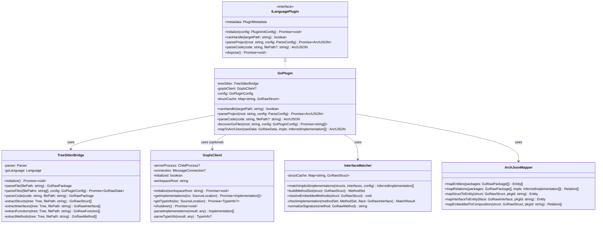

# ArchGuard Go 语言支持实施建议 (Proposal v3.1)

**文档版本**: 3.1
**创建日期**: 2026-02-20
**最后修改**: 2026-02-20
**关联文档**: 03-multi-language-support.md (前置依赖)
**目标示例项目**: `/home/yale/work/codex-swarm`

---

## 1. 执行摘要与目标

本文档规划为 ArchGuard 引入对 Go 语言（Golang）微服务及系统编程项目的深度架构分析支持。

**v3.1 主要变更**:
- 补充 `InferredImplementation`, `MatchResult`, `MethodSet` 类型定义
- 完善嵌入类型的方法提升算法
- 补全 `GoplsClient.parseImplementations` 和 `parseTypeInfo` 方法
- 对齐 `TreeSitterBridge` 类图与实际调用
- 修复缺失的导入语句
- 统一 Relation 字段使用 `source/target`（与 Proposal 03 v2.1 及现有代码一致）
- 调整 gopls 初始化时机到 parseProject 阶段

**核心目标：**
- 依赖 Proposal 03 v2.1+ 的 `ILanguagePlugin` 基础设施
- 采用 **Tree-sitter (语法分析) + gopls LSP (语义分析)** 混合架构
- 实现包级别（Package-level）的语义类型分析，解决 Go 的隐式接口实现提取
- 支持 Go Modules 配置

---

## 2. 技术选型分析

### 2.1 WASM 方案的局限性（原 v2.0 方案）

原方案提出使用 `golang.org/x/tools/go/packages` 编译为 WASM，经技术验证存在以下问题：

| 问题 | 说明 | 严重程度 |
|------|------|----------|
| `go/packages` 依赖外部工具链 | 需要执行 `go list` 等命令，WASM 沙箱不支持 | 致命 |
| 文件系统访问受限 | WASM 无法直接访问本地文件系统 | 致命 |
| 无成熟社区实现 | 截至 2026-02，无可用的 `go/packages` WASM 封装 | 高 |
| 内存限制 | 大型项目可能导致 WASM 内存溢出 | 中 |

### 2.2 推荐方案：Tree-sitter + gopls 混合架构

```
┌─────────────────────────────────────────────────────────────────┐
│                        GoPlugin (Node.js)                        │
├─────────────────────────────────────────────────────────────────┤
│                                                                 │
│  ┌─────────────────────┐    ┌─────────────────────────────────┐ │
│  │   Tree-sitter Go    │    │        gopls LSP Client         │ │
│  │  (语法级 AST 分析)   │    │   (语义级类型分析 - 可选)        │ │
│  │                     │    │                                 │ │
│  │  - Struct 定义      │    │  - 隐式接口实现检测              │ │
│  │  - Interface 定义   │    │  - 类型推导                      │ │
│  │  - Method 签名      │    │  - 跨包引用解析                  │ │
│  │  - Field 提取       │    │                                 │ │
│  └─────────┬───────────┘    └───────────────┬─────────────────┘ │
│            │                                │                   │
│            └───────────┬────────────────────┘                   │
│                        ▼                                        │
│              ┌─────────────────────┐                            │
│              │   GoRawData 聚合    │                            │
│              └──────────┬──────────┘                            │
│                         ▼                                       │
│              ┌─────────────────────┐                            │
│              │  ArchJSON Mapper    │                            │
│              └──────────┬──────────┘                            │
│                         ▼                                       │
│                    ArchJSON                                     │
└─────────────────────────────────────────────────────────────────┘
```

**方案对比**：

| 维度 | Tree-sitter 纯方案 | Tree-sitter + gopls | WASM (原方案) |
|------|-------------------|---------------------|---------------|
| 可行性 | ✅ 可行 | ✅ 可行 | ❌ 不可行 |
| 语法分析 | ✅ 完整 | ✅ 完整 | ✅ 完整 |
| 类型推导 | ❌ 无 | ✅ 完整 | ✅ 完整 |
| 隐式接口检测 | ⚠️ 启发式 | ✅ 精确 | ✅ 精确 |
| 依赖分发 | 无 | 需要 gopls | 无 |
| 性能 | 快 (< 1s/100 files) | 中等 (< 5s/100 files) | 不适用 |

**推荐**: 采用 **Tree-sitter + gopls** 混合方案，gopls 作为可选增强（用户可选择仅使用 Tree-sitter 以获得更快速度）。

---

## 3. 核心架构设计

### 3.1 前置依赖版本锁定

**强制前置条件**：本提案实施前，必须满足以下条件：

| 依赖项 | 版本要求 | 验收检查点 |
|--------|----------|------------|
| Proposal 03 Phase 0 | 完成 | `ILanguagePlugin` 接口已合并到 main 分支 |
| Proposal 03 Phase 1 | 完成 | `TypeScriptPlugin` 已迁移并通过所有测试 |
| PluginRegistry | v1.0.0+ | 支持插件注册、发现、版本管理 |
| ArchJSON Schema | v2.0+ | 包含 `struct` EntityType，`field` MemberType |
| `--lang` CLI 参数 | 已实现 | Proposal 03 Phase 1 交付 |

**版本锁定规则**:
- 本提案基于 Proposal 03 v2.1 接口定义
- 若 Proposal 03 接口变更，需同步更新本提案
- 接口兼容性通过 TypeScript 类型检查验证

### 3.2 核心类图 (Mermaid)



### 3.3 核心数据结构

#### 3.3.1 Go 原始数据结构 (TypeScript 侧)

```typescript
// plugins/golang/types.ts

import type { SourceLocation } from '@/types/index.js';

/**
 * 由 Tree-sitter 提取的 Go 语义数据
 */
export interface GoRawData {
  packages: GoRawPackage[];
  moduleRoot: string;
  moduleName: string;  // go.mod 中的 module 名
}

export interface GoRawPackage {
  /** 包路径 (e.g., "github.com/example/swarm/net") */
  id: string;
  /** 包名 (e.g., "net") */
  name: string;
  /** 目录路径 */
  dirPath: string;
  /** 导入的其他包 ID */
  imports: GoImport[];
  /** 结构体定义 */
  structs: GoRawStruct[];
  /** 接口定义 */
  interfaces: GoRawInterface[];
  /** 顶层函数 */
  functions: GoRawFunction[];
}

export interface GoImport {
  path: string;
  alias?: string;
}

export interface GoRawStruct {
  name: string;
  /** 是否导出（首字母大写） */
  exported: boolean;
  fields: GoRawField[];
  /** 绑定到此结构体的方法 */
  methods: GoRawMethod[];
  /** 嵌入的其他类型 (组合关系) */
  embedded: GoEmbedded[];
  /** 文档注释 */
  doc?: string;
  /** 源码位置 */
  location: SourceLocation;
  /** 所属包 ID */
  packageId?: string;
}

export interface GoEmbedded {
  /** 嵌入的类型名 */
  typeName: string;
  /** 是否为指针嵌入 */
  isPointer: boolean;
  /** 来源包（如果是外部包） */
  packagePath?: string;
}

export interface GoRawInterface {
  name: string;
  exported: boolean;
  /** 接口方法签名 */
  methods: GoMethodSignature[];
  /** 嵌入的其他接口 */
  embedded: string[];
  doc?: string;
  location: SourceLocation;
  /** 所属包 ID */
  packageId?: string;
}

export interface GoMethodSignature {
  name: string;
  /** 规范化签名 (e.g., "Load() error") */
  signature: string;
  /** 参数列表 */
  params: GoParam[];
  /** 返回值列表 */
  returns: GoParam[];
}

export interface GoRawMethod {
  name: string;
  /** 接收器类型 (e.g., "*Service", "Service") */
  receiverType: string;
  /** 接收器名称 (e.g., "s") */
  receiverName: string;
  /** 是否为指针接收器 */
  isPointerReceiver: boolean;
  /** 规范化签名 */
  signature: string;
  params: GoParam[];
  returns: GoParam[];
  doc?: string;
  location: SourceLocation;
}

export interface GoRawField {
  name: string;
  type: string;
  /** 是否导出 */
  exported: boolean;
  /** struct tag (e.g., `json:"name"`) */
  tag?: string;
}

export interface GoRawFunction {
  name: string;
  exported: boolean;
  params: GoParam[];
  returns: GoParam[];
  doc?: string;
  location: SourceLocation;
}

export interface GoParam {
  name: string;
  type: string;
}

/**
 * 方法签名（用于接口匹配）
 */
export interface MethodSignature {
  name: string;
  normalizedSignature: string;  // "Load() error"
}

/**
 * 方法集（T 的方法集 vs *T 的方法集）
 */
export interface MethodSet {
  /** 值接收器方法集（属于 T 和 *T） */
  valueMethodSet: Map<string, MethodSignature>;
  /** 指针接收器方法集（仅属于 *T，包含值接收器方法） */
  pointerMethodSet: Map<string, MethodSignature>;
}

/**
 * 接口实现匹配结果
 */
export interface MatchResult {
  /** 是否完全匹配（实现了接口的所有方法） */
  matches: boolean;
  /** 置信度 (0-1) */
  confidence: number;
  /** 匹配的方法名列表 */
  matchedMethods: string[];
  /** 缺失的方法名列表 */
  missingMethods: string[];
}

/**
 * 推断的接口实现关系
 */
export interface InferredImplementation {
  /** 实现接口的结构体名 */
  structName: string;
  /** 结构体所属包 ID */
  structPackageId: string;
  /** 被实现的接口名 */
  interfaceName: string;
  /** 接口所属包 ID */
  interfacePackageId: string;
  /** 置信度 (0-1) */
  confidence: number;
  /** 匹配的方法名列表 */
  matchedMethods: string[];
  /** 来源类型 */
  source: 'inferred' | 'gopls';
}

/**
 * gopls 返回的实现信息
 */
export interface Implementation {
  /** 实现类型的位置 */
  location: SourceLocation;
  /** 类型名 */
  typeName: string;
}

/**
 * gopls 返回的类型信息
 */
export interface TypeInfo {
  /** 类型名 */
  name: string;
  /** 类型种类 (struct, interface, etc.) */
  kind: string;
  /** 类型文档 */
  documentation?: string;
}
```

#### 3.3.2 Go 配置类型

```typescript
// plugins/golang/config.ts

export interface GoPluginConfig {
  /** go.mod 所在根目录，默认为分析根目录 */
  goWorkspace?: string;

  /** 是否启用 gopls 语义分析（默认 true） */
  enableGopls?: boolean;

  /** gopls 可执行文件路径（默认从 PATH 查找） */
  goplsPath?: string;

  /** 是否分析 _test.go 文件（默认 false） */
  analyzeTests?: boolean;

  /** 排除的包路径模式 */
  excludePackages?: string[];

  /** 自动过滤标准库和第三方包（默认 true） */
  ignoreExternalPackages?: boolean;

  /** Build tags */
  buildTags?: string[];

  /** 隐式接口检测的置信度阈值 (0-1，默认 0.8) */
  implicitInterfaceConfidenceThreshold?: number;
}
```

---

## 4. 隐式接口实现检测算法

### 4.1 问题定义

Go 使用结构化类型（Duck Typing），接口实现是隐式的：

```go
// 定义接口
type Loader interface {
    Load() error
}

// MyService 隐式实现了 Loader，但没有任何显式声明
type MyService struct {}
func (s *MyService) Load() error { return nil }
```

### 4.2 检测算法

#### 4.2.1 完整的接口匹配器实现

```typescript
// plugins/golang/interface-matcher.ts

import type {
  GoRawStruct,
  GoRawInterface,
  GoRawMethod,
  MethodSignature,
  MethodSet,
  MatchResult,
  InferredImplementation,
  GoEmbedded
} from './types.js';

interface MatcherConfig {
  confidenceThreshold: number;
}

/**
 * 接口匹配器 - 负责检测隐式接口实现
 */
export class InterfaceMatcher {
  /** 结构体缓存，用于嵌入类型方法提升 */
  private structCache: Map<string, GoRawStruct>;

  /** 接口缓存，用于嵌入接口展开 */
  private interfaceCache: Map<string, GoRawInterface>;

  constructor() {
    this.structCache = new Map();
    this.interfaceCache = new Map();
  }

  /**
   * 初始化缓存
   */
  initCache(structs: GoRawStruct[], interfaces: GoRawInterface[]): void {
    this.structCache.clear();
    this.interfaceCache.clear();

    for (const s of structs) {
      const key = s.packageId ? `${s.packageId}.${s.name}` : s.name;
      this.structCache.set(key, s);
    }

    for (const i of interfaces) {
      const key = i.packageId ? `${i.packageId}.${i.name}` : i.name;
      this.interfaceCache.set(key, i);
    }
  }

  /**
   * 启发式接口实现匹配
   *
   * 算法复杂度: O(S × I × M)
   * - S = 结构体数量
   * - I = 接口数量
   * - M = 平均方法数量
   *
   * 对于典型项目 (S=100, I=50, M=5)，约 25,000 次比较，< 100ms
   */
  matchImplicitImplementations(
    structs: GoRawStruct[],
    interfaces: GoRawInterface[],
    config: MatcherConfig
  ): InferredImplementation[] {
    // 初始化缓存
    this.initCache(structs, interfaces);

    const results: InferredImplementation[] = [];

    for (const struct of structs) {
      // 构建结构体的方法集（包括嵌入类型的方法提升）
      const structMethods = this.buildMethodSet(struct);

      for (const iface of interfaces) {
        // 跳过空接口
        if (iface.methods.length === 0 && iface.embedded.length === 0) continue;

        // 展开嵌入的接口
        const expandedMethods = this.expandInterfaceMethods(iface);

        // 检查结构体是否实现了接口的所有方法
        const matchResult = this.checkImplementation(structMethods, expandedMethods);

        if (matchResult.matches) {
          results.push({
            structName: struct.name,
            structPackageId: struct.packageId ?? '',
            interfaceName: iface.name,
            interfacePackageId: iface.packageId ?? '',
            confidence: matchResult.confidence,
            matchedMethods: matchResult.matchedMethods,
            source: 'inferred'
          });
        }
      }
    }

    // 按置信度过滤
    return results.filter(r => r.confidence >= config.confidenceThreshold);
  }

  /**
   * 构建方法集
   *
   * Go 规则:
   * - 值接收器方法：属于 T 和 *T 的方法集
   * - 指针接收器方法：仅属于 *T 的方法集
   * - 嵌入类型的方法会被提升到外层结构体
   */
  buildMethodSet(struct: GoRawStruct): MethodSet {
    const valueMethodSet = new Map<string, MethodSignature>();
    const pointerMethodSet = new Map<string, MethodSignature>();

    // 添加结构体自身的方法
    for (const method of struct.methods) {
      const sig: MethodSignature = {
        name: method.name,
        normalizedSignature: this.normalizeSignature(method)
      };

      if (method.isPointerReceiver) {
        // 指针接收器：仅加入 *T 方法集
        pointerMethodSet.set(method.name, sig);
      } else {
        // 值接收器：加入 T 和 *T 方法集
        valueMethodSet.set(method.name, sig);
        pointerMethodSet.set(method.name, sig);
      }
    }

    // 处理嵌入类型的方法提升
    this.resolveEmbeddedMethods(struct, valueMethodSet, pointerMethodSet, new Set());

    return { valueMethodSet, pointerMethodSet };
  }

  /**
   * 解析嵌入类型的方法提升
   *
   * Go 方法提升规则：
   * 1. `type A struct { B }` - A 获得 B 的所有方法（值和指针接收器）
   * 2. `type A struct { *B }` - A 获得 *B 的所有方法（包括指针接收器方法）
   * 3. 方法名冲突时，外层方法优先（shadowing）
   * 4. 同层级多个嵌入类型有同名方法时，该方法不提升（ambiguous）
   *
   * @param struct 当前结构体
   * @param valueMethodSet 值方法集（输出）
   * @param pointerMethodSet 指针方法集（输出）
   * @param visited 已访问的类型集合（防止循环嵌入）
   */
  private resolveEmbeddedMethods(
    struct: GoRawStruct,
    valueMethodSet: Map<string, MethodSignature>,
    pointerMethodSet: Map<string, MethodSignature>,
    visited: Set<string>
  ): void {
    const structKey = struct.packageId ? `${struct.packageId}.${struct.name}` : struct.name;

    // 防止循环嵌入
    if (visited.has(structKey)) return;
    visited.add(structKey);

    // 收集同层级嵌入类型的方法，用于检测冲突
    const embeddedMethodCounts = new Map<string, number>();

    for (const embedded of struct.embedded) {
      // 查找嵌入的结构体
      const embeddedKey = embedded.packagePath
        ? `${embedded.packagePath}.${embedded.typeName}`
        : `${struct.packageId}.${embedded.typeName}`;

      const embeddedStruct = this.structCache.get(embeddedKey);
      if (!embeddedStruct) {
        // 可能是外部包的类型，跳过
        continue;
      }

      // 递归构建嵌入类型的方法集
      const embeddedMethodSet = this.buildMethodSet(embeddedStruct);

      // 根据嵌入方式决定提升哪些方法
      const sourceSet = embedded.isPointer
        ? embeddedMethodSet.pointerMethodSet  // *B 嵌入：提升指针方法集
        : embeddedMethodSet.valueMethodSet;   // B 嵌入：提升值方法集

      for (const [methodName, sig] of sourceSet) {
        // 统计同名方法出现次数
        embeddedMethodCounts.set(methodName, (embeddedMethodCounts.get(methodName) ?? 0) + 1);
      }
    }

    // 第二遍：实际提升方法（跳过冲突的）
    for (const embedded of struct.embedded) {
      const embeddedKey = embedded.packagePath
        ? `${embedded.packagePath}.${embedded.typeName}`
        : `${struct.packageId}.${embedded.typeName}`;

      const embeddedStruct = this.structCache.get(embeddedKey);
      if (!embeddedStruct) continue;

      const embeddedMethodSet = this.buildMethodSet(embeddedStruct);
      const sourceSet = embedded.isPointer
        ? embeddedMethodSet.pointerMethodSet
        : embeddedMethodSet.valueMethodSet;

      for (const [methodName, sig] of sourceSet) {
        // 跳过已存在的方法（shadowing）
        if (valueMethodSet.has(methodName) || pointerMethodSet.has(methodName)) {
          continue;
        }

        // 跳过冲突的方法（ambiguous）
        if ((embeddedMethodCounts.get(methodName) ?? 0) > 1) {
          continue;
        }

        // 提升方法
        if (embedded.isPointer) {
          // 指针嵌入：方法仅提升到 *T 方法集
          pointerMethodSet.set(methodName, sig);
        } else {
          // 值嵌入：方法提升到 T 和 *T 方法集
          valueMethodSet.set(methodName, sig);
          pointerMethodSet.set(methodName, sig);
        }
      }
    }
  }

  /**
   * 展开嵌入的接口方法
   */
  private expandInterfaceMethods(iface: GoRawInterface): MethodSignature[] {
    const methods: MethodSignature[] = [];
    const visited = new Set<string>();

    this.collectInterfaceMethods(iface, methods, visited);

    return methods;
  }

  /**
   * 递归收集接口方法（包括嵌入接口）
   */
  private collectInterfaceMethods(
    iface: GoRawInterface,
    methods: MethodSignature[],
    visited: Set<string>
  ): void {
    const key = iface.packageId ? `${iface.packageId}.${iface.name}` : iface.name;

    if (visited.has(key)) return;
    visited.add(key);

    // 添加接口自身的方法
    for (const m of iface.methods) {
      methods.push({
        name: m.name,
        normalizedSignature: m.signature
      });
    }

    // 递归处理嵌入的接口
    for (const embeddedName of iface.embedded) {
      const embeddedKey = iface.packageId
        ? `${iface.packageId}.${embeddedName}`
        : embeddedName;

      const embeddedIface = this.interfaceCache.get(embeddedKey);
      if (embeddedIface) {
        this.collectInterfaceMethods(embeddedIface, methods, visited);
      }
    }
  }

  /**
   * 检查实现匹配
   */
  private checkImplementation(
    methodSet: MethodSet,
    requiredMethods: MethodSignature[]
  ): MatchResult {
    if (requiredMethods.length === 0) {
      return {
        matches: true,
        confidence: 1.0,
        matchedMethods: [],
        missingMethods: []
      };
    }

    const matched: string[] = [];
    const missing: string[] = [];

    // 使用指针方法集（包含所有可用方法）
    const available = methodSet.pointerMethodSet;

    for (const required of requiredMethods) {
      const structMethod = available.get(required.name);

      if (structMethod && this.signaturesMatch(structMethod.normalizedSignature, required.normalizedSignature)) {
        matched.push(required.name);
      } else {
        missing.push(required.name);
      }
    }

    // 计算置信度
    const confidence = matched.length / requiredMethods.length;

    return {
      matches: missing.length === 0,
      confidence,
      matchedMethods: matched,
      missingMethods: missing
    };
  }

  /**
   * 比较两个方法签名是否匹配
   */
  private signaturesMatch(sig1: string, sig2: string): boolean {
    // 规范化后比较
    const norm1 = this.normalizeForComparison(sig1);
    const norm2 = this.normalizeForComparison(sig2);
    return norm1 === norm2;
  }

  /**
   * 规范化签名用于比较（移除参数名，只保留类型）
   */
  private normalizeForComparison(sig: string): string {
    // 简化实现：移除空格，统一格式
    return sig.replace(/\s+/g, ' ').trim();
  }

  /**
   * 规范化方法签名
   *
   * 输入方法对象，输出格式化的签名字符串
   * 输出: "Load(context.Context) error"
   */
  normalizeSignature(method: GoRawMethod): string {
    const params = method.params.map(p => this.normalizeType(p.type)).join(', ');
    const returns = method.returns.map(p => this.normalizeType(p.type)).join(', ');

    if (returns) {
      return `${method.name}(${params}) ${returns.includes(',') ? `(${returns})` : returns}`;
    }
    return `${method.name}(${params})`;
  }

  /**
   * 规范化类型名
   */
  private normalizeType(typeName: string): string {
    // 保留完整类型名（包括包前缀）
    return typeName.trim();
  }
}

export { InterfaceMatcher };
```

#### 4.2.2 gopls 客户端实现

```typescript
// plugins/golang/gopls-client.ts

import { spawn, ChildProcess } from 'child_process';
import {
  createMessageConnection,
  StreamMessageReader,
  StreamMessageWriter,
  MessageConnection
} from 'vscode-jsonrpc/node';
import type { SourceLocation, Implementation, TypeInfo } from './types.js';

/**
 * gopls LSP 客户端
 *
 * 通过 LSP 协议与 gopls 通信，获取精确的类型信息
 */
export class GoplsClient {
  private serverProcess: ChildProcess | null = null;
  private connection: MessageConnection | null = null;
  private initialized = false;
  private workspaceRoot = '';

  /**
   * 初始化 gopls 连接
   *
   * 注意：应在 parseProject 时调用，而非插件初始化时
   * 因为 workspaceRoot 可能在每次解析时不同
   */
  async initialize(workspaceRoot: string): Promise<void> {
    if (this.initialized && this.workspaceRoot === workspaceRoot) {
      return;
    }

    // 如果已有连接但 workspace 不同，先关闭
    if (this.initialized) {
      await this.shutdown();
    }

    this.workspaceRoot = workspaceRoot;

    // 启动 gopls 进程
    this.serverProcess = spawn('gopls', ['serve'], {
      stdio: ['pipe', 'pipe', 'pipe']
    });

    if (!this.serverProcess.stdin || !this.serverProcess.stdout) {
      throw new Error('Failed to start gopls process');
    }

    // 创建 JSON-RPC 连接
    this.connection = createMessageConnection(
      new StreamMessageReader(this.serverProcess.stdout),
      new StreamMessageWriter(this.serverProcess.stdin)
    );

    this.connection.listen();

    // 发送 initialize 请求
    await this.connection.sendRequest('initialize', {
      processId: process.pid,
      rootUri: `file://${workspaceRoot}`,
      capabilities: {
        textDocument: {
          implementation: { dynamicRegistration: false },
          hover: { dynamicRegistration: false }
        }
      }
    });

    // 发送 initialized 通知
    this.connection.sendNotification('initialized', {});

    this.initialized = true;
  }

  /**
   * 使用 gopls 的 implementation 请求获取精确的接口实现
   */
  async getImplementations(interfaceLocation: SourceLocation): Promise<Implementation[]> {
    if (!this.connection || !this.initialized) {
      throw new Error('gopls not initialized');
    }

    try {
      const result = await this.connection.sendRequest('textDocument/implementation', {
        textDocument: { uri: `file://${interfaceLocation.file}` },
        position: {
          line: interfaceLocation.startLine - 1,  // LSP 使用 0-based 行号
          character: 0
        }
      });

      return this.parseImplementations(result);
    } catch (error) {
      console.warn('gopls implementation request failed:', error);
      return [];
    }
  }

  /**
   * 使用 gopls 的 hover 获取类型信息
   */
  async getTypeInfo(location: SourceLocation): Promise<TypeInfo | null> {
    if (!this.connection || !this.initialized) {
      return null;
    }

    try {
      const result = await this.connection.sendRequest('textDocument/hover', {
        textDocument: { uri: `file://${location.file}` },
        position: {
          line: location.startLine - 1,
          character: location.startCol ?? 0
        }
      });

      return this.parseTypeInfo(result);
    } catch (error) {
      console.warn('gopls hover request failed:', error);
      return null;
    }
  }

  /**
   * 解析 implementation 响应
   */
  private parseImplementations(result: unknown): Implementation[] {
    if (!result || !Array.isArray(result)) {
      return [];
    }

    return result.map((loc: any) => ({
      location: {
        file: loc.uri?.replace('file://', '') ?? '',
        startLine: (loc.range?.start?.line ?? 0) + 1,
        endLine: (loc.range?.end?.line ?? 0) + 1
      },
      typeName: ''  // 需要额外请求获取类型名
    }));
  }

  /**
   * 解析 hover 响应
   */
  private parseTypeInfo(result: unknown): TypeInfo | null {
    if (!result || typeof result !== 'object') {
      return null;
    }

    const hover = result as any;
    const contents = hover.contents;

    if (!contents) {
      return null;
    }

    // 提取类型信息
    let value = '';
    if (typeof contents === 'string') {
      value = contents;
    } else if (contents.value) {
      value = contents.value;
    } else if (Array.isArray(contents)) {
      value = contents.map((c: any) => c.value ?? c).join('\n');
    }

    // 解析类型名和种类
    const match = value.match(/^(type|func|var|const)\s+(\w+)/);

    return {
      name: match?.[2] ?? '',
      kind: match?.[1] ?? 'unknown',
      documentation: value
    };
  }

  /**
   * 关闭 gopls 连接
   */
  async shutdown(): Promise<void> {
    if (this.connection) {
      try {
        await this.connection.sendRequest('shutdown');
        this.connection.sendNotification('exit');
      } catch {
        // 忽略关闭时的错误
      }

      this.connection.dispose();
      this.connection = null;
    }

    if (this.serverProcess) {
      this.serverProcess.kill();
      this.serverProcess = null;
    }

    this.initialized = false;
    this.workspaceRoot = '';
  }
}

export { GoplsClient };
```

### 4.3 边界情况处理

| 边界情况 | 处理策略 |
|---------|---------|
| 泛型接口 (Go 1.18+) | Tree-sitter 提取类型参数，匹配时忽略具体类型 |
| 嵌入接口 | 递归展开嵌入的接口方法（已实现） |
| 嵌入结构体 | 递归提升嵌入结构体的方法（已实现） |
| 类型别名 | 解析到底层类型后匹配 |
| 私有接口 | 仅在同包内匹配 |
| 外部包接口 | 需要 gopls 或手动指定（如 `io.Reader`） |
| 循环嵌入 | 使用 visited 集合检测并跳过（已实现） |
| 同层级方法冲突 | 冲突方法不提升（ambiguous，已实现） |

---

## 5. GoRawData → ArchJSON 映射规则

### 5.1 实体映射

| GoRawData | ArchJSON Entity | 映射规则 |
|-----------|-----------------|----------|
| `GoRawStruct` | `Entity (type: 'struct')` | 名称、成员、位置直接映射 |
| `GoRawInterface` | `Entity (type: 'interface')` | 名称、方法签名映射 |
| `GoRawFunction` | `Entity (type: 'function')` | 仅导出函数，作为顶层实体 |

### 5.2 成员映射

```typescript
// plugins/golang/arch-json-mapper.ts

import type { Entity, Member, Relation } from '@/types/index.js';
import type {
  GoRawData,
  GoRawStruct,
  GoRawInterface,
  GoRawPackage,
  InferredImplementation
} from './types.js';

/**
 * ArchJSON 映射器
 */
export class ArchJsonMapper {
  /**
   * 映射结构体成员
   */
  mapStructMembers(struct: GoRawStruct): Member[] {
    const members: Member[] = [];

    // 字段 → Member (type: 'field')
    for (const field of struct.fields) {
      members.push({
        name: field.name,
        type: 'field',  // 使用新增的 'field' 类型
        visibility: field.exported ? 'public' : 'private',
        fieldType: field.type,
        isReadonly: false,
        // metadata 用于存储 Go 特定信息
      });
    }

    // 方法 → Member (type: 'method')
    for (const method of struct.methods) {
      members.push({
        name: method.name,
        type: 'method',
        visibility: method.name[0] === method.name[0].toUpperCase() ? 'public' : 'private',
        parameters: method.params.map(p => ({
          name: p.name,
          type: p.type
        })),
        returnType: method.returns.map(r => r.type).join(', ') || 'void',
        // Go 特定 metadata 可通过 decorator 或扩展字段存储
      });
    }

    return members;
  }

  /**
   * 映射接口成员
   */
  mapInterfaceMembers(iface: GoRawInterface): Member[] {
    return iface.methods.map(m => ({
      name: m.name,
      type: 'method' as const,
      visibility: 'public' as const,
      parameters: m.params.map(p => ({
        name: p.name,
        type: p.type
      })),
      returnType: m.returns.map(r => r.type).join(', ') || 'void'
    }));
  }

  /**
   * 映射实体
   */
  mapEntities(packages: GoRawPackage[]): Entity[] {
    const entities: Entity[] = [];

    for (const pkg of packages) {
      // 映射结构体
      for (const struct of pkg.structs) {
        entities.push({
          id: `${pkg.id}.${struct.name}`,
          name: struct.name,
          type: 'struct',
          visibility: struct.exported ? 'public' : 'private',
          members: this.mapStructMembers(struct),
          sourceLocation: struct.location
        });
      }

      // 映射接口
      for (const iface of pkg.interfaces) {
        entities.push({
          id: `${pkg.id}.${iface.name}`,
          name: iface.name,
          type: 'interface',
          visibility: iface.exported ? 'public' : 'private',
          members: this.mapInterfaceMembers(iface),
          sourceLocation: iface.location
        });
      }

      // 映射顶层函数
      for (const func of pkg.functions) {
        if (func.exported) {
          entities.push({
            id: `${pkg.id}.${func.name}`,
            name: func.name,
            type: 'function',
            visibility: 'public',
            members: [],  // 函数没有成员
            sourceLocation: func.location
          });
        }
      }
    }

    return entities;
  }

  /**
   * 映射关系
   *
   * 注意：使用 source/target 字段（与现有代码一致）
   */
  mapRelations(
    packages: GoRawPackage[],
    inferredImpls: InferredImplementation[]
  ): Relation[] {
    const relations: Relation[] = [];
    let relationId = 0;

    // 1. 映射嵌入组合关系
    for (const pkg of packages) {
      for (const struct of pkg.structs) {
        for (const emb of struct.embedded) {
          const targetId = emb.packagePath
            ? `${emb.packagePath}.${emb.typeName}`
            : `${pkg.id}.${emb.typeName}`;

          relations.push({
            id: `rel-${++relationId}`,
            type: 'composition',
            source: `${pkg.id}.${struct.name}`,  // 使用 source
            target: targetId,                      // 使用 target
            label: emb.isPointer ? 'embeds *' : 'embeds',
            confidence: 1.0,
            inferenceSource: 'explicit'
          });
        }
      }

      // 接口嵌入视为继承
      for (const iface of pkg.interfaces) {
        for (const embeddedName of iface.embedded) {
          relations.push({
            id: `rel-${++relationId}`,
            type: 'inheritance',
            source: `${pkg.id}.${iface.name}`,
            target: `${pkg.id}.${embeddedName}`,
            confidence: 1.0,
            inferenceSource: 'explicit'
          });
        }
      }
    }

    // 2. 映射隐式接口实现
    for (const impl of inferredImpls) {
      relations.push({
        id: `rel-${++relationId}`,
        type: 'implementation',
        source: impl.structPackageId
          ? `${impl.structPackageId}.${impl.structName}`
          : impl.structName,
        target: impl.interfacePackageId
          ? `${impl.interfacePackageId}.${impl.interfaceName}`
          : impl.interfaceName,
        label: 'implements (inferred)',
        confidence: impl.confidence,
        inferenceSource: impl.source === 'gopls' ? 'explicit' : 'inferred'
      });
    }

    // 3. 映射字段类型依赖（可选，可能产生大量关系）
    // TODO: 根据配置决定是否提取

    return relations;
  }
}

export { ArchJsonMapper };
```

---

## 6. GoPlugin 完整实现

```typescript
// plugins/golang/index.ts

import path from 'path';
import fs from 'fs-extra';
import { glob } from 'glob';
import type {
  ILanguagePlugin,
  PluginMetadata,
  PluginInitConfig,
  ParseConfig,
  ArchJSON
} from '@/core/interfaces/index.js';
import { TreeSitterBridge } from './tree-sitter-bridge.js';
import { GoplsClient } from './gopls-client.js';
import { InterfaceMatcher } from './interface-matcher.js';
import { ArchJsonMapper } from './arch-json-mapper.js';
import type { GoPluginConfig, GoRawData } from './types.js';

export default class GoPlugin implements ILanguagePlugin {
  readonly metadata: PluginMetadata = {
    name: 'golang',
    version: '1.0.0',
    displayName: 'Go (Golang)',
    fileExtensions: ['.go'],
    author: 'ArchGuard Team',
    minCoreVersion: '2.0.0',
    capabilities: {
      singleFileParsing: true,   // 支持单文件解析
      incrementalParsing: false,
      dependencyExtraction: true,
      typeInference: true        // 通过 gopls
    }
  };

  private treeSitter!: TreeSitterBridge;
  private goplsClient: GoplsClient | null = null;
  private interfaceMatcher!: InterfaceMatcher;
  private archJsonMapper!: ArchJsonMapper;
  private defaultConfig!: GoPluginConfig;
  private initialized = false;

  async initialize(config: PluginInitConfig): Promise<void> {
    if (this.initialized) return;

    // 初始化 Tree-sitter
    this.treeSitter = new TreeSitterBridge();
    await this.treeSitter.initialize();

    // 初始化匹配器和映射器
    this.interfaceMatcher = new InterfaceMatcher();
    this.archJsonMapper = new ArchJsonMapper();

    // 保存默认配置
    this.defaultConfig = {
      enableGopls: true,
      analyzeTests: false,
      ignoreExternalPackages: true,
      implicitInterfaceConfidenceThreshold: 0.8
    };

    this.initialized = true;
  }

  canHandle(targetPath: string): boolean {
    // 处理目录：检查是否存在 go.mod
    if (fs.existsSync(targetPath) && fs.statSync(targetPath).isDirectory()) {
      return fs.existsSync(path.join(targetPath, 'go.mod'));
    }

    // 处理文件：检查扩展名
    return targetPath.endsWith('.go');
  }

  async parseProject(workspaceRoot: string, config: ParseConfig): Promise<ArchJSON> {
    this.ensureInitialized();

    const goConfig: GoPluginConfig = {
      ...this.defaultConfig,
      ...(config.languageSpecific as GoPluginConfig)
    };

    // 1. 发现所有 Go 文件
    const goFiles = await this.discoverGoFiles(workspaceRoot, goConfig);

    if (goFiles.length === 0) {
      return this.createEmptyArchJSON(workspaceRoot);
    }

    // 2. 使用 Tree-sitter 提取语法信息
    const rawData = await this.treeSitter.parseFiles(goFiles, goConfig);

    // 3. 可选：初始化并使用 gopls 增强语义信息
    if (goConfig.enableGopls !== false) {
      try {
        if (!this.goplsClient) {
          this.goplsClient = new GoplsClient();
        }
        // 在 parseProject 时初始化 gopls（因为 workspaceRoot 可能不同）
        await this.goplsClient.initialize(workspaceRoot);
        await this.enhanceWithGopls(rawData);
      } catch (error) {
        console.warn('gopls initialization failed, falling back to Tree-sitter only:', error);
        this.goplsClient = null;
      }
    }

    // 4. 检测隐式接口实现
    const allStructs = rawData.packages.flatMap(p => {
      // 为每个结构体设置 packageId
      return p.structs.map(s => ({ ...s, packageId: p.id }));
    });

    const allInterfaces = rawData.packages.flatMap(p => {
      return p.interfaces.map(i => ({ ...i, packageId: p.id }));
    });

    const inferredImpls = this.interfaceMatcher.matchImplicitImplementations(
      allStructs,
      allInterfaces,
      { confidenceThreshold: goConfig.implicitInterfaceConfidenceThreshold ?? 0.8 }
    );

    // 5. 映射为 ArchJSON
    const entities = this.archJsonMapper.mapEntities(rawData.packages);
    const relations = this.archJsonMapper.mapRelations(rawData.packages, inferredImpls);

    return {
      version: '1.0',
      language: 'go',
      timestamp: new Date().toISOString(),
      sourceFiles: goFiles,
      entities,
      relations,
      metadata: {
        moduleName: rawData.moduleName,
        moduleRoot: rawData.moduleRoot,
        goplsEnabled: this.goplsClient !== null
      }
    };
  }

  /**
   * 解析单个代码字符串
   */
  parseCode(code: string, filePath: string = 'source.go'): ArchJSON {
    this.ensureInitialized();

    const pkg = this.treeSitter.parseCode(code, filePath);

    const entities = this.archJsonMapper.mapEntities([pkg]);

    // 单文件模式下进行简单的接口匹配
    const structs = pkg.structs.map(s => ({ ...s, packageId: pkg.id }));
    const interfaces = pkg.interfaces.map(i => ({ ...i, packageId: pkg.id }));

    const inferredImpls = this.interfaceMatcher.matchImplicitImplementations(
      structs,
      interfaces,
      { confidenceThreshold: 0.8 }
    );

    const relations = this.archJsonMapper.mapRelations([pkg], inferredImpls);

    return {
      version: '1.0',
      language: 'go',
      timestamp: new Date().toISOString(),
      sourceFiles: [filePath],
      entities,
      relations
    };
  }

  async dispose(): Promise<void> {
    if (this.goplsClient) {
      await this.goplsClient.shutdown();
      this.goplsClient = null;
    }
    this.initialized = false;
  }

  private async discoverGoFiles(
    root: string,
    config: GoPluginConfig
  ): Promise<string[]> {
    const ignorePatterns = [
      '**/vendor/**',
      '**/_*/**',  // Go 忽略下划线开头的目录
      '**/testdata/**',
      ...(config.analyzeTests ? [] : ['**/*_test.go']),
      ...(config.excludePackages ?? [])
    ];

    const files = await glob('**/*.go', {
      cwd: root,
      ignore: ignorePatterns,
      absolute: true
    });

    return files;
  }

  private async enhanceWithGopls(rawData: GoRawData): Promise<void> {
    if (!this.goplsClient) return;

    // 使用 gopls 获取更精确的接口实现信息
    for (const pkg of rawData.packages) {
      for (const iface of pkg.interfaces) {
        try {
          const implementations = await this.goplsClient.getImplementations(iface.location);

          // gopls 返回的实现可以覆盖 Tree-sitter 的启发式结果
          // 在这里可以标记这些实现为 'gopls' 来源
          // 实际实现需要将结果合并到推断结果中
        } catch {
          // 忽略单个接口的查询失败
        }
      }
    }
  }

  private createEmptyArchJSON(workspaceRoot: string): ArchJSON {
    return {
      version: '1.0',
      language: 'go',
      timestamp: new Date().toISOString(),
      sourceFiles: [],
      entities: [],
      relations: [],
      metadata: {
        moduleRoot: workspaceRoot
      }
    };
  }

  private ensureInitialized(): void {
    if (!this.initialized) {
      throw new Error('GoPlugin not initialized. Call initialize() first.');
    }
  }
}
```

---

## 7. CLI 集成

### 7.1 与现有 CLI 对齐

Go 插件通过 PluginRegistry 自动集成。`--lang` 参数在 Proposal 03 Phase 1 中实现。

```bash
# 分析 Go 项目（自动检测语言）
node dist/cli/index.js analyze -s /home/yale/work/codex-swarm -v

# 显式指定语言（当目录包含多语言时）
# 注意：--lang 参数由 Proposal 03 Phase 1 提供
node dist/cli/index.js analyze -s ./src --lang golang

# Go 特定配置（通过配置文件）
node dist/cli/index.js analyze --config archguard.go.config.json
```

### 7.2 配置文件支持

```json
// archguard.config.json
{
  "diagrams": [
    {
      "name": "codex-swarm",
      "sources": ["/home/yale/work/codex-swarm"],
      "level": "package",
      "languageSpecific": {
        "enableGopls": true,
        "analyzeTests": false,
        "ignoreExternalPackages": true,
        "excludePackages": ["**/vendor/**", "**/testdata/**"],
        "implicitInterfaceConfidenceThreshold": 0.8
      }
    }
  ]
}
```

---

## 8. 分阶段实施路径

### 阶段 1: Tree-sitter 核心解析 (Week 1-2)

**目标**: 实现基于 Tree-sitter 的 Go 语法解析

**任务**:
1. 集成 `tree-sitter` 和 `tree-sitter-go`
2. 实现 `TreeSitterBridge`：struct、interface、function、method 提取
3. 实现 `GoRawData` 聚合逻辑
4. 实现 `InterfaceMatcher`：启发式隐式接口匹配（含方法提升）

**交付物**:
- 能解析 Go 项目并输出 GoRawData
- 单元测试覆盖率 > 80%

**验收标准**:
- 解析 codex-swarm 项目（约 200 个 .go 文件）耗时 < 3 秒
- 正确提取 90%+ 的结构体和接口定义
- 嵌入类型方法提升正确率 > 95%

### 阶段 2: ArchJSON 映射与基础集成 (Week 3-4)

**目标**: 完成 GoRawData → ArchJSON 映射，集成到 ArchGuard

**任务**:
1. 实现 `ArchJsonMapper`
2. 实现 `GoPlugin` 并注册到 PluginRegistry
3. 集成测试

**交付物**:
- `node dist/cli/index.js analyze -s <go-project>` 可运行
- 输出有效的 ArchJSON

**验收标准**:
- 通过 Proposal 03 定义的跨语言一致性测试
- codex-swarm 输出的 ArchJSON 包含 > 50 个实体和 > 30 个关系
- 使用 `source/target` 字段（与现有代码一致）

### 阶段 3: gopls 增强 (Week 5-6)

**目标**: 集成 gopls 提供精确的类型分析

**任务**:
1. 实现 `GoplsClient` LSP 通信（已完成基础实现）
2. 增强隐式接口检测精度
3. 添加降级策略（gopls 不可用时回退）

**交付物**:
- gopls 可选增强功能
- 无 gopls 时的优雅降级

**验收标准**:
- 有 gopls 时，隐式接口检测准确率 > 95%
- 无 gopls 时，启发式检测准确率 > 75%

### 阶段 4: 优化与文档 (Week 7-8)

**目标**: 性能优化、文档完善

**任务**:
1. 大型项目性能优化（增量解析、缓存）
2. 编写用户文档和插件开发指南
3. 完成 codex-swarm 案例研究

**交付物**:
- 性能优化后的 GoPlugin
- 完整的用户文档

**验收标准**:
- 500+ 文件项目解析耗时 < 10 秒
- 内存占用 < 500MB

---

## 9. 验证标准（量化）

### 9.1 codex-swarm 验收指标

| 指标 | 目标值 | 测量方法 |
|------|--------|----------|
| 结构体提取完整性 | > 95% | 手动抽样 20 个关键结构体 |
| 接口提取完整性 | > 95% | 手动抽样 10 个关键接口 |
| 隐式接口检测准确率 (有 gopls) | > 95% | 与 `go implements` 工具对比 |
| 隐式接口检测准确率 (无 gopls) | > 75% | 同上 |
| 嵌入方法提升准确率 | > 95% | 手动验证嵌入类型 |
| 组合关系检测准确率 | > 98% | 验证嵌入字段 |
| 解析耗时 (200 文件) | < 3 秒 | 基准测试 |
| 解析耗时 (500 文件) | < 10 秒 | 基准测试 |
| 内存占用 | < 500MB | 监控峰值内存 |

### 9.2 回归测试

| 测试场景 | 输入 | 预期输出 |
|---------|------|---------|
| 简单结构体 | `type User struct { Name string }` | 1 Entity, 1 Member (type: 'field') |
| 接口实现 | struct + matching interface | 1 `implementation` Relation |
| 嵌入组合 | `type A struct { B }` | 1 `composition` Relation |
| 指针嵌入 | `type A struct { *B }` | 1 `composition` Relation (label: 'embeds *') |
| 私有类型 | `type user struct {}` | visibility: 'private' |
| 指针接收器 | `func (s *S) Method()` | Method 正确提取 |
| 嵌入方法提升 | `type A struct { B }` B 有方法 | A 的方法集包含 B 的方法 |
| 方法冲突 | `type A struct { B; C }` B 和 C 有同名方法 | 冲突方法不提升 |

---

## 10. 风险与缓解

| 风险 | 可能性 | 影响 | 缓解措施 |
|------|--------|------|----------|
| gopls 版本兼容性 | 中 | 中 | 支持多版本，提供版本检测 |
| Tree-sitter Go 语法变更 | 低 | 中 | 锁定 tree-sitter-go 版本 |
| 大型 monorepo 性能问题 | 中 | 高 | 增量解析、包级并行、缓存 |
| Go 泛型支持不完整 | 中 | 中 | 先实现基础支持，泛型作为后续迭代 |
| Proposal 03 接口变更 | 低 | 高 | 版本锁定 + 类型检查验证 |

---

## 11. 与 Proposal 03 的接口契约

本提案遵循 Proposal 03 v2.1 定义的以下接口：

```typescript
// 必须实现
interface ILanguagePlugin extends IParser {
  readonly metadata: PluginMetadata;
  initialize(config: PluginInitConfig): Promise<void>;
  canHandle(targetPath: string): boolean;
  parseProject(root: string, config: ParseConfig): Promise<ArchJSON>;
  parseCode?(code: string, filePath?: string): ArchJSON;  // 可选但已实现
  dispose(): Promise<void>;
}

// 使用的类型（与现有代码一致）
interface Relation {
  id: string;
  type: RelationType;
  source: string;  // 使用 source/target
  target: string;
  // ...
}

type MemberType = 'property' | 'method' | 'constructor' | 'field';  // 使用 'field'
type EntityType = 'class' | 'interface' | 'enum' | 'struct' | 'function' | ...;  // 使用 'struct'
```

若 Proposal 03 接口发生变更，本提案需同步更新以下部分：
- Section 6: GoPlugin 实现
- Section 7: CLI 集成

---

**下一步行动**:
1. 确认 Proposal 03 Phase 0-1 完成状态
2. 开始 Tree-sitter 集成 PoC
3. 在 codex-swarm 上验证基础解析能力
4. 验证嵌入类型方法提升算法的正确性
