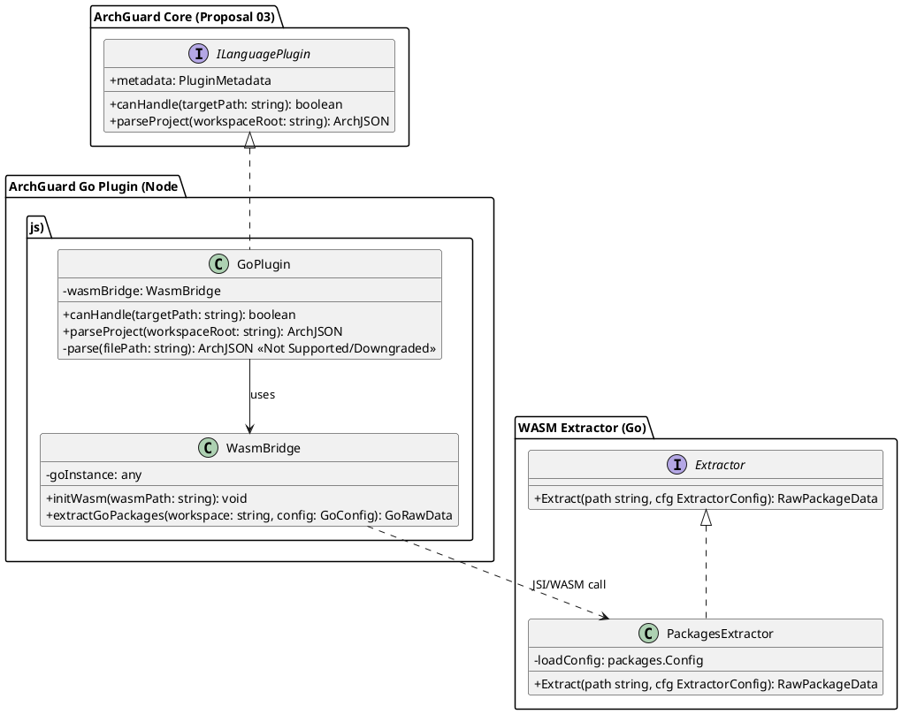

# ArchGuard Go 语言支持实施建议 (Proposal v2.0)

**文档版本**: 2.0
**创建日期**: 2026-02-20
**关联文档**: 03-multi-language-support.md (前置依赖)
**目标示例项目**: `/home/yale/work/codex-swarm`

---

## 1. 执行摘要与目标

本文档规划为 ArchGuard 引入对 Go 语言（Golang）微服务及系统编程项目的深度架构分析支持。
在第一版的基础上，本版深刻吸取了架构审查意见，彻底解决了 **底层解析器分发困境**、**语义级类型推导缺陷（隐式接口实现）**，并明确了与现有代码库中**多语言架构（ILanguagePlugin）的前置解耦关系**。

**核心目标：**
- 彻底抽离 `ILanguagePlugin` 作为基建，确保 Go 解析器不成为悬空实现。
- 采用 **WASM (WebAssembly)** 或 **Tree-sitter (Node bindings)** 进行高性能、轻量级、跨平台的进程内解析，拒绝 CLI 分发依赖。
- 引入包级别（Package-level）的语义类型分析，解决 Go 的隐式接口实现（Duck Typing）提取痛点。
- 支持 Go 特有的模块化（Go Modules）解析参数。

---

## 2. 核心架构修正与设计

### 2.1 基础架构前置要求（Dependency on Proposal 03）

**Blocker**: 本提案（Proposal 15）强依赖于 `03-multi-language-support.md` 中 **Phase 1** 阶段的核心基建落地。
在引入任何 Go 代码之前，必须确保 ArchGuard 已经拥有真正的 `ILanguagePlugin` 抽象网关和 `PluginRegistry`。

**本提案范围限定**: 本提案仅关注 GoPlugin 的 WASM 提取器构建及特有的语义（Duck Typing、Go Modules）处理。对于多语言抽象网关的重构剥离，请参见 Proposal 03。

### 2.2 解析引擎技术选型 (进程内执行)

为避免 `go-ast-extractor` CLI 带来的分发灾难和跨进程性能损耗，我们在 Node.js 进程内获取 Go 的结构与语义信息，采用 **Go WASM (golang.org/x/tools/go/packages)** 技术栈。

**结论**: Go 语言插件 (`GoPlugin`) 将捆绑经过编译的 `parser.wasm` (由 Go 编写的使用 `go/packages` 的提取器)。Node.js 主进程直接加载执行。

### 2.3 核心类图与接口设计 (PlantUML)

以下是 Go 插件架构的核心类与接口设计：



#### 2.3.1 核心数据结构与接口 (无实现逻辑)

为了连接 Node 端和 WASM 端，需要设计一个中间传输结构（`GoRawData`），它比最终的 `ArchJSON` 更加扁平和贴近 Go 语义，由 `GoPlugin` 负责清洗。

**1. WASM 核心提取接口 (Go 侧定义)**:
```go
// ExtractorConfig 为传给 golang.org/x/tools/go/packages 的载荷配置
type ExtractorConfig struct {
    Dir              string
    IgnoreGoModCache bool
    AnalyzeTests     bool
    BuildTags        []string
}

// Extractor 控制整个提取流程
type Extractor interface {
    Extract(path string, cfg ExtractorConfig) (*RawPackageData, error)
}
```

**2. 中间传输记录结构 (Node/TS 侧定义)**:
```typescript
/**
 * 由 WASM 端返回的未经清洗的 Go 语义树（扁平化）
 */
interface GoRawData {
  packages: GoRawPackage[];
  moduleRoot: string;
}

interface GoRawPackage {
  id: string;               // e.g. "github.com/example/swarm/net"
  name: string;             // e.g. "net"
  imports: string[];        // 导入的其他包 ID
  structs: GoRawStruct[];
  interfaces: GoRawInterface[];
}

interface GoRawStruct {
  name: string;
  fields: GoRawField[];
  methods: GoRawMethod[];
  embedded: string[];       // 嵌入的其他结构体或接口 (组合关系)
}

interface GoRawInterface {
  name: string;
  methods: GoRawMethod[];
}

interface GoRawMethod {
  name: string;
  signature: string;        // 完整签名
  receiverType: string;     // e.g. "*Service"
}

interface GoRawField {
  name: string;
  type: string;
}
```

### 2.4 解决 Go 的 Duck Typing 与依赖识别

仅靠单文件 AST 无法识别如下情况下的接口实现关系：
```go
type MyService struct {}
// 实现了 config 包中的 Loader 接口，但没有任何显式声明 (implements)
func (s *MyService) Load() error { return nil }
```

**实施方案**:
通过 WASM 加载整个项目工作区，使用 `golang.org/x/tools/go/packages` 获取完整的类型推导信息（Type-Checked Packages）。
- **实体映射**: Go 的 `Struct` 和 `Interface` 映射为 Arch-JSON 的 `Entities`。
- **关系映射**: 
  - 通过全局扫描包级别方法集（Method Sets）与接口签名（Signatures），动态建立属于 `implementation` 的 Relation。
  - 通过指针或值接收器（Receivers）、字段组合（Struct Embedding）建立 `composition` 关系。

### 2.5 扩展的运行时配置

`ArchGuardConfig` 及 CLI 支持以下专为 Go Modules 时代设计的配置：

| 参数/配置项 | 类型 | 描述 |
| --- | --- | --- |
| `goWorkspace` | string | `go.mod` 所在根目录路径，默认为分析根目录。 |
| `ignoreGoModCache` | boolean | 默认 `true`。自动过滤掉 `$GOPATH/pkg/mod` 中下载和引用的第三方标准或三方包，防止解析出庞大而无用的标准库图谱。 |
| `analyzeTests` | boolean | 默认 `false`。是否深度分析并抽取 `_test.go` 文件及包，用于单元测试覆盖拓扑图。 |
| `buildTags`| string[] | 注入必要的 build tags，避免 WASM 解析时因跨平台条件编译 (`+build linux`) 导致的类型丢失。 |

---

## 3. 分阶段实施路径 (四步走)

### 阶段 1: WASM 解析器构建 (Core Extraction Engine)
**目标**: 创建独立且跨平台的 Go 语义提取器 `parser.wasm`。
**任务**:
1. 初始化 `plugins/golang/go-extractor` 目录（Go 项目）。
2. 构建利用 `go/packages` 解析包信息并输出特定 `ArchJSON` 碎片的 Go 代码。
3. 编译发布为 `.wasm` 格式，与 `go_wasm_exec.js` 胶水代码一并提交到仓库。
**交付物**: 纯净且独立的 `parser.wasm` 引擎，可通过 Node 环境直接加载执行解析测试文件。

### 阶段 2: Node.js 适配桥接与多包解析
**目标**: 将 WASM 解析器完全接入 ArchGuard 体系。
**任务**:
1. 实现 `GoPlugin`，负责加载 WASM 实例与内存指令传递。
2. 在 TS 侧还原 `GoPlugin` 接收到的结构，将隐式接口、组合映射为 Arch-JSON 实体间关系（Relations）。
**交付物**: CLI 完美运行 `archguard generate -p /home/yale/work/codex-swarm --lang go` 并输出带完整类型映射的 JSON。

### 阶段 3: 并行渲染、图表优化及 codex-swarm 深层架构绘制
**目标**: 大型微服务项目的性能优化及最终 Markdown 交付。
**任务**:
1. 控制 WASM OOM 风险，进行包维度的分批送入解析。
2. 配合 Mermaid 绘制出清晰的微服务结构和 P2P 网络模块分布。
**交付物**: `/home/yale/work/codex-swarm` 项目的完整高质量 Mermaid 图（含类图与包依赖图），并在文档中验证通过。

---

## 4. 示例验证 (`codex-swarm`)

在实施过程中，把控 `/home/yale/work/codex-swarm` 作为唯一标准集成测试基线。

**重点考察点**:
1. 提取 P2P 网络（如 libp2p 的封装）中的深层方法接收者，建立准确的 `composition`。
2. 正确忽略 `vendor` (如果有) 和 `$GOPATH/mod` 中的无关大库（如 `ipfs`, `grpc` 代码），聚焦于 Swarm 逻辑拓扑。
3. 确保 WASM 解析器在大型代码库（数百个 `.go` 文件）下能控制在秒级完成响应。
