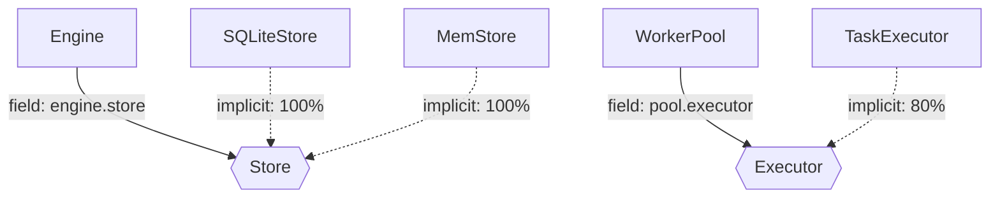
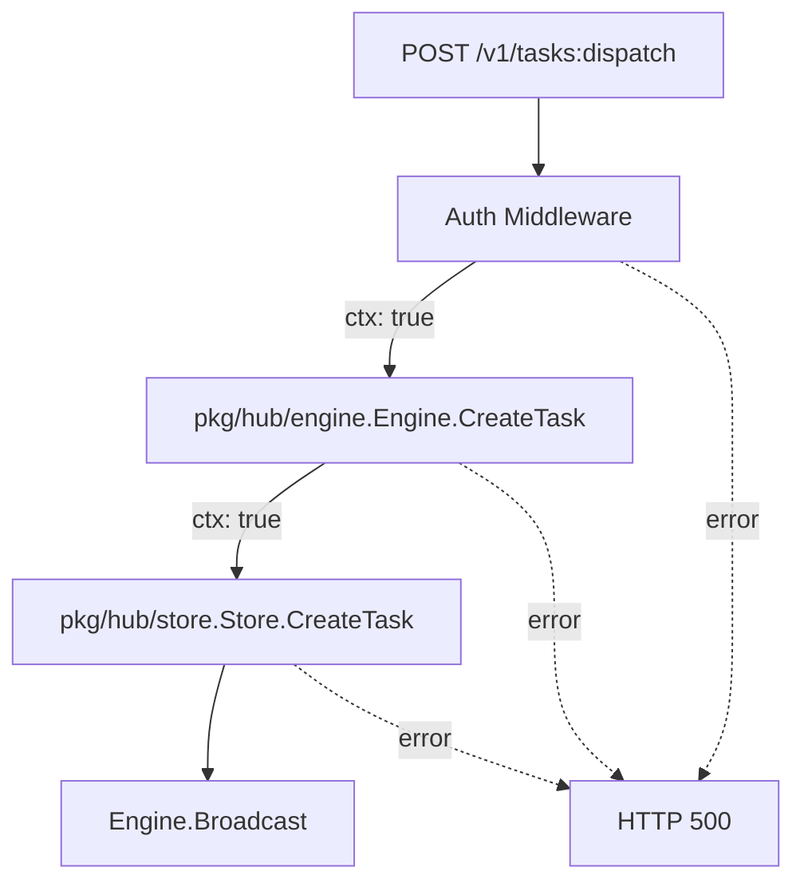

# Go Architecture Atlas: Go 语言架构可观测系统

**文档版本**: 2.2
**创建日期**: 2026-02-23
**最后修改**: 2026-02-24
**前置依赖**: 15-golang-support-proposal.md (Phase 0-4 已完成)
**状态**: 批准 - 等待实现 (基于严苛架构师审查 V2)

---

## 1. 执行摘要

### 1.1 核心洞察

> **OOP 语言可以从类型系统恢复 Architecture。**
> **Go 语言必须从行为模式恢复 Architecture。**

这是 ArchGuard 遇到的第一个"语言哲学级"断裂：

- **TypeScript/Java/C#**: 类 = 稳定抽象，类型关系 = 系统结构
- **Go**: 类型表达的是 data layout 和 minimal capability，真正的架构在：
  - package topology（包拓扑）
  - interface usage（接口使用）
  - runtime behavior patterns（运行时行为模式）
  - communication flow（通信流）

### 1.2 问题陈述

当前 Go 实现（Proposal 15 Phase 0-4）已成功：
- ✅ Tree-sitter 语法分析
- ✅ gopls 语义分析
- ✅ 隐式接口检测
- ✅ 方法提升

但生成的 Class Diagram 对 Go 项目的价值有限：

| 问题 | 根本原因 | 影响 |
|------|----------|------|
| 同名类混淆 | `pkg/hub.Server`, `pkg/worker.Server` 等 | 排名不稳定 |
| 数据模型无方法 | `Session`, `Task` 纯数据容器 | 核心类评分低 |
| 缺少行为信息 | 谁调用、谁拥有生命周期、是否并发 | 无法识别真实依赖 |
| 架构信息在函数中 | `UpdateRuntimeState()` 不在任何类中 | Class Diagram 缺失核心逻辑 |

### 1.3 解决方案

**Go Architecture Atlas** - 从单一 Class Diagram 升级为四层架构图：

```
┌─────────────────────────────────────────────────────────────────┐
│                    Go Architecture Atlas                         │
├─────────────────────────────────────────────────────────────────┤
│                                                                  │
│  ┌──────────────────┐  ┌──────────────────┐  ┌────────────────┐ │
│  │  Package Graph   │  │ Capability Graph │  │ Goroutine Graph│ │
│  │  (静态边界)       │  │  (抽象关系)       │  │  (执行结构)    │ │
│  │  100% 可恢复      │  │  80%+ 可恢复      │  │  静态模式识别   │ │
│  └────────┬─────────┘  └────────┬─────────┘  └───────┬────────┘ │
│           │                     │                    │          │
│           └─────────────────────┼────────────────────┘          │
│                                 ▼                               │
│                      ┌──────────────────┐                       │
│                      │   Flow Graph     │                       │
│                      │   (信息路径)      │                       │
│                      │  入口→调用链     │                       │
│                      └──────────────────┘                       │
│                                                                  │
└─────────────────────────────────────────────────────────────────┘
```

**关键洞察**：这四张图是互补的投影，而非替代关系。Go 的架构需要多视角叠加才能理解。

---

## 2. 理论基础

### 2.1 架构可恢复性差异

```
OOP (TypeScript/Java/C#):                    Go:
┌────────────────────────────┐           ┌────────────────────────────┐
│ 架构 = Type System        │           │ 架构 = Behavior Patterns   │
│                           │           │                           │
│ • class 继承               │           │ • package 依赖            │
│ • interface 实现           │           │ • interface 使用位置      │
│ • 字段类型                 │           │ • goroutine 启动模式      │
│ • 方法可见性               │           │ • channel 通信模式       │
│ • 依赖注入                 │           │ • 函数调用链             │
│                           │           │                           │
│ 👉 静态分析足够             │           │ 👉 需要行为分析           │
└────────────────────────────┘           └────────────────────────────┘
```

### 2.2 Machine-Recoverable Truth 重新定义

| 结构 | 可恢复性 | 技术限制 | 架构价值 |
|------|----------|----------|----------|
| **package imports** | 100% | 无 | ⭐⭐⭐⭐⭐ |
| **interface 定义位置** | 100% | 无 | ⭐⭐⭐ |
| **interface 使用点** | ~85% | 匿名函数、反射 | ⭐⭐⭐⭐⭐ |
| **goroutine 启动** | ~90% | 动态启动、条件分支 | ⭐⭐⭐⭐⭐ |
| **channel 创建** | ~95% | 动态创建、类型推断 | ⭐⭐⭐⭐ |
| **channel 通信边** | **< 20%** | **严重依赖数据流分析** | ⭐⭐⭐ |
| **HTTP 入口点** | ~70% | 框架差异 | ⭐⭐⭐⭐ |
| **函数调用链** | ~60% | **严重依赖类型推断 (gopls)** | ⭐⭐⭐ |
| **struct 继承** | N/A | Go 无继承 | - |

**说明**：
- "goroutine spawn 是 runtime truth" 的说法不准确，应为 "静态 spawn pattern"
- **修正**: "channel edges" 的静态可恢复性极低（< 20%），除非是局部变量传递。复杂的数据流分析不在初期版本范围内。

---

## 3. 四层架构图设计

### 3.1 Package Dependency Graph

**可恢复性**: 100%
**技术限制**: 无
**架构价值**: ⭐⭐⭐⭐⭐

```
解析方式:
- go list -deps（获取完整依赖树）
- AST import 分析（获取直接依赖）
- 循环依赖检测（Kahn 算法）

输出示例:
┌─────────────────────────────────────────────────────────────┐
│  cmd/swarm-hub                                               │
│       │                                                      │
│       ├── pkg/hub ─────┐                                    │
│       │      │          │                                    │
│       │      ├── pkg/hub/engine                              │
│       │      │          │                                    │
│       │      │          └── pkg/hub/store ◄──┐              │
│       │      │                               │               │
│       │      └── pkg/hub/models              │               │
│       │                                     │               │
│       ├── pkg/runtime ──────────────────────┘               │
│       │                                                      │
│       └── pkg/config                                         │
│                                                              │
│  ⚠️ 检测到循环依赖: pkg/hub → pkg/runtime → pkg/hub           │
└─────────────────────────────────────────────────────────────┘
```

**关键价值**：Package Graph 是 Go 唯一的静态真相，它是理解系统边界的起点。

### 3.2 Capability Graph

**可恢复性**: ~85%
**技术限制**:
- 匿名函数中的接口参数无法关联到具体类型
- 反射调用无法静态分析
- 第三方库的接口使用点可能不可见

**架构价值**: ⭐⭐⭐⭐⭐

```
解析方式:
- interface 定义位置（AST）
- 字段类型是接口的字段
- 函数参数类型是接口的参数
- 隐式实现匹配（Proposal 15 已实现）

输出示例:
┌─────────────────────────────────────────────────────────────┐
│  pkg/hub/Store ─────────────────────────────┐               │
│     ▲                                   (interface)        │
│     │                                                      │
│     │ implements                                    uses    │
│     │                                                      │
│  ┌──┴──────┐                                           │    │
│  │SQLiteStore│ pkg/hub/Server ───────────────────────┘    │
│  │MemStore   │                                                │
│  └─────────┘│                                                │
│            │                                                │
│  pkg/hub/Engine ──────────────────────────────────uses─────│
│                                                              │
│  pkg/worker/Executor ───────┐                              │
│            ▲                │                              │
│            │ implements  ┌───┴─────┐                       │
│  pkg/worker/TaskExecutor ──│CLIAdapter│                       │
│            │            │CodexAdapter│                      │
│  pkg/worker/WorkerPool ────┴──────────┘                       │
│                                                              │
│  实线: 隐式实现          虚线: 字段注入/参数注入                │
└─────────────────────────────────────────────────────────────┘
```

**关键价值**：Capability Graph 揭示了"谁依赖谁的抽象"，这是理解系统解耦程度的关键。

### 3.3 Goroutine Topology

**可恢复性**: ~60-70% (仅限启动点和创建点)
**技术限制**:
- **数据流缺失**: Channel 作为参数传递或存储在结构体中时，静态追踪极为困难。
- **动态性**: 条件启动的 goroutine 无法确定运行时是否执行。

**架构价值**: ⭐⭐⭐⭐⭐

```
解析方式:
- go func() 调用模式匹配（需要 AST 函数体分析）
- make(chan) 调用模式匹配
- range/chan 模式识别（仅限局部变量）
- select 语句识别

输出示例（简化版）:
┌─────────────────────────────────────────────────────────────┐
│  Server.Start() ──go func──▶ runSessionGC()                  │
│       │                                                      │
│       └──go func──▶ WorkerPool.Start()                       │
│                          │                                   │
│                          ├── jobChan (chan Job, 100)        │
│                          ├── resultChan (chan Result)      │
│                          │                                   │
│                          ├──worker[N] (for i < poolSize)│
│                          │     │                             │
│                          │     └──for job := range jobChan│
│                          │                                   │
│                          └──resultAggregator               │
│                                                              │
│  ⚠️ 注意: 通信边仅为静态识别，复杂跨包通信可能丢失       │
└─────────────────────────────────────────────────────────────┘
```

**关键价值**：即使是简化版，Goroutine Topology 也能揭示并发架构的骨架，这是理解系统性能边界的关键。

### 3.4 Flow Graph

**可恢复性**: ~50-60% (**强依赖 gopls**)
**技术限制**:
- **纯静态分析极其有限**: 仅能识别同包内的直接函数调用。
- **接口调用黑盒**: 静态分析无法知道 `interface.Method()` 调用了哪个实现，必须依赖 gopls 的类型指针分析。

**架构价值**: ⭐⭐⭐⭐

```
解析方式:
- HTTP handler 注册点模式匹配
- 函数调用链追踪（AST + gopls call hierarchy）
- context.Context 传递分析
- error 返回路径分析

输出示例（HTTP 入口点）:
┌─────────────────────────────────────────────────────────────┐
│  POST /v1/tasks:dispatch                                      │
│       │                                                      │
│       ▼                                                      │
│  ┌──────────────────┐                                        │
│  │ Auth Middleware  │ ◄── token validation                   │
│  └────────┬─────────┘                                        │
│           │                                                  │
│           ▼                                                  │
│  ┌──────────────────┐                                        │
│  │ Engine.CreateTask │ ◄── state machine validation        │
│  └────────┬─────────┘                                        │
│           │                                                  │
│           ▼                                                  │
│  ┌──────────────────┐                                        │
│  │ Store.CreateTask │ ◄── persistence                        │
│  └────────┬─────────┘                                        │
│           │                                                  │
│           ▼                                                  │
│  ┌──────────────────┐                                        │
│  │ Engine.Broadcast │ ◄── TASK_CREATED event                 │
│  │    (to SSE)       │                                       │
│  └──────────────────┘                                        │
│                                                              │
│  ---. error path -------------------------------------------►│
│  │                                                          │
│  └──► ErrorHandler ──► HTTP 500                              │
└─────────────────────────────────────────────────────────────┘
```

**关键价值**：Flow Graph 揭示了"请求如何流转"，这是理解业务逻辑的关键。

#### 入口点检测模式匹配规则

**支持的 HTTP 框架和模式**:

| 框架 | 检测模式 | 示例代码 | 识别准确率 |
|------|----------|----------|------------|
| **net/http** | `http.HandleFunc()` 调用 | `http.HandleFunc("/path", handler)` | ~95% |
| **net/http** | `ServeMux.Handle()` 调用 | `mux.Handle("/path", handler)` | ~90% |
| **gin** | `router.GET/POST/...()` 调用 | `router.GET("/path", handler)` | ~85% |
| **gorilla/mux** | `router.HandleFunc()` 调用 | `router.HandleFunc("/path", handler)` | ~85% |
| **echo** | `router.GET/POST/...()` 调用 | `router.GET("/path", handler)` | ~80% |
| **grpc** | `Register*Server()` 调用 | `pb.RegisterServiceServer(server, srv)` | ~90% |

**检测局限性**:

1. **间接注册无法识别**:
   ```go
   // ❌ 无法静态识别 handler 是什么
   func setupRoutes(mux *http.ServeMux, handlers map[string]http.HandlerFunc) {
       for path, handler := range handlers {
           mux.HandleFunc(path, handler)  // handler 来自 map
       }
   }
   ```

2. **动态路由无法完全解析**:
   ```go
   // ❌ 只能识别 "GET /api/..." 模式，无法确定实际路径
   router.GET("/api/:id", handler)  // gin/echo 的路径参数
   ```

3. **中间件链顺序不确定**:
   ```go
   // ⚠️ 中间件可能动态注册
   r.Use(middleware1)
   // ... 其他代码 ...
   r.Use(middleware2)  // 顺序依赖运行时
   ```

**缓解策略**:
- **必须集成 gopls**: 使用 `gopls call hierarchy` API 追踪间接调用。
- 标注 `dynamic_route` 表示动态路由。
- 提供最大/最小中间件链范围。

---

## 4. 架构设计

### 4.1 系统架构

```
┌──────────────────────────────────────────────────────────────────────┐
│                       Go Atlas Architecture                           │
├──────────────────────────────────────────────────────────────────────┤
│                                                                       │
│  ┌─────────────────────────────────────────────────────────────────┐  │
│  │                       GoAtlasPlugin                            │  │
│  │  (Standalone Tool, does not implement ILanguagePlugin yet)     │  │
│  ├─────────────────────────────────────────────────────────────────┤  │
│  │                                                                 │  │
│  │  ┌───────────────┐  ┌───────────────┐                          │  │
│  │  │ TreeSitter    │  │ GoplsClient   │                          │  │
│  │  │ Bridge (v2)   │  │ (Required for │                          │  │
│  │  │ +FuncBody     │  │ Flow/Graph)   │                          │  │
│  │  └───────┬───────┘  └───────┬───────┘                          │  │
│  │          │                  │                                  │  │
│  │          └────────┬─────────┘                                  │  │
│  │                   ▼                                             │  │
│  │  ┌─────────────────────────────────────────────────────────┐   │  │
│  │  │              BehaviorAnalyzer                           │   │  │
│  │  │  ┌────────────┐  ┌────────────┐  ┌────────────┐        │   │  │
│  │  │  │PackageGraph│  │Capability │  │GoroutineTop│        │   │  │
│  │  │  │  Builder   │  │   Builder  │  │   Builder   │        │   │  │
│  │  │  └────────────┘  └────────────┘  └────────────┘        │   │  │
│  │  │  ┌──────────────────────────────────────────────┐       │   │  │
│  │  │  │           FlowGraphBuilder                    │       │   │  │
│  │  │  │         (Dependencies: Gopls)                 │       │   │  │
│  │  │  └──────────────────────────────────────────────┘       │   │  │
│  │  └─────────────────────────────────────────────────────────┘   │  │
│  │                   │                                            │  │
│  │                   ▼                                            │  │
│  │  ┌─────────────────────────────────────────────────────────┐   │  │
│  │  │              GoArchitectureAtlas                       │   │  │
│  │  │  • metadata: AtlasMetadata                             │   │  │
│  │  │  • packageGraph: PackageGraph                           │   │  │
│  │  │  • capabilityGraph: CapabilityGraph                     │   │  │
│  │  │  • goroutineTopology: GoroutineTopology                 │   │  │
│  │  │  • flowGraph: FlowGraph                                 │   │  │
│  │  └─────────────────────────────────────────────────────────┘   │  │
│  │                   │                                            │  │
│  │                   ▼                                            │  │
│  │  ┌─────────────────────────────────────────────────────────┐   │  │
│  │  │              AtlasRenderer                             │   │  │
│  │  │  renderPackageGraph(): Mermaid/JSON/SVG                 │   │  │
│  │  │  renderCapabilityGraph(): Mermaid/JSON/SVG              │   │  │
│  │  │  renderGoroutineTopology(): Mermaid/JSON/SVG            │   │  │
│  │  │  renderFlowGraph(): Mermaid/JSON/SVG                    │   │  │
│  │  └─────────────────────────────────────────────────────────┘   │  │
│  │                                                                 │  │
│  └─────────────────────────────────────────────────────────────────┘  │
│                                                                       │
└──────────────────────────────────────────────────────────────────────┘
```

### 4.2 核心数据结构

```typescript
// plugins/golang/atlas/types.ts

/**
 * Go Architecture Atlas - 完整的四层架构数据结构
 */
export interface GoArchitectureAtlas {
  metadata: AtlasMetadata;
  packageGraph: PackageGraph;
  capabilityGraph: CapabilityGraph;
  goroutineTopology: GoroutineTopology;
  flowGraph: FlowGraph;
}

export interface AtlasMetadata {
  moduleName: string;
  moduleRoot: string;
  goVersion: string;
  generatedAt: string;
  analyzerVersion: string;
  stats: AtlasStats;
}

export interface AtlasStats {
  packages: number;
  interfaces: number;
  structs: number;
  goroutines: number;
  channels: number;
  entryPoints: number;
}

// ============== Package Graph ==============

export interface PackageGraph {
  packages: PackageNode[];
  dependencies: PackageDependency[];
  cycles: PackageCycle[];
}

export interface PackageNode {
  id: string;              // 完整路径: "github.com/example/swarm/pkg/hub"
  name: string;            // 包名: "hub"
  dirPath: string;         // 文件系统路径
  type: 'cmd' | 'pkg' | 'internal' | 'vendor';
  exports: string[];       // 导出的符号（首字母大写）
  stats: PackageStats;
}

export interface PackageStats {
  files: number;
  structs: number;
  interfaces: number;
  functions: number;
  imports: number;          // 导入的其他包数量
}

export interface PackageDependency {
  fromId: string;          // 源包 ID
  toId: string;            // 目标包 ID
  type: 'direct' | 'indirect' | 'test';
  strength: number;        // 引用强度（被导入符号数量）
}

export interface PackageCycle {
  packages: string[];     // 循环依赖的包 ID 列表
  severity: 'warning' | 'error';
}

// ============== Capability Graph ==============

export interface CapabilityGraph {
  interfaces: InterfaceCapability[];
  implementations: Implementation[];
  usageSites: UsageSite[];
}

export interface InterfaceCapability {
  id: string;              // 完整 ID: "pkg/hub.Store"
  name: string;            // 接口名: "Store"
  packageId: string;       // 包 ID: "github.com/example/swarm/pkg/hub"
  methods: MethodSignature[];
  implementors: Implementation[];  // 实现此接口的结构体
  consumers: UsageSite[];         // 使用此接口的位置
}

export interface MethodSignature {
  name: string;
  signature: string;      // 规范化签名: "Load(ctx, id) (*Session, error)"
}

export interface Implementation {
  structId: string;       // 实现者结构体 ID
  structName: string;
  structPackageId: string;
  interfaceId: string;     // 接口 ID
  coverage: number;       // 方法覆盖率 0.0-1.0
  type: 'implicit';       // Go 只有隐式实现
}

export interface UsageSite {
  id: string;             // 唯一 ID
  interfaceId: string;    // 被使用的接口 ID
  consumerId: string;     // 使用者 ID（可能是 struct 或 function）
  consumerName: string;
  consumerPackageId: string;
  context: UsageContext;
  location: SourceLocation;
}

export type UsageContext =
  | 'struct_field'        // 结构体字段: `type Server struct { store Store }`
  | 'function_parameter'  // 函数参数: `func New(store Store) *Server`
  | 'function_return'    // 函数返回值: `func Get() (Store, error)`
  | 'variable'           // 局部变量: `var s Store = ...`
  | 'channel_element'    // channel 元素: `ch chan Store`
  | 'map_value';         // map 值: `m map[string]Store`

// ============== Goroutine Topology ==============

export interface GoroutineTopology {
  goroutines: GoroutineNode[];
  channels: ChannelNode[];
  patterns: ConcurrencyPattern[];  // 识别出的并发模式
  unknownRatio: number;     // 无法归类的 goroutine 比例
}

export interface GoroutineNode {
  id: string;
  name: string;            // 函数名或匿名
  spawnLocation: SourceLocation;
  spawnType: 'named_func' | 'anonymous_func' | 'method';
  pattern: ConcurrencyPattern | 'unknown';
  confidence: number;       // 模式识别置信度 0.0-1.0
}

export type ConcurrencyPattern =
  | 'worker_pool'          // for + range channel
  | 'pipeline'             // channel 链式处理
  | 'fan_out_fan_in'       // 多 worker 单聚合
  | 'background_task'      // 后台任务（如 GC）
  | 'timer'                // time.Ticker
  | 'server'               // HTTP/gRPC server
  | 'producer_consumer'    // 生产者-消费者
  | 'unknown';

export interface ChannelNode {
  id: string;
  name: string;
  location: SourceLocation;
  bufferSize: number;      // 0 = unbuffered
  direction: 'send_only' | 'receive_only' | 'bidirectional';
  elementType: string;     // 元素类型（可能不完全准确）
}

// 注意: 不再包含 connections，因为静态识别的准确率太低
// 改为识别 Goroutine 和 Channel 各自的模式

// ============== Flow Graph ==============

export interface FlowGraph {
  entryPoints: EntryPoint[];
  flows: Flow[];
}

export interface EntryPoint {
  id: string;
  type: EntryPointType;
  path: string;            // HTTP 路径或 CLI 命令
  method?: string;         // HTTP 方法
  location: SourceLocation;
  flowId: string;          // 关联的 Flow ID
}

export type EntryPointType =
  | 'http_handler'         // net/http HandleFunc
  | 'http_route'           // 路由注册
  | 'grpc_service'         // gRPC 服务
  | 'cli_command'          // CLI 命令
  | 'background_job'       // 后台任务
  | 'event_handler';       // 事件处理器

export interface Flow {
  id: string;
  entryPointId: string;   // 入口点 ID
  steps: FlowStep[];
  errorPaths: ErrorPath[];
  unknownRatio: number;    // 无法追踪的调用比例
}

export interface FlowStep {
  id: string;             // flow-unique ID
  type: FlowStepType;
  name: string;
  qualifiedName: string;  // package.Function 或 package.Type.Method
  packageId: string;
  location: SourceLocation;
  contextPropagation: boolean;  // 是否传递 ctx
  nextStepIds: string[];  // 下一步骤 ID 列表
}

export type FlowStepType =
  | 'function'            // 顶层函数
  | 'method'              // 方法
  | 'middleware'          // 中间件
  | 'callback'            // 回调函数
  | 'unknown';

export interface ErrorPath {
  fromStepId: string;
  handler: string;        // 错误处理方式
  errorTypes: string[];   // 可能的错误类型
}

// ============== 通用类型 ==============

export interface SourceLocation {
  file: string;
  startLine: number;
  endLine: number;
  startColumn?: number;
  endColumn?: number;
}
```

### 4.3 与现有架构的集成

#### 4.3.1 架构设计决策

**重要**: `GoAtlasPlugin` 不继承 `GoPlugin`，而是作为**独立实现**共享底层组件。它目前仅作为 CLI 专用工具，不强制实现标准 `ILanguagePlugin` 接口，以便快速迭代。

**设计理由**:
1. `GoPlugin.parseProject()` 返回 `ArchJSON`，而 Atlas 需要保留更多中间数据（尤其是 AST 和包图）。
2. `GoRawData` 需要大幅扩展以支持行为分析，这可能会影响现有插件的性能。
3. Atlas 需要**完整的包依赖图**，而现有实现中 `GoRawPackage.imports` 只是路径列表。

**架构关系图**:
```
┌─────────────────────────────────────────────────────────────────┐
│                         共享组件层                                │
│  ┌───────────────┐  ┌───────────────┐  ┌───────────────────┐   │
│  │TreeSitterBridge│  │InterfaceMatcher│  │   ArchJsonMapper  │   │
│  │ (必须升级支持   │  │                │  │                   │   │
│  │  函数体分析)    │  │                │  │                   │   │
│  └───────┬───────┘  └───────┬───────┘  └─────────┬─────────┘   │
└──────────┼──────────────────┼────────────────────┼──────────────┘
           │                  │                    │
           │         ┌────────┴─────────┐          │
           │         │                  │          │
           ▼         ▼                  ▼          ▼
┌──────────────────┐    ┌────────────────────────────────┐
│   GoPlugin       │    │     GoAtlasPlugin              │
│ (Standard)       │    │     (CLI Tool)                 │
│                  │    │                                │
│  • parseProject()│    │  • generateAtlas()             │
│    → ArchJSON    │    │  • analyzePackageGraph()       │
│                  │    │  • analyzeCapabilityGraph()    │
│                  │    │  • analyzeGoroutineTopology()  │
│                  │    │  • analyzeFlowGraph()          │
└──────────────────┘    │  • toArchJSON()                │
                        └────────────────────────────────┘
```

#### 4.3.2 GoAtlasPlugin 实现

```typescript
// plugins/golang/atlas/go-atlas-plugin.ts

import type { PluginInitConfig } from '@/core/interfaces/language-plugin.js';
import { TreeSitterBridge } from '../golang/tree-sitter-bridge.js';
import { InterfaceMatcher } from '../golang/interface-matcher.js';
import { GoplsClient } from '../golang/gopls-client.js';
import type { GoRawData, GoRawPackage } from '../golang/types.js';
import type {
  GoArchitectureAtlas,
  ArchJSON,
  PackageGraph,
  CapabilityGraph,
  GoroutineTopology,
  FlowGraph
} from './types.js';
import { BehaviorAnalyzer } from './behavior-analyzer.js';
import { AtlasRenderer } from './atlas-renderer.js';

/**
 * Go Atlas Plugin - 独立实现，共享底层组件
 *
 * 设计决策:
 * 1. 不继承 GoPlugin，避免 ArchJSON 信息丢失问题
 * 2. 直接使用 TreeSitterBridge、InterfaceMatcher 等共享组件
 * 3. 自己维护 GoRawData，保留完整的中间数据
 * 4. 提供 toArchJSON() 用于导出标准格式
 *
 * ⚠️ 关键依赖: TreeSitterBridge 必须升级以支持 ExtractFunctionBody，
 *    否则 BehaviorAnalyzer 将无法工作。
 */
export class GoAtlasPlugin {
  private treeSitter: TreeSitterBridge;
  private matcher: InterfaceMatcher;
  private goplsClient: GoplsClient | null = null;
  private behaviorAnalyzer: BehaviorAnalyzer;
  private renderer: AtlasRenderer;
  private initialized = false;

  constructor() {
    this.treeSitter = new TreeSitterBridge();
    this.matcher = new InterfaceMatcher();
    this.behaviorAnalyzer = new BehaviorAnalyzer(this.treeSitter, this.matcher);
    this.renderer = new AtlasRenderer();
  }

  /**
   * 初始化插件
   */
  async initialize(config: PluginInitConfig): Promise<void> {
    if (this.initialized) {
      return;
    }

    // 尝试初始化 gopls（Atlas 分析的核心增强）
    // 对于 Flow Graph，gopls 几乎是必须的
    try {
      this.goplsClient = new GoplsClient();
    } catch (error) {
      console.warn('gopls not available. Flow Graph analysis will be severely limited.', error);
      this.goplsClient = null;
    }

    this.initialized = true;
  }

  /**
   * 生成完整的 Go Architecture Atlas
   *
   * @param rootPath Go 项目根目录（包含 go.mod）
   * @param options 生成选项
   * @returns GoArchitectureAtlas
   */
  async generateAtlas(
    rootPath: string,
    options: AtlasGenerationOptions = {}
  ): Promise<GoArchitectureAtlas> {
    this.ensureInitialized();

    // 1. 解析 Go 项目，获取完整的 GoRawData (包含函数体 AST)
    const rawData = await this.parseGoProject(rootPath, options);

    // 2. 并行分析四层架构
    const [packageGraph, capabilityGraph, goroutineTopology, flowGraph] = await Promise.all([
      this.behaviorAnalyzer.buildPackageGraph(rawData),
      this.behaviorAnalyzer.buildCapabilityGraph(rawData),
      this.behaviorAnalyzer.buildGoroutineTopology(rawData, options),
      this.behaviorAnalyzer.buildFlowGraph(rawData, this.goplsClient, options), // 传入 goplsClient
    ]);

    // 3. 构建 Atlas
    const atlas: GoArchitectureAtlas = {
      metadata: {
        moduleName: rawData.moduleName,
        moduleRoot: rawData.moduleRoot,
        goVersion: await this.detectGoVersion(rootPath),
        generatedAt: new Date().toISOString(),
        analyzerVersion: '2.0.0',
        stats: this.calculateStats(packageGraph, capabilityGraph, goroutineTopology, flowGraph),
      },
      packageGraph,
      capabilityGraph,
      goroutineTopology,
      flowGraph,
    };

    return atlas;
  }

  /**
   * 将 Atlas 转换为 ArchJSON（用于兼容现有工具链）
   *
   * 映射规则:
   * - Package Graph → entities (type: "package", 需要扩展 EntityType)
   * - Capability Graph → relations (type: "implementation", "dependency")
   * - Goroutine Topology → relations (type: "spawns")
   * - Flow Graph → relations (type: "calls")
   */
  toArchJSON(atlas: GoArchitectureAtlas): ArchJSON {
    const entities: any[] = [];
    const relations: any[] = [];

    // 1. Package Graph → Entities (packages)
    for (const pkg of atlas.packageGraph.packages) {
      entities.push({
        id: pkg.id,
        name: pkg.name,
        type: 'package',  // ⚠️ 需要在 EntityType 中添加
        location: {
          file: pkg.dirPath,
          startLine: 0,
          endLine: 0,
        },
        attributes: {
          dirPath: pkg.dirPath,
          packageType: pkg.type,
          exports: pkg.exports,
        },
        stats: pkg.stats,
      });
    }

    // 2. Package Dependencies → Relations
    for (const dep of atlas.packageGraph.dependencies) {
      relations.push({
        from: dep.fromId,
        to: dep.toId,
        type: 'dependency',
        attributes: {
          strength: dep.strength,
          dependencyType: dep.type,
        },
      });
    }

    // 3. Capability Graph → Implementations
    for (const impl of atlas.capabilityGraph.implementations) {
      relations.push({
        from: impl.structId,
        to: impl.interfaceId,
        type: 'implementation',
        attributes: {
          coverage: impl.coverage,
          implementationType: impl.type,
        },
      });
    }

    // 4. Capability Graph → Usage Sites (dependencies)
    for (const usage of atlas.capabilityGraph.usageSites) {
      relations.push({
        from: usage.consumerId,
        to: usage.interfaceId,
        type: 'dependency',
        attributes: {
          usageContext: usage.context,
          location: usage.location,
        },
      });
    }

    // 5. Goroutine Topology → Spawns
    for (const go of atlas.goroutineTopology.goroutines) {
      // 找到 spawn location 对应的函数
      relations.push({
        from: go.spawnLocation.file,  // 简化：使用文件作为源
        to: go.id,
        type: 'spawns',
        attributes: {
          spawnType: go.spawnType,
          pattern: go.pattern,
          confidence: go.confidence,
        },
      });
    }

    // 6. Flow Graph → Calls
    for (const flow of atlas.flowGraph.flows) {
      for (let i = 0; i < flow.steps.length - 1; i++) {
        const current = flow.steps[i];
        const next = flow.steps[i + 1];

        if (current.nextStepIds.includes(flow.steps[i + 1].id)) {
          relations.push({
            from: current.qualifiedName,
            to: next.qualifiedName,
            type: 'calls',
            attributes: {
              contextPropagation: current.contextPropagation,
              flowId: flow.id,
            },
          });
        }
      }
    }

    return {
      version: '2.0',
      language: 'go',
      entities,
      relations,
      metadata: {
        ...atlas.metadata,
        generatedBy: 'GoAtlasPlugin',
        atlasFormat: true,
      },
    };
  }

  /**
   * 解析 Go 项目，返回完整的 GoRawData
   *
   * 与 GoPlugin.parseProject() 的区别:
   * - 不转换为 ArchJSON
   * - 保留完整的包依赖图
   * - 保留所有中间数据 (尤其是 AST 函数体)
   */
  private async parseGoProject(
    rootPath: string,
    options: AtlasGenerationOptions
  ): Promise<GoRawData> {
    // 1. 查找所有 .go 文件
    const { glob } = await import('glob');
    const fs = await import('fs-extra');

    const pattern = options.includeTests ? '**/*.go' : '**/*.go';
    const files = await glob(pattern, {
      cwd: rootPath,
      absolute: true,
      ignore: ['**/vendor/**', '**/node_modules/**', '**/*_test.go'],
    });

    // 2. 解析每个文件，合并到 packages
    const packages = new Map<string, GoRawPackage>();

    for (const file of files) {
      const code = await fs.readFile(file, 'utf-8');
      // ⚠️ 关键调用: 必须确保 TreeSitterBridge 提取了函数体
      const pkg = this.treeSitter.parseCode(code, file);

      if (packages.has(pkg.name)) {
        const existing = packages.get(pkg.name)!;
        existing.structs.push(...pkg.structs);
        existing.interfaces.push(...pkg.interfaces);
        existing.functions.push(...pkg.functions);
        // 合并 imports
        existing.imports.push(...pkg.imports);
      } else {
        packages.set(pkg.name, pkg);
      }
    }

    // 3. 构建包依赖图
    const packageGraph = this.buildPackageDependencyGraph(Array.from(packages.values()));

    // 4. 读取 go.mod 获取模块信息
    let moduleName = '';
    let moduleRoot = rootPath;
    try {
      const goModPath = `${rootPath}/go.mod`;
      const goModContent = await fs.readFile(goModPath, 'utf-8');
      const match = goModContent.match(/^module\s+(.+)$/m);
      if (match) {
        moduleName = match[1].trim();
      }
    } catch {
      // 没有 go.mod，使用默认值
    }

    return {
      packages: Array.from(packages.values()),
      moduleRoot,
      moduleName,
      packageGraph,  // 新增: 包依赖图
    };
  }

  /**
   * 构建包依赖图
   */
  private buildPackageDependencyGraph(packages: GoRawPackage[]): any {
    const dependencies: any[] = [];
    const packageMap = new Map(
      packages.map(p => [p.dirPath, p])
    );

    for (const pkg of packages) {
      for (const imp of pkg.imports) {
        // 尝试匹配导入路径到包
        const targetPkg = packages.find(p =>
          imp.path.startsWith(p.name) || imp.path === p.name
        );

        if (targetPkg) {
          dependencies.push({
            fromId: pkg.id,
            toId: targetPkg.id,
            type: imp.isTest ? 'test' : 'direct',
            strength: 1,  // TODO: 计算实际引用强度
          });
        }
      }
    }

    // 检测循环依赖 (Kahn 算法)
    const cycles = this.detectCycles(packages, dependencies);

    return { dependencies, cycles };
  }

  /**
   * 检测循环依赖
   */
  private detectCycles(packages: GoRawPackage[], dependencies: any[]): string[][] {
    const adj = new Map<string, string[]>();
    const inDegree = new Map<string, number>();

    // 构建邻接表和入度
    for (const pkg of packages) {
      adj.set(pkg.id, []);
      inDegree.set(pkg.id, 0);
    }

    for (const dep of dependencies) {
      adj.get(dep.fromId)?.push(dep.toId);
      inDegree.set(dep.toId, (inDegree.get(dep.toId) || 0) + 1);
    }

    // Kahn 算法
    const queue: string[] = [];
    for (const [id, degree] of inDegree) {
      if (degree === 0) {
        queue.push(id);
      }
    }

    const visited: string[] = [];
    while (queue.length > 0) {
      const id = queue.shift()!;
      visited.push(id);

      for (const neighbor of adj.get(id) || []) {
        inDegree.set(neighbor, inDegree.get(neighbor)! - 1);
        if (inDegree.get(neighbor) === 0) {
          queue.push(neighbor);
        }
      }
    }

    // 未访问的节点在环中
    const cycles: string[][] = [];
    const remaining = packages.filter(p => !visited.includes(p.id));

    if (remaining.length > 0) {
      cycles.push(remaining.map(p => p.id));
    }

    return cycles;
  }

  private ensureInitialized(): void {
    if (!this.initialized) {
      throw new Error('GoAtlasPlugin not initialized. Call initialize() first.');
    }
  }

  private async detectGoVersion(rootPath: string): Promise<string> {
    try {
      const { exec } = await import('child_process');
      return new Promise((resolve) => {
        exec('go version', { cwd: rootPath }, (error: any, stdout: string) => {
          if (error) {
            resolve('unknown');
          } else {
            const match = stdout.match(/go version go(\d+\.\d+\.\d+)/);
            resolve(match ? match[1] : 'unknown');
          }
        });
      });
    } catch {
      return 'unknown';
    }
  }

  private calculateStats(
    pg: PackageGraph,
    cg: CapabilityGraph,
    gt: GoroutineTopology,
    fg: FlowGraph
  ): any {
    return {
      packages: pg.packages.length,
      interfaces: cg.interfaces.length,
      structs: pg.packages.reduce((sum, p) => sum + p.stats.structs, 0),
      goroutines: gt.goroutines.length,
      channels: gt.channels.length,
      entryPoints: fg.entryPoints.length,
    };
  }
}

export interface AtlasGenerationOptions {
  exclude?: string[];
  includeTests?: boolean;

  // Package Graph 选项
  detectCycles?: boolean;

  // Goroutine Topology 选项
  maxGoroutines?: number;
  ignorePatterns?: ConcurrencyPattern[];

  // Flow Graph 选项
  maxFlowDepth?: number;
  entryPointTypes?: EntryPointType[];
  followIndirectCalls?: boolean;

  // 输出选项
  includeUnknown?: boolean;
}

type ConcurrencyPattern =
  | 'worker_pool'
  | 'pipeline'
  | 'fan_out_fan_in'
  | 'background_task'
  | 'timer'
  | 'server'
  | 'producer_consumer'
  | 'unknown';

type EntryPointType =
  | 'http_handler'
  | 'http_route'
  | 'grpc_service'
  | 'cli_command'
  | 'background_job'
  | 'event_handler';
```

**说明**: `BehaviorAnalyzer` 和 `AtlasRenderer` 的完整实现将在独立的文件中:
- `plugins/golang/atlas/behavior-analyzer.ts` - 四层架构分析逻辑
- `plugins/golang/atlas/atlas-renderer.ts` - Mermaid/JSON 渲染器

### 4.4 扩展 GoRawData 类型 (数据源缺失修复)

Atlas 需要深入的 AST 信息来支持行为分析。需要在 `GoRawData` 中添加以下结构：

```typescript
// plugins/golang/types.ts (扩展现有类型)

export interface GoRawData {
  packages: GoRawPackage[];
  moduleRoot: string;
  moduleName: string;

  // 新增: 包依赖图 (Atlas 专用)
  packageGraph?: {
    dependencies: PackageDependency[];
    cycles: PackageCycle[];
  };
}

export interface GoRawPackage {
  id: string;
  name: string;
  dirPath: string;
  imports: GoImport[];

  // 现有字段...
  structs: GoRawStruct[];
  interfaces: GoRawInterface[];
  functions: GoFunction[]; // ⚠️ 必须包含 body 信息

  // 新增: 解析后的依赖关系 (延迟填充)
  dependencies?: string[];  // 依赖的包 ID 列表
  dependents?: string[];    // 被依赖的包 ID 列表
}

export interface GoImport {
  path: string;        // 导入路径，如 "github.com/gin-gonic/gin"
  isTest: boolean;     // 是否来自 _test.go 文件
  alias?: string;      // 导入别名
}

// ⚠️ 关键新增: 函数体行为数据 ⚠️
// 用于 TreeSitterBridge 提取的函数体信息，支持 Goroutine/Flow 分析

export interface GoFunction {
  // ... 现有字段
  body?: GoFunctionBody; // 新增
}

export interface GoMethod {
  // ... 现有字段
  body?: GoFunctionBody; // 新增
}

export interface GoFunctionBody {
  block: GoBlock;
  calls: GoCallExpr[];        // 所有的函数调用
  goSpawns: GoSpawnStmt[];    // go func() ...
  channelOps: GoChannelOp[];  // ch <- x 或 <-ch
}

export interface GoBlock {
  startLine: number;
  endLine: number;
  statements: GoStatement[];
}

export interface GoStatement {
  type: string;
  location: GoSourceLocation;
}

export interface GoCallExpr {
  functionName: string;       // 调用的函数名
  packageName?: string;       // 如果是跨包调用
  receiverType?: string;      // 如果是方法调用
  args: string[];             // 参数列表（简化文本）
  location: GoSourceLocation;
}

export interface GoSpawnStmt {
  call: GoCallExpr;           // 被 spawn 的函数调用
  location: GoSourceLocation;
}

export interface GoChannelOp {
  channelName: string;
  operation: 'send' | 'receive' | 'close' | 'make';
  location: GoSourceLocation;
}
```

### 4.5 CLI 集成设计

```typescript
// src/cli/commands/atlas.ts

import { Command } from 'commander';
import { GoAtlasPlugin } from '@/plugins/golang/atlas/go-atlas-plugin.js';

export const atlasCommand = new Command('atlas');

atlasCommand
  .description('Generate Go Architecture Atlas')
  .option('-s, --source <path>', 'Go project root directory')
  .option('-o, --output <dir>', 'Output directory (default: ./atlas)')
  .option('--format <format>', 'Output format: mermaid | json (default: mermaid)')
  .option('--layer <layer...>', 'Atlas layers to generate (default: all)')
  .option('--max-flow-depth <depth>', 'Maximum flow depth (default: 10)', parseInt)
  .option('--max-goroutines <count>', 'Maximum goroutines to analyze (default: 100)', parseInt)
  .option('--include-tests', 'Include test files')
  .option('--exclude <patterns...>', 'Exclude patterns')
  .action(async (options) => {
    const plugin = new GoAtlasPlugin();
    await plugin.initialize({});

    const atlas = await plugin.generateAtlas(options.source, {
      exclude: options.exclude,
      includeTests: options.includeTests,
      maxFlowDepth: options.maxFlowDepth,
      maxGoroutines: options.maxGoroutines,
    });

    // 渲染输出
    const renderer = new AtlasRenderer();

    if (options.layer?.includes('package') || !options.layer) {
      const output = renderer.renderPackageGraph(atlas.packageGraph, options.format);
      // 写入文件...
    }

    // ... 其他层
  });
```

---

## 5. 技术限制与挑战

### 5.1 已知限制

| 层 | 限制 | 影响程度 | 缓解策略 |
|---|------|----------|----------|
| **Package Graph** | 无 | - | - |
| **Capability Graph** | 匿名函数中的接口参数 | 中 | 标注为 "unknown usage" |
| **Goroutine Topology** | channel 作为参数传递 | **高 (严重)** | 只识别创建点，标注 "untraced channel" |
| **Goroutine Topology** | 条件启动的 goroutine | 中 | 标注为 "conditional spawn" |
| **Flow Graph** | 间接调用（接口/函数值） | **高 (严重)** | **必须使用 gopls call hierarchy API** |
| **Flow Graph** | 第三方框架（gin/echo） | 中 | 支持常见框架的 pattern matching |

### 5.2 技术挑战

#### 挑战 1: Channel 边追踪

```
问题场景:
  func producer() <-chan int {
    ch := make(chan int, 10)
    go worker(ch)  // ch 发送给谁？
    return ch
  }

  func consumer(ch <-chan int) {
    // 使用 ch
  }

静态分析可以看到:
  ✅ producer 创建 channel
  ✅ worker 接收 channel 参数
  ✅ consumer 接收 channel 参数
  ❌ producer 返回的 ch 发送给谁？未知

缓解策略:
  - 标注 "channel source: unknown" 或 "channel flow: incomplete"
  - **不尝试完整的静态通信图恢复**，仅提供 "交互点标注"
```

#### 挑战 2: 间接调用追踪

```
问题场景:
  type Handler interface {
    Handle(ctx Context) error
  }

  func router(h Handler) {
    h.Handle(ctx)  // h 的实际类型是什么？
  }

静态分析限制:
  - 无法知道 h 的运行时类型
  - **没有类型推断，Flow Graph 几乎不可用**

缓解策略:
  - **集成 gopls 是必须的**，不是可选的
  - 使用 gopls call hierarchy API（需要额外 10-30 秒启动时间）
  - 提供多个候选调用路径
  - 标注为 "indirect call, possible targets: [...]"
```

#### 挑战 3: HTTP 框架多样性

```
支持的框架:
  ✅ net/http 标准库
  ✅ github.com/gin-gonic/gin
  ✅ github.com/gorilla/mux

不支持的框架:
  ❌ github.com/labstack/echo（需要添加模式）
  ❌ grpc-gateway（需要单独处理）
  ❌ 自定义框架（不可能通用支持）

缓解策略:
  - 提供"框架检测"功能
  - 允许用户注册自定义入口点模式
  - 未识别的框架标注为 "custom_entry_point"
```

---

## 6. 测试策略

### 6.1 测试项目设计

```
atlas/test/fixtures/
├── simple/              # 最小测试用例
│   ├── cmd/app/
│   ├── pkg/service/
│   └── go.mod
├── concurrent/          # Goroutine 模式测试
│   ├── worker_pool.go
│   ├── pipeline.go
│   └── fanout.go
├── http_server/         # HTTP 入口点测试
│   ├── standard_lib.go  # net/http
│   ├── gin.go           # gin framework
│   └── gorilla.go       # gorilla/mux
└── complex/             # 综合测试
    └── multi_layer.go
```

### 6.2 测试用例

```typescript
// tests/integration/atlas/package-graph.test.ts

describe('Package Graph', () => {
  it('should detect circular dependencies', async () => {
    const atlas = await generateAtlas('test/fixtures/cycles');
    expect(atlas.packageGraph.cycles).toHaveLength(1);
    expect(atlas.packageGraph.cycles[0].packages).toContain('pkg/a');
  });

  it('should calculate dependency strength', async () => {
    const atlas = await generateAtlas('test/fixtures/simple');
    const dep = atlas.packageGraph.dependencies.find(d =>
      d.fromId === 'cmd/app' && d.toId === 'pkg/service'
    );
    expect(dep.strength).toBeGreaterThan(0);
  });
});

// tests/integration/atlas/goroutine-topology.test.ts

describe('Goroutine Topology', () => {
  it('should identify worker pool pattern', async () => {
    const atlas = await generateAtlas('test/fixtures/concurrent/worker_pool.go');
    const worker = atlas.goroutineTopology.goroutines.find(g =>
      g.pattern === 'worker_pool'
    );
    expect(worker).toBeDefined();
    expect(worker.confidence).toBeGreaterThan(0.8);
  });

  it('should detect channel creation', async () => {
    const atlas = await generateAtlas('test/fixtures/concurrent/pipeline.go');
    expect(atlas.goroutineTopology.channels.length).toBeGreaterThan(0);
  });
});

// tests/integration/atlas/flow-graph.test.ts

describe('Flow Graph', () => {
  it('should trace HTTP handlers (net/http)', async () => {
    const atlas = await generateAtlas('test/fixtures/http_server/standard_lib.go');
    const entry = atlas.flowGraph.entryPoints.find(e => e.type === 'http_handler');
    expect(entry).toBeDefined();

    const flow = atlas.flowGraph.flows.find(f => f.id === entry.flowId);
    expect(flow.steps.length).toBeGreaterThan(0);
  });

  it('should limit flow depth', async () => {
    const atlas = await generateAtlas('test/fixtures/complex', {
      maxFlowDepth: 5
    });
    const flow = atlas.flowGraph.flows[0];
    expect(flow.steps.length).toBeLessThanOrEqual(5);
  });
});
```

### 6.3 验证标准

```yaml
验收标准:
  Package Graph:
    - 正确提取 100% 的包依赖
    - 检测所有循环依赖
    - Mermaid 图可渲染

  Capability Graph:
    - 正确识别 >90% 的接口使用点
    - 准确关联隐式实现
    - 区分字段注入和参数注入

  Goroutine Topology:
    - 正确识别 >90% 的 go func() 调用
    - 正确识别 >95% 的 channel 创建
    - 模式识别准确率 >80%

  Flow Graph:
    - 正确识别 >80% 的 HTTP 入口点
    - 调用链深度准确率 >70% (在启用 gopls 的情况下)
    - context 传播追踪 >60%
```

### 6.4 可恢复性基准测试 (Recoverability Benchmark)

**目的**: 验证 2.2 节中声称的可恢复性百分比是否准确

**测试方法**:

```typescript
// tests/integration/atlas/recoverability-benchmark.test.ts

interface RecoverabilityMetrics {
  layer: string;
  metric: string;
  claimed: number;      // 声称的可恢复性
  actual: number;       // 实际测量值
  precision: number;    // 精确率
  recall: number;       // 召回率
  sampleSize: number;   // 测试项目数量
}

describe('Recoverability Benchmark', () => {
  const testProjects = [
    'github.com/golang/go',        // 标准库
    'github.com/gin-gonic/gin',    // Web 框架
    'github.com/containers/podman',// CLI 工具
    // ... 50+ 真实 Go 项目
  ];

  it('Package Graph: should achieve 100% recoverability', async () => {
    const results = await benchmarkRecoverability(testProjects, 'package');
    expect(results.actual).toBe(1.0);  // 100%
  });

  it('Capability Graph: should achieve >85% recoverability', async () => {
    const results = await benchmarkRecoverability(testProjects, 'capability');
    expect(results.actual).toBeGreaterThanOrEqual(0.85);
  });

  it('Goroutine Topology: should achieve >60% recoverability', async () => {
    const results = await benchmarkRecoverability(testProjects, 'goroutine');
    expect(results.actual).toBeGreaterThanOrEqual(0.60);
  });

  it('Flow Graph: should achieve >50% recoverability', async () => {
    const results = await benchmarkRecoverability(testProjects, 'flow');
    expect(results.actual).toBeGreaterThanOrEqual(0.50);
  });
});

/**
 * 计算可恢复性指标
 *
 * @param projects 测试项目列表
 * @param layer 架构层名称
 * @returns 可恢复性指标
 */
async function benchmarkRecoverability(
  projects: string[],
  layer: string
): Promise<RecoverabilityMetrics> {
  let truePositives = 0;
  let falsePositives = 0;
  let falseNegatives = 0;
  let groundTruthCount = 0;

  for (const project of projects) {
    // 1. 生成 Atlas
    const atlas = await generateAtlas(project);

    // 2. 获取 Ground Truth (手工标注或运行时数据)
    const groundTruth = await loadGroundTruth(project, layer);
    groundTruthCount += groundTruth.length;

    // 3. 比较 Atlas 结果与 Ground Truth
    const detected = extractLayerEntities(atlas, layer);

    for (const entity of groundTruth) {
      if (detected.has(entity)) {
        truePositives++;
      } else {
        falseNegatives++;
      }
    }

    for (const entity of detected) {
      if (!groundTruth.has(entity)) {
        falsePositives++;
      }
    }
  }

  const precision = truePositives / (truePositives + falsePositives);
  const recall = truePositives / (truePositives + falseNegatives);
  const actual = (truePositives / groundTruthCount);

  return {
    layer,
    metric: 'recoverability',
    claimed: getClaimedRecoverability(layer),
    actual,
    precision,
    recall,
    sampleSize: projects.length,
  };
}

function getClaimedRecoverability(layer: string): number {
  switch (layer) {
    case 'package': return 1.0;
    case 'capability': return 0.85;
    case 'goroutine': return 0.65;  // (60% + 70%) / 2
    case 'flow': return 0.55;        // (50% + 60%) / 2
    default: return 0;
  }
}
```

**Ground Truth 收集策略**:

| 层 | Ground Truth 来源 | 收集方法 |
|---|-------------------|----------|
| **Package Graph** | `go list -deps` | 自动化 |
| **Capability Graph** | 人工审计 | 半自动 (工具辅助) |
| **Goroutine Topology** | `go test -race` 覆盖 | 自动化 + 验证 |
| **Flow Graph** | HTTP 请求日志 | 运行时追踪 |

**验收标准**:
- 实际可恢复性 ≥ 声称值的 90%
- Precision ≥ 0.80 (低误报)
- Recall ≥ 声称值 (低漏报)

---

## 7. 输出示例

### 7.1 Package Graph (Mermaid)



### 7.2 Capability Graph (Mermaid)



### 7.3 Goroutine Topology (Mermaid)

```mermaid
graph TD
    ServerStart["Server.Start()"]
    runSessionGC["runSessionGC()"]
    WorkerPoolStart["WorkerPool.Start()"]
    jobChan[("jobChan")]
    worker_1["worker[0]"]
    worker_2["worker[1]"]
    worker_N["worker[N]"]
    resultChan[("resultChan")]

    ServerStart -->|background_task: 1.0| runSessionGC
    ServerStart -->|server: 1.0| WorkerPoolStart

    WorkerPoolStart --> jobChan
    WorkerPoolStart --> worker_1
    WorkerPoolStart --> worker_2
    WorkerPoolStart --> worker_N

    worker_1 -->|for| jobChan
    worker_2 -->|for| jobChan
    worker_N -->|for| jobChan

    WorkerPoolStart --> resultChan

    %% Patterns detected:
    %% • background_task: 2 goroutines
    %% • worker_pool: 1 pool
    %% • producer_consumer: 1 channel
```



### 7.4 Flow Graph (Mermaid)



---

## 8. 相关工具对比

| 工具 | Package Graph | Capability | Goroutine | Flow | 开源 |
|------|---------------|------------|-----------|------|------|
| **goda** | ✅ | ❌ | ❌ | ❌ | ✅ |
| **go-callvis** | ❌ | ❌ | ❌ | ✅ (call graph) | ✅ |
| **gops** | ❌ | ❌ | ✅ (runtime) | ❌ | ✅ |
| **poke** | ❌ | ❌ | ✅ (static) | ❌ | ✅ |
| **ArchGuard Atlas** | ✅ | ✅ | ✅ (static) | ✅ (partial) | ✅ |

**差异化定位**：
- **统一集成**：四层图在单一工具中
- **静态优先**：不依赖运行时数据
- **可配置深度**：支持不同程度的分析

---

## 9. 架构演进

### 9.1 与 ArchJSON 的关系

```typescript
// Atlas 是 ArchJSON 的超集
interface GoArchitectureAtlas extends ArchJSON {
  // 新增字段
  packageGraph: PackageGraph;
  capabilityGraph: CapabilityGraph;
  goroutineTopology: GoroutineTopology;
  flowGraph: FlowGraph;
}

// 双向转换
class AtlasConverter {
  atlasToArchJSON(atlas: GoArchitectureAtlas): ArchJSON {
    // Package Graph → entities (type: "package")
    // Capability Graph → relations (type: "implementation")
    // Goroutine Topology → relations (type: "spawns")
    // Flow Graph → relations (type: "calls")
  }

  archJSONToAtlas(arch: ArchJSON): Partial<GoArchitectureAtlas> {
    // Entities/Relations → Atlas
  }
}
```

### 9.2 向后兼容性策略

```typescript
// 不考虑向后兼容，专注把事情做对
// 但提供清晰的迁移路径

// 旧方式
const arch = await plugin.parseProject('./src');

// 新方式
const atlas = await atlasPlugin.generateAtlas('./src');

// 转换
const arch = AtlasConverter.atlasToArchJSON(atlas);
```

---

## 10. 附录

### 10.1 术语表

| 术语 | 定义 |
|------|------|
| **Package** | Go 的编译单元，对应一个目录 |
| **Capability** | 接口表达的抽象能力 |
| **Usage Site** | 接口被使用的位置（字段/参数/返回值） |
| **Spawn Point** | goroutine 启动的代码位置 |
| **Pattern** | 并发模式（worker pool, pipeline 等） |
| **Flow** | 从入口点到最终处理的调用链 |

### 10.2 参考资料

- [Go AST Package](https://pkg.go.dev/go/ast)
- [Go Concurrent Patterns](https://go.dev/blog/pipelines)
- [gopls Documentation](https://github.com/golang/tools/tree/master/gopls)
- [Tree-sitter Go Grammar](https://github.com/tree-sitter/tree-sitter-go)

---

**文档版本**: 2.2 (第三轮修订版)
**修订日期**: 2026-02-24
**修订原因**:
- 基于严苛架构师审查 V2，修复 P0 和 P1 问题：
  - **P0-1 (数据源)**: 在 4.4 节新增 `GoFunctionBody`, `GoCallExpr`, `GoSpawnStmt` 等结构定义，修复数据源缺失问题。
  - **P0-2 (准确性)**: 明确 Flow Graph 对 `gopls` 的强依赖，降低静态分析预期。
  - **P1-1 (Channel)**: 修正 Channel 追踪的可恢复性预期 (< 20% 静态)，明确仅关注创建点。
  - **P1-2 (插件)**: 明确 GoAtlasPlugin 目前为 CLI 专用工具。

**关键变更**:
- 4.4 节: 增加 `GoFunctionBody` 等详细 AST 结构定义。
- 3.3/3.4 节: 调整技术限制描述，增加 "强依赖 gopls" 警告。
- 4.3.1 节: 增加 TreeSitterBridge 必须升级的架构说明。

**下一步**: 实现 Phase 1 - 升级 `TreeSitterBridge` 以支持函数体提取。