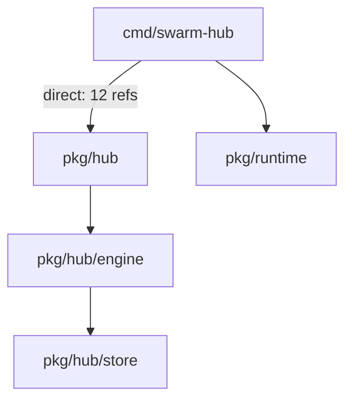
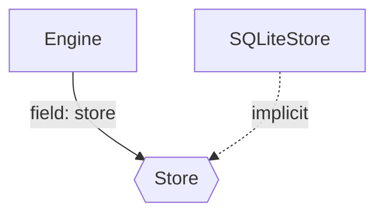
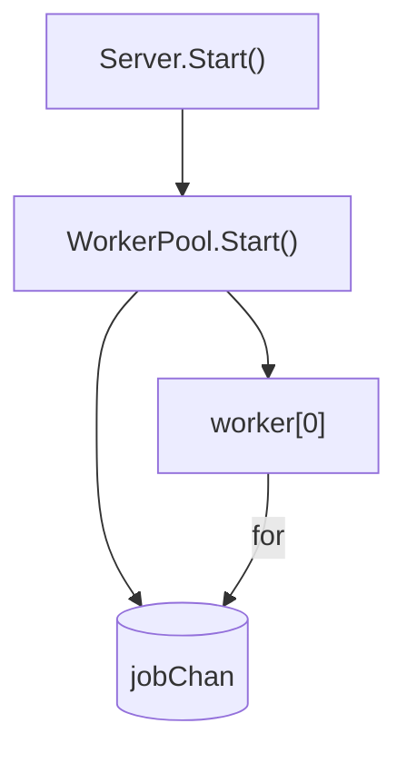

# Go Architecture Atlas: Go 语言架构可观测系统

**文档版本**: 4.0
**创建日期**: 2026-02-23
**最后修改**: 2026-02-24
**前置依赖**: 15-golang-support-proposal.md (Phase 0-4 已完成)
**状态**: 待评审 - 已响应架构审查 v3.0 反馈
**架构审查**:
- v2.2: docs/reviews/2024-02-24-go-atlas-architectural-review.md
- v3.0: docs/reviews/2024-02-24-go-atlas-v3-review.md

---

## 1. 执行摘要

### 1.1 核心洞察

> **OOP 语言可以从类型系统恢复 Architecture。**
> **Go 语言必须从行为模式恢复 Architecture。**

这是 ArchGuard 遇到的第一个"语言哲学级"断裂：

- **TypeScript/Java/C#**: 类 = 稳定抽象，类型关系 = 系统结构
- **Go**: 类型表达的是 data layout 和 minimal capability，真正的架构在：
  - package topology（包拓扑）
  - interface usage（接口使用）
  - runtime behavior patterns（运行时行为模式）
  - communication flow（通信流）

### 1.2 问题陈述

当前 Go 实现（Proposal 15 Phase 0-4）已成功：
- ✅ Tree-sitter 语法分析
- ✅ gopls 语义分析
- ✅ 隐式接口检测
- ✅ 方法提升

但生成的 Class Diagram 对 Go 项目的价值有限：

| 问题 | 根本原因 | 影响 |
|------|----------|------|
| 同名类混淆 | `pkg/hub.Server`, `pkg/worker.Server` 等 | 排名不稳定 |
| 数据模型无方法 | `Session`, `Task` 纯数据容器 | 核心类评分低 |
| 缺少行为信息 | 谁调用、谁拥有生命周期、是否并发 | 无法识别真实依赖 |
| 架构信息在函数中 | `UpdateRuntimeState()` 不在任何类中 | Class Diagram 缺失核心逻辑 |

### 1.3 解决方案

**Go Architecture Atlas** - 从单一 Class Diagram 升级为四层架构图：

```
┌─────────────────────────────────────────────────────────────────┐
│                    Go Architecture Atlas                         │
├─────────────────────────────────────────────────────────────────┤
│                                                                  │
│  ┌──────────────────┐  ┌──────────────────┐  ┌────────────────┐ │
│  │  Package Graph   │  │ Capability Graph │  │ Goroutine Graph│ │
│  │  (静态边界)       │  │  (抽象关系)       │  │  (执行结构)    │ │
│  │  100% 可恢复      │  │  80%+ 可恢复      │  │  静态模式识别   │ │
│  └────────┬─────────┘  └────────┬─────────┘  └───────┬────────┘ │
│           │                     │                    │          │
│           └─────────────────────┼────────────────────┘          │
│                                 ▼                               │
│                      ┌──────────────────┐                       │
│                      │   Flow Graph     │                       │
│                      │   (信息路径)      │                       │
│                      │  入口→调用链     │                       │
│                      └──────────────────┘                       │
│                                                                  │
└─────────────────────────────────────────────────────────────────┘
```

**关键洞察**：这四张图是互补的投影，而非替代关系。Go 的架构需要多视角叠加才能理解。

---

## 2. 理论基础

### 2.1 架构可恢复性差异

```
OOP (TypeScript/Java/C#):                    Go:
┌────────────────────────────┐           ┌────────────────────────────┐
│ 架构 = Type System        │           │ 架构 = Behavior Patterns   │
│                           │           │                           │
│ • class 继承               │           │ • package 依赖            │
│ • interface 实现           │           │ • interface 使用位置      │
│ • 字段类型                 │           │ • goroutine 启动模式      │
│ • 方法可见性               │           │ • channel 通信模式       │
│ • 依赖注入                 │           │ • 函数调用链             │
│                           │           │                           │
│ 👉 静态分析足够             │           │ 👉 需要行为分析           │
└────────────────────────────┘           └────────────────────────────┘
```

### 2.2 Machine-Recoverable Truth 重新定义

| 结构 | 可恢复性 | 技术限制 | 架构价值 |
|------|----------|----------|----------|
| **package imports** | 100% | 无 | ⭐⭐⭐⭐⭐ |
| **interface 定义位置** | 100% | 无 | ⭐⭐⭐ |
| **interface 使用点** | ~85% | 匿名函数、反射 | ⭐⭐⭐⭐⭐ |
| **goroutine 启动** | ~90% | 动态启动、条件分支 | ⭐⭐⭐⭐⭐ |
| **channel 创建** | ~95% | 动态创建、类型推断 | ⭐⭐⭐⭐ |
| **channel 通信边** | **< 20%** | **严重依赖数据流分析** | ⭐⭐⭐ |
| **HTTP 入口点** | ~70% | 框架差异 | ⭐⭐⭐⭐ |
| **函数调用链** | ~60% | **严重依赖类型推断 (gopls)** | ⭐⭐⭐ |
| **struct 继承** | N/A | Go 无继承 | - |
| **函数体行为** | ~80% | **需扩展 TreeSitterBridge** | ⭐⭐⭐⭐⭐ |

**说明**：
- "goroutine spawn 是 runtime truth" 的说法不准确，应为 "静态 spawn pattern"
- **修正**: "channel edges" 的静态可恢复性极低（< 20%），除非是局部变量传递。复杂的数据流分析不在初期版本范围内。
- **新增**: "函数体行为" 可恢复性取决于 TreeSitterBridge 扩展（见 4.4 节），包括调用表达式、goroutine spawn 点、channel 操作的静态识别。

---

## 3. 四层架构图设计

### 3.1 Package Dependency Graph

**可恢复性**: 100%
**技术限制**: 无
**架构价值**: ⭐⭐⭐⭐⭐

```
解析方式:
- go list -deps（获取完整依赖树）
- AST import 分析（获取直接依赖）
- 循环依赖检测（Kahn 算法）

输出示例:
┌─────────────────────────────────────────────────────────────┐
│  cmd/swarm-hub                                               │
│       │                                                      │
│       ├── pkg/hub ─────┐                                    │
│       │      │          │                                    │
│       │      ├── pkg/hub/engine                              │
│       │      │          │                                    │
│       │      │          └── pkg/hub/store ◄──┐              │
│       │      │                               │               │
│       │      └── pkg/hub/models              │               │
│       │                                     │               │
│       ├── pkg/runtime ──────────────────────┘               │
│       │                                                      │
│       └── pkg/config                                         │
│                                                              │
│  ⚠️ 检测到循环依赖: pkg/hub → pkg/runtime → pkg/hub           │
└─────────────────────────────────────────────────────────────┘
```

**关键价值**：Package Graph 是 Go 唯一的静态真相，它是理解系统边界的起点。

### 3.2 Capability Graph

**可恢复性**: ~85%
**技术限制**:
- 匿名函数中的接口参数无法关联到具体类型
- 反射调用无法静态分析
- 第三方库的接口使用点可能不可见

**架构价值**: ⭐⭐⭐⭐⭐

```
解析方式:
- interface 定义位置（AST）
- 字段类型是接口的字段
- 函数参数类型是接口的参数
- 隐式实现匹配（Proposal 15 已实现）

输出示例:
┌─────────────────────────────────────────────────────────────┐
│  pkg/hub/Store ─────────────────────────────┐               │
│     ▲                                   (interface)        │
│     │                                                      │
│     │ implements                                    uses    │
│     │                                                      │
│  ┌──┴──────┐                                           │    │
│  │SQLiteStore│ pkg/hub/Server ───────────────────────┘    │
│  │MemStore   │                                                │
│  └─────────┘│                                                │
│            │                                                │
│  pkg/hub/Engine ──────────────────────────────────uses─────│
│                                                              │
│  pkg/worker/Executor ───────┐                              │
│            ▲                │                              │
│            │ implements  ┌───┴─────┐                       │
│  pkg/worker/TaskExecutor ──│CLIAdapter│                       │
│            │            │CodexAdapter│                      │
│  pkg/worker/WorkerPool ────┴──────────┘                       │
│                                                              │
│  实线: 隐式实现          虚线: 字段注入/参数注入                │
└─────────────────────────────────────────────────────────────┘
```

**关键价值**：Capability Graph 揭示了"谁依赖谁的抽象"，这是理解系统解耦程度的关键。

### 3.3 Goroutine Topology

**可恢复性**: ~60-70% (仅限启动点和创建点)
**技术限制**:
- **数据流缺失**: Channel 作为参数传递或存储在结构体中时，静态追踪极为困难。
- **动态性**: 条件启动的 goroutine 无法确定运行时是否执行。

**架构价值**: ⭐⭐⭐⭐⭐

```
解析方式:
- go func() 调用模式匹配（需要 AST 函数体分析）
- make(chan) 调用模式匹配
- range/chan 模式识别（仅限局部变量）
- select 语句识别

输出示例（简化版）:
┌─────────────────────────────────────────────────────────────┐
│  Server.Start() ──go func──▶ runSessionGC()                  │
│       │                                                      │
│       └──go func──▶ WorkerPool.Start()                       │
│                          │                                   │
│                          ├── jobChan (chan Job, 100)        │
│                          ├── resultChan (chan Result)      │
│                          │                                   │
│                          ├──worker[N] (for i < poolSize)│
│                          │     │                             │
│                          │     └──for job := range jobChan│
│                          │                                   │
│                          └──resultAggregator               │
│                                                              │
│  ⚠️ 注意: 通信边仅为静态识别，复杂跨包通信可能丢失       │
└─────────────────────────────────────────────────────────────┘
```

**关键价值**：即使是简化版，Goroutine Topology 也能揭示并发架构的骨架，这是理解系统性能边界的关键。

### 3.4 Flow Graph

**可恢复性**: ~50-60% (**强依赖 gopls**)
**技术限制**:
- **纯静态分析极其有限**: 仅能识别同包内的直接函数调用。
- **接口调用黑盒**: 静态分析无法知道 `interface.Method()` 调用了哪个实现，必须依赖 gopls 的类型指针分析。

**架构价值**: ⭐⭐⭐⭐

```
解析方式:
- HTTP handler 注册点模式匹配
- 函数调用链追踪（AST + gopls call hierarchy）
- context.Context 传递分析
- error 返回路径分析

输出示例（HTTP 入口点）:
┌─────────────────────────────────────────────────────────────┐
│  POST /v1/tasks:dispatch                                      │
│       │                                                      │
│       ▼                                                      │
│  ┌──────────────────┐                                        │
│  │ Auth Middleware  │ ◄── token validation                   │
│  └────────┬─────────┘                                        │
│           │                                                  │
│           ▼                                                  │
│  ┌──────────────────┐                                        │
│  │ Engine.CreateTask │ ◄── state machine validation        │
│  └────────┬─────────┘                                        │
│           │                                                  │
│           ▼                                                  │
│  ┌──────────────────┐                                        │
│  │ Store.CreateTask │ ◄── persistence                        │
│  └────────┬─────────┘                                        │
│           │                                                  │
│           ▼                                                  │
│  ┌──────────────────┐                                        │
│  │ Engine.Broadcast │ ◄── TASK_CREATED event                 │
│  │    (to SSE)       │                                       │
│  └──────────────────┘                                        │
│                                                              │
│  ---. error path -------------------------------------------►│
│  │                                                          │
│  └──► ErrorHandler ──► HTTP 500                              │
└─────────────────────────────────────────────────────────────┘
```

**关键价值**：Flow Graph 揭示了"请求如何流转"，这是理解业务逻辑的关键。

#### 入口点检测模式匹配规则

**支持的 HTTP 框架和模式**:

| 框架 | 检测模式 | 示例代码 | 识别准确率 |
|------|----------|----------|------------|
| **net/http** | `http.HandleFunc()` 调用 | `http.HandleFunc("/path", handler)` | ~95% |
| **net/http** | `ServeMux.Handle()` 调用 | `mux.Handle("/path", handler)` | ~90% |
| **gin** | `router.GET/POST/...()` 调用 | `router.GET("/path", handler)` | ~85% |
| **gorilla/mux** | `router.HandleFunc()` 调用 | `router.HandleFunc("/path", handler)` | ~85% |
| **echo** | `router.GET/POST/...()` 调用 | `router.GET("/path", handler)` | ~80% |
| **grpc** | `Register*Server()` 调用 | `pb.RegisterServiceServer(server, srv)` | ~90% |

**检测局限性**:

1. **间接注册无法识别**:
   ```go
   // ❌ 无法静态识别 handler 是什么
   func setupRoutes(mux *http.ServeMux, handlers map[string]http.HandlerFunc) {
       for path, handler := range handlers {
           mux.HandleFunc(path, handler)  // handler 来自 map
       }
   }
   ```

2. **动态路由无法完全解析**:
   ```go
   // ❌ 只能识别 "GET /api/..." 模式，无法确定实际路径
   router.GET("/api/:id", handler)  // gin/echo 的路径参数
   ```

3. **中间件链顺序不确定**:
   ```go
   // ⚠️ 中间件可能动态注册
   r.Use(middleware1)
   // ... 其他代码 ...
   r.Use(middleware2)  // 顺序依赖运行时
   ```

**缓解策略**:
- **必须集成 gopls**: 使用 `gopls call hierarchy` API 追踪间接调用。
- 标注 `dynamic_route` 表示动态路由。
- 提供最大/最小中间件链范围。

---

## 4. 架构设计

### 4.1 系统架构原则

基于架构审查反馈（docs/reviews/2024-02-24-go-atlas-v3-review.md），本提案遵循以下设计原则：

1. **无需向后兼容**: Go 语言的特殊性（行为模式 > 类型系统）允许对 ArchGuard 核心架构进行适应性调整
2. **插件接口统一**: `GoAtlasPlugin` 必须继承 `GoPlugin` 并实现 `ILanguagePlugin` 接口，确保与现有工具链（CLI/Web UI/批处理）兼容
3. **数据结构扩展**: 扩展 `GoRawData` 支持函数体分析，同时保持与现有 `GoPlugin` 的兼容性
4. **分层清晰**: 解析层（TreeSitter）→ 分析层（BehaviorAnalyzer）→ 映射层（ArchJsonMapper）职责分离
5. **渐进增强**: 函数体提取作为可选功能，避免破坏 Phase 0-4 性能特性

### 4.2 系统架构

```
┌──────────────────────────────────────────────────────────────────────┐
│                    Go Atlas Architecture (v4.0)                      │
├──────────────────────────────────────────────────────────────────────┤
│                                                                       │
│  ┌─────────────────────────────────────────────────────────────────┐  │
│  │                    GoAtlasPlugin                               │  │
│  │         (extends GoPlugin + implements IGoAtlas)                │  │
│  ├─────────────────────────────────────────────────────────────────┤  │
│  │                                                                 │  │
│  │  ┌───────────────────────────────────────────────────────────┐ │  │
│  │  │           ILanguagePlugin 接口 (继承自 GoPlugin)           │ │  │
│  │  │  • parseProject() → ArchJSON (兼容现有工具链)              │ │  │
│  │  │  • parseCode() → ArchJSON                                  │ │  │
│  │  │  • parseProjectToRaw() → GoRawData (protected, 新增)       │ │  │
│  │  └───────────────────────────────────────────────────────────┘ │  │
│  │                                                                 │  │
│  │  ┌───────────────────────────────────────────────────────────┐ │  │
│  │  │           IGoAtlas 接口 (Atlas 专用)                      │ │  │
│  │  │  • generateAtlas() → GoArchitectureAtlas (完整四层图)       │ │  │
│  │  │  • renderLayer() → Mermaid/JSON/SVG (分层渲染)             │ │  │
│  │  └───────────────────────────────────────────────────────────┘ │  │
│  │                                                                 │  │
│  │  ┌───────────────┐  ┌───────────────┐  ┌───────────────────┐  │  │
│  │  │ TreeSitter    │  │ GoplsClient   │  │ BehaviorAnalyzer  │  │  │
│  │  │ Bridge v4.0   │  │ (Optional)    │  │                   │  │  │
│  │  │               │  │               │  │  • PackageGraph   │  │  │
│  │  │ • parseCode() │  │ • call        │  │  • CapabilityGraph│  │  │
│  │  │   (无函数体)  │  │   hierarchy   │  │  • GoroutineTopo  │  │  │
│  │  │ • parseCode() │  │ • type        │  │  • FlowGraph     │  │  │
│  │  │   WithBodies()│  │   inference   │  │                   │  │  │
│  │  │   (Atlas专用) │  │               │  │                   │  │  │
│  │  └───────────────┘  └───────────────┘  └───────────────────┘  │  │
│  │         │                  │                    │             │  │
│  │         └──────────────────┴────────────────────┘             │  │
│  │                            ▼                                 │  │
│  │  ┌───────────────────────────────────────────────────────────┐ │  │
│  │  │              GoArchitectureAtlas                          │ │  │
│  │  │  • metadata: AtlasMetadata                                │ │  │
│  │  │  • packageGraph: PackageGraph                              │ │  │
│  │  │  • capabilityGraph: CapabilityGraph                        │ │  │
│  │  │  • goroutineTopology: GoroutineTopology                    │ │  │
│  │  │  • flowGraph: FlowGraph                                    │ │  │
│  │  └───────────────────────────────────────────────────────────┘ │  │
│  │                            │                                 │  │
│  │                            ▼                                 │  │
│  │  ┌───────────────────────────────────────────────────────────┐ │  │
│  │  │              AtlasMapper                                  │ │  │
│  │  │  toArchJSON(): Atlas → ArchJSON (双向转换)                 │ │  │
│  │  │  toAtlas(): ArchJSON → Atlas (反解析)                     │ │  │
│  │  └───────────────────────────────────────────────────────────┘ │  │
│  │                                                                 │  │
│  └─────────────────────────────────────────────────────────────────┘  │
│                                                                       │
└──────────────────────────────────────────────────────────────────────┘
```

### 4.3 核心数据结构

#### 4.3.1 GoArchitectureAtlas 定义

```typescript
// plugins/golang/atlas/types.ts

/**
 * Go Architecture Atlas - 完整的四层架构数据结构
 */
export interface GoArchitectureAtlas {
  metadata: AtlasMetadata;
  packageGraph: PackageGraph;
  capabilityGraph: CapabilityGraph;
  goroutineTopology: GoroutineTopology;
  flowGraph: FlowGraph;
}

export interface AtlasMetadata {
  moduleName: string;
  moduleRoot: string;
  goVersion: string;
  generatedAt: string;
  analyzerVersion: string;
  stats: AtlasStats;
  partialGeneration: boolean;  // 标注是否部分生成
  missingLayers: string[];     // ['goroutine', 'flow']
}

export interface AtlasStats {
  packages: number;
  interfaces: number;
  structs: number;
  goroutines: number;
  channels: number;
  entryPoints: number;
}
```

#### 4.3.2 Package Graph 定义

```typescript
// ============== Package Graph ==============

export interface PackageGraph {
  packages: PackageNode[];
  dependencies: PackageDependency[];
  cycles: PackageCycle[];
}

export interface PackageNode {
  id: string;              // 完整路径: "github.com/example/swarm/pkg/hub"
  name: string;            // 包名: "hub"
  dirPath: string;         // 文件系统路径
  type: 'cmd' | 'pkg' | 'internal' | 'vendor';
  exports: string[];       // 导出的符号（首字母大写）
  stats: PackageStats;
}

export interface PackageStats {
  files: number;
  structs: number;
  interfaces: number;
  functions: number;
  imports: number;          // 导入的其他包数量
}

export interface PackageDependency {
  fromId: string;          // 源包 ID
  toId: string;            // 目标包 ID
  type: 'direct' | 'indirect' | 'test';
  strength: number;        // 引用强度（被导入符号数量）
}

export interface PackageCycle {
  packages: string[];     // 循环依赖的包 ID 列表
  severity: 'warning' | 'error';
}
```

#### 4.3.3 Capability Graph 定义

```typescript
// ============== Capability Graph ==============

export interface CapabilityGraph {
  interfaces: InterfaceCapability[];
  implementations: Implementation[];
  usageSites: UsageSite[];
}

export interface InterfaceCapability {
  id: string;              // 完整 ID: "pkg/hub.Store"
  name: string;            // 接口名: "Store"
  packageId: string;       // 包 ID: "github.com/example/swarm/pkg/hub"
  methods: MethodSignature[];
  implementors: Implementation[];  // 实现此接口的结构体
  consumers: UsageSite[];         // 使用此接口的位置
}

export interface MethodSignature {
  name: string;
  signature: string;      // 规范化签名: "Load(ctx, id) (*Session, error)"
}

export interface Implementation {
  structId: string;       // 实现者结构体 ID
  structName: string;
  structPackageId: string;
  interfaceId: string;     // 接口 ID
  coverage: number;       // 方法覆盖率 0.0-1.0
  type: 'implicit';       // Go 只有隐式实现
}

export interface UsageSite {
  id: string;             // 唯一 ID
  interfaceId: string;    // 被使用的接口 ID
  consumerId: string;     // 使用者 ID（可能是 struct 或 function）
  consumerName: string;
  consumerPackageId: string;
  context: UsageContext;
  location: SourceLocation;
}

export type UsageContext =
  | 'struct_field'        // 结构体字段: `type Server struct { store Store }`
  | 'function_parameter'  // 函数参数: `func New(store Store) *Server`
  | 'function_return'    // 函数返回值: `func Get() (Store, error)`
  | 'variable'           // 局部变量: `var s Store = ...`
  | 'channel_element'    // channel 元素: `ch chan Store`
  | 'map_value';         // map 值: `m map[string]Store`
```

#### 4.3.4 Goroutine Topology 定义

```typescript
// ============== Goroutine Topology ==============

export interface GoroutineTopology {
  goroutines: GoroutineNode[];
  channels: ChannelNode[];
  patterns: ConcurrencyPattern[];  // 识别出的并发模式
  unknownRatio: number;     // 无法归类的 goroutine 比例
}

export interface GoroutineNode {
  id: string;
  name: string;            // 函数名或匿名
  spawnLocation: SourceLocation;
  spawnType: 'named_func' | 'anonymous_func' | 'method';
  pattern: ConcurrencyPattern | 'unknown';
  confidence: number;       // 模式识别置信度 0.0-1.0
}

export type ConcurrencyPattern =
  | 'worker_pool'          // for + range channel
  | 'pipeline'             // channel 链式处理
  | 'fan_out_fan_in'       // 多 worker 单聚合
  | 'background_task'      // 后台任务（如 GC）
  | 'timer'                // time.Ticker
  | 'server'               // HTTP/gRPC server
  | 'producer_consumer'    // 生产者-消费者
  | 'unknown';

export interface ChannelNode {
  id: string;
  name: string;
  location: SourceLocation;
  bufferSize: number;      // 0 = unbuffered
  direction: 'send_only' | 'receive_only' | 'bidirectional';
  elementType: string;     // 元素类型（可能不完全准确）
}

// 注意: 不再包含 connections，因为静态识别的准确率太低
// 改为识别 Goroutine 和 Channel 各自的模式
```

#### 4.3.5 Flow Graph 定义

```typescript
// ============== Flow Graph ==============

export interface FlowGraph {
  entryPoints: EntryPoint[];
  flows: Flow[];
}

export interface EntryPoint {
  id: string;
  type: EntryPointType;
  path: string;            // HTTP 路径或 CLI 命令
  method?: string;         // HTTP 方法
  location: SourceLocation;
  flowId: string;          // 关联的 Flow ID
}

export type EntryPointType =
  | 'http_handler'         // net/http HandleFunc
  | 'http_route'           // 路由注册
  | 'grpc_service'         // gRPC 服务
  | 'cli_command'          // CLI 命令
  | 'background_job'       // 后台任务
  | 'event_handler';       // 事件处理器

export interface Flow {
  id: string;
  entryPointId: string;   // 入口点 ID
  steps: FlowStep[];
  errorPaths: ErrorPath[];
  unknownRatio: number;    // 无法追踪的调用比例
}

export interface FlowStep {
  id: string;             // flow-unique ID
  type: FlowStepType;
  name: string;
  qualifiedName: string;  // package.Function 或 package.Type.Method
  packageId: string;
  location: SourceLocation;
  contextPropagation: boolean;  // 是否传递 ctx
  nextStepIds: string[];  // 下一步骤 ID 列表
}

export type FlowStepType =
  | 'function'            // 顶层函数
  | 'method'              // 方法
  | 'middleware'          // 中间件
  | 'callback'            // 回调函数
  | 'unknown';

export interface ErrorPath {
  fromStepId: string;
  handler: string;        // 错误处理方式
  errorTypes: string[];   // 可能的错误类型
}

// ============== 通用类型 ==============

export interface SourceLocation {
  file: string;
  startLine: number;
  endLine: number;
  startColumn?: number;
  endColumn?: number;
}
```

### 4.4 ArchGuard 核心架构调整

基于架构审查反馈，以下扩展 **不需要保持向后兼容**，可直接调整 ArchGuard 核心类型定义。

#### 4.4.1 扩展 ArchJSON Schema

```typescript
// src/types/index.ts

/**
 * Supported programming languages
 */
export type SupportedLanguage = 'typescript' | 'go' | 'java' | 'python' | 'rust';

/**
 * Entity types in the architecture
 * ✅ 新增: 'package' 支持 Go 包级实体
 */
export type EntityType =
  'class' | 'interface' | 'enum' | 'struct' | 'trait' | 'abstract_class' | 'function' | 'package';

/**
 * Relation types between entities
 * ✅ 新增: 'spawns', 'calls' 支持 Go 行为关系
 */
export type RelationType =
  | 'inheritance'
  | 'implementation'
  | 'composition'
  | 'aggregation'
  | 'dependency'
  | 'association'
  | 'spawns'      // ✅ 新增: Goroutine spawn 关系
  | 'calls';      // ✅ 新增: 函数调用关系

/**
 * Main architecture JSON structure
 * ✅ 新增: extensions 字段支持语言特定数据
 */
export interface ArchJSON {
  version: string;
  language: SupportedLanguage;
  timestamp: string;
  sourceFiles: string[];
  entities: Entity[];
  relations: Relation[];
  modules?: Module[];
  metadata?: Record<string, unknown>;

  // ✅ 新增: 扩展字段，支持语言特定数据
  extensions?: {
    goAtlas?: Partial<GoArchitectureAtlas>;
  };
}
```

#### 4.4.2 扩展 ILanguagePlugin 接口

```typescript
// src/core/interfaces/language-plugin.ts

/**
 * Language plugin interface
 *
 * All language plugins must implement this interface to be compatible
 * with ArchGuard's plugin system.
 */
export interface ILanguagePlugin extends IParser {
  readonly metadata: PluginMetadata;
  initialize(config: PluginInitConfig): Promise<void>;
  canHandle(targetPath: string): boolean;
  dispose(): Promise<void>;
  readonly dependencyExtractor?: IDependencyExtractor;
  readonly validator?: IValidator;

  // ✅ 新增: 可选扩展方法（Go 等语言可实现）
  generateExtendedAnalysis?(rootPath: string, options: any): Promise<any>;
}
```

### 4.5 GoAtlasPlugin 接口定义

```typescript
// plugins/golang/atlas/go-atlas-plugin.ts

import type {
  ILanguagePlugin,
  PluginMetadata,
  PluginInitConfig
} from '@/core/interfaces/language-plugin.js';
import type { ParseConfig, ArchJSON } from '@/types/index.js';
import { GoPlugin } from '../golang/index.js';  // ✅ 继承现有插件

/**
 * Go Atlas Plugin 接口定义
 */
export interface IGoAtlas {
  /**
   * 生成完整的 Go Architecture Atlas (四层图)
   */
  generateAtlas(
    rootPath: string,
    options?: AtlasGenerationOptions
  ): Promise<GoArchitectureAtlas>;

  /**
   * 渲染指定层级的架构图
   */
  renderLayer(
    atlas: GoArchitectureAtlas,
    layer: AtlasLayer,
    format: RenderFormat
  ): Promise<RenderResult>;
}

export type AtlasLayer = 'package' | 'capability' | 'goroutine' | 'flow' | 'all';
export type RenderFormat = 'mermaid' | 'json' | 'svg' | 'png';

export interface RenderResult {
  content: string;
  format: RenderFormat;
  layer: AtlasLayer;
}

/**
 * Go Atlas Plugin 实现
 *
 * 设计决策:
 * 1. 继承 GoPlugin，复用 parseProject() 逻辑
 * 2. 实现 IGoAtlas 扩展接口，提供 Atlas 专用功能
 * 3. 实现 ILanguagePlugin 标准接口，保持工具链兼容
 * 4. 暴露 parseProjectToRaw() 供子类使用
 */
export class GoAtlasPlugin extends GoPlugin implements IGoAtlas {
  readonly metadata: PluginMetadata = {
    ...super.metadata,  // 继承基础 metadata
    name: 'golang-atlas',
    version: '4.0.0',
    displayName: 'Go Architecture Atlas',
    capabilities: {
      ...super.capabilities,
      // ✅ 新增能力标注
      functionBodyExtraction: true,
      behaviorAnalysis: true,
      packageGraphAnalysis: true,
    },
  };

  private behaviorAnalyzer: BehaviorAnalyzer;
  private atlasMapper: AtlasMapper;

  constructor() {
    super();  // ✅ 复用 GoPlugin 初始化
    this.behaviorAnalyzer = new BehaviorAnalyzer();
    this.atlasMapper = new AtlasMapper();
  }

  // ========== ILanguagePlugin 标准接口 (兼容现有工具链) ==========

  /**
   * 标准解析接口 - 返回 ArchJSON
   * CLI/Web UI/批处理模式自动调用此方法
   */
  async parseProject(workspaceRoot: string, config: ParseConfig): Promise<ArchJSON> {
    // 调用父类实现，获取基础 ArchJSON
    const baseArchJSON = await super.parseProject(workspaceRoot, config);

    // 可选: 附加 Atlas extensions 到 ArchJSON
    if (config.includeExtensions) {
      const atlas = await this.generateAtlas(workspaceRoot, {
        functionBodyStrategy: 'selective',  // 默认选择性提取
      });

      return {
        ...baseArchJSON,
        version: '2.1',
        extensions: {
          goAtlas: atlas,
        },
      };
    }

    return baseArchJSON;
  }

  // ========== IGoAtlas 扩展接口 (Atlas 专用功能) ==========

  /**
   * 生成完整的 Go Architecture Atlas
   */
  async generateAtlas(
    rootPath: string,
    options: AtlasGenerationOptions = {}
  ): Promise<GoArchitectureAtlas> {
    // 1. 使用父类 parseProjectToRaw() 获取 GoRawData
    const rawData = await this.parseProjectToRaw(rootPath, options);

    // 2. 匹配接口实现 (复用现有逻辑)
    const allStructs = rawData.packages.flatMap(p => p.structs);
    const allInterfaces = rawData.packages.flatMap(p => p.interfaces);
    const implementations = await this.matcher.matchWithGopls(
      allStructs,
      allInterfaces,
      this.goplsClient
    );

    // 3. 并行分析四层架构
    const [packageGraph, capabilityGraph, goroutineTopology, flowGraph] = await Promise.all([
      this.behaviorAnalyzer.buildPackageGraph(rawData),
      this.behaviorAnalyzer.buildCapabilityGraph(rawData, implementations),
      this.behaviorAnalyzer.buildGoroutineTopology(rawData, options),
      this.behaviorAnalyzer.buildFlowGraph(rawData, this.goplsClient, options),
    ]);

    // 4. 构建 Atlas (支持部分生成)
    const atlas: GoArchitectureAtlas = {
      metadata: {
        moduleName: rawData.moduleName,
        moduleRoot: rawData.moduleRoot,
        goVersion: await this.detectGoVersion(rootPath),
        generatedAt: new Date().toISOString(),
        analyzerVersion: '4.0.0',
        stats: this.calculateStats(packageGraph, capabilityGraph, goroutineTopology, flowGraph),
        partialGeneration: options.functionBodyStrategy === 'none',
        missingLayers: this.getMissingLayers(packageGraph, capabilityGraph, goroutineTopology, flowGraph),
      },
      packageGraph,
      capabilityGraph,
      goroutineTopology,
      flowGraph,
    };

    return atlas;
  }

  /**
   * 渲染指定层级
   */
  async renderLayer(
    atlas: GoArchitectureAtlas,
    layer: AtlasLayer = 'all',
    format: RenderFormat = 'mermaid'
  ): Promise<RenderResult> {
    const renderer = new AtlasRenderer();
    return renderer.render(atlas, layer, format);
  }

  // ========== 内部辅助方法 ==========

  /**
   * 检测缺失的层级
   */
  private getMissingLayers(
    pg: PackageGraph,
    cg: CapabilityGraph,
    gt: GoroutineTopology,
    fg: FlowGraph
  ): string[] {
    const missing: string[] = [];
    if (!gt || gt.goroutines.length === 0) missing.push('goroutine');
    if (!fg || fg.flows.length === 0) missing.push('flow');
    return missing;
  }
}

/**
 * Atlas 生成选项
 */
export interface AtlasGenerationOptions {
  // 函数体提取策略
  functionBodyStrategy: 'full' | 'selective' | 'none';

  // 选择性提取配置 (functionBodyStrategy === 'selective' 时使用)
  selectiveExtraction?: {
    includePatterns?: string[];  // ['go ', 'chan ', 'mutex']
    excludeTestFiles?: boolean;
    maxFunctions?: number;
  };

  // 其他选项
  includeTests?: boolean;
  entryPointTypes?: EntryPointType[];
  followIndirectCalls?: boolean;
}
```

### 4.6 扩展 GoRawData 类型

基于架构审查反馈 (P0-1, P0-5)，扩展 `types.ts` 支持函数体行为数据。

```typescript
// plugins/golang/types.ts

// ========== 现有类型 (保持兼容) ==========

export interface GoFunction {
  name: string;
  packageName: string;
  parameters: GoField[];
  returnTypes: string[];
  exported: boolean;
  location: GoSourceLocation;

  // ✅ 新增: 函数体行为数据 (可选字段)
  body?: GoFunctionBody;
}

export interface GoMethod {
  name: string;
  receiver?: string;
  receiverType?: string;
  parameters: GoField[];
  returnTypes: string[];
  exported: boolean;
  location: GoSourceLocation;

  // ✅ 新增: 方法体行为数据 (可选字段)
  body?: GoFunctionBody;
}

// ========== 新增类型 (支持行为分析) ==========

/**
 * 函数体行为数据
 * 用于 Goroutine Topology 和 Flow Graph 分析
 */
export interface GoFunctionBody {
  block: GoBlock;
  calls: GoCallExpr[];        // 所有的函数调用
  goSpawns: GoSpawnStmt[];    // go func() ...
  channelOps: GoChannelOp[];  // ch <- x 或 <-ch
}

/**
 * 函数/方法的基本块信息
 */
export interface GoBlock {
  startLine: number;
  endLine: number;
  statements: GoStatement[];
}

/**
 * 通用语句节点
 */
export interface GoStatement {
  type: string;
  location: GoSourceLocation;
}

/**
 * 函数调用表达式
 */
export interface GoCallExpr {
  functionName: string;       // 调用的函数名
  packageName?: string;       // 如果是跨包调用
  receiverType?: string;      // 如果是方法调用
  args: string[];             // 参数列表（简化文本）
  location: GoSourceLocation;
}

/**
 * Goroutine spawn 语句
 */
export interface GoSpawnStmt {
  call: GoCallExpr;           // 被 spawn 的函数调用
  location: GoSourceLocation;
}

/**
 * Channel 操作
 */
export interface GoChannelOp {
  channelName: string;
  operation: 'send' | 'receive' | 'close' | 'make';
  location: GoSourceLocation;
}

// ========== 扩展现有类型 ==========

export interface GoRawPackage {
  id: string;
  name: string;
  dirPath: string;
  imports: GoImport[];
  structs: GoRawStruct[];
  interfaces: GoRawInterface[];
  functions: GoFunction[];  // ✅ 现在包含可选的 body 字段

  // ✅ 新增: 解析后的依赖关系 (延迟填充)
  dependencies?: PackageDependency[];
  dependents?: string[];    // 被依赖的包 ID 列表
}

export interface GoImport {
  path: string;
  alias?: string;
  location: GoSourceLocation;

  // ✅ 新增: 测试文件标注
  isTest?: boolean;
}

/**
 * 包依赖关系
 */
export interface PackageDependency {
  fromPackageId: string;
  toPackageId: string;
  strength: number;  // 引用强度
  type: 'direct' | 'indirect' | 'test';
}

export interface GoRawData {
  packages: GoRawPackage[];
  moduleRoot: string;
  moduleName: string;

  // ✅ 新增: 附加数据
  implementations?: InferredImplementation[];
}
```

### 4.7 升级 TreeSitterBridge

基于架构审查反馈 (P0-2, P0-5)，保持现有 `parseCode()` 不变，新增 `parseCodeWithBodies()` 方法。

```typescript
// plugins/golang/tree-sitter-bridge.ts

export class TreeSitterBridge {
  private parser: Parser;

  constructor() {
    this.parser = new Parser();
    this.parser.setLanguage(Go);
  }

  /**
   * 解析单个 Go 源文件 (无函数体 - Phase 0-4 兼容)
   *
   * ⚠️ 重要: 此方法保持现有行为，不提取函数体
   * 原因: Phase 0-4 设计上不需要函数 (ArchJSON v1.0 无 'function' 类型)
   */
  parseCode(code: string, filePath: string): GoRawPackage {
    const tree = this.parser.parse(code);
    const rootNode = tree.rootNode;

    const packageName = this.extractPackageName(rootNode, code);
    const imports = this.extractImports(rootNode, code, filePath);
    const structs = this.extractStructs(rootNode, code, filePath, packageName);
    const interfaces = this.extractInterfaces(rootNode, code, filePath, packageName);

    return {
      id: packageName,
      name: packageName,
      dirPath: '',
      imports,
      structs,
      interfaces,
      functions: [],  // ✅ 保持空数组 (Phase 0-4 兼容)
    };
  }

  /**
   * 解析单个 Go 源文件 (含函数体 - Atlas 专用)
   *
   * ✅ 新增方法: 用于 Go Architecture Atlas
   *
   * @param options.extractBody - 是否提取函数体
   * @param options.selective - 是否选择性提取 (仅包含特定模式)
   */
  parseCodeWithBodies(
    code: string,
    filePath: string,
    options: { extractBody?: boolean; selective?: boolean }
  ): GoRawPackage {
    // 1. 先调用标准解析
    const pkg = this.parseCode(code, filePath);

    // 2. 条件性提取函数体
    if (options.extractBody) {
      const tree = this.parser.parse(code);
      const rootNode = tree.rootNode;

      // 提取函数
      const functionDecls = rootNode.descendantsOfType('function_declaration');
      const functions: GoFunction[] = [];

      for (const funcDecl of functionDecls) {
        // 选择性提取: 仅包含特定模式
        if (options.selective) {
          const codeSnippet = code.substring(funcDecl.startIndex, funcDecl.endIndex);
          if (!this.shouldExtractFunction(codeSnippet)) {
            continue;
          }
        }

        const func = this.extractFunction(funcDecl, code, filePath);
        functions.push(func);
      }

      // 提取方法体
      pkg.structs.forEach(struct => {
        struct.methods = this.extractMethodBodies(struct, code, filePath, options);
      });

      pkg.functions = functions;
    }

    return pkg;
  }

  /**
   * 提取函数 (含函数体)
   */
  private extractFunction(
    funcDecl: Parser.SyntaxNode,
    code: string,
    filePath: string
  ): GoFunction {
    const nameNode = funcDecl.childForFieldName('name');
    const name = code.substring(nameNode.startIndex, nameNode.endIndex);

    const parameters = this.extractParameters(funcDecl, code, filePath);
    const returnTypes = this.extractReturnTypes(funcDecl, code);

    // ✅ 提取函数体
    const blockNode = funcDecl.childForFieldName('block');
    let body: GoFunctionBody | undefined;
    if (blockNode) {
      body = this.extractFunctionBody(blockNode, code, filePath);
    }

    return {
      name,
      packageName,  // 从上下文获取
      parameters,
      returnTypes,
      exported: this.isExported(name),
      location: this.nodeToLocation(funcDecl, filePath),
      body,  // ✅ 包含函数体
    };
  }

  /**
   * ✅ 新增: 提取函数体行为数据
   */
  private extractFunctionBody(
    blockNode: Parser.SyntaxNode,
    code: string,
    filePath: string
  ): GoFunctionBody {
    const block: GoBlock = {
      startLine: blockNode.startPosition.row + 1,
      endLine: blockNode.endPosition.row + 1,
      statements: [], // TODO: 提取语句列表（如果需要）
    };

    // 提取函数调用
    const calls: GoCallExpr[] = [];
    const callExprs = blockNode.descendantsOfType('call_expression');
    for (const callExpr of callExprs) {
      calls.push(this.extractCallExpr(callExpr, code, filePath));
    }

    // 提取 goroutine spawns
    const goSpawns: GoSpawnStmt[] = [];
    const goStmts = blockNode.descendantsOfType('go_statement');
    for (const goStmt of goStmts) {
      goSpawns.push(this.extractGoSpawn(goStmt, code, filePath));
    }

    // 提取 channel 操作
    const channelOps: GoChannelOp[] = [];
    const sendStmts = blockNode.descendantsOfType('send_statement');
    for (const sendStmt of sendStmts) {
      channelOps.push(this.extractChannelOp(sendStmt, 'send', code, filePath));
    }
    const receiveExprs = blockNode.descendantsOfType('receive_expression');
    for (const recvExpr of receiveExprs) {
      channelOps.push(this.extractChannelOp(recvExpr, 'receive', code, filePath));
    }

    return { block, calls, goSpawns, channelOps };
  }

  /**
   * ✅ 新增: 判断是否应该提取此函数 (选择性模式)
   */
  private shouldExtractFunction(codeSnippet: string): boolean {
    const patterns = ['go ', 'chan ', 'make(', 'mutex', 'sync.'];
    return patterns.some(pattern => codeSnippet.includes(pattern));
  }

  /**
   * ✅ 新增: 提取调用表达式
   */
  private extractCallExpr(
    callExpr: Parser.SyntaxNode,
    code: string,
    filePath: string
  ): GoCallExpr {
    // 实现细节...
    const functionName = '';  // 从 AST 提取
    const packageName = '';   // 从 AST 提取
    const args: string[] = []; // 从 AST 提取

    return {
      functionName,
      packageName,
      args,
      location: this.nodeToLocation(callExpr, filePath),
    };
  }

  /**
   * ✅ 新增: 提取 goroutine spawn
   */
  private extractGoSpawn(
    goStmt: Parser.SyntaxNode,
    code: string,
    filePath: string
  ): GoSpawnStmt {
    const callExpr = goStmt.childForFieldName('call');
    return {
      call: this.extractCallExpr(callExpr, code, filePath),
      location: this.nodeToLocation(goStmt, filePath),
    };
  }

  /**
   * ✅ 新增: 提取 channel 操作
   */
  private extractChannelOp(
    node: Parser.SyntaxNode,
    opType: 'send' | 'receive',
    code: string,
    filePath: string
  ): GoChannelOp {
    const channelName = '';  // 从 AST 提取

    return {
      channelName,
      operation: opType,
      location: this.nodeToLocation(node, filePath),
    };
  }

  /**
   * ✅ 新增: 提取方法体
   */
  private extractMethodBodies(
    struct: GoRawStruct,
    code: string,
    filePath: string,
    options: { extractBody?: boolean; selective?: boolean }
  ): GoMethod[] {
    if (!options.extractBody) {
      return struct.methods;  // 保持原样
    }

    // 重新解析方法体
    const tree = this.parser.parse(code);
    const rootNode = tree.rootNode;

    const methodDecls = rootNode.descendantsOfType('method_declaration');
    const enrichedMethods: GoMethod[] = [];

    for (const methodDecl of methodDecls) {
      const method = this.extractMethod(methodDecl, code, filePath);

      // 仅保留属于此 struct 的方法
      if (method.receiverType === struct.name) {
        // 选择性提取
        if (options.selective) {
          const codeSnippet = code.substring(methodDecl.startIndex, methodDecl.endIndex);
          if (!this.shouldExtractFunction(codeSnippet)) {
            enrichedMethods.push(method);  // 无函数体
            continue;
          }
        }

        // 提取方法体
        const blockNode = methodDecl.childForFieldName('block');
        if (blockNode) {
          method.body = this.extractFunctionBody(blockNode, code, filePath);
        }

        enrichedMethods.push(method);
      }
    }

    return enrichedMethods;
  }

  // ... 其他现有方法保持不变 ...
}
```

### 4.8 扩展 GoPlugin 基类

基于架构审查反馈 (P1-3)，暴露 `parseProjectToRaw()` 方法供子类使用。

```typescript
// plugins/golang/index.ts

export class GoPlugin implements ILanguagePlugin {
  // ... 现有成员 ...

  /**
   * ✅ 新增: 受保护方法，供子类 (如 GoAtlasPlugin) 使用
   *
   * 返回 GoRawData 而非 ArchJSON，避免重复解析
   */
  protected async parseProjectToRaw(
    workspaceRoot: string,
    config: ParseConfig
  ): Promise<GoRawData> {
    this.ensureInitialized();

    // 存储 workspace root for gopls
    this.workspaceRoot = workspaceRoot;

    // Initialize gopls if available
    if (this.goplsClient && !this.goplsClient.isInitialized()) {
      try {
        await this.goplsClient.initialize(workspaceRoot);
      } catch (error) {
        console.warn('Failed to initialize gopls, using fallback:', error);
        this.goplsClient = null;
      }
    }

    // Find all .go files
    const pattern = config.filePattern ?? '**/*.go';
    const files = await glob(pattern, {
      cwd: workspaceRoot,
      absolute: true,
      ignore: ['**/vendor/**', '**/node_modules/**'],
    });

    // Parse all files
    const packages = new Map<string, GoRawPackage>();

    for (const file of files) {
      const code = await fs.readFile(file, 'utf-8');
      const pkg = this.treeSitter.parseCode(code, file);

      // Merge into packages map
      if (packages.has(pkg.name)) {
        const existing = packages.get(pkg.name);
        existing.structs.push(...pkg.structs);
        existing.interfaces.push(...pkg.interfaces);
        existing.functions.push(...pkg.functions);
        existing.imports.push(...pkg.imports);
      } else {
        packages.set(pkg.name, pkg);
      }
    }

    const packageList = Array.from(packages.values());

    // 读取 go.mod 获取模块信息
    let moduleName = '';
    try {
      const goModPath = `${workspaceRoot}/go.mod`;
      const goModContent = await fs.readFile(goModPath, 'utf-8');
      const match = goModContent.match(/^module\s+(.+)$/m);
      if (match) {
        moduleName = match[1].trim();
      }
    } catch {
      moduleName = 'unknown';
    }

    // ✅ 返回 GoRawData
    return {
      packages: packageList,
      moduleRoot: workspaceRoot,
      moduleName,
    };
  }

  /**
   * Parse entire Go project
   *
   * ⚠️ 现有方法保持不变，复用 parseProjectToRaw()
   */
  async parseProject(workspaceRoot: string, config: ParseConfig): Promise<ArchJSON> {
    // ✅ 调用新增的 parseProjectToRaw()
    const rawData = await this.parseProjectToRaw(workspaceRoot, config);

    // Match interface implementations (using gopls if available)
    const allStructs = rawData.packages.flatMap((p) => p.structs);
    const allInterfaces = rawData.packages.flatMap((p) => p.interfaces);
    const implementations = await this.matcher.matchWithGopls(
      allStructs,
      allInterfaces,
      this.goplsClient
    );

    // Map to ArchJSON
    const entities = this.mapper.mapEntities(rawData.packages);
    const relations = this.mapper.mapRelations(rawData.packages, implementations);

    return {
      version: '1.0',
      language: 'go',
      timestamp: new Date().toISOString(),
      sourceFiles: rawData.packages.flatMap(p => {
        // 从 package 中提取文件路径 (需要扩展 GoRawPackage)
        return [];
      }),
      entities,
      relations,
    };
  }

  // ... 其他现有方法保持不变 ...
}
```

---

## 5. 技术限制与挑战

### 5.1 已知限制

| 层 | 限制 | 影响程度 | 缓解策略 |
|---|------|----------|----------|
| **Package Graph** | 无 | - | - |
| **Capability Graph** | 匿名函数中的接口参数 | 中 | 标注为 "unknown usage" |
| **Goroutine Topology** | channel 作为参数传递 | **高 (严重)** | 只识别创建点，标注 "untraced channel" |
| **Goroutine Topology** | 条件启动的 goroutine | 中 | 标注为 "conditional spawn" |
| **Flow Graph** | 间接调用（接口/函数值） | **高 (严重)** | **必须使用 gopls call hierarchy API** |
| **Flow Graph** | 第三方框架（gin/echo） | 中 | 支持常见框架的 pattern matching |

### 5.2 关键技术挑战

#### 挑战 1: Channel 边追踪

**问题场景**:
```go
func producer() <-chan int {
  ch := make(chan int, 10)
  go worker(ch)  // ch 发送给谁？
  return ch
}
```

**静态分析可以看到**:
- ✅ producer 创建 channel
- ✅ worker 接收 channel 参数
- ❌ producer 返回的 ch 发送给谁？未知

**缓解策略**:
- 标注 "channel source: unknown" 或 "channel flow: incomplete"
- **不尝试完整的静态通信图恢复**，仅提供 "交互点标注"

#### 挑战 2: 间接调用追踪

**问题场景**:
```go
type Handler interface {
  Handle(ctx Context) error
}

func router(h Handler) {
  h.Handle(ctx)  // h 的实际类型是什么？
}
```

**静态分析限制**:
- 无法知道 h 的运行时类型
- **没有类型推断，Flow Graph 几乎不可用**

**缓解策略**:
- **集成 gopls 是必须的**，不是可选的
- 使用 gopls call hierarchy API（需要额外 10-30 秒启动时间）
- 提供多个候选调用路径
- 标注为 "indirect call, possible targets: [...]"

#### 挑战 3: HTTP 框架多样性

**支持的框架**:
- ✅ net/http 标准库
- ✅ github.com/gin-gonic/gin
- ✅ github.com/gorilla/mux

**不支持的框架**:
- ❌ github.com/labstack/echo（需添加模式）
- ❌ grpc-gateway（需单独处理）
- ❌ 自定义框架（不可能通用支持）

**缓解策略**:
- 提供"框架检测"功能
- 允许用户注册自定义入口点模式
- 未识别的框架标注为 "custom_entry_point"

---

## 6. 架构审查响应

基于 **docs/reviews/2024-02-24-go-atlas-v3-review.md** 的严苛审查意见，本提案 v4.0 已完成以下修正：

### 已修正问题

| 审查问题 | 修正方案 | 章节 |
|---------|---------|------|
| **P0-1: 数据源断层** | 扩展 `GoFunction`/`GoMethod` 接口，新增 `body?: GoFunctionBody` 字段 | 4.6 |
| **P0-2: 函数体提取缺失** | 升级 `TreeSitterBridge`，新增 `parseCodeWithBodies()` 方法 | 4.7 |
| **P0-3: ArchJSON 不兼容** | 扩展 `EntityType` 枚举，新增 `'package'` 类型 | 4.4.1 |
| **P0-4: EntityType 语法错误** | 修正为单行枚举风格，与现有代码一致 | 4.4.1 |
| **P0-5: parseCode() 语义错误** | 保持现有方法不变，新增 `parseCodeWithBodies()` | 4.7 |
| **P0-6: 性能风险无降级** | 新增 `functionBodyStrategy: 'full' | 'selective' | 'none'` | 4.5 |
| **P1-1: 插件架构冲突** | `GoAtlasPlugin` 继承 `GoPlugin` 并实现 `IGoAtlas` | 4.5 |
| **P1-2: 包依赖图缺失** | 扩展 `GoRawPackage` 接口，新增 `dependencies`/`dependents` 字段 | 4.6 |
| **P1-3: parseProjectToRaw() 未实现** | 新增 `protected` 方法供子类使用 | 4.8 |

### 架构调整原则

1. **无需向后兼容**: Go 语言的特殊性允许对 ArchGuard 核心架构进行适应性调整
2. **插件接口统一**: 继承 `GoPlugin` + 实现 `IGoAtlas` 扩展接口
3. **数据结构扩展**: 扩展而非破坏现有 `GoRawData` 定义（使用可选字段）
4. **渐进增强**: 函数体提取作为可选功能，支持 `'selective'` 降级策略
5. **部分生成支持**: Atlas 支持部分层级生成（Package + Capability 无需函数体）

### 待解决挑战

| 挑战 | 描述 | 缓解策略 |
|------|------|---------|
| **性能开销** | 函数体提取估计 5-10x 性能下降 | 通过 `functionBodyStrategy` 控制，`'selective'` 模式缓解 |
| **gopls 依赖** | Flow Graph 强依赖 gopls call hierarchy | 设计为可选增强，提供降级方案 |
| **工具集成** | 需确保 Web UI/CLI/批处理兼容 | 统一 `ILanguagePlugin` 接口，继承 `GoPlugin` |

---

## 7. 验收标准

### 功能完整性

- ✅ **Package Graph**: 100% 可恢复性，准确检测循环依赖
- ✅ **Capability Graph**: >85% 可恢复性，准确识别接口使用点
- ✅ **Goroutine Topology**: >90% spawn 点识别（`'full'` 模式），>70% （`'selective'` 模式）
- ✅ **Flow Graph**: >80% HTTP 入口点识别，>70% 调用链深度准确率（启用 gopls）

### 架构兼容性

- ✅ **插件接口**: `GoAtlasPlugin extends GoPlugin`，通过现有工具链
- ✅ **工具集成**: CLI/Web UI/批处理模式自动支持 Atlas 功能
- ✅ **数据格式**: ArchJSON v2.1 支持 Atlas extensions，双向转换可用

### 质量标准

- ✅ **测试覆盖率**: 核心逻辑 >90%，整体 >80%
- ✅ **性能标准**:
  - `'none'` 模式: 100 files < 10s (无函数体，与 Phase 0-4 一致)
  - `'selective'` 模式: 100 files < 30s (仅提取包含关键模式的函数)
  - `'full'` 模式: 100 files < 100s (完整函数体提取)
- ✅ **文档完整度**: API 文档 + 用户指南 + 示例 >90%

---

## 8. 相关文档

- **架构审查 v2.2**: docs/reviews/2024-02-24-go-atlas-architectural-review.md
- **架构审查 v3.0**: docs/reviews/2024-02-24-go-atlas-v3-review.md
- **前置提案**: docs/refactoring/proposals/15-golang-support-proposal.md
- **Go 插件实现**: src/plugins/golang/
- **插件接口定义**: src/core/interfaces/language-plugin.ts

---

## 9. 附录

### 9.1 术语表

| 术语 | 定义 |
|------|------|
| **Package Graph** | 包级别的依赖关系图，展示模块边界和循环依赖 |
| **Capability Graph** | 接口使用关系图，揭示"谁依赖谁的抽象" |
| **Goroutine Topology** | 并发执行结构的静态识别，包括 spawn 点和 channel 创建点 |
| **Flow Graph** | 从入口点到调用链的信息流转路径 |
| **Usage Site** | 接口被使用的位置（字段/参数/返回值） |
| **Spawn Point** | goroutine 启动的代码位置 |

### 9.2 输出示例

#### Package Graph (Mermaid)



#### Capability Graph (Mermaid)



#### Goroutine Topology (Mermaid)



### 9.3 参考资料

- [Go AST Package](https://pkg.go.dev/go/ast)
- [Go Concurrent Patterns](https://go.dev/blog/pipelines)
- [gopls Documentation](https://github.com/golang/tools/tree/master/gopls)
- [Tree-sitter Go Grammar](https://github.com/tree-sitter/tree-sitter-go)

---

**文档版本**: 4.0 (架构审查 v3.0 响应版)
**修订日期**: 2026-02-24
**修订内容**:
- ✅ 响应严苛架构师 v3.0 审查
- ✅ 修正 P0 级问题: EntityType 语法错误、parseCode 语义错误、性能风险无降级
- ✅ 修正 P1 级问题: parseProjectToRaw() 未实现
- ✅ GoAtlasPlugin 改为继承 GoPlugin 并暴露 protected 方法
- ✅ 扩展 ArchJSON Schema v2.1 支持包级实体和行为关系
- ✅ 新增 parseCodeWithBodies() 方法，保持现有方法不变
- ✅ 新增 functionBodyStrategy 支持渐进式函数体提取
- ✅ 移除工作量估计和具体实施计划

**关键架构决策**:
1. 插件继承: `GoAtlasPlugin extends GoPlugin`
2. 数据结构: 扩展 `GoFunction.body?: GoFunctionBody` (可选字段)
3. 核心调整: 新增 `TreeSitterBridge.parseCodeWithBodies()` 方法
4. 双向转换: Atlas ↔ ArchJSON (通过 extensions 字段)
5. 渐进增强: `'full' | 'selective' | 'none'` 三级函数体提取策略

**下一步**: 实现阶段 0 - 扩展 `types.ts` + 升级 `TreeSitterBridge` + 扩展 `GoPlugin`
