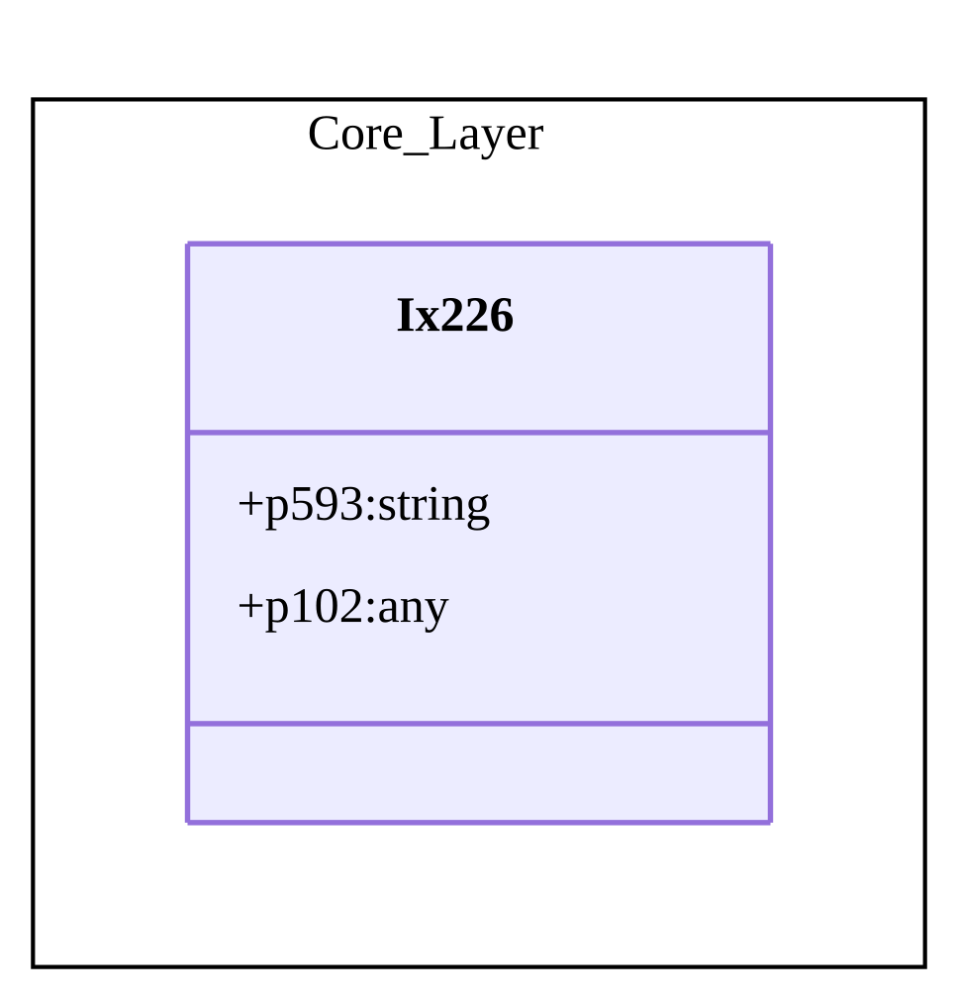
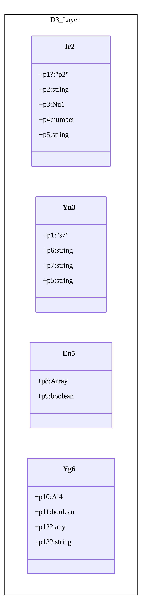

# Architecture Diagrams

**Total Diagrams**: 6
**Successful**: 6
**Failed**: 0

---

## Diagrams

### method/d10

- **Entities**: 3
- **Relations**: 0
- **Diagram**: [View PNG](method/d10.png)

---

### method/d2

- **Entities**: 4
- **Relations**: 2
- **Diagram**: [View PNG](method/d2.png)

---

### method/d4

- **Entities**: 16
- **Relations**: 10
- **Diagram**: [View PNG](method/d4.png)

---

### method/d6

- **Entities**: 61
- **Relations**: 66
- **Diagram**: [View PNG](method/d6.png)

---

### method/d7

- **Entities**: 17
- **Relations**: 44
- **Diagram**: [View PNG](method/d7.png)

---

### method/d8

- **Entities**: 66
- **Relations**: 45
- **Diagram**: [View PNG](method/d8.png)

---

## Summary Statistics

- **Total Entities**: 167
- **Total Relations**: 167
- **Average Entities per Diagram**: 27.8
- **Average Relations per Diagram**: 27.8

## File Statistics (sorted by InDegree ↓)

> `~LOC` is approximate (max entity endLine). `InDegree`/`OutDegree` count relations within parsed scope. Level: `method`

| File | ~LOC | Entities | Methods | Fields | InDegree | OutDegree | Cycles |
|------|------|----------|---------|--------|----------|-----------|--------|
| f56.ts | 44 | 3 | 0 | 4 | 0 | 0 | 0 |

## Circular Dependencies

No circular dependencies detected.

*Generated by ArchGuard v2.0*
